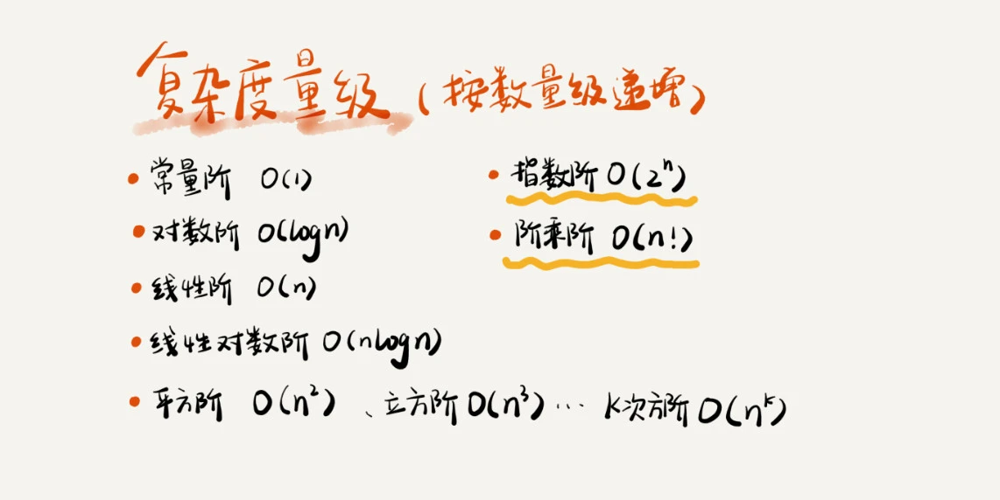
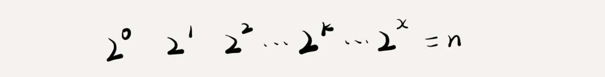
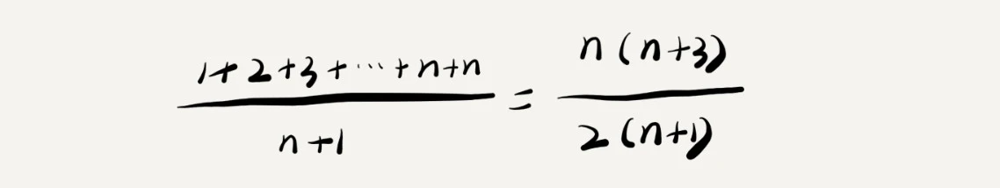
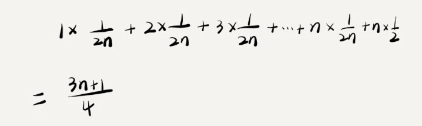
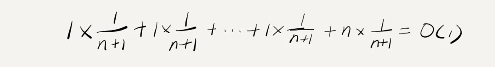
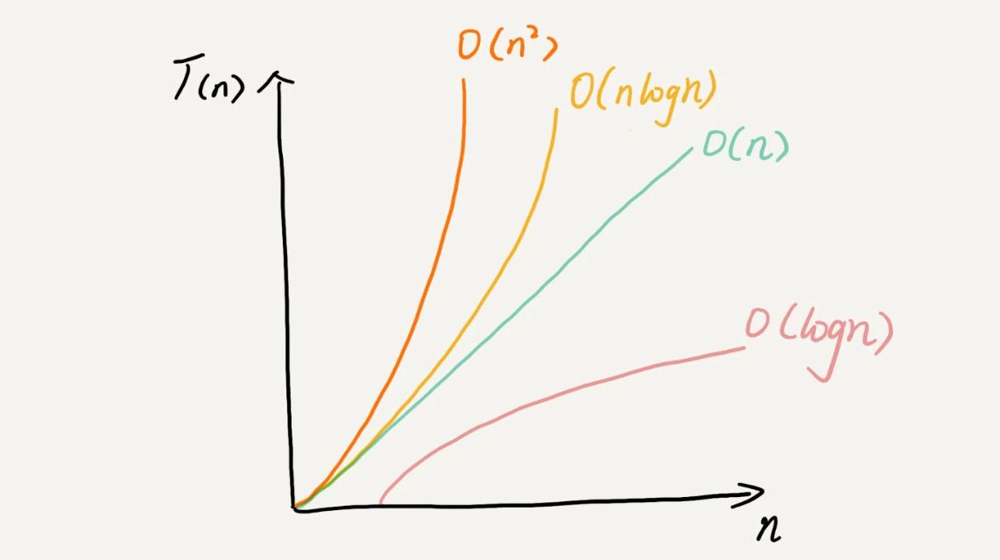

[toc]


# 一、什么是复杂度分析


**数据结构和算法本身解决的是“快”和“省”的问题**，即如何让代码运行得更快，如何让代码更省存储空间。
因此需从**执行时间**和**占用空间**两个维度来评估数据结构和算法的性能

那如何来衡量你编写的算法代码的执行效率呢? 答案就是：**时间、空间复杂度分析**


# 二、如何进行复杂度分析？

## 2.1 大 O 复杂度表示法

算法的执行效率，粗略地讲，就是算法代码执行的时间。
但是，如何在不运行代码的情况下，用“肉眼”得到一段代码的执行时间呢？

例如：

```
 int cal(int n) {
   int sum = 0;
   int i = 1;
   for (; i <= n; ++i) {
     sum = sum + i;
   }
   return sum;
 }
```
假设每行代码执行的时间都一样，为 unit_time。在这个假设的基础之上，这段代码的总执行时间是多少呢？

第 2、3 行代码分别需要 1 个 unit_time 的执行时间，
第 4、5 行都运行了 n 遍，所以需要 2n*unit_time 的执行时间，
所以这段代码总的执行时间就是 (2n+2)*unit_time

尽管我们不知道 unit_time 的具体值,但是可以看出来：

**所有代码的执行时间 T(n) 与 每行代码的执行次数成正比**

我们可以把这个规律总结成一个公式：
> T(n) = O(f(n))


- T(n) 表示代码执行的时间
- n 表示数据规模的大小
- f(n) 表示每行代码执行的次数总和。因为这是一个公式，所以用 f(n) 来表示
- O 表示代码的执行时间 T(n) 与 f(n) 表达式成正比


大 O 时间复杂度实际上并不具体表示代码真正的执行时间，而是**表示代码执行时间随数据规模增长的变化趋势**，
所以，也叫作渐进时间复杂度（asymptotic time complexity），简称时间复杂度


## 2.2 时间复杂度    

时间复杂度的全称是渐进时间复杂度，表示算法的执行时间与数据规模之间的增长关系


### 分析时间复杂度技巧

- 只关注循环执行次数最多的一段代码
- 加法法则：总复杂度等于量级最大的那段代码的复杂度
- 乘法法则：嵌套代码的复杂度等于嵌套内外代码复杂度的乘积

### 几种常见时间复杂度实例分析





对于刚罗列的复杂度量级，我们可以粗略地分为两类，多项式量级和非多项式量级。
其中，非多项式量级只有两个：O(2n) 和 O(n!)。

当数据规模 n 越来越大时，非多项式量级算法的执行时间会急剧增加，求解问题的执行时间会无限增长。
所以，**非多项式时间复杂度的算法其实是非常低效的算法**


因此我们主要来看几种常见的多项式时间复杂度：


#### O(1)

O(1) 只是常量级时间复杂度的一种表示方法，并不是指只执行了一行代码

**只要代码的执行时间不随 n 的增大而增长，这样代码的时间复杂度都记作 O(1)**
或者说，
**一般情况下，只要算法中不存在循环语句、递归语句，即使有成千上万行的代码，其时间复杂度也是Ο(1)**


#### O(logn)、O(nlogn)

对数阶时间复杂度非常常见，同时也是最难分析的一种时间复杂度

```kotlin
 i=1;
 while (i <= n)  {
   i = i * 2;
 }
```


根据我们前面讲的复杂度分析方法，第三行代码是循环执行次数最多的。所以，我们只要能计算出这行代码被执行了多少次，就能知道整段代码的时间复杂度。

实际上，变量 i 的取值就是一个等比数列。如果我把它一个一个列出来，就应该是这个样子的：




所以，我们只要知道 x 值是多少，就知道这行代码执行的次数了。通过 2x=n 求解 x

x=log2n，所以，这段代码的时间复杂度就是 O(log2n)


我们知道，对数之间是可以互相转换的，log3n 就等于 log32 * log2n，所以 O(log3n) = O(C * log2n)，其中 C=log32 是一个常量。

基于我们前面的一个理论：**在采用大 O 标记复杂度的时候，可以忽略系数，即 O(Cf(n)) = O(f(n))**。

所以，O(log2n) 就等于 O(log3n)。

因此，**在对数阶时间复杂度的表示方法里，我们忽略对数的“底”，统一表示为 O(logn)**。


#### O(m+n)、O(m*n)

```

int cal(int m, int n) {
  int sum_1 = 0;
  int i = 1;
  for (; i < m; ++i) {
    sum_1 = sum_1 + i;
  }

  int sum_2 = 0;
  int j = 1;
  for (; j < n; ++j) {
    sum_2 = sum_2 + j;
  }

  return sum_1 + sum_2;
}
```


m 和 n 是表示两个数据规模。我们无法事先评估 m 和 n 谁的量级大，所以我们在表示复杂度的时候，就不能简单地利用加法法则，省略掉其中一个。所以，上面代码的时间复杂度就是 O(m+n)


### 最好、最坏情况时间复杂度


```

// n表示数组array的长度
int find(int[] array, int n, int x) {
  int i = 0;
  int pos = -1;
  for (; i < n; ++i) {
    if (array[i] == x) pos = i;
  }
  return pos;
}
```

这段代码要实现的功能是，在一个无序的数组（array）中，查找变量 x 出现的位置。如果没有找到，就返回 -1。

按照上节课讲的分析方法，这段代码的复杂度是 O(n)，其中，n 代表数组的长度


我们在数组中查找一个数据，并不需要每次都把整个数组都遍历一遍，因为有可能中途找到就可以提前结束循环了。

但是，这段代码写得不够高效。我们可以这样优化一下这段查找代码。

```
// n表示数组array的长度
int find(int[] array, int n, int x) {
  int i = 0;
  int pos = -1;
  for (; i < n; ++i) {
    if (array[i] == x) {
       pos = i;
       break;
    }
  }
  return pos;
```


这个时候，问题就来了。我们优化完之后，这段代码的时间复杂度还是 O(n) 吗？


因为，要查找的变量 x 可能出现在数组的任意位置。

如果数组中第一个元素正好是要查找的变量 x，那就不需要继续遍历剩下的 n-1 个数据了，那时间复杂度就是 O(1)。

但如果数组中不存在变量 x，那我们就需要把整个数组都遍历一遍，时间复杂度就成了 O(n)。

所以，不同的情况下，这段代码的时间复杂度是不一样的。


为了表示代码在不同情况下的不同时间复杂度，我们需要引入三个概念：

**最好情况时间复杂度、最坏情况时间复杂度 和 平均情况时间复杂度**


**最好情况时间复杂度就是，在最理想的情况下，执行这段代码的时间复杂度**。就像我们刚刚讲到的，在最理想的情况下，要查找的变量 x 正好是数组的第一个元素，这个时候对应的时间复杂度就是最好情况时间复杂度。


**最坏情况时间复杂度就是，在最糟糕的情况下，执行这段代码的时间复杂度**。就像刚举的那个例子，如果数组中没有要查找的变量 x，我们需要把整个数组都遍历一遍才行，所以这种最糟糕情况下对应的时间复杂度就是最坏情况时间复杂度。


### 平均情况时间复杂度


最好情况时间复杂度和最坏情况时间复杂度对应的都是极端情况下的代码复杂度，发生的概率其实并不大。

为了更好地表示平均情况下的复杂度，我们需要引入另一个概念：平均情况时间复杂度，后面我简称为平均时间复杂度。


借助刚才查找变量 x 的例子,要查找的变量 x 在数组中的位置，有 n+1 种情况：在数组的 0～n-1 位置中 和 不在数组中。

我们把每种情况下，查找需要遍历的元素个数累加起来，然后再除以 n+1，就可以得到需要遍历的元素个数的平均值，即：





时间复杂度的大 O 标记法中，可以省略掉系数、低阶、常量，

所以，咱们把刚刚这个公式简化之后，**得到的平均时间复杂度就是 O(n)**


这个结论虽然是正确的，但是计算过程稍微有点儿问题。究竟是什么问题呢？我们刚讲的这 n+1 种情况，出现的概率并不是一样的。

我们知道，要查找的变量 x，要么在数组里，要么就不在数组里。这两种情况对应的概率统计起来很麻烦，为了方便你理解，我们假设在数组中与不在数组中的概率都为 1/2。另外，要查找的数据出现在 0～n-1 这 n 个位置的概率也是一样的，为 1/n。
所以，根据概率乘法法则，要查找的数据出现在 0～n-1 中任意位置的概率就是 1/(2n)。

因此，前面的推导过程中存在的最大问题就是，没有将各种情况发生的概率考虑进去。如果我们把每种情况发生的概率也考虑进去，那平均时间复杂度的计算过程就变成了这样：




**这个值就是概率论中的加权平均值，也叫作期望值，所以平均时间复杂度的全称应该叫加权平均时间复杂度或者期望时间复杂度**

引入概率之后，前面那段代码的加权平均值为 (3n+1)/4。

用大 O 表示法来表示，去掉系数和常量，**这段代码的加权平均时间复杂度仍然是 O(n)**

实际上，在大多数情况下，我们并不需要区分最好、最坏、平均情况时间复杂度三种情况。像我们上一节课举的那些例子那样，很多时候，我们使用一个复杂度就可以满足需求了。只有同一块代码在不同的情况下，时间复杂度有量级的差距，我们才会使用这三种复杂度表示法来区分


### 均摊时间复杂度

大部分情况下，我们并不需要区分最好、最坏、平均三种复杂度。平均复杂度只在某些特殊情况下才会用到，

而均摊时间复杂度应用的场景比它更加特殊、更加有限。

```

 // array表示一个长度为n的数组
 // 代码中的array.length就等于n
 int[] array = new int[n];
 int count = 0;
 
 void insert(int val) {
    if (count == array.length) {
       int sum = 0;
       for (int i = 0; i < array.length; ++i) {
          sum = sum + array[i];
       }
       array[0] = sum;
       count = 1;
    }

    array[count] = val;
    ++count;
 }
```


这段代码**实现了一个往数组中插入数据的功能**。

当数组满了之后，也就是代码中的 count == array.length 时，我们用 for 循环遍历数组求和，并清空数组，将求和之后的 sum 值放到数组的第一个位置，然后再将新的数据插入。但如果数组一开始就有空闲空间，则直接将数据插入数组

那这段代码的时间复杂度是多少呢？

最理想的情况下，数组中有空闲空间，我们只需要将数据插入到数组下标为 count 的位置就可以了，所以最好情况时间复杂度为 O(1)。最坏的情况下，数组中没有空闲空间了，我们需要先做一次数组的遍历求和，然后再将数据插入，所以最坏情况时间复杂度为 O(n)。

那平均时间复杂度是多少呢？答案是 O(1)

假设数组的长度是 n，根据数据插入的位置的不同，我们可以分为 n 种情况，每种情况的时间复杂度是 O(1)。
除此之外，还有一种“额外”的情况，就是在数组没有空闲空间时插入一个数据，这个时候的时间复杂度是 O(n)。
而且，这 n+1 种情况发生的概率一样，都是 1/(n+1)。

所以，根据加权平均的计算方法，我们求得的平均时间复杂度就是：




我们还是继续看在数组中插入数据的这个例子。每一次 O(n) 的插入操作，都会跟着 n-1 次 O(1) 的插入操作，所以把耗时多的那次操作均摊到接下来的 n-1 次耗时少的操作上，均摊下来，这一组连续的操作的均摊时间复杂度就是 O(1)。这就是均摊分析的大致思路

均摊时间复杂度和摊还分析应用场景比较特殊，所以我们并不会经常用到。应用场景如下：

对一个数据结构进行一组连续操作中，大部分情况下时间复杂度都很低，只有个别情况下时间复杂度比较高，而且这些操作之间存在前后连贯的时序关系，这个时候，我们就可以将这一组操作放在一块儿分析，看是否能将较高时间复杂度那次操作的耗时，平摊到其他那些时间复杂度比较低的操作上。而且，在能够应用均摊时间复杂度分析的场合，一般均摊时间复杂度就等于最好情况时间复杂度。


**均摊时间复杂度就是一种特殊的平均时间复杂度**，我们没必要花太多精力去区分它们。你最应该掌握的是它的分析方法，摊还分析。至于分析出来的结果是叫平均还是叫均摊，这只是个说法，并不重要


## 2.3 空间复杂度

空间复杂度全称就是渐进空间复杂度（asymptotic space complexity），表示**算法的存储空间与数据规模之间的增长关系**


```

void print(int n) {
  int i = 0;
  int[] a = new int[n];
  for (i; i <n; ++i) {
    a[i] = i * i;
  }

  for (i = n-1; i >= 0; --i) {
    print out a[i]
  }
}
```

第 2 行代码中，我们申请了一个空间存储变量 i，但是它是常量阶的，跟数据规模 n 没有关系，所以我们可以忽略。

第 3 行申请了一个大小为 n 的 int 类型数组，

除此之外，剩下的代码都没有占用更多的空间，所以整段代码的空间复杂度就是 O(n)。


我们常见的空间复杂度就是 O(1)、O(n)、O(n2 )


# 小结


复杂度也叫渐进复杂度，包括时间复杂度和空间复杂度，用来分析算法执行效率与数据规模之间的增长关系，可以粗略地表示，越高阶复杂度的算法，执行效率越低。


常见的复杂度并不多，从低阶到高阶有：O(1)、O(logn)、O(n)、O(nlogn)、O(n2 )





# 练习


分析 add() 函数的时间复杂度和空间复杂度

```

// 全局变量，大小为10的数组array，长度len，下标i。
int array[] = new int[10]; 
int len = 10;
int i = 0;

// 往数组中添加一个元素
void add(int element) {
   if (i >= len) { // 数组空间不够了
     // 重新申请一个2倍大小的数组空间
     int new_array[] = new int[len*2];
     // 把原来array数组中的数据依次copy到new_array
     for (int j = 0; j < len; ++j) {
       new_array[j] = array[j];
     }
     // new_array复制给array，array现在大小就是2倍len了
     array = new_array;
     len = 2 * len;
   }
   // 将element放到下标为i的位置，下标i加一
   array[i] = element;
   ++i;
}
```


最好时间复杂度     O(1)

最坏时间复杂度     O(n)

平均时间复杂度     O(1)

均摊时间复杂度     O(1)


空间复杂度            O(1)


