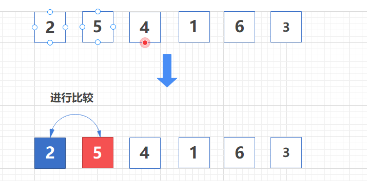
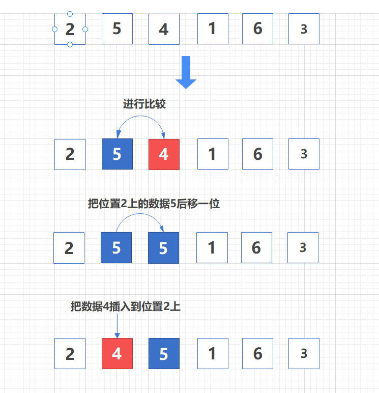

[toc]


# 插入排序


**将数组中的数据分为两个区间，已排序区间和未排序区间**。初始已排序区间只有一个元素，就是数组的第一个元素。
插入算法的核心思想是**取未排序区间中的元素，在已排序区间中找到合适的插入位置将其插入，并保证已排序区间数据一直有序**。
重复这个过程，直到未排序区间中元素为空，算法结束


插入排序也包含两种操作，**一种是元素的比较，一种是元素的移动**。
当我们需要将一个数据 a 插入到已排序区间时，需要拿 a 与已排序区间的元素依次比较大小，找到合适的插入位置。找到插入点之后，我们还需要将插入点之后的元素顺序往后移动一位，这样才能腾出位置给元素 a 插入


以数组 {2, 5, 4, 1, 6, 3} 为例，下面是排序过程：

第一轮排序，初始时，已排序数组是 {2}，未排序数组是 {5,4,1,6,3} ，首先未排序数组中的 5 和 已排序数组中的 2 进行比较





第二轮排序，首先对未排序数组中的数据4和已排序数组中位置2上的数据5进行比较，由于 5 > 4 ，所以把位置2上的数据5后移一位。
然后，把数据4和已排序数组中位置1上的数据2进行比较，由于2<4，所以不再进行数据移动。
到此次可以得出结论，数据4的位置应该在原数组中的位置2上，最后将数据4插入到位置2




后面的排序以此类推，不再赘述。


代码如下：

```
public class InsertionSort {

    private static final int[] data = {2, 5, 4, 1, 6, 3};

    public static void main(String[] args) {
        insertionSort(data);
    }


    /**
     * 插入排序将数组分为2个区间，已排序区间和未排序区间
     * 每次取未排序区间中的元素，在已排序区间中找到合适的插入位置将其插入，并保证已排序区间数据一直有序
     * 重复这个过程，直到未排序区间中元素为空
     *
     * @param data
     * @return
     */
    public static int[] insertionSort(int[] data) {
        System.out.println("排序前：" + Arrays.toString(data));

        if (data == null || data.length < 2) {
            return data;
        }

        // i 代表未排序区间的指针
        // 初始化状态下已排序区间就是第一个元素，所以这里从 i=1 开始
        // 外层循环对未排序区间数据依次比较
        for (int i = 1; i < data.length; i++) {

            int value = data[i];        // data[i] 即未排序区间的第一个数据
            int j = i - 1;              // j 代表有插入的位置,初始值为已排序区间的最后一个位置

            for (; j >= 0; j--) {
                if (data[j] > value) {
                    data[j + 1] = data[j];  // 把比value大的数据后移一位
                } else {
                    break;
                }
            }

            // 经过内层循环的比较和赋值，j + 1 的值就是要插入的位置
            // 因为内层循环结束时会执行j--，所以真实的位置要+1
            data[j + 1] = value;     //插入数据

            System.out.println("第 " + i + " 轮排序后：" + Arrays.toString(data));
        }

        System.out.println("排序后：" + Arrays.toString(data));
        return data;
    }
}
```


输出如下：

```
排序前：[2, 5, 4, 1, 6, 3]
第 1 轮排序后：[2, 5, 4, 1, 6, 3]
第 2 轮排序后：[2, 4, 5, 1, 6, 3]
第 3 轮排序后：[1, 2, 4, 5, 6, 3]
第 4 轮排序后：[1, 2, 4, 5, 6, 3]
第 5 轮排序后：[1, 2, 3, 4, 5, 6]
排序后：[1, 2, 3, 4, 5, 6]
```


# 二、性能分析


## 时间复杂度


- 最好时间复杂度为 O(n)

  如果要排序的数据已经是有序的，我们并不需要搬移任何数据。如果我们从尾到头在有序数据组里面查找插入位置，每次只需要比较一个数据就能确定插入的位置。所以这种情况下，最好时间复杂度为 O(n)。

  **注意，这里是从尾到头遍历已经有序的数据**，而不是从头到尾。 
  从尾到头遍历已经有序的数据，每次查找仅比较一次；如果是从头到尾遍历已经有序的数据，每次查找比较次数为当时有序数据个数

- 坏情况时间复杂度为 O(n2)

  如果数组是倒序的，每次插入都相当于在数组的第一个位置插入新的数据，所以需要移动大量的数据，所以最坏情况时间复杂度为 O(n2)

  

- 平均时间复杂度为 O(n2)

  数组中插入一个数据的平均时间复杂度是 O(n)。所以，对于插入排序来说，每次插入操作都相当于在数组中插入一个数据，循环执行 n 次插入操作，所以平均时间复杂度为 O(n2)


## 内存消耗

插入排序算法的运行并不需要额外的存储空间，所以**空间复杂度是 O(1)**，**是一个原地排序算法**


## 稳定性

在插入排序中，对于值相同的元素，我们可以选择将后面出现的元素，插入到前面出现元素的后面，这样就可以保持原有的前后顺序不变，所以**插入排序是稳定的排序算法**


# 三、冒泡排序 VS 插入排序

冒泡排序和插入排序的时间复杂度都是 O(n2)，都是原地排序算法，为什么插入排序要比冒泡排序更受欢迎呢？

我们前面分析冒泡排序和插入排序的时候讲到，冒泡排序不管怎么优化，元素交换的次数是一个固定值，是原始数据的逆序度。
插入排序是同样的，不管怎么优化，元素移动的次数也等于原始数据的逆序度。

但是，从代码实现上来看，冒泡排序的数据交换要比插入排序的数据移动要复杂，冒泡排序需要 3 个赋值操作，而插入排序只需要 1 个。我们来看这段操作：

```

冒泡排序中数据的交换操作：
if (a[j] > a[j+1]) { // 交换
   int tmp = a[j];
   a[j] = a[j+1];
   a[j+1] = tmp;
   flag = true;
}

插入排序中数据的移动操作：
if (a[j] > value) {
  a[j+1] = a[j];  // 数据移动
} else {
  break;
}
```


我们把执行一个赋值语句的时间粗略地计为单位时间（unit_time），然后分别用冒泡排序和插入排序对同一个逆序度是 K 的数组进行排序。用冒泡排序，需要 K 次交换操作，每次需要 3 个赋值语句，所以交换操作总耗时就是 3*K 单位时间。而插入排序中数据移动操作只需要 K 个单位时间。

所以，虽然冒泡排序和插入排序在时间复杂度上是一样的，都是 O(n2)，但是如果我们希望把性能优化做到极致，那肯定首选插入排序。插入排序的算法思路也有很大的优化空间，上面只是讲了最基础的一种。如果你对插入排序的优化感兴趣，可以自行学习一下**希尔排序**


