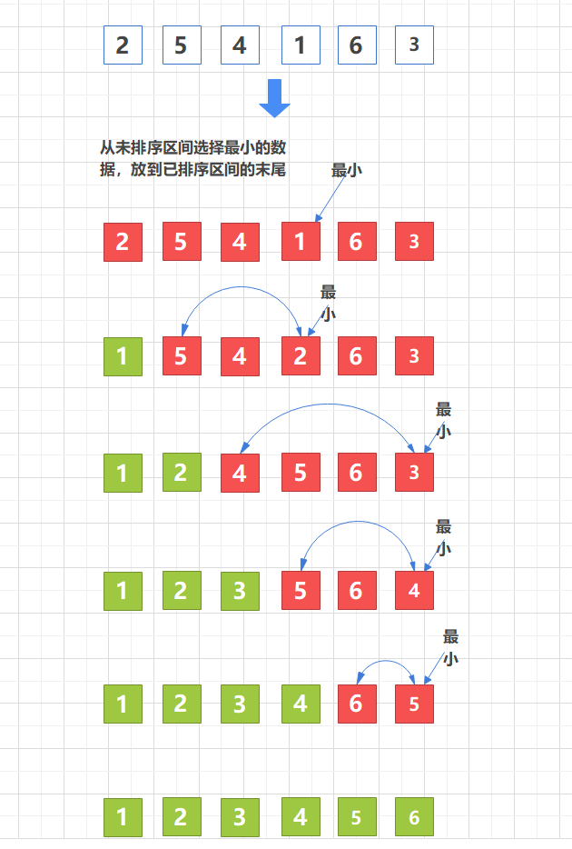

[toc]


# 一、选择排序


选择排序算法的实现思路有点类似插入排序，也分已排序区间和未排序区间。
但是**选择排序每次会从未排序区间中找到最小的元素，将其放到已排序区间的末尾**





代码如下；

```
public class SelectionSort {
    private static final int[] data = {2, 5, 4, 1, 6, 3};

    public static void main(String[] args) {
        selectionSort(data);
    }

    /**
     * 选择分已排序区间和未排序区间
     * 每次从未排序区间中找到最小的元素，将其放到已排序区间的末尾
     *
     * @param data
     * @return
     */
    public static int[] selectionSort(int[] data) {
        System.out.println("排序前：" + Arrays.toString(data));

        if (data == null || data.length < 2) {
            return data;
        }

        for (int i = 0; i < data.length - 1; i++) {

            int minIndex = i;  //最小值的下标

            // 在未排序数组中找到最小值  
            // 初始状态下，把第一个数据当成已排序数组，所以这里 j = i +1
            for (int j = i + 1; j < data.length; j++) {
                if (data[minIndex] > data[j]) {
                    minIndex = j;
                }
            }

            //交换数据
            int temp = data[i];
            data[i] = data[minIndex];
            data[minIndex] = temp;

            System.out.println("第 " + (i + 1) + " 轮排序后：" + Arrays.toString(data));
        }
        System.out.println("排序后：" + Arrays.toString(data));
        return data;
    }
}
```

输入如下：

```
排序前：[2, 5, 4, 1, 6, 3]
第 1 轮排序后：[1, 5, 4, 2, 6, 3]
第 2 轮排序后：[1, 2, 4, 5, 6, 3]
第 3 轮排序后：[1, 2, 3, 5, 6, 4]
第 4 轮排序后：[1, 2, 3, 4, 6, 5]
第 5 轮排序后：[1, 2, 3, 4, 5, 6]
排序后：[1, 2, 3, 4, 5, 6]
```


# 二、算法分析


## 时间复杂度


- 最好时间复杂度为  O(n2)

  

- 坏情况时间复杂度为 O(n2)

  

- 平均时间复杂度为 O(n2)

  


## 内存消耗

选择排序算法的运行并不需要额外的存储空间，所以**空间复杂度是 O(1)**，**是一个原地排序算法**


## 稳定性

**选择排序是一种不稳定的排序算法**。从我前面画的那张图中，你可以看出来，选择排序每次都要找剩余未排序元素中的最小值，并和前面的元素交换位置，这样破坏了稳定性。

比如 5，8，5，2，9 这样一组数据，使用选择排序算法来排序的话，第一次找到最小元素 2，与第一个 5 交换位置，那第一个 5 和中间的 5 顺序就变了，所以就不稳定了。正是因此，相对于冒泡排序和插入排序，选择排序就稍微逊色了