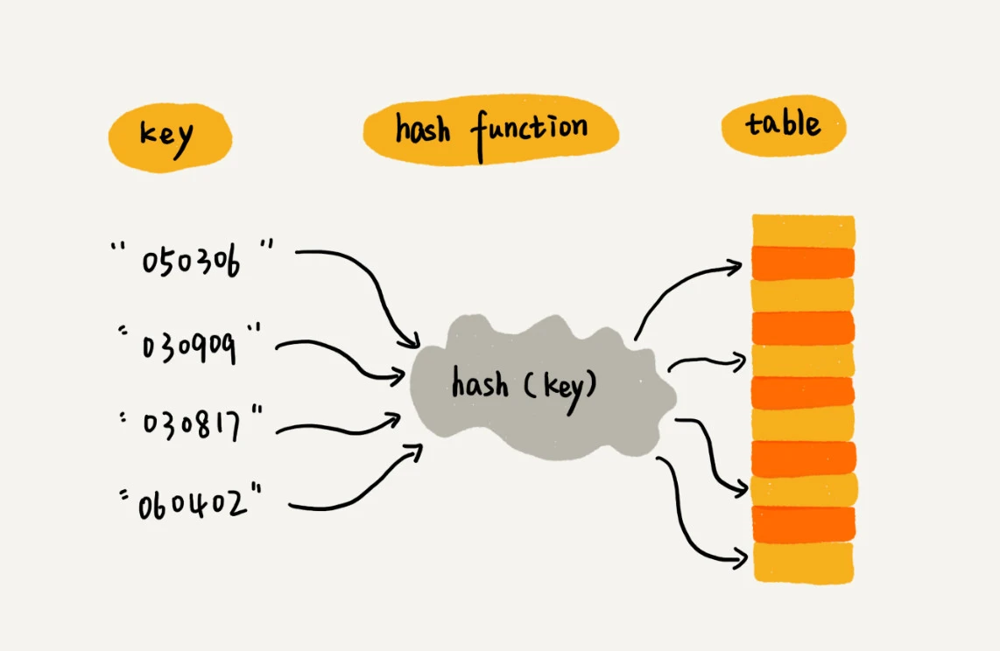
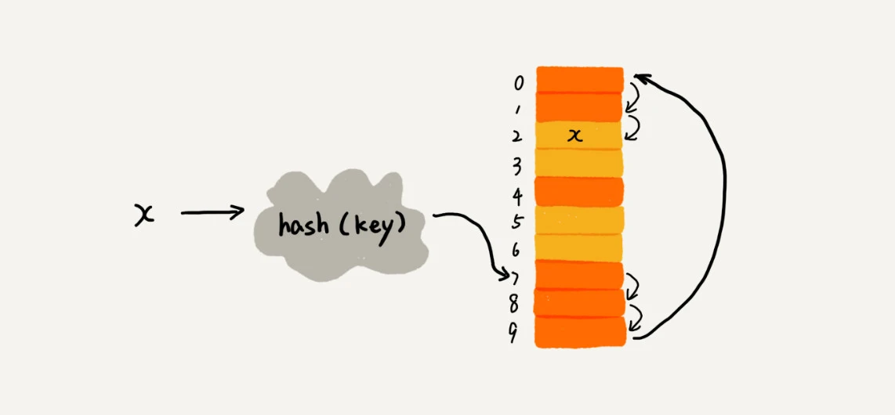
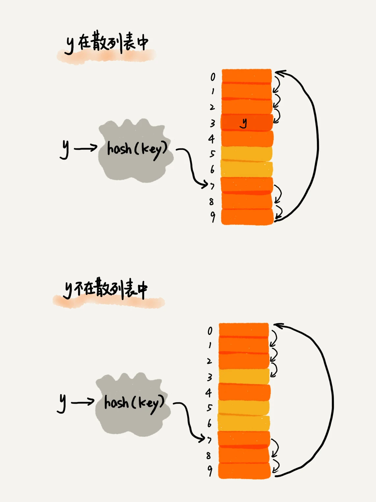
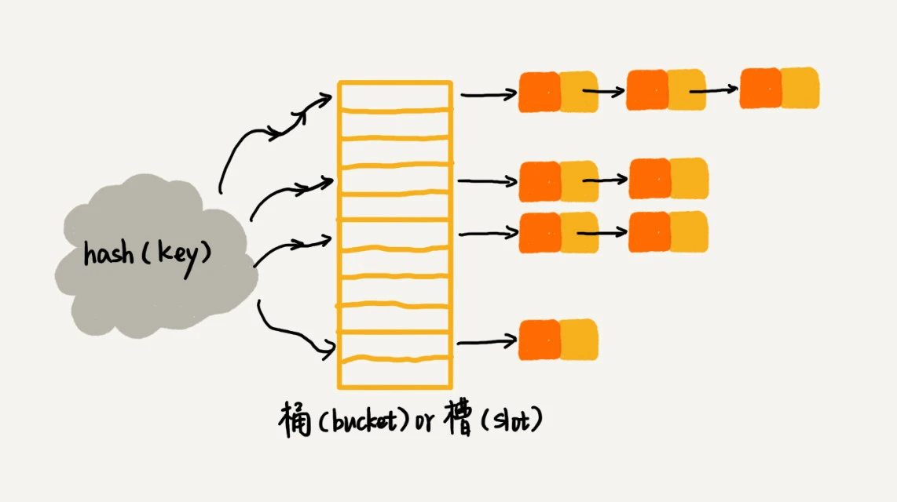
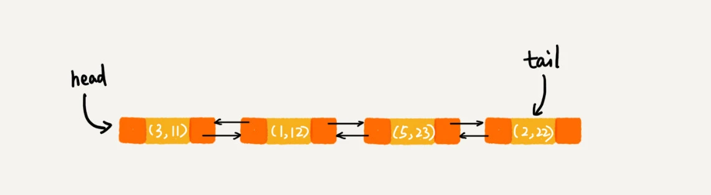
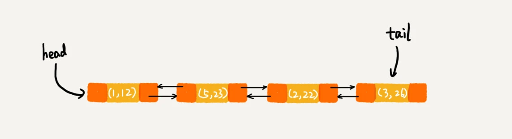
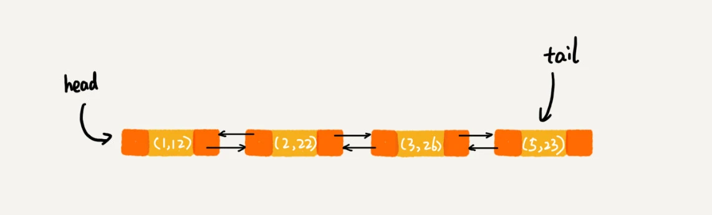

[toc]

# 一、散列表


散列表的英文叫“Hash Table”，我们平时也叫它“哈希表”或者“Hash 表”

**散列表用的是数组支持按照下标随机访问数据的特性，所以散列表其实就是数组的一种扩展，由数组演化而来。可以说，如果没有数组，就没有散列表**


假如我们有 89 名选手参加学校运动会。为了方便记录成绩，每个选手胸前都会贴上自己的参赛号码。这 89 名选手的编号依次是 1 到 89。现在我们希望编程实现这样一个功能，通过编号快速找到对应的选手信息。你会怎么做呢？

我们可以把这 89 名选手的信息放在数组里。编号为 1 的选手，我们放到数组中下标为 1 的位置；编号为 2 的选手，我们放到数组中下标为 2 的位置。以此类推，编号为 k 的选手放到数组中下标为 k 的位置。

因为参赛编号跟数组下标一一对应，当我们需要查询参赛编号为 x 的选手的时候，我们只需要将下标为 x 的数组元素取出来就可以了，时间复杂度就是 O(1)

在这个例子里，**参赛编号是自然数，并且与数组的下标形成一一映射，所以利用数组支持根据下标随机访问的时候，时间复杂度是 O(1) **这一特性，就可以实现快速查找编号对应的选手信息

假设校长说，参赛编号不能设置得这么简单，要加上年级、班级这些更详细的信息，所以我们把编号的规则稍微修改了一下，用 6 位数字来表示。比如 051167，其中，前两位 05 表示年级，中间两位 11 表示班级，最后两位还是原来的编号 1 到 89。这个时候我们该如何存储选手信息，才能够支持通过编号来快速查找选手信息呢？

思路还是跟前面类似。尽管我们不能直接把编号作为数组下标，但我们可以截取参赛编号的后两位作为数组下标，来存取选手信息数据。当通过参赛编号查询选手信息的时候，我们用同样的方法，取参赛编号的后两位，作为数组下标，来读取数组中的数据。

这就是典型的散列思想。其中，**参赛选手的编号我们叫做键（key）或者关键字**，我们用它来标识一个选手。
我们**把参赛编号转化为数组下标的映射方法就叫作散列函数（或“Hash 函数”“哈希函数”）**，
而**散列函数计算得到的值就叫作散列值（或“Hash 值”“哈希值”）**





**散列表用的就是数组支持按照下标随机访问的时候，时间复杂度是 O(1) 的特性。**
**我们通过散列函数把元素的键值映射为下标，然后将数据存储在数组中对应下标的位置。**
**当我们按照键值查询元素时，我们用同样的散列函数，将键值转化数组下标，从对应的数组下标的位置取数据。**


散列表来源于数组，它借助散列函数对数组这种数据结构进行扩展，利用的是数组支持按照下标随机访问元素的特性。散列表两个核心问题是**散列函数设计**和**散列冲突解决**。

散列函数设计的好坏决定了散列冲突的概率，也就决定散列表的性能。

散列冲突有两种常用的解决方法，开放寻址法和链表法。

# 二、散列函数


散列函数，顾名思义，它是一个函数。
我们可以把它定义成 hash(key)，其中 **key 表示元素的键值，hash(key) 的值表示经过散列函数计算得到的散列值**


那第一个例子中，编号就是数组下标，所以 hash(key) 就等于 key。
改造后的例子，写成散列函数稍微有点复杂。我用伪代码将它写成函数就是下面这样：

```
int hash(String key) {
  // 获取后两位字符
  string lastTwoChars = key.substr(length-2, length);
  // 将后两位字符转换为整数
  int hashValue = convert lastTwoChas to int-type;
  return hashValue;
}
```


刚刚举的学校运动会的例子，散列函数比较简单，也比较容易想到。但是，如果参赛选手的编号是随机生成的 6 位数字，又或者用的是 a 到 z 之间的字符串，该如何构造散列函数呢？

我总结了三点散列函数设计的基本要求：

- **散列函数计算得到的散列值是一个非负整数**
- **如果 key1 = key2，那 hash(key1) == hash(key2)**
- **如果 key1 ≠ key2，那 hash(key1) ≠ hash(key2)**


第一点，因为数组下标是从 0 开始的，所以散列函数生成的散列值也要是非负整数。
第二点，相同的 key，经过散列函数得到的散列值也应该是相同的。

第三点理解起来可能会有问题。这个要求看起来合情合理，但是在真实的情况下，要想找到一个不同的 key 对应的散列值都不一样的散列函数，几乎是不可能的。即便像业界著名的MD5、SHA、CRC等哈希算法，也**无法完全避免这种散列冲突**。而且，因为数组的存储空间有限，也会加大散列冲突的概率

所以我们几乎无法找到一个完美的无冲突的散列函数，即便能找到，付出的时间成本、计算成本也是很大的，所以针对散列冲突问题，我们需要通过其他途径来解决。


# 三、散列冲突


再好的散列函数也无法避免散列冲突。那究竟该如何解决散列冲突问题呢？
我们常用的散列冲突解决方法有两类，开放寻址法（open addressing）和链表法（chaining）


## 3.1 开放寻址法

开放寻址法的核心思想是，**如果出现了散列冲突，我们就重新探测一个空闲位置，将其插入**。

那如何重新探测新的位置呢？我先讲一个比较简单的探测方法，线性探测（Linear Probing）。

当我们往散列表中插入数据时，如果某个数据经过散列函数散列之后，存储位置已经被占用了，我们就从当前位置开始，依次往后查找，看是否有空闲位置，直到找到为止。





这里面黄色的色块表示空闲位置，橙色的色块表示已经存储了数据

从图中可以看出，散列表的大小为 10，在元素 x 插入散列表之前，已经 6 个元素插入到散列表中。x 经过 Hash 算法之后，被散列到位置下标为 7 的位置，但是这个位置已经有数据了，所以就产生了冲突。

于是我们就顺序地往后一个一个找，看有没有空闲的位置，遍历到尾部都没有找到空闲的位置，于是我们再从表头开始找，直到找到空闲位置 2，于是将其插入到这个位置。


在散列表中查找元素的过程有点儿类似插入过程。我们通过散列函数求出要查找元素的键值对应的散列值，然后比较数组中下标为散列值的元素和要查找的元素。如果相等，则说明就是我们要找的元素；否则就顺序往后依次查找。如果遍历到数组中的空闲位置，还没有找到，就说明要查找的元素并没有在散列表中。




对于开放寻址冲突解决方法，除了线性探测方法之外，还有另外两种比较经典的探测方法，二次探测（Quadratic probing）和双重散列（Double hashing）

所谓二次探测，跟线性探测很像，线性探测每次探测的步长是 1，那它探测的下标序列就是 hash(key)+0，hash(key)+1，hash(key)+2……而二次探测探测的步长就变成了原来的“二次方”，也就是说，它探测的下标序列就是 hash(key)+0，hash(key)+12，hash(key)+22……

所谓双重散列，意思就是不仅要使用一个散列函数。我们使用一组散列函数 hash1(key)，hash2(key)，hash3(key)……我们先用第一个散列函数，如果计算得到的存储位置已经被占用，再用第二个散列函数，依次类推，直到找到空闲的存储位置。


不管采用哪种探测方法，当散列表中空闲位置不多的时候，散列冲突的概率就会大大提高。为了尽可能保证散列表的操作效率，一般情况下，我们会尽可能保证散列表中有一定比例的空闲槽位。我们**用装载因子（load factor）来表示空位的多少**

装载因子的计算公式是：

> 散列表的装载因子 = 填入表中的元素个数 / 散列表的长度


装载因子越大，说明空闲位置越少，冲突越多，散列表的性能会下降。


## 3.2 链表法


**链表法是一种更加常用的散列冲突解决办法**，相比开放寻址法，它要简单很多。

我们来看这个图，在散列表中，每个“桶（bucket）”或者“槽（slot）”会对应一条链表，**所有散列值相同的元素我们都放到相同槽位对应的链表中**





当插入的时候，我们只需要通过散列函数计算出对应的散列槽位，将其插入到对应链表中即可，所以插入的时间复杂度是 O(1)。当查找、删除一个元素时，我们同样通过散列函数计算出对应的槽，然后遍历链表查找或者删除

那查找或删除操作的时间复杂度是多少呢？实际上，这两个操作的时间复杂度跟链表的长度 k 成正比，也就是 O(k)。对于散列比较均匀的散列函数来说，理论上讲，k=n/m，其中 n 表示散列中数据的个数，m 表示散列表中“槽”的个数。


# 四、HashMap


## 4.1 初始大小

HashMap 默认的初始大小是 16，当然这个默认值是可以设置的，如果事先知道大概的数据量有多大，可以通过修改默认初始大小，减少动态扩容的次数，这样会大大提高 HashMap 的性能。


## 4.2 装载因子和动态扩容

最大装载因子默认是 0.75，当 HashMap 中元素个数超过 0.75*capacity（capacity 表示散列表的容量）的时候，就会启动扩容，每次扩容都会扩容为原来的两倍大小


## 4.3 散列冲突解决方法

HashMap 底层采用链表法来解决冲突。即使负载因子和散列函数设计得再合理，也免不了会出现拉链过长的情况，一旦出现拉链过长，则会严重影响 HashMap 的性能。

于是，在 JDK1.8 版本中，为了对 HashMap 做进一步优化，我们引入了红黑树。而当链表长度太长（默认超过 8）时，链表就转换为红黑树。我们可以利用红黑树快速增删改查的特点，提高 HashMap 的性能。当红黑树结点个数少于 8 个的时候，又会将红黑树转化为链表。因为在数据量较小的情况下，红黑树要维护平衡，比起链表来，性能上的优势并不明显。


## 4.4  散列函数


散列函数的设计并不复杂，追求的是简单高效、分布均匀

```
int hash(Object key) {
    int h = key.hashCode()；
    return (h ^ (h >>> 16)) & (capicity -1); //capicity表示散列表的大小
}
```

其中，hashCode() 返回的是 Java 对象的 hash code。

比如 String 类型的对象的 hashCode() 就是下面这样：

```
public int hashCode() {
  int var1 = this.hash;
  if(var1 == 0 && this.value.length > 0) {
    char[] var2 = this.value;
    for(int var3 = 0; var3 < this.value.length; ++var3) {
      var1 = 31 * var1 + var2[var3];
    }
    this.hash = var1;
  }
  return var1;
}
```


# 五、LinkedHashMap


HashMap 底层是通过散列表这种数据结构实现的。
而 LinkedHashMap 前面比 HashMap 多了一个“Linked”，这里的“Linked”是不是说，LinkedHashMap 是一个通过链表法解决散列冲突的散列表呢？

实际上，LinkedHashMap 并没有这么简单，其中的“Linked”也并不仅仅代表它是通过链表法解决散列冲突的

先来看一段代码。你觉得这段代码会以什么样的顺序打印 3，1，5，2 这几个 key 呢？原因又是什么呢？

```
HashMap<Integer, Integer> m = new LinkedHashMap<>();
m.put(3, 11);
m.put(1, 12);
m.put(5, 23);
m.put(2, 22);

for (Map.Entry e : m.entrySet()) {
  System.out.println(e.getKey());
}
```


我先告诉你答案，上面的代码会按照数据插入的顺序依次来打印，也就是说，打印的顺序就是 3，1，5，2。你有没有觉得奇怪？散列表中数据是经过散列函数打乱之后无规律存储的，这里是如何实现按照数据的插入顺序来遍历打印的呢？

**LinkedHashMap 也是通过散列表和链表组合在一起实现的。实际上，它不仅支持按照插入顺序遍历数据，还支持按照访问顺序来遍历数据**

```
// 10是初始大小，0.75是装载因子，true是表示按照访问时间排序
HashMap<Integer, Integer> m = new LinkedHashMap<>(10, 0.75f, true);
m.put(3, 11);
m.put(1, 12);
m.put(5, 23);
m.put(2, 22);

m.put(3, 26);
m.get(5);

for (Map.Entry e : m.entrySet()) {
  System.out.println(e.getKey());
}
```

这段代码打印的结果是 1，2，3，5。

我来具体分析一下，为什么这段代码会按照这样顺序来打印。

每次调用 put() 函数，往 LinkedHashMap 中添加数据的时候，都会将数据添加到链表的尾部，所以，在前四个操作完成之后，链表中的数据是下面这样：





在第 8 行代码中，再次将键值为 3 的数据放入到 LinkedHashMap 的时候，会先查找这个键值是否已经有了，然后，再将已经存在的 (3,11) 删除，并且将新的 (3,26) 放到链表的尾部。所以，这个时候链表中的数据就是下面这样




当第 9 行代码访问到 key 为 5 的数据的时候，我们将被访问到的数据移动到链表的尾部。所以，第 9 行代码之后，链表中的数据是下面这样：




所以，最后打印出来的数据是 1，2，3，5。

从上面的分析，你有没有发现，**按照访问时间排序的 LinkedHashMap 本身就是一个支持 LRU 缓存淘汰策略的缓存系统**？
实际上，它们两个的实现原理也是一模一样的


**LinkedHashMap 是通过双向链表和散列表这两种数据结构组合实现的。LinkedHashMap 中的“Linked”实际上是指的是双向链表，并非指用链表法解决散列冲突。**


# 六、为什么散列表和链表经常一块使用


散列表这种数据结构虽然支持非常高效的数据插入、删除、查找操作，但是散列表中的数据都是通过散列函数打乱之后无规律存储的。也就说，它无法支持按照某种顺序快速地遍历数据。如果希望按照顺序遍历散列表中的数据，那我们需要将散列表中的数据拷贝到数组中，然后排序，再遍历。

因为散列表是动态数据结构，不停地有数据的插入、删除，所以每当我们希望按顺序遍历散列表中的数据的时候，都需要先排序，那效率势必会很低。为了解决这个问题，我们将散列表和链表（或者跳表）结合在一起使用。

