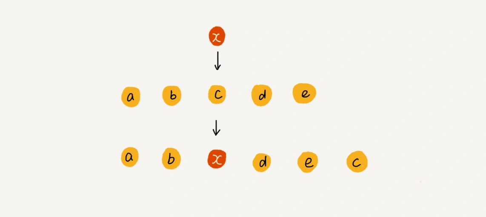

[toc]


# 一、定义

>  数组（Array）是一种线性表数据结构。它用一组连续的内存空间，来存储一组具有相同类型的数据


- **线性表（Linear List）**

  顾名思义，线性表就是数据排成像一条线一样的结构。**每个线性表上的数据最多只有前和后两个方向**

  其实除了数组，链表、队列、栈等也是线性表结构

  

  

  

  与它相对立的概念是非线性表，比如二叉树、堆、图等。
  之所以叫非线性，是因为，**在非线性表中，数据之间并不是简单的前后关系**

  
  
  
  


- **连续的内存空间和相同类型的数据**

  正是因为这两个限制，它才有了一个堪称“杀手锏”的特性：“随机访问”。
  但有利就有弊，这两个限制也让数组的很多操作变得非常低效，比如要想在数组中删除、插入一个数据，为了保证连续性，就需要做大量的数据搬移工作


# 二、数组的相关操作


## 2.1 随机访问


我们可以通过数组下标达到对数组进行随机访问的目的

例如：

```
```


### 数组是如何实现根据下标随机访问数组元素?

我们拿一个长度为 10 的 int 类型的数组 int[] a = new int[10]来举例。在我画的这个图中，计算机给数组 a[10]，分配了一块连续内存空间 1000～1039，其中，内存块的首地址为 base_address = 1000


计算机会给每个内存单元分配一个地址，计算机通过地址来访问内存中的数据。当计算机需要随机访问数组中的某个元素时，它会首先通过下面的寻址公式，计算出该元素存储的内存地址：

> a[i]_address = base_address + i * data_type_size

其中 data_type_size 表示数组中每个元素的大小。我们举的这个例子里，数组中存储的是 int 类型数据，所以 data_type_size 就为 4 个字节


数组支持随机访问，根据下标随机访问的时间复杂度为 O(1)

数组与链表相比，适合查找操作，但是查找的时间复杂度并不为 O(1)。
即便是排好序的数组，你用二分查找，时间复杂度也是 O(logn)


## 2.2 插入

数组为了保持内存数据的连续性，会导致插入、删除这两个操作比较低效

假设数组的长度为 n，现在，如果我们需要将一个数据插入到数组中的第 k 个位置。为了把第 k 个位置腾出来，给新来的数据，我们需要将第 k～n 这部分的元素都顺序地往后挪一位。

那插入操作的时间复杂度是多少呢？

- 如果在数组的末尾插入元素，那就不需要移动数据了，这时的时间复杂度为 O(1)
- 如果在数组的开头插入元素，那所有的数据都需要依次往后移动一位，所以最坏时间复杂度是 O(n)
- 因为我们在每个位置插入元素的概率是一样的，所以平均情况时间复杂度为 (1+2+...n)/n=O(n)


如果数组中的数据是有序的，我们在某个位置插入一个新的元素时，就必须按照刚才的方法搬移 k 之后的数据。

但是，如果数组中存储的数据并没有任何规律，数组只是被当作一个存储数据的集合。在这种情况下，如果要将某个数据插入到第 k 个位置，**为了避免大规模的数据搬移**，我们还有一个简单的办法就是，**直接将第 k 位的数据搬移到数组元素的最后，把新的元素直接放入第 k 个位置**


为了更好地理解，我们举一个例子。假设数组 a[10]中存储了如下 5 个元素：a，b，c，d，e。我们现在需要将元素 x 插入到第 3 个位置。我们只需要将 c 放入到 a[5]，将 a[2]赋值为 x 即可。
最后，数组中的元素如下： a，b，x，d，e，c。




利用这种处理技巧，在特定场景下，**在第 k 个位置插入一个元素的时间复杂度就会降为 O(1)**


## 2.3 删除


跟插入数据类似，如果我们要删除第 k 个位置的数据，为了内存的连续性，也需要搬移数据，不然中间就会出现空洞，内存就不连续了

- 如果删除数组末尾的数据，则最好情况时间复杂度为 O(1)
- 如果删除开头的数据，则最坏情况时间复杂度为 O(n)
- 平均情况时间复杂度也为 O(n)


实际上，在某些特殊场景下，我们并不一定非得追求数组中数据的连续性。如果我们将多次删除操作集中在一起执行，删除的效率是不是会提高很多呢？

我们继续来看例子。数组 a[10]中存储了 8 个元素：a，b，c，d，e，f，g，h。现在，我们要依次删除 a，b，c 三个元素。


为了避免 d，e，f，g，h 这几个数据会被搬移三次，我们可以先记录下已经删除的数据。每次的删除操作并不是真正地搬移数据，只是记录数据已经被删除。当数组没有更多空间存储数据时，我们再触发执行一次真正的删除操作，这样就大大减少了删除操作导致的数据搬移。


如果你了解 JVM，你会发现，**这正是 JVM 标记清除垃圾回收算法的核心思想**

类比一下，平时使用到的垃圾桶。
生活中，我们扔进屋里垃圾桶的垃圾，并没有消失，只是被 ''标记'' 成了垃圾，
只有垃圾桶塞满时，才会清理垃圾桶。然后再次存放垃圾


# 三、容器能否完全替代数组


针对数组类型，很多语言都提供了容器类，比如 Java 中的 ArrayList。在项目开发中，什么时候适合用数组，什么时候适合用容器呢？


ArrayList 最大的优势就是**可以将很多数组操作的细节封装起来**。比如前面提到的数组插入、删除数据时需要搬移其他数据等。另外，它还有一个优势，就是**支持动态扩容**。每次存储空间不够的时候，它都会将空间自动扩容为 1.5 倍大小

数组本身在定义的时候需要预先指定大小，因为需要分配连续的内存空间。如果我们申请了大小为 10 的数组，当第 11 个数据需要存储到数组中时，我们就需要重新分配一块更大的空间，将原来的数据复制过去，然后再将新的数据插入

1. Java ArrayList 无法存储基本类型，比如 int、long，需要封装为 Integer、Long 类，而 Autoboxing、Unboxing 则有一定的性能消耗，所以如果特别关注性能，或者希望使用基本类型，就可以选用数组。
2. 如果数据大小事先已知，并且对数据的操作非常简单，用不到 ArrayList 提供的大部分方法，也可以直接使用数组。
3. 当要表示多维数组时，用数组往往会更加直观。比如 Object[][] array；而用容器的话则需要这样定义：ArrayList > array。

总结一下就是，
对于业务开发，直接使用容器就足够了，省时省力。毕竟损耗一丢丢性能，完全不会影响到系统整体的性能。
但如果你是做一些非常底层的开发，比如开发网络框架，性能的优化需要做到极致，这个时候数组就会优于容器，成为首选


