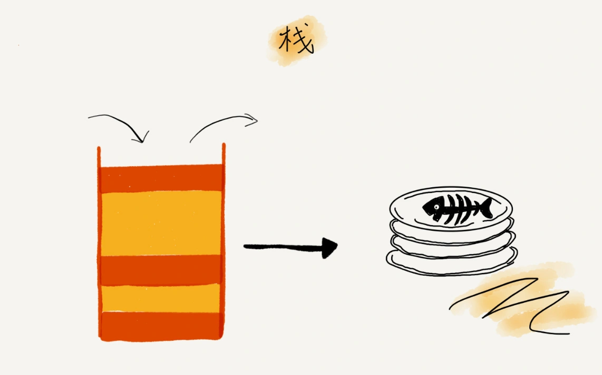
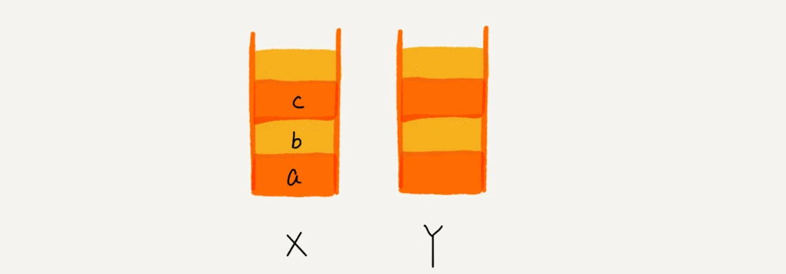
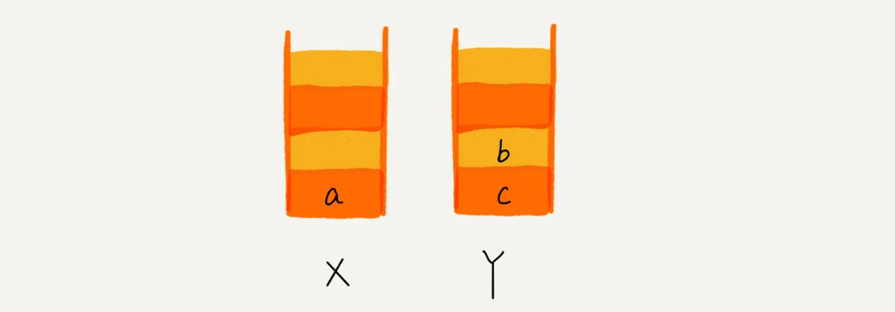
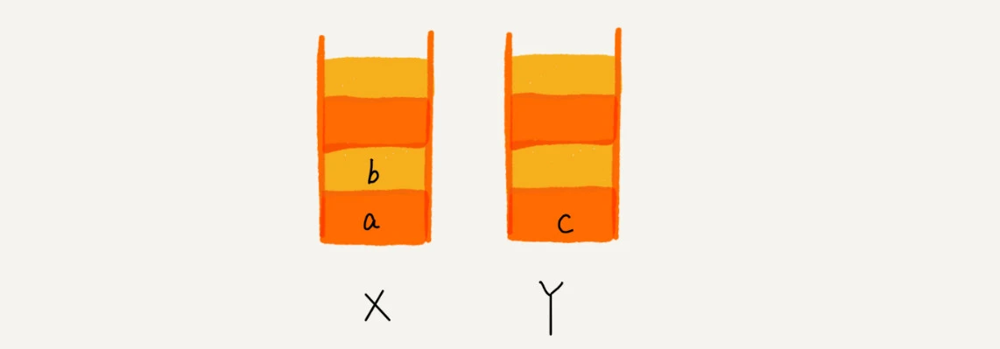

[toc]


# 一、概述


后进者先出，先进者后出

从栈的操作特性上来看，**栈是一种“操作受限”的线性表**，只允许在一端插入和删除数据





从功能上来说，数组或链表确实可以替代栈，但你要知道，特定的数据结构是对特定场景的抽象，而且，数组或链表暴露了太多的操作接口，操作上的确灵活自由，但使用时就比较不可控，自然也就更容易出错。

**当某个数据集合只涉及在一端插入和删除数据，并且满足后进先出、先进后出的特性，这时我们就应该首选“栈”这种数据结构**


## 如何实现一个栈


从刚才栈的定义里，我们可以看出，栈主要包含两个操作，入栈和出栈，也就是在栈顶插入一个数据和从栈顶删除一个数据


实际上，栈既可以用数组来实现，也可以用链表来实现。

- 用数组实现的栈，叫作顺序栈
- 用链表实现的栈，叫作链式栈


```
/**
 * @author ChenSen
 * @date 2021/8/6 16:57
 * @desc 使用数组实现的栈
 */
public class ArrayStack<E> {

    private int capacity; //栈的大小
    private Object[] items;
    private int count;  //栈中元素个数


    public ArrayStack(int capacity) {
        this.capacity = capacity;
        items = new Object[capacity];
        count = 0;
    }


    /**
     * 出栈
     *
     * @return
     */
    public E pop() {

        if (count == 0) {
            return null;
        }

        Object element = items[count - 1];
        items[count - 1] = null;
        count--;
        return (E) element;
    }

    /**
     * 入栈
     *
     * @param element
     * @param <E>
     */
    public <E> Boolean push(E element) {

        // 数组空间不够了，直接返回false，入栈失败
        if (count == capacity) {
            return false;
        }

        items[count] = element;
        count++;
        return true;
    }


    @Override
    public String toString() {
        return "ArrayStack{" +
                "capacity=" + capacity +
                ", items=" + Arrays.toString(items) +
                ", count=" + count +
                '}';
    }

    public static void main(String[] args) {
        ArrayStack stack = new ArrayStack<Integer>(5);
        for (int i = 0; i < 6; i++) {
            stack.push(i);
            System.out.println("入栈：" + stack.toString());
        }

        for (int i = 0; i < 6; i++) {
            stack.pop();
            System.out.println("出栈：" + stack.toString());
        }

    }
}

```


不管是顺序栈还是链式栈，我们存储数据只需要一个大小为 n 的数组就够了。
在入栈和出栈过程中，只需要一两个临时变量存储空间，所以空间复杂度是 O(1)

注意，这里存储数据需要一个大小为 n 的数组，并不是说空间复杂度就是 O(n)。
因为，这 n 个空间是必须的，无法省掉。**所以我们说空间复杂度的时候，是指除了原本的数据存储空间外，算法运行还需要额外的存储空间**

时间复杂度也不难。不管是顺序栈还是链式栈，入栈、出栈只涉及栈顶个别数据的操作，所以**时间复杂度都是 O(1)**


## 支持动态扩容的顺序栈


刚才那个基于数组实现的栈，是一个固定大小的栈，也就是说，在初始化栈时需要事先指定栈的大小。当栈满之后，就无法再往栈里添加数据了。尽管链式栈的大小不受限，但要存储 next 指针，内存消耗相对较多

那我们如何基于数组实现一个可以支持动态扩容的栈呢？

当数组空间不够时，我们就重新申请一块更大的内存，将原来数组中数据统统拷贝过去。这样就实现了一个支持动态扩容的数组。
所以，如果要实现一个支持动态扩容的栈，我们只需要底层依赖一个支持动态扩容的数组就可以了。当栈满了之后，我们就申请一个更大的数组，将原来的数据搬移到新数组中

对于出栈操作来说，我们不会涉及内存的重新申请和数据的搬移，所以出栈的时间复杂度仍然是 O(1)。但是，对于入栈操作来说，情况就不一样了。当栈中有空闲空间时，入栈操作的时间复杂度为 O(1)。但当空间不够时，就需要重新申请内存和数据搬移，所以时间复杂度就变成了 O(n)。

也就是说，对于入栈操作来说，最好情况时间复杂度是 O(1)，最坏情况时间复杂度是 O(n)。那平均情况下的时间复杂度又是多少呢？还记得我们在复杂度分析那一节中讲的摊还分析法吗？这个入栈操作的平均情况下的时间复杂度可以用摊还分析法来分析。我们也正好借此来实战一下摊还分析法。

为了分析的方便，我们需要事先做一些假设和定义：

- 栈空间不够时，我们重新申请一个是原来大小两倍的数组；
- 为了简化分析，假设只有入栈操作没有出栈操作；
- 定义不涉及内存搬移的入栈操作为 simple-push 操作，时间复杂度为 O(1)

如果当前栈大小为 K，并且已满，当再有新的数据要入栈时，就需要重新申请 2 倍大小的内存，并且做 K 个数据的搬移操作，然后再入栈。但是，接下来的 K-1 次入栈操作，我们都不需要再重新申请内存和搬移数据，所以这 K-1 次入栈操作都只需要一个 simple-push 操作就可以完成

这 K 次入栈操作，总共涉及了 K 个数据的搬移，以及 K 次 simple-push 操作。将 K 个数据搬移均摊到 K 次入栈操作，那每个入栈操作只需要一个数据搬移和一个 simple-push 操作。以此类推，入栈操作的均摊时间复杂度就为 O(1)

通过这个例子的实战分析，也印证了前面讲到的，均摊时间复杂度一般都等于最好情况时间复杂度。因为在大部分情况下，入栈操作的时间复杂度 O 都是 O(1)，只有在个别时刻才会退化为 O(n)，所以把耗时多的入栈操作的时间均摊到其他入栈操作上，平均情况下的耗时就接近 O(1)。


# 实现浏览器的前进、后退功能


我们使用两个栈，X 和 Y，我们把首次浏览的页面依次压入栈 X，当点击后退按钮时，再依次从栈 X 中出栈，并将出栈的数据依次放入栈 Y。当我们点击前进按钮时，我们依次从栈 Y 中取出数据，放入栈 X 中。当栈 X 中没有数据时，那就说明没有页面可以继续后退浏览了。当栈 Y 中没有数据，那就说明没有页面可以点击前进按钮浏览了


比如你顺序查看了 a，b，c 三个页面，我们就依次把 a，b，c 压入栈，这个时候，两个栈的数据就是这个样子：





当你通过浏览器的后退按钮，从页面 c 后退到页面 a 之后，我们就依次把 c 和 b 从栈 X 中弹出，并且依次放入到栈 Y。这个时候，两个栈的数据就是这个样子：




这个时候你又想看页面 b，于是你又点击前进按钮回到 b 页面，我们就把 b 再从栈 Y 中出栈，放入栈 X 中。此时两个栈的数据是这个样子：





# 总结

栈是一种操作受限的数据结构，只支持入栈和出栈操作。后进先出是它最大的特点。
栈既可以通过数组实现，也可以通过链表来实现。不管基于数组还是链表，入栈、出栈的时间复杂度都为 O(1)


