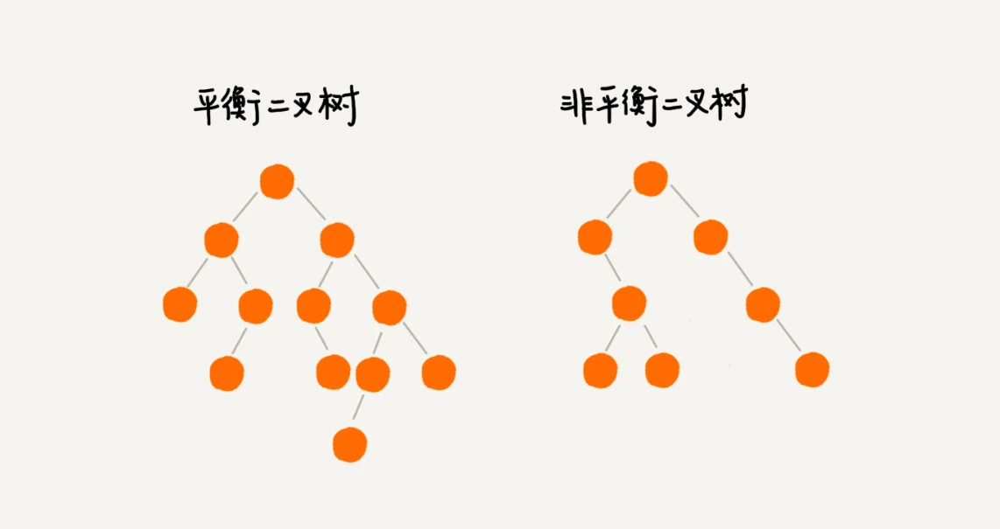
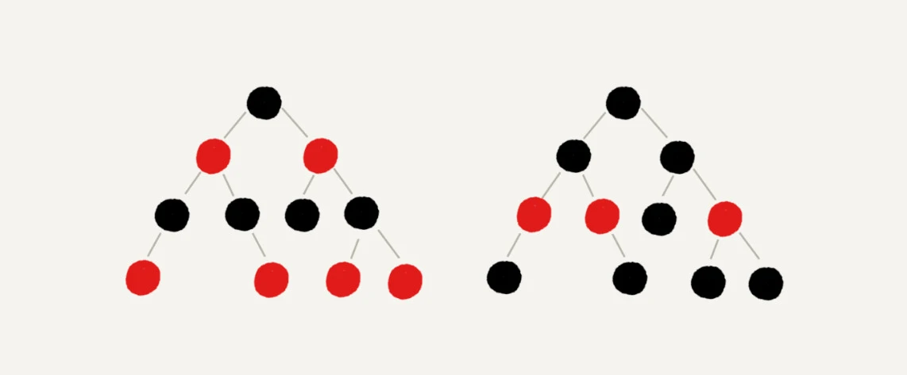
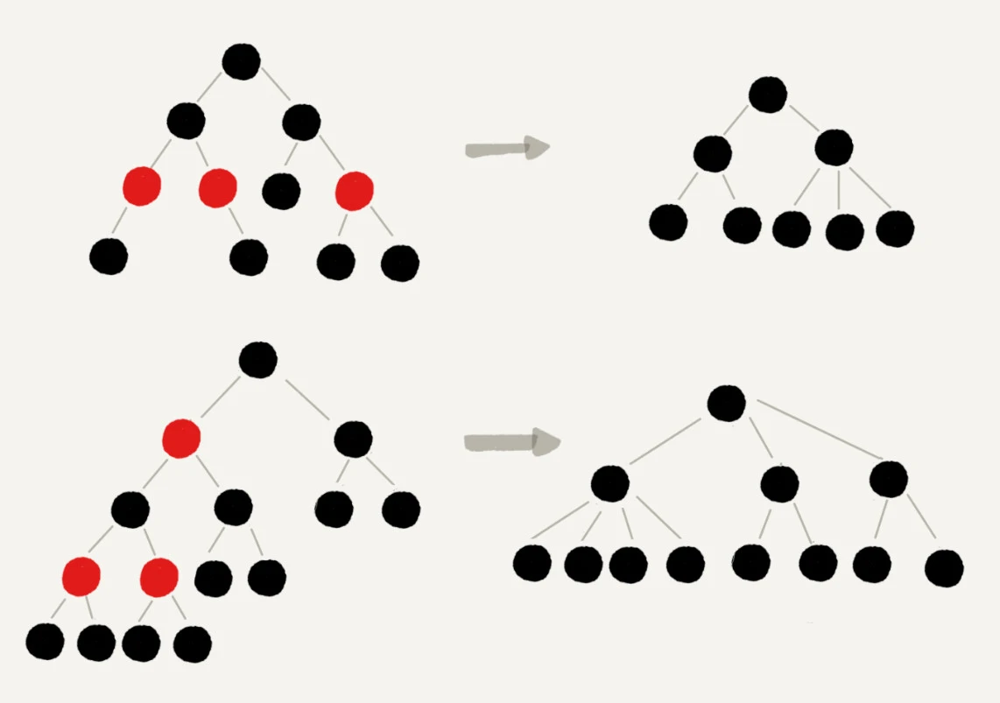

[toc]

# 一、平衡二叉查找树

平衡二叉树的严格定义是这样的：**二叉树中任意一个节点的左右子树的高度相差不能大于 1**。
从这个定义来看，上一节我们讲的完全二叉树、满二叉树其实都是平衡二叉树，但是非完全二叉树也有可能是平衡二叉树。

平衡二叉查找树不仅满足上面平衡二叉树的定义，还满足二叉查找树的特点。最先被发明的平衡二叉查找树是AVL 树，它严格符合我刚讲到的平衡二叉查找树的定义，即任何节点的左右子树高度相差不超过 1，是一种高度平衡的二叉查找树

但是很多平衡二叉查找树其实并没有严格符合上面的定义（树中任意一个节点的左右子树的高度相差不能大于 1），
比如我们下面要讲的红黑树，它从根节点到各个叶子节点的最长路径，有可能会比最短路径大一倍。

发明平衡二叉查找树这类数据结构的初衷是，解决普通二叉查找树在频繁的插入、删除等动态更新的情况下，出现时间复杂度退化的问题。

所以，**平衡二叉查找树中“平衡”的意思，其实就是让整棵树左右看起来比较“对称”、比较“平衡”，不要出现左子树很高、右子树很矮的情况。这样就能让整棵树的高度相对来说低一些，相应的插入、删除、查找等操作的效率高一些**。

所以，如果我们现在设计一个新的平衡二叉查找树，只要树的高度不比 log2n 大很多（比如树的高度仍然是对数量级的），尽管它不符合我们前面讲的严格的平衡二叉查找树的定义，但我们仍然可以说，这是一个合格的平衡二叉查找树

# 二、红黑树

# 2.1 概念

平衡二叉查找树其实有很多，比如，Splay Tree（伸展树）、Treap（树堆）等，但是我们提到平衡二叉查找树，听到的基本都是红黑树

**红黑树的英文是“Red-Black Tree”，简称 R-B Tree**。它是一种不严格的平衡二叉查找树

**红黑树中的节点，一类被标记为黑色，一类被标记为红色**。除此之外，一棵红黑树还需要满足这样几个要求：

- 根节点是黑色的
- 每个叶子节点都是黑色的空节点（NIL），也就是说，叶子节点不存储数据
- 任何相邻的节点都不能同时为红色，也就是说，红色节点是被黑色节点隔开的
- 每个节点，从该节点到达其可达叶子节点的所有路径，都包含相同数目的黑色节点

> 这里的第二点要求“叶子节点都是黑色的空节点”，稍微有些奇怪，它主要是为了简化红黑树的代码实现而设置的。暂时不考虑这一点，所以，在画图和讲解的时候，将黑色的、空的叶子节点都省略掉了

## 2.2 为什么说红黑树是“近似平衡”的

平衡二叉查找树的初衷，是为了解决二叉查找树因为动态更新导致的性能退化问题。
所以，**“平衡”的意思可以等价为性能不退化。“近似平衡”就等价为性能不会退化得太严重**。

二叉查找树很多操作的性能都跟树的高度成正比。
一棵极其平衡的二叉树（满二叉树或完全二叉树）的高度大约是 log2n，所以如果要证明红黑树是近似平衡的，我们只需要分析，红黑树的高度是否比较稳定地趋近 log2n 就好了

**首先，我们来看，如果我们将红色节点从红黑树中去掉，那单纯包含黑色节点的红黑树的高度是多少呢？**

红色节点删除之后，有些节点就没有父节点了，它们会直接拿这些节点的祖父节点（父节点的父节点）作为父节点。所以，之前的二叉树就变成了四叉树

前面红黑树的定义里有这么一条：从任意节点到可达的叶子节点的每个路径包含相同数目的黑色节点。我们从四叉树中取出某些节点，放到叶节点位置，四叉树就变成了完全二叉树。所以，仅包含黑色节点的四叉树的高度，比包含相同节点个数的完全二叉树的高度还要小。

完全二叉树的高度近似 log2n，这里的四叉“黑树”的高度要低于完全二叉树，所以去掉红色节点的“黑树”的高度也不会超过 log2n

**我们现在知道只包含黑色节点的“黑树”的高度，那我们现在把红色节点加回去，高度会变成多少呢？**

从上面我画的红黑树的例子和定义看，在红黑树中，红色节点不能相邻，也就是说，有一个红色节点就要至少有一个黑色节点，将它跟其他红色节点隔开。红黑树中包含最多黑色节点的路径不会超过 log2n，所以加入红色节点之后，最长路径不会超过 2log2n，也就是说，红黑树的高度近似 2log2n。

所以，红黑树的高度只比高度平衡的 AVL 树的高度（log2n）仅仅大了一倍，在性能上，下降得并不多。这样推导出来的结果不够精确，实际上红黑树的性能更好

