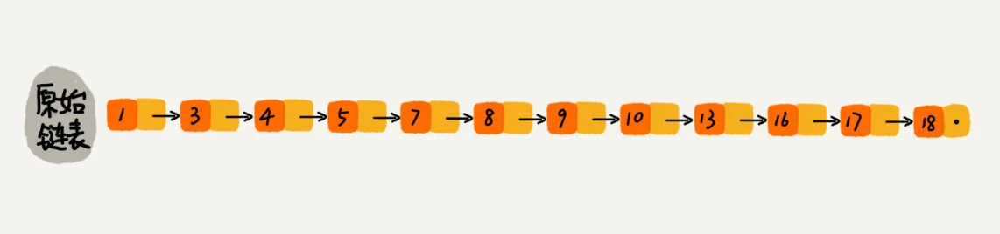
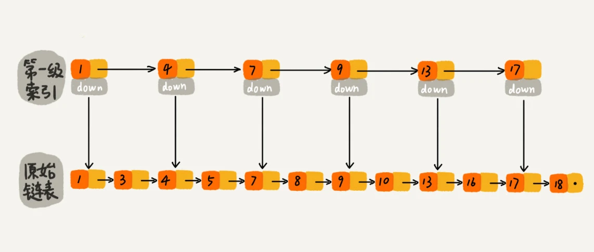
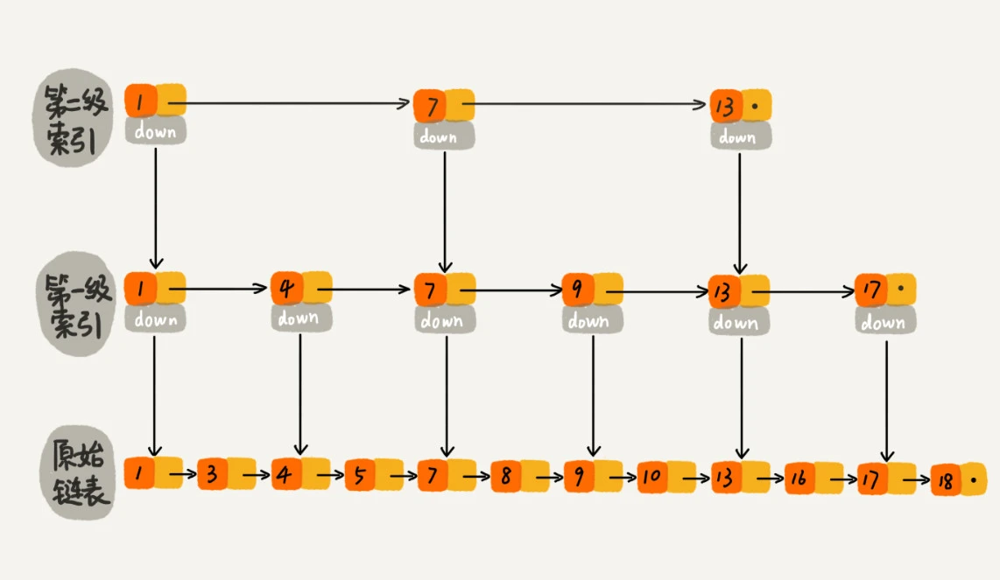
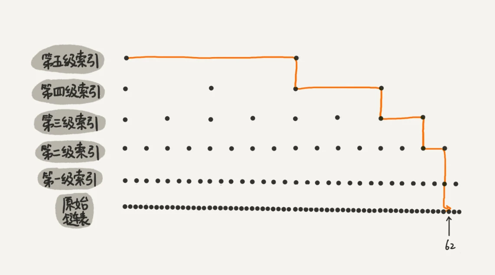

[toc]

# 一、跳表

对于一个单链表来讲，即便链表中存储的数据是有序的，如果我们要想在其中查找某个数据，也只能从头到尾遍历链表。
这样查找效率就会很低，时间复杂度会很高，是 O(n)

那怎么来提高查找效率呢？如果像图中那样，对链表建立一级“索引”，查找起来是不是就会更快一些呢？
每两个结点提取一个结点到上一级，我们**把抽出来的那一级叫做索引或索引层**。
图中的 down 表示 down 指针，指向下一级结点。

如果我们现在要查找某个结点，比如 16。我们可以先在索引层遍历，当遍历到索引层中值为 13 的结点时，我们发现下一个结点是 17，那要查找的结点 16 肯定就在这两个结点之间。然后我们通过索引层结点的 down 指针，下降到原始链表这一层，继续遍历。这个时候，我们只需要再遍历 2 个结点，就可以找到值等于 16 的这个结点了。这样，原来如果要查找 16，需要遍历 10 个结点，现在只需要遍历 7 个结点

从这个例子里，我们看出，加来一层索引之后，查找一个结点需要遍历的结点个数减少了，也就是说查找效率提高了。那如果我们再加一级索引呢？效率会不会提升更多呢？

跟前面建立第一级索引的方式相似，我们在第一级索引的基础之上，每两个结点就抽出一个结点到第二级索引。现在我们再来查找 16，只需要遍历 6 个结点了，需要遍历的结点数量又减少了。

我举的例子数据量不大，所以即便加了两级索引，查找效率的提升也并不明显。为了让你能真切地感受索引提升查询效率。我画了一个包含 64 个结点的链表，按照前面讲的这种思路，建立了五级索引。

从图中我们可以看出，原来没有索引的时候，查找 62 需要遍历 62 个结点，现在只需要遍历 11 个结点，速度是不是提高了很多？所以，当链表的长度 n 比较大时，比如 1000、10000 的时候，在构建索引之后，查找效率的提升就会非常明显。

**这种链表加多级索引的结构，就是跳表**

**跳表中查询任意数据的时间复杂度就是 O(logn)**

**跳表是不是很浪费内存？**

比起单纯的单链表，跳表需要存储多级索引，肯定要消耗更多的存储空间。

**跳表的空间复杂度是 O(n)**。也就是说，如果将包含 n 个结点的单链表构造成跳表，我们需要额外再用接近 n 个结点的存储空间

实际上，在软件开发中，我们不必太在意索引占用的额外空间。在讲数据结构和算法时，我们习惯性地把要处理的数据看成整数，但是在实际的软件开发中，原始链表中存储的有可能是很大的对象，而索引结点只需要存储关键值和几个指针，并不需要存储对象，所以**当对象比索引结点大很多时，那索引占用的额外空间就可以忽略了**

# 二、跳表的时间复杂度？

1.计算跳表的高度
如果链表有n个节点，每2个节点抽取抽出一个节点作为上一级索引的节点，那第1级索引的节点个数大约是n/2，第2级索引的节点个数大约是n/4，依次类推，第k级索引的节点个数就是n/(2^k)。假设索引有h级别，最高级的索引有2个节点，则有n/(2^h)=2，得出h=log2n-1，包含原始链表这一层，整个跳表的高度就是log2n。

2.计算跳表的时间复杂度
假设我们在跳表中查询某个数据的时候，如果每一层都遍历m个节点，那在跳表中查询一个数据的时间复杂度就是O(m*logn)。那这个m是多少呢？如下图所示，假设我们要查找的数据是x，在第k级索引中，我们遍历到y节点之后，发现x大于y，小于后面的节点z，所以我们通过y的down指针，从第k级下降到第k-1级索引。在第k-1级索引中，y和z之间只有3个节点（包含y和z），所以，我们在k-1级索引中最多只需要遍历3个节点，以此类推，每一级索引都最多只需要遍历3个节点。所以m=3。因此在跳表中查询某个数据的时间复杂度就是O(logn)。

# 三、跳表的空间复杂度及如何优化？

1.计算索引的节点总数
如果链表有n个节点，每2个节点抽取抽出一个节点作为上一级索引的节点，那每一级索引的节点数分别为：n/2，n/4，n/8，…，8，4，2，等比数列求和n-1，所以跳表的空间复杂度为O(n)。

2.如何优化时间复杂度
如果链表有n个节点，每3或5个节点抽取抽出一个节点作为上一级索引的节点，那每一级索引的节点数分别为（以3为例）：n/3，n/9，n/27，…，27，9，3，1，等比数列求和n/2，所以跳表的空间复杂度为O(n)，和每2个节点抽取一次相比，时间复杂度要低不少呢。

# 四、高效的动态插入和删除？

跳表本质上就是链表，所以仅插作，插入和删除操时间复杂度就为O(1)，但在实际情况中，要插入或删除某个节点，需要先查找到指定位置，而这个查找操作比较费时，但在跳表中这个查找操作的时间复杂度是O(logn)，所以，跳表的插入和删除操作的是时间复杂度也是O(logn)。

# 五、跳表索引动态更新？

当往跳表中插入数据的时候，可以选择同时将这个数据插入到部分索引层中，那么如何选择这个索引层呢？可以通过随机函数来决定将这个节点插入到哪几级索引中，比如随机函数生成了值K，那就可以把这个节点添加到第1级到第K级索引中。

