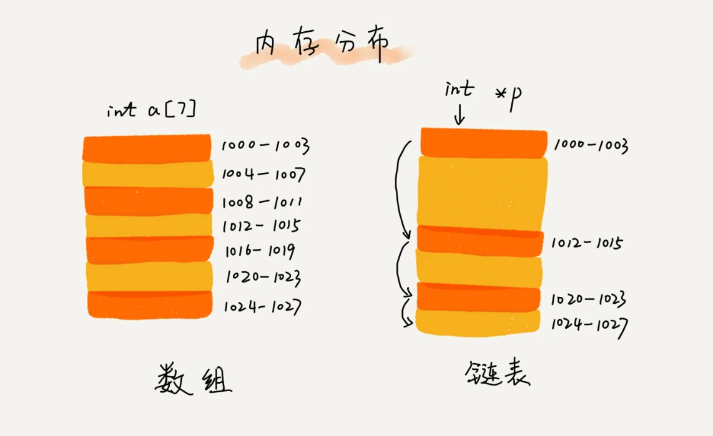
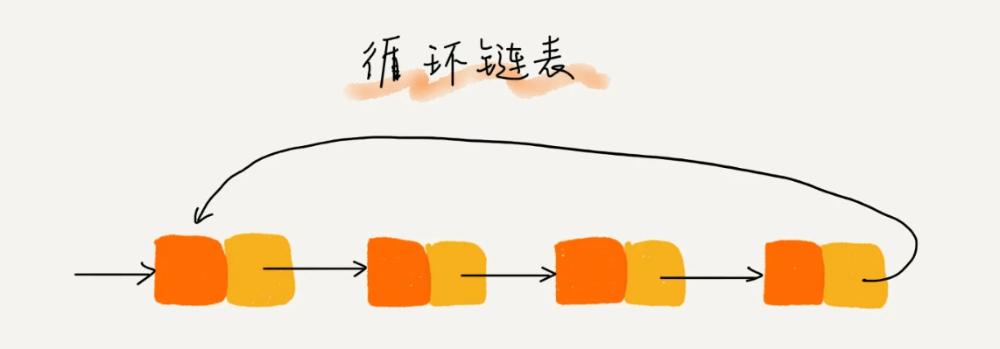
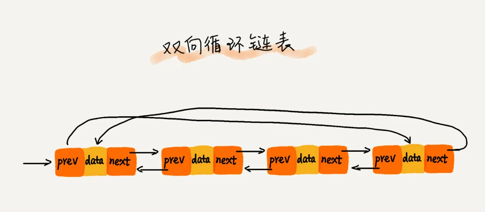

[toc]

# 一、概述

数组需要一块连续的内存空间来存储，对内存的要求比较高

而链表恰恰相反，它并不需要一块连续的内存空间，它通过“指针”将一组零散的内存块串联起来使用

指针 或者 引用 的含义：**存储所指对象的内存地址**

**将某个变量赋值给指针/引用，实际上就是将这个变量的地址赋值给指针/引用，或者反过来说，指针/引用中存储了这个变量的内存地址，指向了这个变量，通过指针/引用就能找到这个变量。**

链表的结构有很多种，这里主要介绍三种最常见的链表结构：
- 单链表
- 双向链表
- 循环链表

# 二、单链表

链表通过指针将一组零散的内存块串联在一起。
其中，我们**把内存块称为链表的“结点”**。为了将所有的结点串起来，每个链表的结点除了存储数据之外，**还需要记录链上的下一个结点的地址**。我们把这个记录下个结点地址的指针叫作**后继指针 next**

从单链表图中，可以发现，其中有两个结点是比较特殊的，它们分别是第一个结点和最后一个结点。
我们习惯性地把**第一个结点叫作头结点，把最后一个结点叫作尾结点**。
其中，**头结点用来记录链表的基地址**。有了它，我们就可以遍历得到整条链表。
而尾结点特殊的地方是：**指针不是指向下一个结点，而是指向一个空地址 NULL，表示这是链表上最后一个结点**

在进行数组的插入、删除操作时，为了保持内存数据的连续性，需要做大量的数据搬移，所以时间复杂度是 O(n)。
而在链表中插入或者删除一个数据，我们并不需要为了保持内存的连续性而搬移结点，因为链表的存储空间本身就不是连续的。
所以，在链表中插入和删除一个数据是非常快速的。

但是，有利就有弊。链表要想随机访问第 k 个元素，就没有数组那么高效了。因为链表中的数据并非连续存储的，所以无法像数组那样，根据首地址和下标，通过寻址公式就能直接计算出对应的内存地址，而是需要**根据指针一个结点一个结点地依次遍历，直到找到相应的结点，需要 O(n) 的时间复杂度**

# 三、循环链表

和单链表相比，循环链表的优点是从链尾到链头比较方便。**当要处理的数据具有环型结构特点时，就特别适合采用循环链表**。比如著名的约瑟夫问题。尽管用单链表也可以实现，但是用循环链表实现的话，代码就会简洁很多

# 四、双向链表

单向链表只有一个方向，结点只有一个后继指针 next 指向后面的结点。
而双向链表，顾名思义，它支持两个方向，**每个结点不止有一个后继指针 next 指向后面的结点，还有一个前驱指针 prev 指向前面的结点**

**双向链表需要额外的两个空间来存储后继结点和前驱结点的地址**。
所以，如果存储同样多的数据，双向链表要比单链表占用更多的内存空间。虽然两个指针比较浪费存储空间，但可以支持双向遍历，这样也带来了双向链表操作的灵活性

在实际的软件开发中，从链表中删除一个数据无外乎这两种情况：

- 删除结点中“值等于某个给定值”的结点
- 删除给定指针指向的结点

对于第一种情况，不管是单链表还是双向链表，为了查找到值等于给定值的结点，都需要从头结点开始一个一个依次遍历对比，直到找到值等于给定值的结点，然后再通过我前面讲的指针操作将其删除

尽管单纯的删除操作时间复杂度是 O(1)，**但遍历查找的时间是主要的耗时点，对应的时间复杂度为 O(n)**。根据时间复杂度分析中的加法法则，**删除值等于给定值的结点对应的链表操作的总时间复杂度为 O(n)**

对于第二种情况，我们已经找到了要删除的结点，但是**删除某个结点 q 需要知道其前驱结点，而单链表并不支持直接获取前驱结点**，所以，为了找到前驱结点，我们还是要从头结点开始遍历链表，直到 p->next=q，说明 p 是 q 的前驱结点

但是对于双向链表来说，这种情况就比较有优势了。因为双向链表中的结点已经保存了前驱结点的指针，不需要像单链表那样遍历。所以，**针对第二种情况，单链表删除操作需要 O(n) 的时间复杂度，而双向链表只需要在 O(1) 的时间复杂度内就搞定了**

同理，如果我们希望在链表的某个指定结点前面插入一个结点，双向链表比单链表有很大的优势。双向链表可以在 O(1) 时间复杂度搞定，而单向链表需要 O(n) 的时间复杂度

除了插入、删除操作有优势之外，**对于一个有序链表，双向链表的按值查询的效率也要比单链表高一些**。因为，我们可以记录上次查找的位置 p，每次查询时，根据要查找的值与 p 的大小关系，决定是往前还是往后查找，所以平均只需要查找一半的数据

现在，你有没有觉得双向链表要比单链表更加高效呢？这就是为什么在实际的软件开发中，双向链表尽管比较费内存，但还是比单链表的应用更加广泛的原因。如果你熟悉 Java 语言，你肯定用过 LinkedHashMap 这个容器。如果你深入研究 LinkedHashMap 的实现原理，就会发现其中就用到了双向链表这种数据结构

实际上，这里有一个更加重要的知识点需要你掌握，那就是用**空间换时间的设计思想**。当内存空间充足的时候，如果我们更加追求代码的执行速度，我们就可以选择空间复杂度相对较高、但时间复杂度相对很低的算法或者数据结构。
相反，如果内存比较紧缺，比如代码跑在手机或者单片机上，这个时候，就要反过来用时间换空间的设计思路

**缓存实际上就是利用了空间换时间的设计思想**。如果我们把数据存储在硬盘上，会比较节省内存，但每次查找数据都要询问一次硬盘，会比较慢。但如果我们通过缓存技术，事先将数据加载在内存中，虽然会比较耗费内存空间，但是每次数据查询的速度就大大提高了

# 五、双向循环列表

# 六、链表 VS 数组

|            |  数组  |  链表  |
| :--------: | :----: | :----: |
| 插入、删除 | O（n） | O（1） |
|  随机访问  | O（1） | O（n） |

数组简单易用，在实现上使用的是连续的内存空间，可以借助 CPU 的缓存机制，预读数组中的数据，所以访问效率更高。而链表在内存中并不是连续存储，所以对 CPU 缓存不友好，没办法有效预读

数组的缺点是大小固定，一经声明就要占用整块连续内存空间。
如果声明的数组过大，系统可能没有足够的连续内存空间分配给它，导致“内存不足（out of memory）”。
如果声明的数组过小，则可能出现不够用的情况。这时只能再申请一个更大的内存空间，把原数组拷贝进去，非常费时。
链表本身没有大小的限制，天然地支持动态扩容，这也是它与数组最大的区别。

Java 中的 ArrayList 容器，虽然可以支持动态扩容，但是，当我们往支持动态扩容的数组中插入一个数据时，如果数组中没有空闲空间了，就会申请一个更大的空间，将数据拷贝过去，而数据拷贝的操作是非常耗时的

除此之外，如果你的代码对内存的使用非常苛刻，那数组就更适合你。因为链表中的每个结点都需要消耗额外的存储空间去存储一份指向下一个结点的指针，所以内存消耗会翻倍。而且，对链表进行频繁的插入、删除操作，还会导致频繁的内存申请和释放，容易造成内存碎片，如果是 Java 语言，就有可能会导致频繁的 GC（Garbage Collection，垃圾回收）

# 七、 LRU 缓存淘汰算法

缓存是一种提高数据读取性能的技术，在硬件设计、软件开发中都有着非常广泛的应用，比如常见的 CPU 缓存、数据库缓存、浏览器缓存等等

缓存的大小有限，当缓存被用满时，哪些数据应该被清理出去，哪些数据应该被保留？这就需要缓存淘汰策略来决定。
常见的策略有三种：

- 先进先出策略 FIFO（First In，First Out）
- 最少使用策略 LFU（Least Frequently Used）
- 最近最少使用策略 LRU（Least Recently Used）

如何基于链表实现 LRU 缓存淘汰算法？

设计思路：

维护一个有序单链表，越靠近链表尾部的结点是越早之前访问的。
当有一个新的数据被访问时，我们从链表头开始顺序遍历链表:

1. 如果此数据之前已经被缓存在链表中了，我们遍历得到这个数据对应的结点，并将其从原来的位置删除，然后再插入到链表的头部。

2. 如果此数据没有在缓存链表中，又可以分为两种情况：

   - 如果此时缓存未满，则将此结点直接插入到链表的头部；
   - 如果此时缓存已满，则链表尾结点删除，将新的数据结点插入链表的头部

   

不管缓存有没有满，我们都需要遍历一遍链表，所以这种基于链表的实现思路，**缓存访问的时间复杂度为 O(n)**

我们可以继续优化这个实现思路，比如引散列表（Hash table来记录每个数据的位置，将缓存访问的时间复杂度降到 O(1)。

具体实现在 散列表（Hash table) 中会讲到

# 练习题

## 5 个常见的链表操作

- 单链表反转
- 链表中环的检测
- 两个有序的链表合并
- 删除链表倒数第 n 个结点
- 求链表的中间结点

