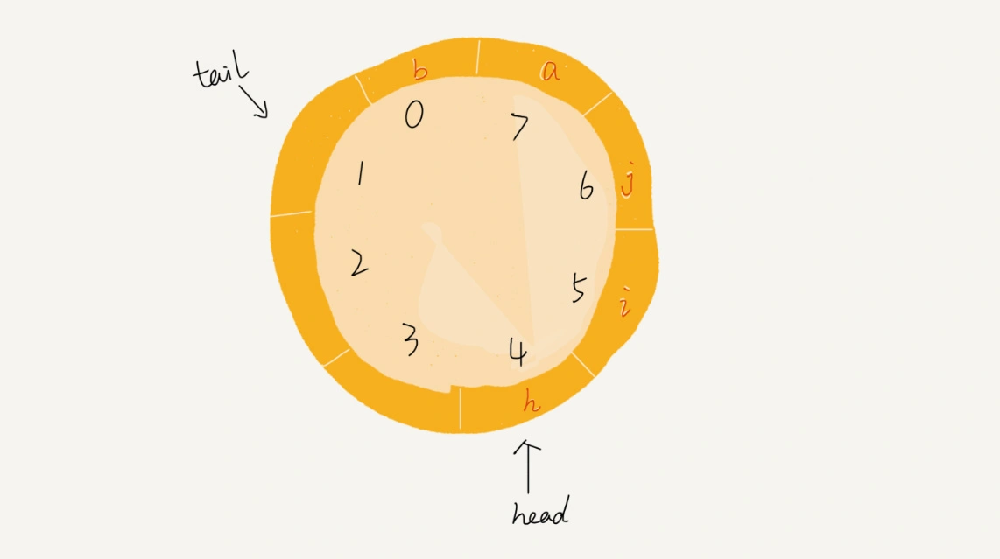

[toc]

# 一、概述


**先进者先出**，这就是典型的“队列”。队列跟栈一样，也是一种**操作受限的线性表数据结构**

我们知道，栈只支持两个基本操作：入栈 push()和出栈 pop()。
队列跟栈非常相似，支持的操作也很有限，最基本的操作也是两个：

- 入队 enqueue()，放一个数据到队列尾部

- 出队 dequeue()，从队列头部取一个元素

  


队列跟栈一样，也是一种抽象的数据结构。它具有先进先出的特性，支持在队尾插入元素，在队头删除元素，那究竟该如何实现一个队列呢？

跟栈一样，**队列可以用数组来实现，也可以用链表来实现**。

用数组实现的栈叫作顺序栈，用链表实现的栈叫作链式栈。
同样，**用数组实现的队列叫作顺序队列，用链表实现的队列叫作链式队列**

```
/**
 * @author ChenSen
 * @date 2021/8/10 17:07
 * @desc 基于数组实现的队列，也叫做顺序队列
 */
public class ArrayQueue<E> {

    private int capacity;     //队列的大小
    private Object[] items;
    private int head;         //head表示队头下标
    private int tail;         //tail表示队尾下标


    public ArrayQueue(int capacity) {
        this.capacity = capacity;
        items = new Object[capacity];
    }

    /**
     * 入队
     *
     * @param item
     */
    public boolean enqueue(E item) {
        if (tail == capacity) {  //队列末尾已经没有空间了

            if (head == 0) {  // tail ==capacity && head==0，表示整个队列都占满了
                return false;
            }

            System.out.println("进行数据搬移 head = " + head + "; tail = " + tail);
            // 数据搬移
            for (int i = head; i < tail; i++) {
                items[i - head] = items[i];
                items[i] = null;  //注意：这个操作不是必要的，因为我们通过tail指针移动来代表数据的移除
            }
            // 搬移完之后重新更新head和tail
            tail = tail - head;
            head = 0;
        }

        items[tail] = item;
        tail++;
        return true;
    }

    /**
     * 出队
     *
     * @return
     */
    public E dequeue() {
        if (head == tail) {  //队列为空
            return null;
        }
        Object item = items[head];
        items[head] = null; //注意：这个操作不是必要的，因为我们通过head指针移动来代表数据的移除
        head++;
        return (E) item;
    }

    @Override
    public String toString() {
        return "ArrayQueue{" +
                "capacity=" + capacity +
                ", items=" + Arrays.toString(items) +
                ", head=" + head +
                ", tail=" + tail +
                '}';
    }

    public static void main(String[] args) {

        ArrayQueue<String> queue = new ArrayQueue<>(5);
        for (int i = 0; i < 6; i++) {
            boolean result = queue.enqueue("item " + i);
            System.out.println("入队 " + result + ";  " + queue.toString());
        }

        for (int i = 0; i < 2; i++) {
            String result = queue.dequeue();
            System.out.println("出队 " + result + ";  " + queue.toString());
        }

        for (int i = 0; i < 5; i++) {
            boolean result = queue.enqueue("item " + i);
            System.out.println("入队 " + result + ";  " + queue.toString());
        }
    }
}

```


# 二、循环队列


上面用数组来实现队列的时候，在 tail==capacity 时，会有数据搬移操作，这样入队操作性能就会受到影响。
那有没有办法能够避免数据搬移呢？我们来看看循环队列的解决思路

循环队列，顾名思义，它长得像一个环。原本数组是有头有尾的，是一条直线。现在我们把首尾相连，扳成了一个环


图中这个队列的大小为 8，当前 head=4，tail=7。当有一个新的元素 a 入队时，我们放入下标为 7 的位置。
但这个时候，我们并不把 tail 更新为 8，而是将其在环中后移一位，到下标为 0 的位置。
当再有一个元素 b 入队时，我们将 b 放入下标为 0 的位置，然后 tail 加 1 更新为 1。
所以，在 a，b 依次入队之后，循环队列中的元素就变成了下面的样子：





通过这样的方法，我们成功避免了数据搬移操作。关于循环队列，最重要额是**确定好队空和队满的判定条件**

在用数组实现的非循环队列中，队满的判断条件是 tail == n，队空的判断条件是 head == tail。
那针对循环队列，队列为空的判断条件仍然是 head == tail。但队列满的判断条件就稍微有点复杂了


队满的情况，tail=3，head=4，capacity=8，所以总结一下规律就是：(3+1)%8=4。
多画几张队满的图，你就会发现，当队满时，**(tail+1) % capacity = head**

当队列满时，图中的 tail 指向的位置实际上是没有存储数据的。所以，**循环队列会浪费一个数组的存储空间**

```
/**
 * @author ChenSen
 * @date 2021/8/10 18:06
 * @desc 基于数组实现的循环队列
 * <p>
 * 循环队列可以避免数据迁移
 * <p>
 * 当队列满时，tail 指向的位置实际上是没有存储数据的，所以循环队列会浪费一个数组的存储空间
 */
public class CircularQueue<E> {

    private int capacity;     //队列的大小
    private Object[] items;
    private int head;         //head表示队头下标
    private int tail;         //tail表示队尾下标


    public CircularQueue(int capacity) {
        this.capacity = capacity;
        items = new Object[capacity];
    }

    /**
     * 入队
     *
     * @param item
     */
    public boolean enqueue(E item) {
        if ((tail + 1) % capacity == head) { //队列已满
            return false;
        }

        items[tail] = item;
        tail = (tail + 1) % capacity;
        return true;
    }

    /**
     * 出队
     *
     * @return
     */
    public E dequeue() {
        if (head == tail) {  //队列为空
            return null;
        }
        Object item = items[head];
        items[head] = null; //注意：这个操作不是必要的，因为我们通过head指针移动来代表数据的移除
        head = (head + 1) % capacity;
        return (E) item;
    }

    @Override
    public String toString() {
        return "CircularQueue{" +
                "capacity=" + capacity +
                ", items=" + Arrays.toString(items) +
                ", head=" + head +
                ", tail=" + tail +
                '}';
    }

    public static void main(String[] args) {

        CircularQueue<String> queue = new CircularQueue<>(5);
        for (int i = 0; i < 6; i++) {
            boolean result = queue.enqueue("item " + i);
            System.out.println("入队 " + result + ";  " + queue.toString());
        }

        for (int i = 0; i < 6; i++) {
            String result = queue.dequeue();
            System.out.println("出队 " + result + ";  " + queue.toString());
        }

        for (int i = 0; i < 5; i++) {
            boolean result = queue.enqueue("item " + i);
            System.out.println("入队 " + result + ";  " + queue.toString());
        }
    }
}
```


# 三、阻塞队列和并发队列


阻塞队列其实就是在队列基础上增加了阻塞操作。
**在队列为空的时候，从队头取数据会被阻塞**。因为此时还没有数据可取，直到队列中有了数据才能返回；
**如果队列已经满了，那么插入数据的操作就会被阻塞**，直到队列中有空闲位置后再插入数据，然后再返回。


基于阻塞队列实现的“生产者 - 消费者模型”，可以有效地协调生产和消费的速度。当“生产者”生产数据的速度过快，“消费者”来不及消费时，存储数据的队列很快就会满了。这个时候，生产者就阻塞等待，直到“消费者”消费了数据，“生产者”才会被唤醒继续“生产”。


阻塞队列，在多线程情况下，会有多个线程同时操作队列，这个时候就会存在线程安全问题，那如何实现一个线程安全的队列呢？

线程安全的队列我们叫作并发队列。**最简单直接的实现方式是直接在 enqueue()、dequeue() 方法上加锁，但是锁粒度大并发度会比较低，同一时刻仅允许一个存或者取操作**

实际上，**基于数组的循环队列，利用 CAS 原子操作，可以实现非常高效的并发队列**
这也是循环队列比链式队列应用更加广泛的原因。在实战篇讲 Disruptor 的时候，我会再详细讲并发队列的应用。


# 总结

队列最大的特点就是先进先出，主要的两个操作是入队和出队。跟栈一样，它既可以用数组来实现，也可以用链表来实现。
用数组实现的叫顺序队列，用链表实现的叫链式队列。特别是长得像一个环的循环队列。

在数组实现队列的时候，会有数据搬移操作，要想解决数据搬移的问题，我们就需要像环一样的循环队列。要想写出没有 bug 的循环队列实现代码，关键要确定好队空和队满的判定条件，具体的代码你要能写出来。

除此之外，我们还讲了几种高级的队列结构，阻塞队列、并发队列，底层都还是队列这种数据结构，只不过在之上附加了很多其他功能。阻塞队列就是入队、出队操作可以阻塞，并发队列就是队列的操作多线程安全。


