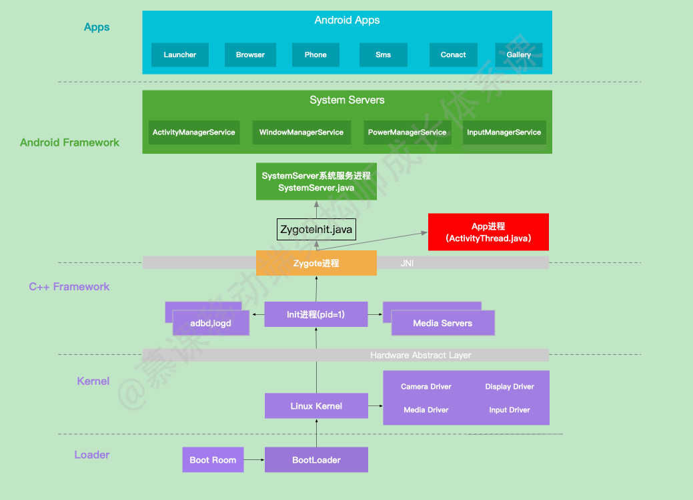
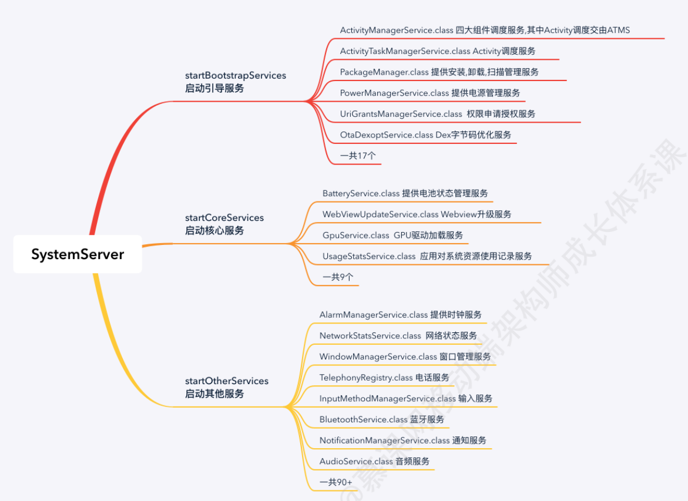
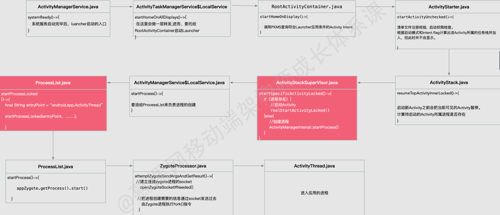
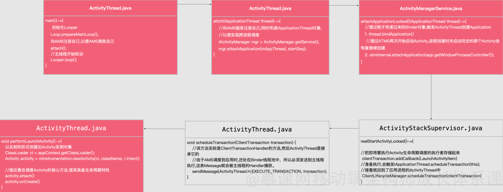
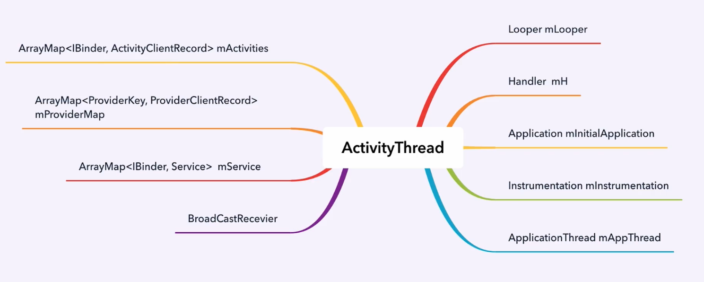

[toc]

#  从开机到 App 启动

# 一、从开机到 SystemServer 系统服务启动


## 1.1  概述

1. 按电源键通电后，引导芯片启动，引导芯片开始从固化在ROM里的预设代码执行，加载引导程序到到RAM，bootloader检查RAM，初始化硬件参数. 

2. Kernel 层主要加载一些硬件设备驱动，初始化进程管理，内管管理、加载Driver驱动文件等,启动内核核心进程. 
3. 硬件设备驱动与HAL层进行交互,启动Init进程 ，它启动后会启动adbd，logd等用户守护进程，同时fork出zygote进程。zygote进程是承上启下的存在。同时会反射调用com.android.internal.os.ZygoteInit 进入Java层。 
4. zygote进程启动完毕它会加载虚拟机，启动 System Serve r进程 (zygote孵化的第一个进程)；System Server负责启动和管理整个Android Framework，包含ActivityManager，WindowManager，PackageManager，PowerManager等服务.
5. zygote 同时会启动相关的APP进程，它启动的第一个APP进程为 Launcher，所有的APP进程都由 zygote fork生成





## 1.2 SystemServer系统服务启动过程

SystemServer 进程是在 ZygoteInit.java 的 main 方法中创建的

```
ZygoteInit.java 

    public static void main(String argv[]) {
        // 1.预加载frameworks/base/preloaded-classes和framework_res.apk资源，
        // linux在fork进程时，只是为子进程创建一个数据结构，使子进程地址空间映射到与父进程相同的物理内存空间。
        // 虚拟机的创建也是实例拷贝,共享系统资源，如果每创建一个虚拟机都加载一份系统资源，将会非常耗时和浪费。
        // 子进程在刚fork生成时，完全共享父进程的进程物理空间，采用写时复制的方式共享资源。
        preloadClasses();
        preloadResources();
        preloadSharedLibraries();

        // 2. 启动system_server进程。该进程是framework的核心。
        if (argv[1].equals("start-system-server")) {
            startSystemServer();
        }

        //3.创建Socket服务
        registerZygoteSocket();

        //4.进入阻塞状态，等待连接，用以处理来自AMS申请进程创建的请求
        runSelectLoopMode();
    }
```


SystemServer 的 main 方法主要做了以下三件事情,即启动不同类型的系统服务:

```
SystemServe.java
   public static void main(String argv[]) {
        //创建系统的服务的管理者
        SystemServiceManager mSystemServiceManager = new SystemServiceManager(mSystemContext);
        //启动引导服务
        /startBootstrapServices();
        //启动核心
        startCoreServices();
        //启动其他一般服务
        startOtherServices();
    }
```





# 二、Launcher 应用的进程启动流程


## 2.1 Luancher 进程启动流程示意图

AMS启动完成后，在systemReady()中会去调用startHomeOnAllDisplays()来启动Launcher应用





## 2.2 Launcher进程启动流程关键方法

1. ActivityManagerService#systemReady是Launcher应用启动的入口

   ```
   ActivityManagerService.java
   
     public void systemReady(...) {
           //开始拉起launcher应用的
           // ActivityTaskManagerInternal是抽象类,它的实现类是ATMS的内部类LocalService
           mAtmInternal.startHomeOnAllDisplays(currentUserId, "systemReady");
    }
   ```

   

2. RootActivityContainer#startHomeOnDisplay顾名思义,启动桌面Activity,核心思想是通过PKMS从已安装的所有应用中查询出符合CATEGORY_HOME的Intent的Activity

   ```
    RootActivityContainer.java
    
        boolean startHomeOnDisplay(...) {
           // 构建一个category为CATEGORY_HOME的Intent，
           // 表明是Home Activity Intent homeIntent = mService.getHomeIntent();
           // 通过PKMS从系统所有已安装的应用中，找到一个符合HomeIntent的Activity
           ActivityInfo aInfo = resolveHomeActivity(userId, homeIntent);
   
           // 启动Home Activity。下面就是启动Activity的流程了
           ActivityStartController.startHomeActivity(homeIntent, aInfo, myReason, displayId);
           return true;
       }
   
   ```

   

3. ActivityStackSupervisor#startSpecificActivityLocked在启动Activity时会通过进程名称processName到ATMS查询该进程的控制器对象。如果为空,则说明进程还没创建，则执行创建进程的流程，否则正常启动Activity

   ```
   ActivityStackSupervisor.java
   
       startSpecificActivityLocked(ActivityRecord r) {
           // 通过进程名称和进程uid查询出该进程控制器，如果为空则说明进程不存在,否则执行启动Activity的流程
           WindowProcessController wpc = mService.getProcessController(r.processName, r.info.applicationInfo.uid);
           if (wpc != null && wpc.hasThread()) { //进程存在，执行启动Activity流程
               realStartActivityLocked(....);
           } else { //进程不存在，执行启动进程流程
               // 进程启动完成,则会通过JNI方式调用ZygoteInit.java 进而调用ActivityThread#Main方法
               ActivityManagerService$LocalService.startProcess();
           }
       }
   ```

   

4. ProcessList#startProcessLocked方法，开始启动进程，并且显示指定了进程创成功后该进程的入口类为android.app.ActivityThread,入口方法均为Java约定俗成的public static void main

   ````
   ProcessList.java
   
       boolean startProcessLocked() {
           // 指定了进程创建成功之后执行的进程的入口类,由此可验证ActivityThread才是Android应用的主入口
           String entryPoint = "android.app.ActivityThread";
           return startProcessLocked(...,entryPoint, ....);
       }
   
   ````

   

5. 进程创建最后在ZygoteProcess#attemptZygoteSendArgsAndGetResult的方法中把需要的参数通过socket的形式发送给Zygote进程执行fork命令

   ```
   ZygoteProcess.java
   
       void attemptUsapSendArgsAndGetResult(...) {
           // 创建socket，并建立跟Zygote进程的链接
           LocalSocket usapSessionSocket = new LocalSocket();
           usapSessionSocket.connect(this.mUsapSocketAddress);
           
           // 使用字符输出流把进程创建参数 发送到Socket Server
           BufferedWriter usapWriter = new BufferedWriter(new  OutputStreamWriter(usapSessionSocket.getOutputStream()), Zygote.SOCKET_BUFFER_SIZE);
           DataInputStream usapReader = new DataInputStream(usapSessionSocket.getInputStream());
           usapWriter.write(msgStr);
           usapWriter.flush();
       }
   
   ```

   

   

6. 前面我们说过Zygote进程创建成功之后会进入ZygoteInit.java，在它的入口方法中创建了Socket Server服务接收申请进程创建的请求

   ```
   ZygoteConnection.java
   
       Runnable processCommand(...) {
           // 通过Navtive方法fork() 创建新进程
           int pid = Zygote.forkAndSpecialize(...parsedArgs.mNiceName, ...);
   
           // 进程创建成功之后,会根据创建进程时指定的新进程的入口类"android.app.ActivityThread"反射调用它的main方法，
           // 从而进入到新进程的世界。
           handleChildProc(parsedArgs, descriptors, childPipeFd, parsedArgs.mStartChildZygote);
       }
   ```

   

# 三、Launcher 应用的桌面启动流程


## 3.1  Launcher HomeActivity 启动流程图

上面讲到App应用进程创建完成后，会通过JNI方式调用ZygoteInit.java,进而调用ActivityThread#Main方法。

这里是App的主入口，也是MainLooper的发源地,同时它还会拉起Application和HomeActivity





## 3.2 Launcher HomeActivity 启动流程关键方法


1. ActivityThread#main这是所有Android 应用进程的入口,在这里开启了Looper的循环,从而使得主线程具有消息分发机制。同时也会负责执行来自AMS对四大组件创建和生命周期调度的执行工作。

         ActivityThread.java
           
           public static void main(String[] args) { .....
           
               // ActivityThread之所以称为主线程,就是因为在他的入口处就开始了MainLooper的初始化和loop工作,
               Looper.prepareMainLooper();
               ActivityThread thread = new ActivityThread();
           
               // 该方法至关重要,=
               thread.attach(false, startSeq);
               if (sMainThreadHandler == null) {
                   sMainThreadHandler = thread.getHandler();
               }
               Looper.loop();
               .....
           }

2. ActivityThread#attach是在main方法中触发的，该方法的主要作用是向AMS注册自己,同时传递IApplicationThreadBinder对象以便于AMS能够对本进程四大组件进行调度。

   ```
       ActivityThread.java
   
       private void attach(boolean system, long startSeq) {
           // IApplicationThread mAppThread是内部类实现了IBinder接口
           // 向AMS注册自己,并且传递了mAppThread对象，以便AMS能够调度本进程的四大组件生命周期
           IActivityManager mgr = ActivityManager.getService();
           mgr.attachApplication(mAppThread, startSeq);
       }
   ```

3. ActivityManagerService#attachApplicationLocked,一是负责Application的创建工作的调度,这会流转到应用进程的ActivityThread。 二是负责继续启动之前未完成启动的Activity.即HomeActivity

   ```
       ActivityManagerService.java
   
       // 1是创建Application对象,
       // 2启动该进程的第一个Activity
       boolean attachApplicationLocked(IApplicationThread thread,..) {
           // 该方法回调到ActivityThread的handleBindApplication方法
           // 创建Application，并调用onCreate方法
           thread.bindApplication(...);
   
           // 执行ATMS的attachApplication,开始启动第一个Activity.
           // 会执行到上面提到的ActivityStackSupervisor#realStartActivityLocked()
           // 把刚才待启动的Activity继续启动
           mAtmInternal.attachApplication(...);
       }
   ```

4. ActivityStackSupervisor#realStartActivityLocked负责AMS服务启动Activity最后的流程。在Android 10中把Activity生命周期拆分成几种生命周期状态的Item。LaunchActivityItem,ResumeActivityItem,PauseActivityItem,StopActivityItem,DestroyActivityItem.每个Item负责对Activity生命周期的具体的调度

   ```
    ActivityStackSupervisor.java
   
       boolean realStartActivityLocked(ActivityRecord r) {
           ClientTransaction clientTransaction = ClientTransaction.obtain(proc.getThread(), r.appToken);
           //这里把启动启动Activity操作的Item添加到集合中clientTransaction.addCallback(LaunchActivityItem.obtain(new Intent(r.intent),
           //开始执行生命周期,流程就会再次进入到应用进程中的IApplicationThread的scheduleTransaction方法
           clientLifecycleManager.scheduleTransaction(clientTransaction);
       }
   ```

5. ClientTransactionHandler,实际上Android 10中ActivityThread是继承自ClientTransactionHandler的，所以下面这个sendMessage最后会被ActivityThread$H 捕获。进而触发下面的performLaunchActivity

   ```
     ClientTransactionHandler.java
   
       void scheduleTransaction(ClientTransaction transaction) {
           sendMessage(ActivityThread.H.EXECUTE_TRANSACTION, transaction);
       }
   ```

6. ActivitityThread#performLaunchActivity主要负责执行来自AMS对Activity创建调度的执行,Activity的创建是通过Instrumentation反射创建出来的。进而执行Activity的attch,onCreate。所以Activity才有了生命周期的能力

   ```
       ActivitityThread.java
   
       public Activity performLaunchActivity(...) {
           //通过反射构建出 Activity对象
           ClassLoader cl = appContext.getClassLoader();
           Activity activity = mInstrumentation.newActivity(cl, component.getClassName(), r.intent);
           //调度Activity的attach()方法
           activity.attach（）
           // 调度Activity的onCreate方法
           mInstrumentation.callActivityOnCreate（）
           //所以我们发现Activity也是反射创建出来的，因为有了ActivityThread的调度才具备了生命周期。
           // 至此Launcher应用的进程创建和HomeActivity的启动我们就分析完了 }
       }
   ```

    

# 四、ActivityThread 与 四大组件


ActivityThread是Android程序第一入口、主线程开始的发源地，也是负责AMS对四大组件调度的具体执行类




实际上四大组件的另外三个也是由AMS调度由ActivityThread创建并赋予他们生命周期。

startService

```
       scheduleCreateService()->{
            sendMessage(H.CREATE_SERVICE, s)->{
                handleBindService((BindServiceData) msg.obj)->{

                    //反射创建Service
                    ClassLoader cl = packageInfo.getClassLoader();
                    Service service = appCompentFactory.instantiateService(cl,...)
                    //紧接着调用核心方法、赋予生命周期
                    service.attach(service.onCreate();
                }
            }
        }
```


BroadcastReceiver

```
   scheduleReceiver()->{
            sendMessage(H.RECEIVER, r)->{
                //反射创建对象,并紧接着调用它的 onReceive方法
                ClassLoader cl = context.getClassLoader();
                BroadcastReceiver receiver = appCompentFactory.instantiateReceiver(cl,...);
                receiver.onReceive(data.intent);
            }
        }
```


***


# 