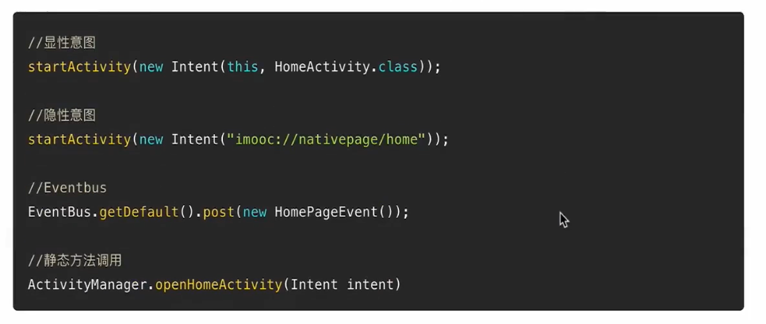
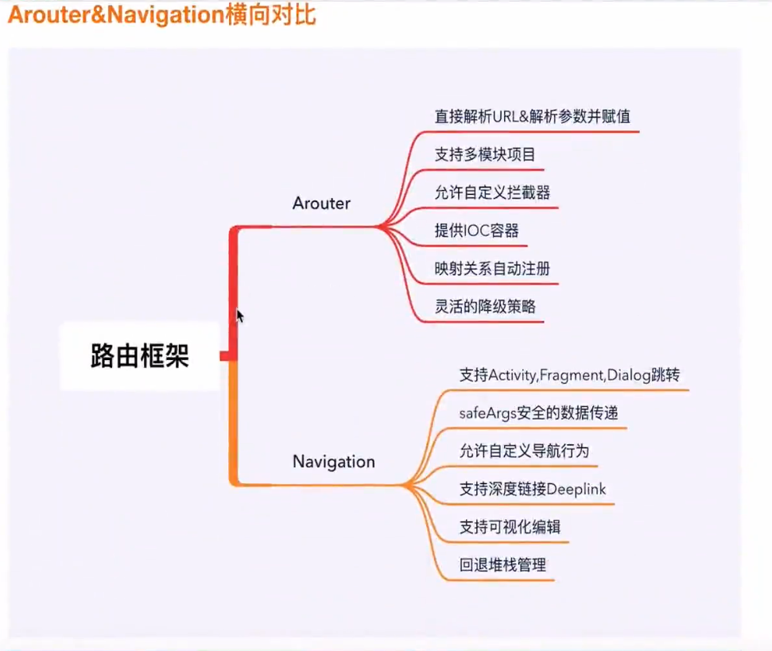

[toc]

# Android 路由

# 一、概述

## 1.1 什么是路由

## 1.2 为什么需要路由

- 降级
- 组件化
- 原生与H5

## 1.3 路由库需要具备什么能力

- 分发
- 管理
- 控制

## 1.4 传统的路由方式

- 显性意图、隐性意图
- 广播、EventBus
- 静态方法显性调用

我们所使用的原生路由方案一般是通过显式intent和隐式intent两种方式实现的（这里主要是指跳转Activity or Fragment）。
在显式intent的情况下，因为会存在直接的类依赖的问题，导致耦合非常严重；
而在隐式intent情况下，则会出现规则集中式管理，导致协作变得非常困难。一般而言配置规则都是在Manifest中的，这就导致了扩展性较差。

除此之外，使用原生的路由方案会出现跳转过程无法控制的问题，因为一旦使用了StartActivity()就无法插手其中任何环节了，
只能交给系统管理，这就导致了在跳转失败的情况下无法降级，而是会直接抛出运营级的异常

## 1.5 ARouter 对比 Navigation

# 