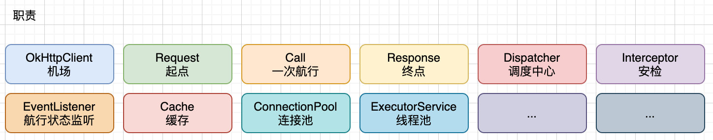
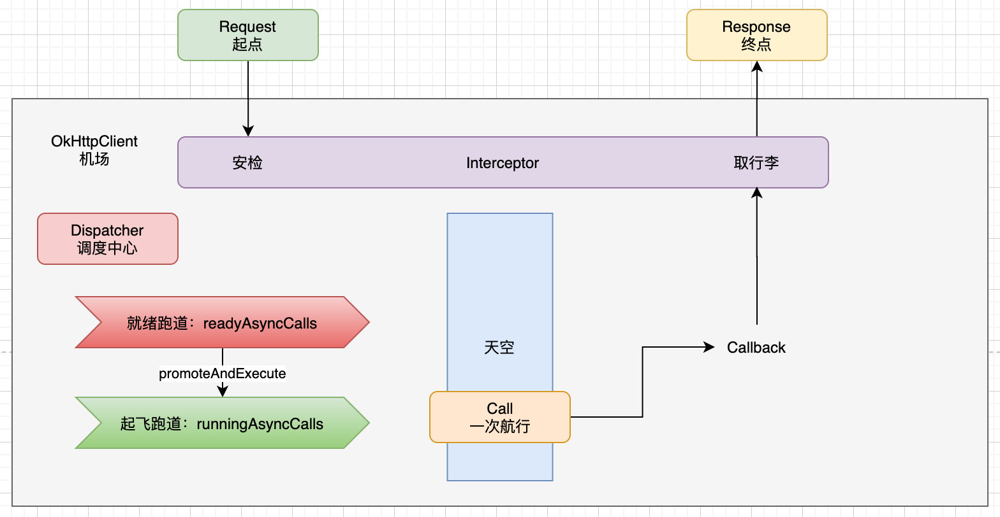
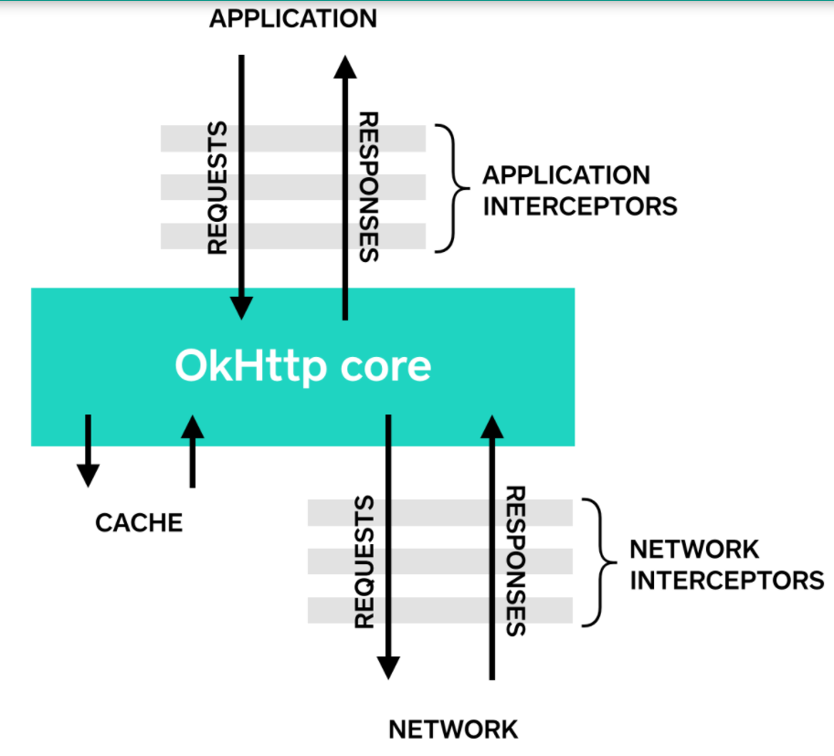
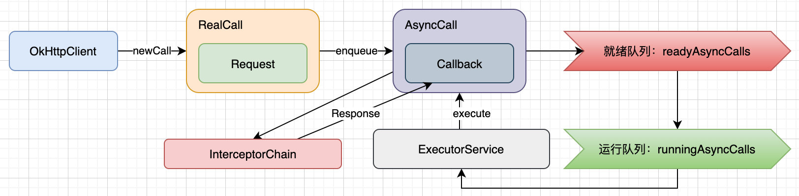

[toc]


[OkHttp]("https://github.com/square/okhttp")


# 一、概述








# 二、重要的类和方法

## OkhttpClient

相当于配置中⼼，所有的请求都会共享这些配置（例如出错是否重试、共享的连接池）

OkHttpClient 中的配置主要有：

- Dispatcher dispatcher ：调度器，⽤于调度后台发起的⽹络请求，有后台总请求数和单主机总请求数的控制。

- List<Protocol> protocols ：⽀持的应⽤层协议，即 HTTP/1.1、HTTP/2 等

- List<ConnectionSpec> connectionSpecs ：应⽤层⽀持的 Socket 设置，即使⽤明⽂传输（⽤于 HTTP）还是某个版本的 TLS（⽤于HTTPS）

- List<Interceptor> interceptors ：⼤多数时候使⽤的 Interceptor 都应该配置到这⾥

- List<Interceptor> networkInterceptors ：直接和⽹络请求交互的 Interceptor 配置到这⾥，例如如果你想查看返回的 301 报⽂或者未解压的 Response Body，需要在这⾥看

- CookieJar cookieJar ：管理 Cookie 的控制器。OkHttp 提供了Cookie 存取的判断⽀持（即什么时候需要存 Cookie，什么时候需要读取Cookie，但没有给出具体的存取实现。如果需要存取 Cookie，你得⾃⼰写实现，例如⽤ Map 存在内存⾥，或者⽤别的⽅式存在本地存储或者数据库

- Cache cache ：Cache 存储的配置。默认是没有，如果需要⽤，得⾃⼰配置出 Cache 存储的⽂件位置以及存储空间上限。

- HostnameVerifier hostnameVerifier ：**⽤于验证 HTTPS 握⼿过程中下载到的证书所属者是否和⾃⼰要访问的主机名⼀致**

- CertificatePinner certificatePinner ：⽤于设置 HTTPS 握⼿过程中针对某个 Host 额外的的 Certifificate Public Key Pinner，即把⽹站证书链中的每⼀个证书公钥直接拿来提前配置进 OkHttpClient ⾥去，作为正常的证书验证机制之外的⼀次额外验证。

- Authenticator authenticator ：⽤于⾃动重新认证。配置之后，在请求收到 401 状态码的响应是，会直接调⽤ authenticator ，⼿动加⼊ Authorization header 之后⾃动重新发起请求。

- boolean followRedirects ：遇到重定向的要求是，是否⾃动follow。

- boolean followSslRedirects 在重定向时，如果原先请求的是 http⽽重定向的⽬标是 https，或者原先请求的是 https ⽽重定向的⽬标是http，是否依然⾃动 follow。（记得，不是「是否⾃动 follow HTTPS URL重定向的意思，⽽是是否⾃动 follow 在 HTTP 和 HTTPS 之间切换的重定向）

- boolean retryOnConnectionFailure ：在请求失败的时候是否⾃动重试。注意，⼤多数的请求失败并不属于 OkHttp 所定义的「需要重试」，这种重试只适⽤于「同⼀个域名的多个 IP 切换重试」「Socket 失效重试」等情况。

- int connectTimeout ：建⽴连接（TCP 或 TLS）的超时时间。

- int readTimeout ：发起请求到读到响应数据的超时时间。

- int writeTimeout ：发起请求并被⽬标服务器接受的超时时间。（为什么？因为有时候对⽅服务器可能由于某种原因⽽不读取你的 Request）


- newCall(Request)  ⽅法会返回⼀个 RealCall 对象，它是 Call 接⼝的实现。当调⽤ RealCall.execute() 的时

  候， RealCall.getResponseWithInterceptorChain() 会被调⽤，它会发起⽹络请求并拿到返回的响应，装进⼀个 Response 对象并作为返回值返回； 

  RealCall.enqueue() 被调⽤的时候⼤同⼩异，区别在于enqueue() 会使⽤ Dispatcher 的线程池来把请求放在后台线程进⾏，但实质上使⽤的同样也是 getResponseWithInterceptorChain() ⽅法

- getResponseWithInterceptorChain() ⽅法做的事：把所有配置好的Interceptor 放在⼀个 List ⾥，然后作为参数，创建⼀个RealInterceptorChain 对象，并调⽤ chain.proceed(request) 来发起请求和获取响应。


## Request

代表一次 Http 请求，包含一下字段：

- url
- method
- headers
- body


## RequestBody

一个抽象类，代表一次 Http 请求的请求体


## Call  、AsyncCall


`AsyncCall`里有一个原子计数器，

```java
//目前每个主机（域名）有多少个会话call
volatile AtomicInteger callsPerHost = new AtomicInteger(0);
```


##  Interceptors


拦截器链基于`责任链模式`，即不同的拦截器有不同的职责，链上的拦截器会按顺序挨个处理，在`Request`发出之前，`Response`返回之前，插入一些定制逻辑，这样可以方便的扩展需求。当然`责任链模式`也有不足，就是只要一个环节阻塞住了，就会拖慢整体运行（效率）；同时链条越长，产生的中间对象就越多（内存）





从上到下，每级 Interceptor 做的事：

⾸先是开发者使⽤ addInterceptor(Interceptor) 所设置的，它们会按照开发者的要求，**在所有其他 Interceptor 处理之前，进⾏最早的预处理⼯作，以及在收到 Response 之后，做最后的善后⼯作**。如果你有统⼀的 header 要添加，可以在这⾥设置；

然后是

-  RetryAndFollowUpInterceptor ：它会对连接做⼀些初始化⼯作，并且负责在请求失败时的重试，以及重定向的⾃动后续请求。它的存在，可以让重试和重定向对于开发者是⽆感知的；

- BridgeInterceptor ：它负责⼀些不影响开发者开发，但影响 HTTP 交互的⼀些额外预处理。例如，Content-Length 的计算和添加、gzip 的⽀持（Accept-Encoding: gzip）、gzip 压缩数据的解包，都是发⽣在这⾥；

- CacheInterceptor ：它负责 Cache 的处理。把它放在后⾯的⽹络交互相关 Interceptor 的前⾯的好处是，如果本地有了可⽤的 Cache，⼀个请求可以在没有发⽣实质⽹络交互的情况下就返回缓存结果，⽽完全不需要开发者做出任何的额外⼯作，让 Cache 更加⽆感知；

- ConnectInterceptor ：它负责建⽴连接。在这⾥，OkHttp 会创建出⽹络请求所需要的 TCP 连接（如果是 HTTP），或者是建⽴在 TCP 连接之上的 TLS 连接（如果是 HTTPS），并且会创建出对应的 HttpCodec 对象（⽤于编码解码 HTTP 请求）；然后是开发者使⽤ addNetworkInterceptor(Interceptor) 所设置的，它们的⾏为逻辑和使⽤ addInterceptor(Interceptor) 创建的⼀样，但由于位置不同，所以这⾥创建的 Interceptor 会看到每个请求和响应的数据（包括重定向以及重试的⼀些中间请求和响应），并且看到的是完整原始数据，⽽不是没有加 Content-Length 的请求数据，或者 Body还没有被 gzip 解压的响应数据。多数情况，这个⽅法不需要被使⽤，不过如果你要做⽹络调试，可以⽤它；

- CallServerInterceptor ：它负责实质的请求与响应的 I/O 操作，即往 Socket ⾥写⼊请求数据，和从 Socket ⾥读取响应数据。


## Dispatcher

调度器，用于执行异步请求，

每个调度程序使用一个 [ExecutorService] 在内部运行调用


`Dispatcher`里有两个默认max值，

```
maxRequests = 64
同时执行请求的最大并发数

maxRequestsPerHost = 5
每个主机并发执行的最大请求数
```


## Response


## ResponseBody


# 三、其他

拦截器是一种强大的机制，可以对网络请求进行**监视、重写和重试**


拦截器分为 应用拦截器和网络拦截器，
两者最大的区别是，
当请求的地址发生重定向或重试等操作时，应用拦截器只会拦截一次，而网络拦截器会拦截多次


## 重写请求
拦截器可以添加、删除或替换请求头，还可以对请求体进行操作。

例如，如果您连接到已知支持它的网络服务器，您可以使用应用程序拦截器来对请求体进行压缩。

```java
/** This interceptor compresses the HTTP request body. Many webservers can't handle this! */
final class GzipRequestInterceptor implements Interceptor {
  @Override public Response intercept(Interceptor.Chain chain) throws IOException {
    Request originalRequest = chain.request();
    if (originalRequest.body() == null || originalRequest.header("Content-Encoding") != null) {
      return chain.proceed(originalRequest);
    }

    Request compressedRequest = originalRequest.newBuilder()
        .header("Content-Encoding", "gzip")
        .method(originalRequest.method(), gzip(originalRequest.body()))
        .build();
    return chain.proceed(compressedRequest);
  }

  private RequestBody gzip(final RequestBody body) {
    return new RequestBody() {
      @Override public MediaType contentType() {
        return body.contentType();
      }

      @Override public long contentLength() {
        return -1; // We don't know the compressed length in advance!
      }

      @Override public void writeTo(BufferedSink sink) throws IOException {
        BufferedSink gzipSink = Okio.buffer(new GzipSink(sink));
        body.writeTo(gzipSink);
        gzipSink.close();
      }
    };
  }
}
```

## 重写响应

例如，您可以重写服务器错误配置的 Cache-Control 响应头以启用更好的响应缓存
```kotlin
/** Dangerous interceptor that rewrites the server's cache-control header. */
private static final Interceptor REWRITE_CACHE_CONTROL_INTERCEPTOR = new Interceptor() {
  @Override public Response intercept(Interceptor.Chain chain) throws IOException {
    Response originalResponse = chain.proceed(chain.request());
    return originalResponse.newBuilder()
        .header("Cache-Control", "max-age=60")
        .build();
  }
};
```


## HTTPS

### 概述

在协商与 HTTPS 服务器的连接时，OkHttp 需要知道要提供哪些 TLS 版本和密码套件。
- 想要最大化连接性的客户端将包括过时的 TLS 版本和弱设计密码套件。
- 想要最大化安全性的严格客户端将仅限于最新的 TLS 版本和最强的密码套件


ConnectionSpec 实现了特定的安全性与连接性决策。 
OkHttp 包含四个内置连接规范:

- RESTRICTED_TLS 是一种安全配置，旨在满足更严格的合规性要求
- MODERN_TLS 是连接到现代 HTTPS 服务器的安全配置
- COMPATIBLE_TLS 是一种安全配置，可连接到安全但不是当前的 HTTPS 服务器
- CLEARTEXT 是用于 http: URL 的不安全配置


OkHttp 默认使用  MODERN_TLS。
可以通过以下方式配置, 当 MODERN_TLS 失败时会切换到 COMPATIBLE_TLS 

```
OkHttpClient client = new OkHttpClient.Builder()
    .connectionSpecs(Arrays.asList(ConnectionSpec.MODERN_TLS, ConnectionSpec.COMPATIBLE_TLS))
    .build();
```


您可以使用一组自定义的 TLS 版本和密码套件构建自己的连接规范
[这一块可以参考Https中TLS结构](../../http/Https.md)

```
ConnectionSpec spec = new ConnectionSpec.Builder(ConnectionSpec.MODERN_TLS)
    .tlsVersions(TlsVersion.TLS_1_2)
    .cipherSuites(
          CipherSuite.TLS_ECDHE_ECDSA_WITH_AES_128_GCM_SHA256,
          CipherSuite.TLS_ECDHE_RSA_WITH_AES_128_GCM_SHA256,
          CipherSuite.TLS_DHE_RSA_WITH_AES_128_GCM_SHA256)
    .build();

OkHttpClient client = new OkHttpClient.Builder()
    .connectionSpecs(Collections.singletonList(spec))
    .build();
```

### TLS 握手失败

**TLS 握手要求客户端和服务器共享一个相同的 TLS 版本和密码套件**。
这取决于 JVM 或 Android 版本、OkHttp 版本和 Web 服务器配置。

如果没有相同的密码套件和 TLS 版本，你的调用会像这样失败：
```
Caused by: javax.net.ssl.SSLProtocolException: SSL handshake aborted: ssl=0x7f2719a89e80:
    Failure in SSL library, usually a protocol error
        error:14077410:SSL routines:SSL23_GET_SERVER_HELLO:sslv3 alert handshake 
        failure (external/openssl/ssl/s23_clnt.c:770 0x7f2728a53ea0:0x00000000)
    at com.android.org.conscrypt.NativeCrypto.SSL_do_handshake(Native Method)
```


您可以使用 [Qualys SSL Labs](https://www.ssllabs.com/ssltest/) 检查 Web 服务器的配置。
OkHttp 的 TLS 配置历史记录在[这里](https://square.github.io/okhttp/tls_configuration_history/)


### Certificate Pinning  证书认证

默认情况下，OkHttp 信任主机平台的证书颁发机构。
此策略可最大限度地提高连接性，但会受到证书颁发机构攻击，例如 2011 年 DigiNotar 攻击。

**使用 CertificatePinner 来限制信任哪些证书和证书颁发机构**。
CertificatePinner 可提高安全性，但会限制您的服务器团队更新其 TLS 证书的能力。

注意：未经服务器 TLS 管理员的许可，请勿使用 CertificatePinner

```kotlin
  private val client = OkHttpClient.Builder()
      .certificatePinner(
          CertificatePinner.Builder()
              .add("publicobject.com", "sha256/afwiKY3RxoMmLkuRW1l7QsPZTJPwDS2pdDROQjXw8ig=")
              .build())
      .build()

  fun run() {
    val request = Request.Builder()
        .url("https://publicobject.com/robots.txt")
        .build()

    client.newCall(request).execute().use { response ->
      if (!response.isSuccessful) throw IOException("Unexpected code $response")

      for (certificate in response.handshake!!.peerCertificates) {
        println(CertificatePinner.pin(certificate))
      }
    }
  }
```


### Customizing Trusted Certificates  自定义证书

下面的示例展示了如何使用您自己的证书替换主机平台的证书颁发机构。

注意： 和上面的 CertificatePinner 一样，未经服务器 TLS 管理员的支持，请勿使用自定义证书！


```kotlin
  private val client: OkHttpClient

  init {
    val trustManager = trustManagerForCertificates(trustedCertificatesInputStream())
    val sslContext = SSLContext.getInstance("TLS")
    sslContext.init(null, arrayOf<TrustManager>(trustManager), null)
    val sslSocketFactory = sslContext.socketFactory

    client = OkHttpClient.Builder()
        .sslSocketFactory(sslSocketFactory, trustManager)
        .build()
  }

  fun run() {
    val request = Request.Builder()
        .url("https://publicobject.com/helloworld.txt")
        .build()

    client.newCall(request).execute().use { response ->
      if (!response.isSuccessful) throw IOException("Unexpected code $response")

      for ((name, value) in response.headers) {
        println("$name: $value")
      }

      println(response.body!!.string())
    }
  }

  /**
   * Returns an input stream containing one or more certificate PEM files. This implementation just
   * embeds the PEM files in Java strings; most applications will instead read this from a resource
   * file that gets bundled with the application.
   */
  private fun trustedCertificatesInputStream(): InputStream {
    ... // Full source omitted. See sample.
  }

  private fun trustManagerForCertificates(inputStream: InputStream): X509TrustManager {
    ... // Full source omitted. See sample.
  }
```


# 四、源码分析


>  基于 Okhttp 版本 4.9.1





以一个简单的异步请求为例

```
    private val client = OkHttpClient.Builder()
        .addInterceptor(HttpLoggingInterceptor().setLevel(HttpLoggingInterceptor.Level.BODY))
        .build()

     val request = Request.Builder()
            .url("https://publicobject.com/helloworld.txt")
            .method("GET", null)
            .build()

       val call = client.newCall(request)
       
       call.enqueue(object : Callback {
            override fun onFailure(call: Call, e: IOException) {
                "onFailure : ${e.message}".log()
            }

            override fun onResponse(call: Call, response: Response) {
                val body = response.body
                "onResponse ${body?.string()}".log()
            }
        })
```


首先创建 OkhttClient， 然后创建一个 Request 对象，代表此次请求

然后调用 client.newCall(request) 方法，得到一个 Call 对象

```
// OkhttpClient 268行 

  /** Prepares the [request] to be executed at some point in the future. */
  override fun newCall(request: Request): Call = RealCall(this, request, forWebSocket = false)
```


 可以看到，返回的实际上是一个 RealCall 对象，

现在有了 call 对象，就可以通过 enqueue 方法加入到队列中

```
 // RealCall 160行
 
 override fun enqueue(responseCallback: Callback) {
    check(executed.compareAndSet(false, true)) { "Already Executed" }

    callStart()
    client.dispatcher.enqueue(AsyncCall(responseCallback))  //这里是重点
  }
```

在 RealCall 的 enqueue 方法中，实际上调用的是  client.dispatcher 的 enqueue  方法，传入的对象是一个 AsyncCall

首先，先看一个 AsyncCall，它是 RealCall 中的一个内部类，继承自 Runnable，后面会讲到

我们先看  client.dispatcher.enqueue(AsyncCall(responseCallback)) ，进入到 dispatcher 

```
 //Dispatch 114行
 
 internal fun enqueue(call: AsyncCall) {
    synchronized(this) {
     ...
    promoteAndExecute()  
  }
  
 
 // Dispatch 161行
  private fun promoteAndExecute(): Boolean {

    val executableCalls = mutableListOf<AsyncCall>()
    val isRunning: Boolean
    synchronized(this) {
      val i = readyAsyncCalls.iterator() 
      while (i.hasNext()) {     // 遍历所有可以执行的 Call
        val asyncCall = i.next()

        i.remove()
        asyncCall.callsPerHost.incrementAndGet()
        executableCalls.add(asyncCall)
        runningAsyncCalls.add(asyncCall)
      }
      isRunning = runningCallsCount() > 0
    }

    for (i in 0 until executableCalls.size) {
      val asyncCall = executableCalls[i]
      asyncCall.executeOn(executorService)    // 执行 call 对象的 executeOn 方法
    }
    return isRunning
  }
  
```


可以看到，调度器 Dispatch 最终执行的是 call 对象的 executeOn 方法，

这个 call 对象其实就是 AsyncCall 对象，AsyncCall 是 Call 的内部类

```
// Call 470
internal inner class AsyncCall(
    private val responseCallback: Callback
  ) : Runnable {
		...
		
    
    fun executeOn(executorService: ExecutorService) {  // 由 Dispatcher 调用
      client.dispatcher.assertThreadDoesntHoldLock()

      try {
      
        executorService.execute(this)  // 使用线程池执行call实例

      } catch (e: RejectedExecutionException) {
      } finally {
        if (!success) {
          client.dispatcher.finished(this) // This call is no longer running!
        }
      }
    }

	// 线程池执行，会调用此方法
    override fun run() {

        try {
         val response = getResponseWithInterceptorChain()   // 这个方法很重要

          responseCallback.onResponse(this@RealCall, response)  //成功的回调
          
        } catch (e: IOException) {
      
            responseCallback.onFailure(this@RealCall, e)  //失败的回调

        } catch (t: Throwable) {
        } finally {
          client.dispatcher.finished(this)
        }
      }
      
      
  // 174行
 internal fun getResponseWithInterceptorChain(): Response {
 
    val interceptors = mutableListOf<Interceptor>()    // Build a full stack of interceptors.
    //添加自定义拦截器
    interceptors += client.interceptors
    
    //添加默认拦截器
    interceptors += RetryAndFollowUpInterceptor(client)
    interceptors += BridgeInterceptor(client.cookieJar)  
    interceptors += CacheInterceptor(client.cache)
    interceptors += ConnectInterceptor
    if (!forWebSocket) {
      //添加自定义网络拦截器（在ConnectInterceptor后面，此时网络连接已准备好）
      interceptors += client.networkInterceptors
    }
    
     //添加默认拦截器，共4+1=5个
    interceptors += CallServerInterceptor(forWebSocket)

    //创建拦截器链
    val chain = RealInterceptorChain(
        call = this,
        interceptors = interceptors,
        index = 0,
        exchange = null,
        request = originalRequest,
        connectTimeoutMillis = client.connectTimeoutMillis,
        readTimeoutMillis = client.readTimeoutMillis,
        writeTimeoutMillis = client.writeTimeoutMillis
    )

    var calledNoMoreExchanges = false
    try {
      val response = chain.proceed(originalRequest)
      if (isCanceled()) {
        response.closeQuietly()
        throw IOException("Canceled")
      }
      return response
    } catch (e: IOException) {
      calledNoMoreExchanges = true
      throw noMoreExchanges(e) as Throwable
    } finally {
      if (!calledNoMoreExchanges) {
        noMoreExchanges(null)
      }
    }
  }
    

```


