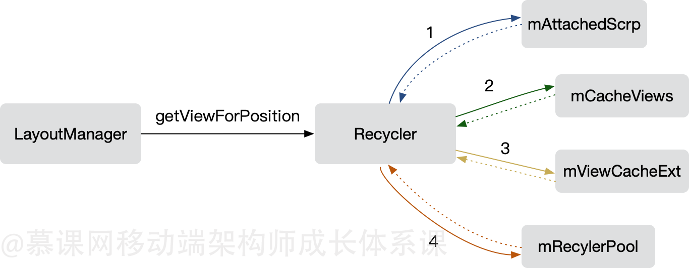

[toc]

# RecyclerView


# Recycler 复用

```

public final class Recycler {     

     //#1 不需要重新bindViewHolder   
     ArrayList mAttachedScrap; 
     ArrayList mChangedScrap; 

     //#2 可通过setItemCacheSize调整，默认大小为2, 
     ArrayList mCachedViews; 
     
     //#3 自定义拓展View缓存 
     ViewCacheExtension mViewCacheExtension; 
     
     //#4 根据viewType存取ViewHolder，
     //   可通过setRecycledViewPool调整,每个类型容量默认为5 
     RecycledViewPool mRecyclerPool;


     
      // Attempts to get the ViewHolder for the given position, either from the Recycler scrap,
      // cache, the RecycledViewPool, or creating it directly.
       ViewHolder tryGetViewHolderForPositionByDeadline(int position,
                   boolean dryRun, long deadlineNs) {
        }
 }

```

四级缓存：

- 第一级缓存： mAttachedScrap、mChangedScrap
复用时，不需要重新调用 bindViewHolder     (屏幕内的ViewHolder)
RecyclerView 认为这中情况的 ViewHolder 还会再次出现在屏幕上，所以这两个集合缓存起来的 ViewHolder 状态、数据都不会改变

- 第二级缓存： mCachedViews
随着列表的滑动，被滑出的 ViewHolder 会被放到 mCachedViews 中  (滑出屏幕的ViewHolder，只有相同位置的可以直接复用)
默认大小为2，可通过 setItemCacheSize 调整

- 第三级缓存： mViewCacheExtension
自定义拓展 View 缓存 

- 第四级缓存： mRecyclerPool
复用时，需要重新调用 bindViewHolder  
当 mCachedViews 存放不下时，会把 ViewHolder 放到 mRecyclerPool 中
可通过 setRecycledViewPool 调整,每个类型容量默认为5 




