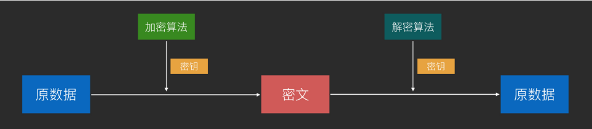
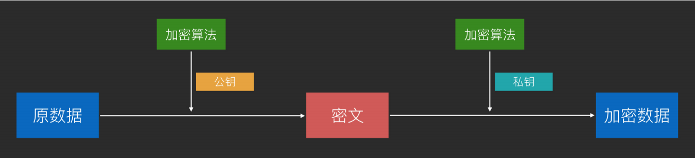
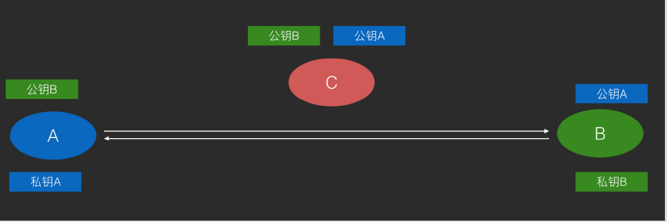
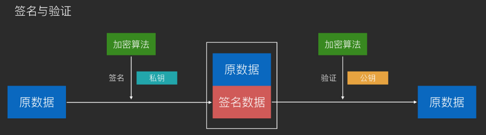
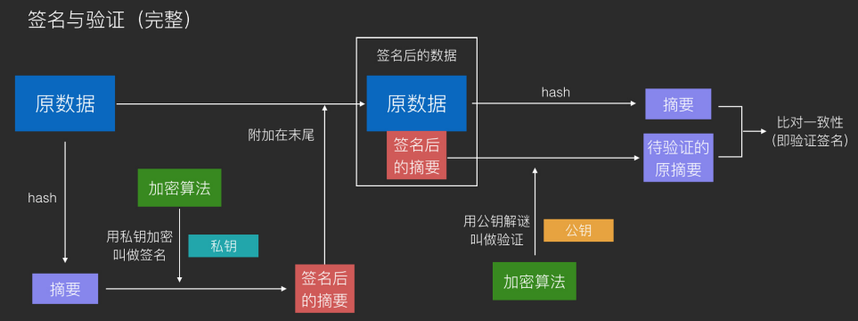

[toc]

# 一、对称加密

## 1.1 概念

通信双⽅使⽤**同⼀个密钥**，使⽤加密算法配合上密钥来加密，解密时使⽤加密过程的完全逆过程配合密钥来进⾏解密。

简化模型即古典密码学中替换式加密的模型：对⽂字进⾏规则化替换来加密，对密⽂进⾏逆向的规则化替换来解密

## 1.2 经典算法- DES

DES（56 位密钥，密钥太短⽽逐渐被弃⽤）

## 1.3 经典算法- AES
AES（128 位、192 位、256 位密钥，现在最流⾏）

## 1.4 对称加密作⽤

加密通信，防⽌信息在不安全⽹络上被截获后，信息被⼈读取或篡改

## 1.5 对称加密（如 AES）的破解 

- 拿到⼀组或多组原⽂-密⽂对

- 设法找到⼀个密钥，这个密钥可以将这些原⽂-密⽂对中的原⽂加密为密⽂，
  以及将密⽂解密为原⽂的组合，即为成功破解
  
  

## 1.6 反破解
⼀种优秀的对称加密算法的标准是，让破解者找不到⽐穷举法（暴⼒破解法）更有
效的破解⼿段，并且穷举法的破解时间⾜够⻓（例如数千年）

## 1.8  对称加密的优缺点

对称加密的优势在于加解密速度快，但是安全性较低，密钥一旦泄露，所有的加密信息都会被破解

# 二、非对称加密

## 2.1 概念

原理：使⽤**公钥对数据进⾏加密**得到密⽂；使⽤**私钥对数据进⾏解密**得到原数据。

⾮对称加密使⽤的是复杂的数学技巧，在古典密码学中没有对应的原型

**通过公钥加密的内容，只有私钥才可以解开，而通过私钥加密的内容，只有公钥才可以解开**

使⽤⾮对称加密通信，可以在不可信⽹络上将双⽅的公钥传给对⽅，然后在发消息前分别对消息使⽤**对⽅的公钥来加密**和使⽤**⾃⼰的私钥来签名**，做到不可信⽹络上的可靠密钥传播及加密通信。

由于**私钥和公钥互相可解**，因此⾮对称加密还可以应⽤于数字签名技术

通常会对原数据 hash 以后对 hash 签名，然后附加在原数据的后⾯作为签名。这是为了让数据更⼩。

## 2.2 经典算法- RSA

⽤于加密和签名

## 2.3 经典算法- DSA

仅⽤于签名，但速度更快

## 2.4 ⾮对称加密的优缺点

- 优点：可以在不安全⽹络上传输密钥

- 缺点：计算复杂，因此性能相⽐对称加密差很多

## 2.5 ⾮对称加密（如RSA、ECDSA）的破解

- 和对称加密不同之处在于，⾮对称加密的公钥很容易获得，因此制造原⽂-密⽂对是没有困难的事

- 所以，⾮对称加密的关键只在于，如何找到⼀个正确的私钥，可以解密所有经过公钥加密过的密⽂。找到这样的私钥即为成功破解

- 由于⾮对称加密的⾃身特性，怎样通过公钥来推断出私钥通常是⼀种思路（例如RSA），但往往最佳⼿段依然是穷举法，只是和对称加密破解的区别在于，**对称加密破解是不断尝试⾃⼰的新密钥是否可以将⾃⼰拿到的原⽂-密⽂对进⾏加密和解密**，**⽽⾮对称加密时不断尝试⾃⼰的新私钥是否和公钥互相可解**

## 2.6 反破解

和对称加密⼀样，⾮对称加密算法优秀的标准同样在于，让破解者找不到⽐穷举法更有效的破解⼿段，并且穷举法的破解时间⾜够⻓

# 三、对称加密与非对称加密的配合使用

- 单独使用对称加密，存在的问题是：秘钥和算法在网络上进行传输存在泄漏风险

​      例如，A 和 B 进行通讯，使用对称加密，最开始的时候 A 需要把秘钥和算法发送给 B

- 单独使用非对称加密，存在的问题是：加解密速度慢，效率低

在实际应用中，安全与速度，二者都要兼得。所以会通过二者结合的方式进行：

**首先使用非对称加密传输对称加密的秘钥和算法，然后使用对称加密进行明文的加密传输**

例如，A 和 B 进行通讯

1. 首先 A 生成一对非对称加密的秘钥，然后把公钥发给 B
2. B 收到 A 的公钥后，生成一个对称加密算法的秘钥，然后将对称加密的秘钥和算法当做内容用 A 的公钥加密后，在发回给 A
3. A 收到 B 发的数据后，用自己的私钥进行解密，这样 A 就安全的得到了对称加密的秘钥和算法
4. 最后，A 和 B 就可以使用加解密速度更快的对称加密算法来加密通讯内容了

# 四、信息摘要

虽说 对称加密算法 比 非对称加密算法 要快很多，但是遇到要加密的信息很多时，速度也会很慢。

而且并不是所有的信息都需要加密，一些不怕被人看到的信息，我只需要**防止他被人更改**就行了。

那如何防止在通讯过程中信息不被别人修改呢，那就是使用 信息摘要和数字签名

什么是信息摘要 就像一片文章的摘要一样，信息摘要就是一段信息的摘要。

它有以下特征：

- **无论输入的消息有多长，计算出来的消息摘要的长度总是固定的**

- **用相同的摘要算法对相同的消息求两次摘要，其结果必然相同**

- **一般地，只要输入的消息不同，对其进行摘要以后产生的摘要消息也几乎不可能相同**

- **消息摘要是单向的，只能进行正向的信息摘要，而无法从摘要中恢复出任何的原信息**

常用的摘要算法有：

- MD5
- SHA-1
- SHA-256
- SHA-512

这样一来，我们就可以**将非常长的消息，用较短的摘要表示了，并且如果有人修改了我的消息，那么对应的摘要就会变。我们在发信息的时候，摘要也跟着一起发出去，如果信息被改了，那么接收者一算，发现，信息的摘要和原本的摘要不一致，就知道信息被篡改了**

# 五、数字签名

其实上面的考虑并周到，如果黑客连摘要一起改了怎么办？所以必须让黑客无法更改信息摘要，做法也很简单，就是对信息摘要进行签名。

 所谓的 签名(动词) 其实就是使用  **私钥对信息摘要进行加密的过程**
 所谓的 签名(名词) 其实就是  **私钥对信息摘要进行加密后的密文** 

数字签名一般指的是 **私钥对信息摘要进行加密后的密文**

这样一来 我的摘要是加密的 ，如果黑客修改数字签名，那我解密后的签名，就不是原来的签名了，除非碰巧解密后的签名正好是 被修改的消息的签名，但这种几率太低太低，几乎不可能。

# 六、中间人攻击

有了加密和数字签名，真的可以高枕无忧了吗？

还是 A 和 B 通讯的场景，

1.  A 首先生成了一对秘钥，然后把公钥发给 B

2. 这时候，黑客出现了，他也生成了一对秘钥。然后他劫持了 A 给 B 发的消息，并偷偷把 A 的公钥换成自己的公钥，然后还把原来A的公钥给存了起来，最后再发给 B

3. B 收到公钥后，还以为是这是 A 的公钥，于是生成一个对称加密算法的秘钥，然后将对称加密算法和对称加密算法的秘钥当做内容用公钥加密后，在发回给 A

4.  这时，黑客再次劫持，用自己的私钥解开了加密内容。这样黑客就有了 对称加密算法和对称加密算法的秘钥了。

    这还不算完，他把这内容再用之前取出的 A 的公钥加密，然后在发给 A

5. A 收到后，还以为是 B 发来的，兴高采烈的用私钥解开，取出里面的 对称加密算法和秘钥。后期 A、B 就用此对称加密算法来加密通讯内容

6.  遗憾的是，这对称加密的秘钥不光两人有，黑客也有，A、B 的通讯内容还是被看的一清二楚

   

中间人攻击的恐怖之处在于，整个攻击过程，通讯双方无法察觉到任何异议，但通讯内容却暴露在黑客的眼中

# 七、数字证书 、CA

上面的问题出在公钥被黑客偷偷换了。 或者说是信息在传输过程中被修改了。

 解决办法也很简单，那就是**不使用公钥而是使用数字证书(以下简称证书)**

证书是什么东西，简单理解就是一个**被权威机构认证的公钥**

就像我们的毕业证会被学校盖个章一样，权威机构也会为公钥"盖个章"。

 **这样的权威机构，我们称作CA(Certificate Authority)数字证书认证中心。** 只是这个盖章的过程，可能和你想的不一样。

- 首先申请证书的人，会把申请资料提供给CA，这些资料包括，公钥、公司名称、网址等。

- CA审核后，会将审核通过的资料生成信息摘要，然后 CA会用自己的私钥对信息摘要进行签名，这样证书就无法被篡改了。(CA也有一对秘钥，其中公钥是公开的，但是私钥会进行特别的保护，严禁泄漏和盗用)

数字证书的内容包含以下部分：

- 版本号—标识证书的版本（V1 V2 V3)

- 序列号—证书的唯一标识符。

- 签名 —签名算法和内容

- 颁发者—证书颁发者相关信息

- 主体 —证书拥有者相关信息包含公钥、证书过期时间等

- 颁发者唯一标识符—证书颁发者的唯一标识符 V2 V3

- 主体唯 一标识符—证书拥有者的唯一标识符 V2 V3

- 扩展 —可选的标准和专用的扩展 V2 V3

  

由于证书中的签名可以防止黑客篡改，所以，数字证书可以用来代替公钥。

 因此 A 和 B 的安全通讯的过程变成以下这个样子了：

1. 首先，A 生成一对秘钥，然后把公钥等相关信息发给 CA

2. CA 确认无误后，为其颁发证书

3. A 将证书发给 B

4. B 收到证书后，确认证书的信息，然后用 *“CA的公钥”* 解开证书中的签名，然后对证书内容做摘要，最后比较两个摘要是否一致，如果一致就说明证书没有被窜改

5. 如果证书没有被篡改，取出里面的公钥，生成一个对称加密算法的秘钥，将对称加密算法的和秘钥用公钥加密，然后发给 A

6. 之后就可以安全通讯了(其实这也是 HTTPS 协议的加密过程)

   

(这里提一个小问题，第四步中的CA的公钥是怎么来的)

# 八、根证书

CA的公钥是怎么来的？CA发给我吗？那发送的过程还是会出现篡改的情况啊。
除非CA的公钥也是一个证书！！！

其实 CA 的公钥的确是一个证书。
那这个证书又是谁签发的呢？

答案是： CA 的 CA，也可以称为 根CA，就同根DNS服务器一样，全世界的 根CA 也就那么几个，负责所有 CA 的证书的签发。

所以上一章的第四步可以细分为

1. B 收到 A 的证书
2. B 用根CA的公钥解开 CA 证书的签名，然后校验 CA 证书的真实性
3. 校验通过后，在用 CA 证书的公钥解开 A 的证书的签名，然后校验证书的真实性
4. 校验通过之后，就可以认为 A 的证书是真实可信的。

有些人可能有要问了，根CA的公钥是怎么来的？
 感觉陷入了一个死循环了。
 其实并不会，因为根CA的"公钥"，其实也是一个证书，但是这个证书有些特殊，他的签发单位是它自己。

这种类型的证书也叫 **自签名证书**

另外根CA的证书，会内置在我们的操作系统和浏览器中。也就是说根CA的证书，天生就有，不需要去下载安装

# 九、总结

- 对称加密：这种加密算法只需要一个 秘钥，且相较于非对称加密 ，加密和解密速度较快

- 非对称加密：这种加密算法需要一对 秘钥，其中一个叫公钥，另一个叫私钥。相较于对称加密来说 ，加密和解密速度较慢

- 公钥：非对称加密中可以被公开的秘钥，用于对信息加密，可被封装成证书。

- 私钥：非对称加密中要保管好的秘钥，用于对公钥加密的信息解密，还可用于签名

- 信息摘要：通过信息摘要算法，将原信息摘要为一个固定长度的摘要

- 数字签名：信息摘要被私钥加密后的密文

- 数字证书：可以简单理解为 **被CA承认且无法篡改的公钥**

- CA：签发证书的权威机构

- 根CA：CA 的 CA，可以签发 CA 的证书

- 根证书：根CA 的自签名证书

# **密码学密钥和登录密码**

## 密钥（key）

场景：⽤于加密和解密

⽬的：保证数据被盗时不会被⼈读懂内容

焦点：数据

## 登录密码（password）

场景：⽤户进⼊⽹站或游戏前的身份验证

⽬的：数据提供⽅或应⽤服务⽅对账户拥有者数据的保护，保证「你是你」的时候才提供权限

焦点：身份

