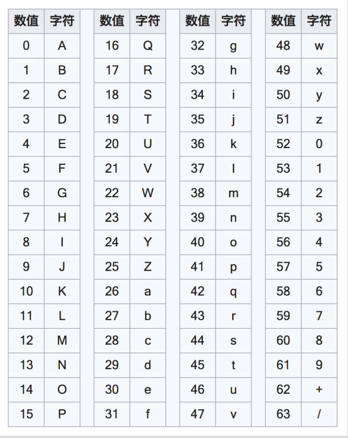
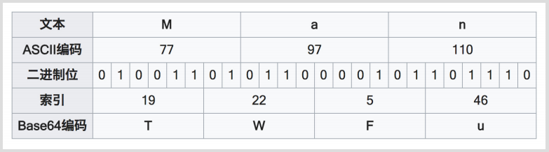
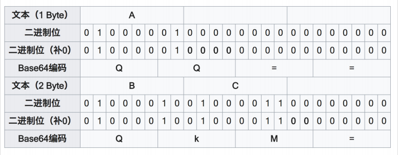

[toc]

# 一、Base64

## 4.1 概念

**将⼆进制数据转换成由 64 个字符组成的字符串的编码算法**

## 4.2 组成

编码后的字符串 =  字母A-Z   +  字母a-z  + 数字0-9   +  （ + 或 / ）

​	64      = 26 + 26  + 10 + 2 

## 4.3 什么是⼆进制数据？

- ⼴义：所有计算机数据都是⼆进制数据

- 狭义：⾮⽂本数据即⼆进制数据

## 4.4 算法

将原数据每 6 位对应成 Base 64 索引表中的⼀个字符编排成⼀个字符串（每个字符8 位）

Base64 索引表：

编码示例：把「Man」进⾏ Base64 编码

编码示例：Base64 的末尾补⾜

## 4.5 **Base64** 的⽤途

1. 将⼆进制数据扩充了储存和传输途径（例如可以把数据保存到⽂本⽂件、可以通过聊天对话框或短信形式发送⼆进制数据、可以在 URL 中加⼊简单的⼆进制数据）

2. 普通的字符串在经过 Base64 编码后的结果会变得⾁眼不可读，因此可以适⽤于⼀定条件下的防偷窥（较少⽤）

## 4.6 **Base64** 的缺点

因为⾃身的原理（6 位变 8 位），因此每次 Base64 编码之后，数据都会增⼤约1/3，所以会影响存储和传输性能。

## 4.7 「Base64 加密图⽚传输更安全和⾼效」？？？

不。

⾸先，Base64 并不是加密；

另外，Base64 会导致数据增⼤ 1/3，降低⽹络性能，增⼤⽤户流量开销，是画蛇添⾜的⼿段。

Base64 对图⽚进⾏编码的⽤于在于，有时需要使⽤**⽂本形式来传输图⽚**。

除此之外，完全没必要使⽤ Base64 对图⽚进⾏额外处理

## 4.8  变种：Base58

⽐特币使⽤的编码⽅式，去掉了 Base64 中的数字 "0"，字⺟⼤写 "O"，字⺟⼤写"I"，和字⺟⼩写 "l"，以及 "+" 和 "/" 符号，⽤于⽐特币地址的表示。

Base58 对于 Base64 的改动，主要⽬的在于⽤户的便捷性。由于去掉了难以区分的字符，使得 Base58 对于「⼈⼯抄写」更加⽅便。另外，去掉了 "+" "/" 号后也让⼤多数的软件可以⽅便双击选取

***

# 二、**URL**  使⽤的百分号编码

在 URL 的字符串中，对⼀些不⽤于特殊⽤途的保留字符，使⽤百分号 "%" 为前缀进⾏单独编码，以避免出现解析错误。

例如，要在 http://hencoder.com/users 后⾯添加查询字符串，查询 name 为「隐秘&伟⼤」的⽤户，

如果直接写成 http://hencoder.com/user/?name=隐秘&伟⼤，"&" 符号就会被解析为分隔符号，因此需要对它进⾏转码，转码后的 URL 为 

http://hencoder.com/user/?name=隐秘%26伟⼤ 。

这种编码仅⽤于 URL，⽬的是避免解析错误的出现。

# 六、 压缩与解压缩

## 6.1  含义

- 压缩：   **将数据使⽤更具有存储优势的编码算法进⾏编码**

- 解压缩：将压缩数据解码还原成原来的形式，以⽅便使⽤

## 6.2  压缩是编码吗？

是。所谓编码，即把数据从⼀种形式转换为另⼀种形式。压缩过程属于编码过程，解压缩过程属于解码过程。

## 6.3 **常⻅压缩算法**

DEFLATE、JPEG、MP3 等

***

# 七、 图⽚与⾳视频编解码

## 7.1 含义

将图像、⾳频、视频数据通过编码来转换成存档形式（编码），以及从存档形式转换回来（解码）

## 7.2 ⽬的

存储和压缩媒体数据（⼤多数媒体编码算法会压缩数据，但不是全部）

***

# 八、序列化

## 8.1 概念

**把数据对象（⼀般是内存中的，例如 JVM 中的对象）转换成字节序列的过程**

对象在程序内存⾥的存放形式是散乱的（存放在不同的内存区域、并且由引⽤进⾏连接），通过序列化可以把内存中的对象转换成⼀个字节序列，从⽽**使⽤ byte[] 等形式进⾏本地存储或⽹络传输**，在需要的时候重新组装（反序列化）来使⽤

## 8.2 目的

让内存中的对象可以被储存和传输。

## 8.3 序列化是编码吗？

不是

## 8.4 和编码的区别

编码是把数据由⼀种数据格式转换成另⼀种数据格式

⽽序列化是把数据由内存中的对象（⽽不是某种具体的格式）转换成字节序列

***

# 九、Hash

## 9.1  **定义**

把任意数据转换成指定⼤⼩范围（通常很⼩，例如 256 字节以内）的数据

## 9.2  **作⽤**

相当于从数据中提出摘要信息，因此最主要⽤途是数字指纹

## 9.3  **Hash** 的实际⽤途：唯⼀性验证

例如 Java 中的 hashCode() ⽅法

## 9.4 怎么重写  hashCode ⽅法？

把 equals() ⽅法中的每个⽤于判断相等的变量都放进 hashCode() 中，⼀起⽣成⼀个尽量不会碰撞的整数即可

## 9.5 **Hash** **的实际⽤途：数据完整性验证**

从⽹络上下载⽂件后，通过⽐对⽂件的 Hash 值（例如 MD5、SHA1），可以确认下载的⽂件是否有损坏。

如果下载的⽂件 Hash 值和⽂件提供⽅给出的 Hash 值⼀致，则证明下载的⽂件是完好⽆损的。

## 9.6 **Hash** **的实际⽤途：快速查找**

HashMap

## 9.7 **Hash** **的实际⽤途：隐私保护**

当重要数据必须暴露的时候，有时可以选择暴露它的 Hash 值（例如 MD5），以保障原数据的安全。

例如⽹站登录时，可以只保存⽤户密码的 Hash 值，在每次登录验证时只需要将输⼊的密码的 Hash 值和数据库中保存的 Hash 值作⽐对就好，⽹站⽆需知道⽤户的密码。

这样，当⽹站数据失窃时，⽤户不会因为⾃⼰的密码被盗导致其他⽹站的安全也受到威胁。

注意：这不属于加密。

## 9.8 **Hash** **是编码吗？**

不是。 Hash 是单向过程，往往是不可逆的，⽆法进⾏逆向恢复操作，因此 Hash 不属于编码。

## 9.9 **Hash** **是加密吗？**

不是。Hash 是单向过程，⽆法进⾏逆向回复操作，因此 Hash 不属于加密。（记住，MD5 不是加密！）

***

# 十、ASCALL 码

***

# 十一、字符集

## 10.1 含义

**⼀个由整数向现实世界中的⽂字符号的** **Map**

## 10.2 **分⽀**

- ASCII：128 个字符，1 字节

- ISO-8859-1：对 ASCII 进⾏扩充，1 字节

- Unicode：13 万个字符，多字节

- UTF-8：Unicode 的编码分⽀

- UTF-16 ：Unicode 的编码分⽀

- GBK / GB2312 / GB18030：中国⾃研标准，多字节，字符集 + 编码

