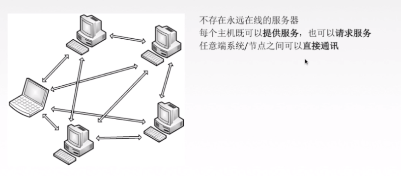

[toc]

# 一、计算机网络相关概述

## 1.1 概念

算机网络：是一个将分散的、具有独立功能`的计算机系统`，通过`通信设备`与`线路`连接起来，由功能完善的`软件`实现资源共享和信息传递的系统

按分布范围，计算机网络里有**局域网LAN**和**广域网WAN**，

其中局域网的代表以太网，以及这两种网络最重要的区分点，**局域网基于广播技术，广域网基于分组交换技术**

## 1.2 衡量计算机网络的性能的指标

### 速率

**速率就是数据传输（数据是指0和1）的速率**，

比如你用迅雷下载，1兆每秒，来衡量目前数据传输的快慢。它是计算机网络中最重要的一个性能指标。

### 带宽

在计算机网络中，**网络带宽是指在单位时间（一般指的是1秒钟）内能传输的数据量**，

比如说你家的电信网络是100兆比特(100Mb)，意思是，一秒内最大的传输速率是100兆比特。

### 吞吐量

吞吐量表示在单位时间内通过某个网络（或信道、接口）的数据量。

以上三点，我们举个案例

- 一条路每秒最多能过100辆车（宽带就相当于100辆/秒）
- 而并不是每秒都会有100辆车过，假如第一秒有0辆，第二秒有10辆...，（但是最多不能超过100辆）
- 所以有第1秒0辆/秒，第2秒10辆/秒，第3秒30辆/秒，这不能说带宽多少吧，于是就用吞吐量表示具体时间通过的量有多少（也有可能等于带宽的量）
- 由此可知**带宽是说的是最大值速率，吞吐量说的是某时刻速率**。但吞吐量不能超过最大速率。

### 时延

时延是指数据（报文/分组/比特流）从网络（或链路）的一端传送到另一端所需的时间，单位是s。 

时延分一下几种：

- 发送时延
- 传播时延
- 排队时延
- 处理时延
- 往返时间（RTT）
- 时延带宽积

#  二、OSI 网络七层模型

## 2.1 总览

七层模型从上到下依次是：

- **应用层**：协议有：HTTP FTP TFTP SMTP SNMP DNS TELNET HTTPS POP3 DHCP
- **表示层**：数据的表示、安全、压缩。格式有，JPEG、ASCll、DECOIC、加密格式等
- **会话层**：建立、管理、终止会话。对应主机进程，指本地主机与远程主机正在进行的会话
- **传输层**：定义传输数据的协议端口号，以及流控和差错校验。协议有：TCP UDP，数据包一旦离开网卡即进入网络传输层
- **网络层**：进行逻辑地址寻址，实现不同网络之间的路径选择。协议有：ICMP IGMP IP（IPV4 IPV6） ARP RARP
- **数据链路层**：建立逻辑连接、进行硬件地址寻址、差错校验等功能。将比特组合成字节进而组合成帧，用MAC地址访问介质，错误发现但不能纠正。
- **物理层**：建立、维护、断开物理连接。

1，2，3 层主要是是**物理链路**组成的，比如`光纤`，`路由器`，`集线器`，主要负责的是**数据通信**

5，6，7 层是**软件**控制的，比如`http`协议，是一种软件层面控制的协议，主要负责**处理传输来的数据**

## 2.1 应用层

### 2.1.1 作用

**应用层对应用程序的通信提供服务**

- 区分是发送报文还是接收报文

- 定义报文类型的语法，比如某字段的意思，例如http中content-type字段是什么意思。

- 最后就是进程如何，什么时候把传输层的数据交给应用层。

  

一些比较重要的应用层协议如下图：

### 2.1.2  应用层常见的模型

#### 客户端/服务器

客户端/服务器模型，也就是C/S架构。

比如电子邮件、web都是

#### P2P

P2P模型，每个主机既可以提供服务，也可以请求服务。

比如迅雷下载也是使用P2P技术的。

### 2.1.3 短链接和长链接

TCP连接有两种工作方式：

+ 短连接方式（Short-Live Connection）
+ 长连接方式（Long-Live Connection）

#### 短连接方式

当客户端有请求时，会建立一个TCP连接，接收到服务器响应后，就断开连接。下次有请求时，再建立连接，收到响应后，再断开。

如此循环。这种方式主要有两个缺点：

1. 建立TCP连接需要3次“握手”，拆除TCP连接需要4次“挥手”，这就需要7个数据包。如果请求和响应各占1个数据包，那么一次短连接的交互过程，有效的传输仅占2/9，这个利用率太低了。

2. 主动断开TCP连接的一端，TCP状态机会进入TIME_WAIT状态。如果频繁地使用短连接方式，就有可能使客户端的机器产生大量的处于TIME_WAIT状态TCP连接。

#### 长连接方式

客户端和服务器建立TCP连接后，会一直使用这条连接进行数据交互，直到没有数据传输或异常断开。

在空闲期间，通常会使用**心跳数据包（Keep-Alive）**保持链路不断开。

目前长连接方式应用范围比较广泛

### 2.1.4 DNS

DNS 说白了就是**将域名转化为ip**

比如www.qq.com，这是域名，

但是网络包需要对方ip地址，域名是不能加入网络包报头的，所以就需要去找一个服务器问，qq的域名对应的ip是多少

大概的通信过程如下：

- 用户主机上运行着`DNS`的客户端，就是我们的PC机或者手机客户端运行着DNS客户端了

- 浏览器将接收到的url中抽取出域名字段，就是访问的主机名，比如`http://www.baidu.com/`, 并将这个主机名传送给DNS应用的客户端

- DNS客户机端向DNS服务器端发送一份`查询报文`，报文中包含着要访问的`主机名字段`（中间包括一些列缓存查询以及分布式DNS集群的工作）

- 该DNS客户机最终会收到一份`回答报文`，其中包含有该主机名对应的`IP地址`

- 一旦该浏览器收到来自DNS的IP地址，就可以向该IP地址定位的HTTP服务器发起TCP连接

###  2.1.5  万维网和 Http 协议

> 万维网www是一个大规模的、联机式的信息存储所，是无数个网络站点和网页的集合。

在不少人看来，互联网、因特网、万维网没有大多的区别，其实这三者之间的关系应该是：

**互联网包含因特网，因特网包含万维网**

- 互联网 internet

  凡是由能彼此通信的设备组成的网络就叫互联网，即使仅有两台机器（计算机、手机等），不论用何种技术使其彼此通信，都叫互联网，所以，互联网有广域网、城域网及局域网之分，国际标准的互联网写法是internet，字母i一定要小写！

- 因特网Internet

  而因特网是互联网中的一种，它可不是仅有两台机器组成的网络，而是由上千万台设备组成的网络（该网络具备很大的规模）。因特网使用`TCP/IP协议`让不同的设备可以彼此通信。但使用`TCP/IP协议`的网络并不一定是因特网，一个局域网也可以使用`TCP/IP协议`。

  

  因特网是基于`TCP/IP协议`实现的，`TCP/IP协议`由很多协议组成，不同类型的协议又被放在不同的层，其中，位于应用层的协议就有很多，比如`FTP、SMTP、HTTP`。所以，因特网提供的服务一般包括有：`www（万维网）服务、电子邮件服务（outlook）、远程登录（QQ）服务、文件传输（FTP）服务、网络电话`等等。

- 万维网

  只要应用层使用的是HTTP协议，就称为`万维网(World Wide Web)`。之所以在浏览器里输入百度网址时，能看见百度网提供的网页，就是因为您的个人浏览器和百度网的服务器之间使用的是HTTP协议在交流

## 2.2 表示层

## 2.3 会话层

## 2.4 传输层

### 2.4.1 概述

因特网的运输层在应用程序断点之间传送应用程序报文，

**在这一层主要有两种传输协议 TCP 和  UDP**，利用这两者中的任何一个都能够传输报文，不过这两种协议有巨大的不同。

TCP面向连接，可靠，不提供广播和多播，它能够控制并确认报文是否到达，并提供了拥塞机制来控制网络传输，因此当网络拥塞时，会抑制其传输速率，适用于大文件传输。 

UDP无连接，收到的报也不确认，没有流量控制，也没有拥塞控制，但时间延迟小，适用于小文件。

### 2.4.2 端口号有什么用

端口号可以用来标识同一个主机上通信的不同应用程序（就是哪个应用程序在使用这个端口）

那为什么一个端口只能分配给一个应用程序，不能是多个呢？

如果服务器有两个应用程序`A，B`，分别启动了A服务和B服务，它们监听同一个端口，那有数据来的时候，服务器无法判断这个数据到底是给A，还是给B。

### 2.4.3 TCP

[TCP与UDP](TCP与UDP.md)

### 2.4.4 UDP

[TCP与UDP](TCP与UDP.md)

## 2.5 网络层

### 2.5.1 概念

网络层主要任务是将分组(分组的概念是大多数计算机网络都不能连续地传送任意长的数据，所以实际上网络系统把数据分割成小块，然后逐块地发动，这种小块就称作分组)从一台主机移动到另一台主机，从而**提供了主机到主机的通信服务和各种形式的进程到进程的通信**

### 2.5.2 分组交换

当`主机H1`要向另一`主机H2`发送数据（报文）时，首先将数据划分成若干个`等长的分组`，然后将这些分组一个接一个地发往里与H1相联的`路由A` ,当`A`接到分组后，先放入缓冲区，再按一定的路由算法确定该分组下一步将发注哪个结点，如此一个结点一个结点传递，直到`最终目的H2`

### 2.5.3 数据报

数据报是通过网络传输的`数据的基本单元`，包含一个`报头（header）`和`数据`本身。

说白了，就是带地址的数据，比如你的写了一句微信"你好"，这串文字本上加上源地址，目的地址，就是数据报

- 首部的固定部分是`20字节`，共20 * 8 = 160比特（1字节=8比特）

- `0 - 4 `比特是`版本号`，版本有ipv4/ipv6

- 首部长度，`单位是4B`，最小为5, 为什么是5呢？因为首部至少20字节，所以4* 5就是20字节

- 区分服务不用看。

- 总长度是，`首部+数据`

- 生存时间是`TTL`，它告诉网络，数据包在网络中的时间是否太长而应被丢弃。每经过一个路由器减一，变成0就丢弃

- 协议是指数据部分用的什么协议，我们只需要知道`TCP`协议用`6`表示，`UDP`协议用`17`表示即可。

- `首部校验和占16位`。这个字段只检验数据报的首部，但不包括数据部分。

- 目的地址和源地址都是`IP地址`，目的地址是通过`DNS`查询得来的

### 2.5.4 ip地址分类

| 类型 |         地址范围          |
| :--: | :-----------------------: |
| A类  | 1.0.0.0 ~ 126.255.255.255 |
| B类  | 128.0.0.0~191.255.255.255 |
| C类  | 192.0.0.0~223.255.255.255 |
| D类  | 224.0.0.0~239.255.255.255 |
| E类  | 240.0.0.0~254.255.255.255 |

其中`127.0.0.0~127.255.255.255`用于环回测试，D类地址用于组播，E类地址用于科研

这里需要注意的是，你发没发现，为什么我们前端启动webpack测试环境的时候，一般地址都是192.168.*.*(* 是指0-255的数字); 

在公司和家里都是这个网段，不是很奇怪吗，你家里的网段怎么和公司一样呢？

其实是因为有一部分叫`私有IP地址`，是不能拿到网络上跟别的计算机通信的。`只能是局域网`自己内部用。比如说有：

可以看到，C类私有地址就是192.168网段，每个局域网都可以有这些私有IP。

还有一些`特殊地址`，需要了解

注意，这里的全1是指，`ipv4地址由4个字节组成`，每一个字节是8位，8位全一就是`十进制的255`, 即`255.255.255.255`。

- 第一行，全一，代表是`255.255.255.255`，在本网络的目的地址写这个的话，就会`内网广播`
- 第二行，网络号特定值，主机号是全0，比如，`192.169.10.1`，这是c类网络，所以网络号是`192.169.10`，主机号是`1`，当主机号全0时，就是0，表示`192.169.10.0`这个网段
- 第三行，还是`192.169.10.1`这个c类地址，主机号都是1，也就是8个1，代表255，所以`192.169.10.255`表示本网段的广播地址
- 第四行，大家最熟悉不过了，`127`作为网络号，主机号非全0或1，比如说`127.0.0.1`代表本机，称为`环回地`址。

### 2.5.5 网络地址转换(NAT)

在ip地址分类里面，我们知道`私有ip地址`是不能跟外网交互的，在小公司大多数计算机的地址都是`192.168`网段，都是私有ip地址，它是怎么跟外网交互数据的呢，这里就引出来一个知识点叫`网络地址转换NAT`

如上图所示，`192.168.0.3`，`192.168.0.4`都是私有网段上的，它们无法跟外网通信，这个时候由于路由器安装了NAT软件，就可以将自己的ip地址，即路由器的ip地址`172.38.1.5`作为内网的代理，去访问外网，外网返回来的数据，经过路由转换，转换成内网的`192.168`网段的私有地址

## 2.6 数据链路层

 ### 2.6.1 主要功能

- 封装成帧   封装的网络数据包，在链路层就叫`数据帧

- 透明传输

- 差错控制

- 差错纠正

- 流量控制

  

## 2.7 物理层

对于物理层，有人会说，这不就是网线吗，比如家里连接路由器的网线，电线杆上的光纤？其实不然，物理层更多的是规定一种`标准`，他并不管物理介质具体是什么，比如电线杆上是光纤还是双绞线，只要你能按物理层规定的标准传输数据就行

那物理层到底有哪些主要任务呢？

- 比如说，规定了`电气特性`，信号的电平用`+10V - +15V`表示二进制的`0`，用`-10V - -15V`表示二进制的`1`，只要条网线能表示这个特性，就不管你用什么材料了。
- 当然还有其它特性，我们不需要了解，`知道物理层是规定传输媒体接口的标准`即可。

