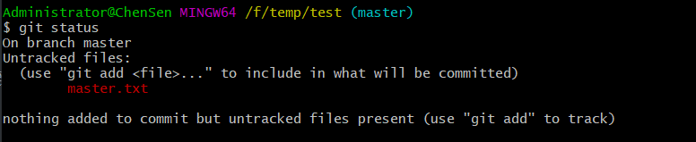
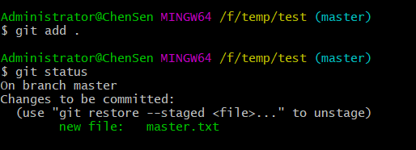
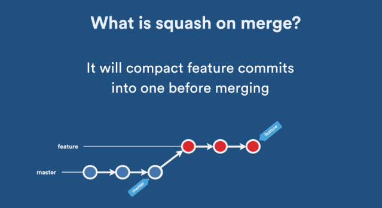
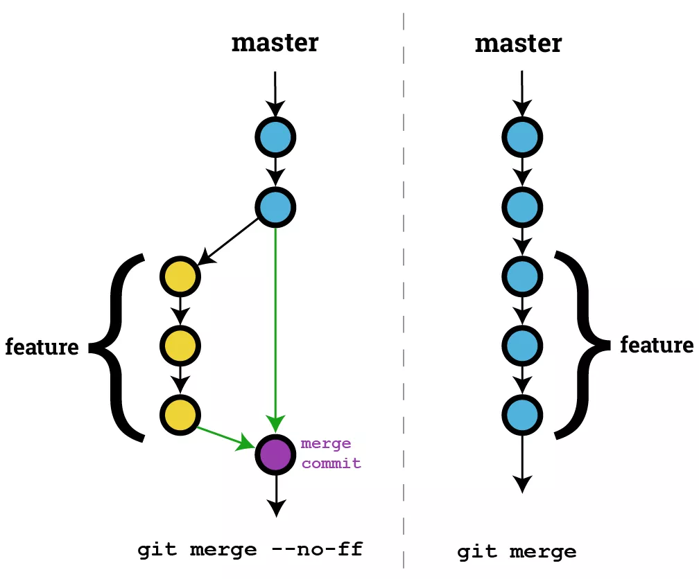
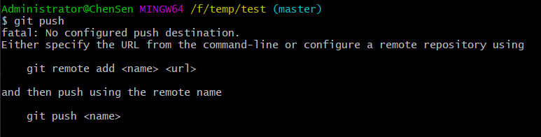
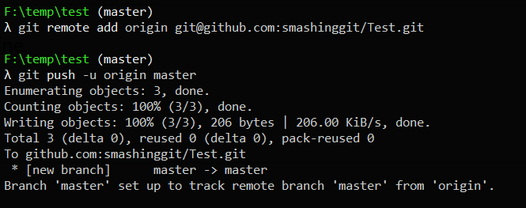
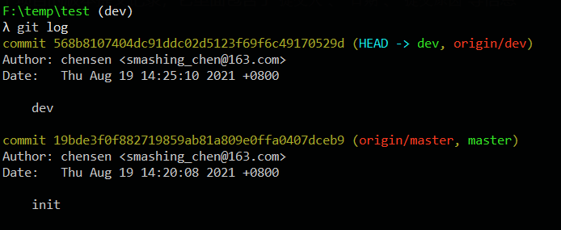
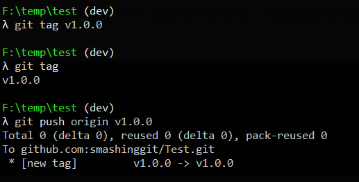
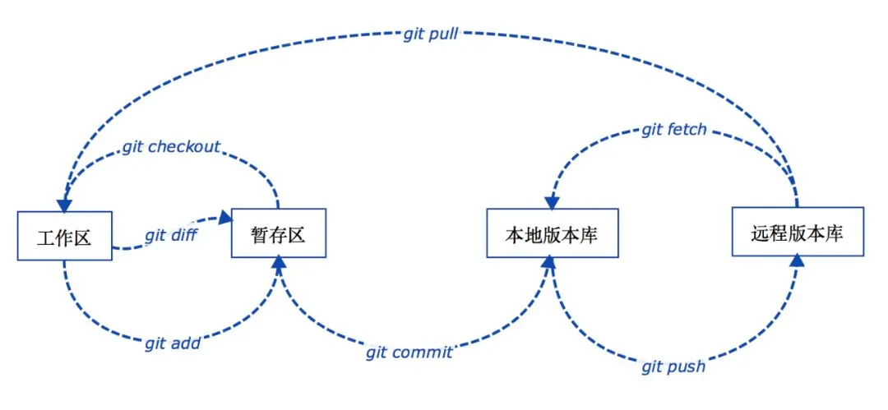

[toc]


# 一、Git 相关命令


## git clone 

从git服务器拉取代码

```
https://github.com/smashinggit/AndroidAll.git
```


## git config

配置开发者用户名和邮箱

每次代码提交的时候都会生成一条提交记录，其中会包含当前配置的用户名和邮箱。

```
git config user.name yourname
git config user.email youeremail@163.com
```


## git branch

创建、重命名、查看、删除项目分支，通过 Git 做项目开发时，一般都是在开发分支中进行，开发完成后合并分支到主干

```
git branch                    // 列出本地所有分支 

git branch -a                 // 列出本地和远程所有分支 

git branch <name>             // 创建一个分支

git branch -m <oldName> <newName>   // 分支重命名

git branch -d <name>        // 删除一个分支
```


> 注意：如果是一个新的仓库，默认在master分支，要先 commit 之后才会真正建立 master 分支，此时才可以建立其它分支


## git checkout 

切换分支

```
git checkout <branch>           // 切换到分支

git checkout -b <branch>        // 创建并切换到一个新的分支

git checkout [<branch>] <file>  // 从本地版本库的 HEAD（也可以是提交ID、分支名、Tag名） 历史中检出 file 覆盖当前工作区的文件，如果省略 HEAD 则是从暂存区检出  例如： git checkout HEAD text.txt

git checkout  --orphan <branch> // 这个命令会创建一个全新的，完全没有历史记录的新分支，但当前源分支上所有的最新文件都还在，真是强迫症患者的福音，但这个新分支必须做一次 git commit 操作后才会真正成为一个新分支。


```


## git stash

在 `Git` 的栈中保存当前修改或删除的工作进度，当你在一个分支里做某项功能开发时，接到通知把昨天已经测试完没问题的代码发布到线上，但这时你已经在这个分支里加入了其它未提交的代码，这个时候就可以把这些未提交的代码存到栈里


```
git stash                    // 将未提交的文件保存到Git栈中

git stash list               // 查看栈中保存的列表

git stash show <stash>       // 显示栈中其中一条记录

git stash drop <stash>       // 移除栈中其中一条记录

git stash apply <stash>      // 从Git栈中检出其中一条记录，但不从栈中移除
  
git stash pop                // 从Git栈中检出最新保存的一条记录，并将它从栈中移除

git stash branch <newBranch> // 把当前栈中最近一次记录检出并创建一个新分支

git stash clear              // 清空栈里的所有记录
```


## git status

查看文件变动状态


通过 git status 命令可以看到文件当前状态 Changes not staged for commit: （改动文件未提交到暂存区）




通过命令 git add . 添加所有文件

```
git add .
```


这时候可通过 git status 看到文件当前状态 Changes to be committed: （文件已提交到暂存区）




## git merge

将其它分支合并到当前分支


```
git merge <commit>      // 合并
```


```
git merge --squash    // 将待合并分支上的 `commit` 合并成一个新的 `commit` 放入当前分支，适用于待合并分支的提交记录不需要保留的情况
```




```
git merge --no-ff
```

默认情况下，`Git` 执行"`快进式合并`"（fast-farward merge），会直接将 `Master` 分支指向 `Develop` 分支，使用 `--no-ff` 参数后，会执行正常合并，在 `Master` 分支上生成一个新节点，保证版本演进更清晰。





## git cherry-pick (拣选)

合并分支的一条或几条提交记录到当前分支末梢

```
git cherry-pick <commitHash>    // 将指定的提交commitHash，应用于当前分支。这会在当前分支产生一个新的提交

git cherry-pick <commitHashA> <commitHashB> // 将 A 和 B 两个提交应用到当前分支。这会在当前分支生成两个对应的新提交

git cherry-pick commitHashA..commitHashB    //转移从 A 到 B 的所有提交。它们必须按照正确的顺序放置：提交 A 必须早于提交 B，否则命令将失败，但不会报错

```


`git cherry-pick`命令的参数，不一定是提交的哈希值，分支名也是可以的，表示转移该分支的最新提交。


对于多分支的代码库，将代码从一个分支转移到另一个分支是常见需求。

这时分两种情况。一种情况是，你需要另一个分支的所有代码变动，那么就采用合并（`git merge`）。另一种情况是，你只需要部分代码变动（某几个提交），这时可以采用 Cherry pick

```
// 假设分支如下：
 a - b - c - d   Master
         \
           e - f - g Feature
           
//现在将提交f应用到master分支
git checkout master
git cheery-pick f

//上面的操作完成以后，代码库就变成了下面的样子
a - b - c - d - f   Master
         \
           e - f - g Feature

```


## git diff

`git diff` 可以说是 `git status` 的具体版本，`git status` 只能查看修改了哪些文件，而 `git diff` 能够具体到该文件的某一部分

```
git diff <file> # 比较当前文件和暂存区文件差异 git diff
git diff <id1><id1><id2> # 比较两次提交之间的差异
git diff <branch1> <branch2> # 在两个分支之间比较
git diff --staged # 比较暂存区和版本库差异
git diff --cached # 比较暂存区和版本库差异
```


## git add

添加文件到暂存区


## git commit 

提交文件变动到版本库

```
git commit -m '第一行提交原因'  -m '第二行提交原因'
```


## git push

> 将本地的代码改动推送到服务器

```
git push [<repository> [<refspec>...]] 
```


如果没有关联远程服务器，调用 push 时会有以下提示：




需要先关联远程服务器后，再进行 push 操作

```
git remote add origin https://github.com/smashinggit/Test.git

git push --set-upstream origin master      
```


> 注意： 如果当前分支还没和远程分支关联，推送时需要 --set-upstream ，后续就不需要了





## git pull

> 将服务器上的最新代码拉取到本地


## git reset

> 将当前的分支重设（reset）到指定的 `<commit>` 或者 `HEAD`
>
> 用于回退版本，可以指定退回某一次提交的版本

```
git reset [--mixed | --soft | --hard | --merge | --keep] [-q] [<commit>]
```


- --mixed     :    reset HEAD and index       

  不带参数时的默认参数，它退回到某个版本，用于重置暂存区的文件与上一次的提交(commit)保持一致，工作区文件内容保持不变

  

- --soft         :    reset only HEAD

  暂存区和工作区中的内容不作任何改变，仅仅把 `HEAD` 指向 `<commit>`

  

- --hard       :     reset HEAD, index and working tree

  自从 `<commit>` 以来在工作区中的任何改变都被丢弃，并把 `HEAD` 指向 `<commit>`

  撤销工作区中所有未提交的修改内容，将暂存区与工作区都回到上一次版本，并删除之前的所有信息提交

  工作区中未被追踪的文件不会被删除。

  **注意：谨慎使用 –hard 参数，它会删除回退点之前的所有信息**

  

- --merge    :     reset HEAD, index and working tree

- --keep      :     reset HEAD but keep local changes

```
git reset HEAD^           // 回退所有内容到上一个版本 
git reset HEAD~3          // 回退到上上上个版本， 数字可以改变
git reset <commitHash>    // 回退到指定版本
git reset HEAD^ <file>    // 回退<file>文件的版本到上一个版本       

git reset --soft HEAD    //
```

**HEAD 说明：**

- HEAD 表示当前版本
- HEAD^ 上一个版本
- HEAD^^ 上上一个版本
- 以此类推

可以使用 ～数字表示:

- HEAD~0 表示当前版本
- HEAD~1 上一个版本
- HEAD~2 上上一个版本
- 以此类推


## git revert

> 撤销某次操作，此次操作之前和之后的 `commit` 和 `history` 都会保留，并且把这次撤销作为一次最新的提交


## git log

查看版本提交记录


```
git log             //

git log -p           // 显示带提交差异对比的历史记录

git log <file>       // 显示某个文件的历史记录

git log -10          // 显示最近10条历史记录，时间可改


```

通过以上命令，我们可以查看整个项目的版本提交记录，它里面包含了`提交人`、`日期`、`提交原因`等信息





## git tag

为项目标记里程碑

```s
git tag               // 列出所有tag

git tag <tagName>     // 创建tag

git tag -d <tagName>  // 删除tag

```

当我们完成某个功能需求准备发布上线时，应该将此次完整的项目代码做个标记，并将这个标记好的版本发布到线上，这里我们以 `v1.0.0` 为标记名并发布，当看到命令行返回如下内容则表示发布成功





通过 git checkout  tagName  可以切换到 tag 对应的代码。
但是，这时候 git 可能会提示你当前处于一个“detached HEAD" 状态，因为 tag 相当于是一个快照，是不能更改它的代码的，**如果要在 tag 代码的基础上做修改**，你需要一个分支： 

```
git switch -c <newBranch>
```

这样就会在当前tag的基础上创建一个新的分支


## git remote

```
git remote add <name> <url>

git remote rename <old> <new>

git remote remove <name>

git remote set-url --add <name> <newurl>

```


## .gitignore

设置哪些内容不需要推送到服务器，这是一个配置文件


`.gitignore` 不是 `Git` 命令，而在项目中的一个文件，通过设置 `.gitignore` 的内容告诉 `Git` 哪些文件应该被忽略不需要推送到服务器，通过以上命令可以创建一个 `.gitignore` 文件，并在编辑器中打开文件，每一行代表一个要忽略的文件或目录，如：

```
demo.html
build/
```

以上内容的意思是 `Git` 将忽略 `demo.html` 文件 和 `build/` 目录，这些内容不会被推送到服务器上


## git mv

移动或重命名文件、目录


```
git mv a.md b.md -f
```

将 `a.md` 重命名为 `b.md` ，同时添加变动到暂存区，加 `-f` 参数可以强制重命名，相比用 `mv a.md b.md` 命令省去了 `git add` 操作


## git rm

从工作区和暂存区移除文件


git rm 删除文件有以下几种形式：

```
git rm <file>           // 将文件从暂存区和工作区中删除

git rm -f <file>        // 如果删除之前修改过并且已经放到暂存区域的话，则必须要用强制删除选项 -f

git rm --cached <file>  // 仅从跟踪清单中删除，但仍然希望保留在当前工作目录中,使用 --cached 选项即可

git rm –r *             // 递归删除，即如果后面跟的是一个目录做为参数，则会递归删除整个目录中的所有子目录和文件
```


# 二、相关原理


## 


### 工作区（*Working Directory*）

就是你在电脑里能看到的目录


### 本地版本库（*Local Repository*）

工作区有一个隐藏目录 `.git`，这个不算工作区，而是 `Git` 的版本库。


### 暂存区（*stage*）

本地版本库里存了很多东西，其中最重要的就是称为 `stage`（或者叫index）的暂存区，还有 `Git` 为我们自动创建的第一个分支 `master`，以及指向 `master` 的一个指针叫 `HEAD`


### 远程版本库（*Remote Repository*）

一般指的是 `Git` 服务器上所对应的仓库，本文的示例所在的`github`仓库就是一个远程版本库


`工作区`、`暂存区`、`本地版本库`、`远程版本库`之间几个常用的 `Git` 操作流程如下图所示：





### 分支（*Branch*）

分支是为了将修改记录的整个流程分开存储，让分开的分支不受其它分支的影响，所以在同一个数据库里可以同时进行多个不同的修改


### 标签（*Tag*）

标签是用于标记特定的点或提交的历史，通常会用来标记发布版本的名称或版本号（如：`publish/0.0.1`），虽然标签看起来有点像分支，但打上标签的提交是固定的，不能随意的改动，参见上图中的`1.0` / `2.0` / `3.0`


### HEAD

`HEAD` 指向的就是当前分支的最新提交


