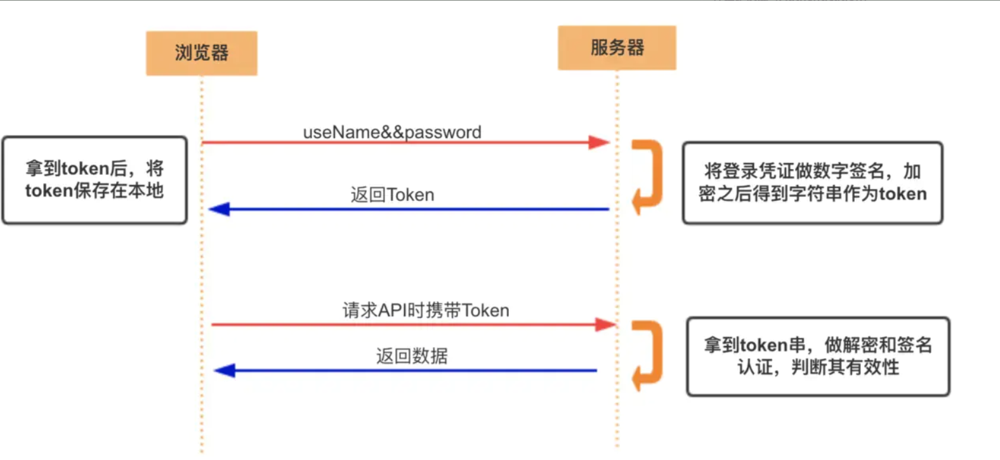
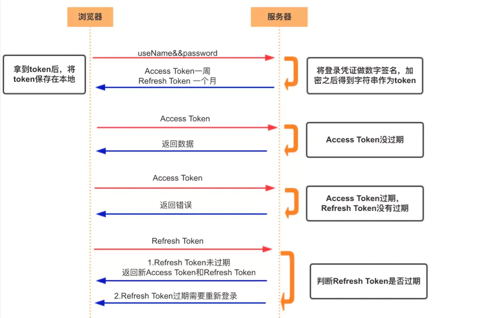

[toc]


# 一、什么是认证（Authentication）


通俗地讲就是**验证当前用户的身份**，证明“你是你自己”（比如：你每天上下班打卡，都需要通过指纹打卡，当你的指纹和系统里录入的指纹相匹配时，就打卡成功）

互联网中的认证：

- 用户名密码登录

- 邮箱发送登录链接

- 手机号接收验证码

- 只要你能收到邮箱/验证码，就默认你是账号的主人

  

# 二、什么是授权（Authorization）


**用户授予第三方应用访问该用户某些资源的权限**

- 你在安装手机应用的时候，APP 会询问是否允许授予权限（访问相册、地理位置等权限）
- 你在访问微信小程序时，当登录时，小程序会询问是否允许授予权限（获取昵称、头像、地区、性别等个人信息）

实现授权的方式有：cookie、session、token、OAuth


# 三、什么是凭证（Credentials）


**实现认证和授权的前提**是需要一种**媒介（证书）** 来标记访问者的身份

- 在战国时期，商鞅变法，发明了照身帖。照身帖由官府发放，是一块打磨光滑细密的竹板，上面刻有持有人的头像和籍贯信息。国人必须持有，如若没有就被认为是黑户，或者间谍之类的。
- 在现实生活中，每个人都会有一张专属的[居民身份证](https://link.juejin.cn/?target=https%3A%2F%2Fbaike.baidu.com%2Fitem%2F%E5%B1%85%E6%B0%91%E8%BA%AB%E4%BB%BD%E8%AF%81%2F2080960)，是用于证明持有人身份的一种法定[证件](https://link.juejin.cn/?target=https%3A%2F%2Fbaike.baidu.com%2Fitem%2F%E8%AF%81%E4%BB%B6%2F5804999)。通过身份证，我们可以办理手机卡/银行卡/个人贷款/交通出行等等，这就是**认证的凭证。**
- 在互联网应用中，一般网站（如掘金）会有两种模式，游客模式和登录模式。游客模式下，可以正常浏览网站上面的文章，一旦想要点赞/收藏/分享文章，就需要登录或者注册账号。当用户登录成功后，服务器会给该用户使用的浏览器颁发一个令牌（token），这个令牌用来表明你的身份，每次浏览器发送请求时会带上这个令牌，就可以使用游客模式下无法使用的功能


# 四、Cookie


## 4.1 概述

**HTTP 是一个无状态的协议**，每次 http 请求都是独立、无关的，默认不需要保留状态信息。

但有时候需要保存一些状态，怎么办呢？HTTP 为此引入了 Cookie。

**Cookie 本质上就是浏览器里面存储的一个很小的文本文件，内部以键值对的方式来存储**( 在chrome开发者面板的 Application 这一栏可以看到 )。

**向同一个域名下发送请求，都会携带相同的 Cookie，服务器拿到 Cookie 进行解析，便能拿到客户端的状态。**

**而服务端可以通过响应头中的 Set-Cookie 字段来对客户端写入 Cookie**


- **HTTP 是无状态的协议（对于事务处理没有记忆能力，每次客户端和服务端会话完成时，服务端不会保存任何会话信息**）：每个请求都是完全独立的，服务端无法确认当前访问者的身份信息，无法分辨上一次的请求发送者和这一次的发送者是不是同一个人。所以服务器与浏览器为了进行会话跟踪（知道是谁在访问我），就必须主动的去维护一个状态，这个状态用于告知服务端前后两个请求是否来自同一浏览器。而这个状态需要通过 cookie 或者 session 去实现。
- **cookie 存储在客户端：** cookie 是服务器发送到用户浏览器并保存在本地的一小块数据，它会在浏览器下次向同一服务器再发起请求时被携带并发送到服务器上。
- **cookie 是不可跨域的：** 每个 cookie 都会绑定单一的域名，无法在别的域名下获取使用，**一级域名和二级域名之间是允许共享使用的**（**靠的是 domain）**

```
// 请求头
Cookie: a=xxx;b=xxx

// 响应头
Set-Cookie: a=xxx
set-Cookie: b=xxx
```


## 4.2 **cookie 重要的属性**


### **name=value**

键值对，设置 Cookie 的名称及相对应的值，都必须是**字符串类型**

-  如果值为 Unicode 字符，需要为字符编码
-  如果值为二进制数据，则需要使用 BASE64 编码


### **domain**

指定 cookie 所属域名，默认是当前域名


### **path**

**指定 cookie 在哪个路径（路由）下生效，默认是 '/'**
如果设置为 `/abc`，则只有 `/abc` 下的路由可以访问到该 cookie，如：`/abc/read`


**maxAge**

cookie 失效的时间，单位秒。

如果为整数，则该 cookie 在 maxAge 秒后失效。

如果为负数，该 cookie 为临时 cookie ，关闭浏览器即失效，浏览器也不会以任何形式保存该 cookie 。

如果为 0，表示删除该 cookie 。默认为 -1。

**比 expires 好用**


### **secure**

该 cookie 是否仅被使用安全协议传输。

安全协议有 HTTPS，SSL等，在网络上传输数据之前先将数据加密。默认为false。
当 secure 值为 true 时，cookie 在 HTTP 中是无效，在 HTTPS 中才有效


### **httpOnly**

**如果给某个 cookie 设置了 httpOnly 属性，则无法通过 JS 脚本 读取到该 cookie 的信息，但还是能通过 Application 中手动修改 cookie，所以只是在一定程度上可以防止 XSS 攻击，不是绝对的安全**


## 4.3 生存周期

Cookie 的有效期可以通过 **Expires** 和 **Max-Age** 两个属性来设置。

- **Expires**  ->  过期时间
- **Max-Age ** -> 用的是一段时间间隔，单位是秒，从浏览器收到报文开始计算

若 Cookie 过期，则这个 Cookie 会被删除，并不会发送给服务端


## 4.4 作用域

关于作用域也有两个属性: **Domain **和 **path**, 

给 **Cookie** 绑定了域名和路径，在发送请求之前，发现域名或者路径和这两个属性不匹配，那么就不会带上 Cookie。

值得注意的是，对于路径来说，`/`表示域名下的任意路径都允许使用 Cookie


## 4.5 Cookie 的缺点

- 容量缺陷

  Cookie 的体积上限只有`4KB`，只能用来存储少量的信息。

- 性能缺陷

  Cookie 紧跟域名，不管域名下面的某一个地址需不需要这个 Cookie ，请求都会携带上完整的 Cookie，这样随着请求数的增多，其实会造成巨大的性能浪费的，因为请求携带了很多不必要的内容。

  但可以通过`Domain`和`Path`指定**作用域**来解决。

- 安全缺陷

  由于 Cookie 以纯文本的形式在浏览器和服务器中传递，很容易被非法用户截获，然后进行一系列的篡改，在 Cookie 的有效期内重新发送给服务器，这是相当危险的。

  另外，在`HttpOnly`为 false 的情况下，Cookie 信息能直接通过 JS 脚本来读取。


# 五、Session


## 5.1 概述


**session 是另一种记录服务器和客户端会话状态的机制**

**session 是基于 cookie 实现的，session 存储在服务器端，sessionId 会被存储到客户端的cookie 中**


## 5.2 **session 认证流程**


- 用户第一次请求服务器的时候，服务器根据用户提交的相关信息，创建对应的 Session

- 请求返回时将此 Session 的唯一标识信息 SessionID 返回给浏览器

- 浏览器接收到服务器返回的 SessionID 信息后，会将此信息存入到 Cookie 中，同时 Cookie 记录此 SessionID 属于哪个域名

- 当用户第二次访问服务器的时候，请求会自动判断此域名下是否存在 Cookie 信息，如果存在自动将 Cookie 信息也发送给服务端，服务端会从 Cookie 中获取 SessionID，再根据 SessionID 查找对应的 Session 信息，如果没有找到说明用户没有登录或者登录失效，如果找到 Session 证明用户已经登录可执行后面操作。


# 六、Cookie 和 Session 的区别

 

- **安全性：** Session 比 Cookie 安全，Session 是存储在服务器端的，Cookie 是存储在客户端的。

- **存取值的类型不同**：Cookie 只支持存字符串数据，想要设置其他类型的数据，需要将其转换成字符串，Session 可以存任意数据类型。

- **有效期不同：** Cookie 可设置为长时间保持，比如我们经常使用的默认登录功能，Session 一般失效时间较短，客户端关闭（默认情况下）或者 Session 超时都会失效。

- **存储大小不同：** 单个 Cookie 保存的数据不能超过 4K，Session 可存储数据远高于 Cookie，但是当访问量过多，会占用过多的服务器资源


# 七、Token（令牌）


## 7.1 Acesss Token


**访问资源接口（API）时所需要的资源凭证**

**简单 token 的组成：** uid(用户唯一的身份标识)、time(当前时间的时间戳)、sign（签名，token 的前几位以哈希算法压缩成的一定长度的十六进制字符串）

**特点：**

- **服务端无状态化、可扩展性好**
- **支持移动端设备**
- 安全
- 支持跨程序调用


**token 的身份验证流程**：





1. 客户端使用用户名跟密码请求登录

2. 服务端收到请求，去验证用户名与密码

3. 验证成功后，服务端会签发一个 token 并把这个 token 发送给客户端

4. 客户端收到 token 以后，会把它存储起来，比如放在 cookie 里或者 localStorage 里

5. 客户端每次向服务端请求资源的时候需要带着服务端签发的 token

6. 服务端收到请求，然后去验证客户端请求里面带着的 token ，如果验证成功，就向客户端返回请求的数据


- 每一次请求都需要携带 token，需要把 token 放到 HTTP 的 Header 里
- 基于 token 的用户认证是一种服务端无状态的认证方式，服务端不用存放 token 数据。用解析 token 的计算时间换取 session 的存储空间，从而减轻服务器的压力，减少频繁的查询数据库
- token 完全由应用管理，所以它可以避开同源策略


## 7.2 Refresh Token


refresh token 是专用于刷新 access token 的 token。

如果没有 refresh token，也可以刷新 access token，但每次刷新都要用户输入登录用户名与密码，会很麻烦。

有了 refresh token，可以减少这个麻烦，客户端直接用 refresh token 去更新 access token，无需用户进行额外的操作





- Access Token 的有效期比较短，当 Access Token 由于过期而失效时，使用 Refresh Token 就可以获取到新的 Token，如果 Refresh Token 也失效了，用户就只能重新登录了

- Refresh Token 及过期时间是存储在服务器的数据库中，只有在申请新的 Access Token 时才会验证，不会对业务接口响应时间造成影响，也不需要向 Session 一样一直保持在内存中以应对大量的请求


# 八 、Token 和 Session 的区别

 

- Session 是一种**记录服务器和客户端会话状态的机制，使服务端有状态化，可以记录会话信息**

  而 Token 是**令牌**，**访问资源接口（API）时所需要的资源凭证**。Token **使服务端无状态化，不会存储会话信息**

- Session 和 Token 并不矛盾，作为身份认证 Token 安全性比 Session 好，因为每一个请求都有签名还能防止监听以及重放攻击，而 Session 就必须依赖链路层来保障通讯安全了。**如果你需要实现有状态的会话，仍然可以增加 Session 来在服务器端保存一些状态。**

- 所谓 Session 认证只是简单的把 User 信息存储到 Session 里，因为 SessionID 的不可预测性，暂且认为是安全的。而 Token ，如果指的是 OAuth Token 或类似的机制的话，提供的是 认证 和 授权 ，认证是针对用户，授权是针对 App 。其目的是让某 App 有权利访问某用户的信息。这里的 Token 是唯一的。不可以转移到其它 App上，也不可以转到其它用户上。Session 只提供一种简单的认证，即只要有此 SessionID ，即认为有此 User 的全部权利。是需要严格保密的，这个数据应该只保存在站方，不应该共享给其它网站或者第三方 App。

  

  所以简单来说：**如果你的用户数据可能需要和第三方共享，或者允许第三方调用 API 接口，用 Token 。如果永远只是自己的网站，自己的 App，用什么就无所谓了**


