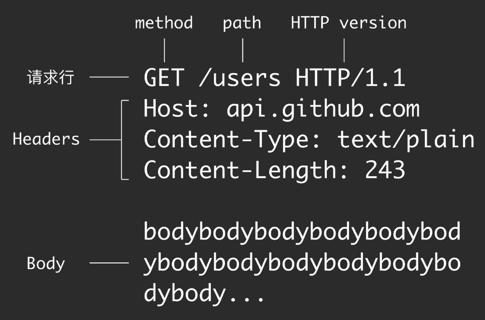
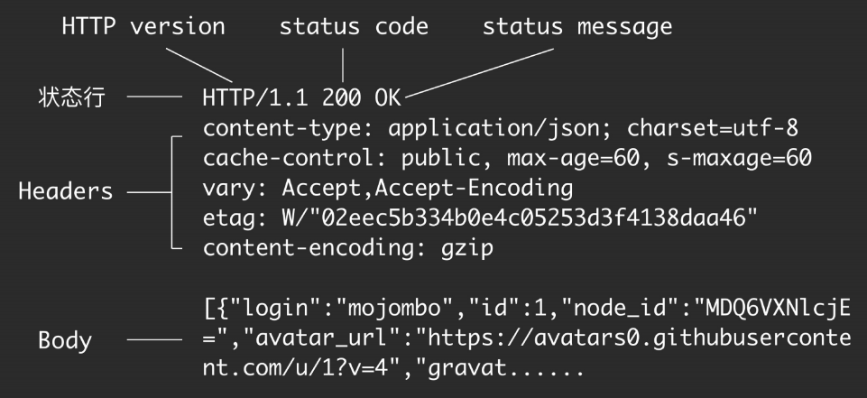
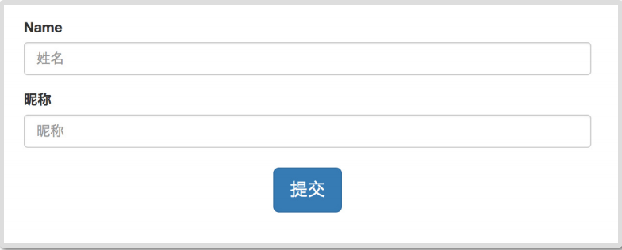
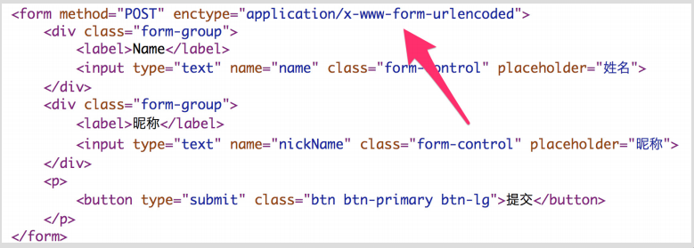
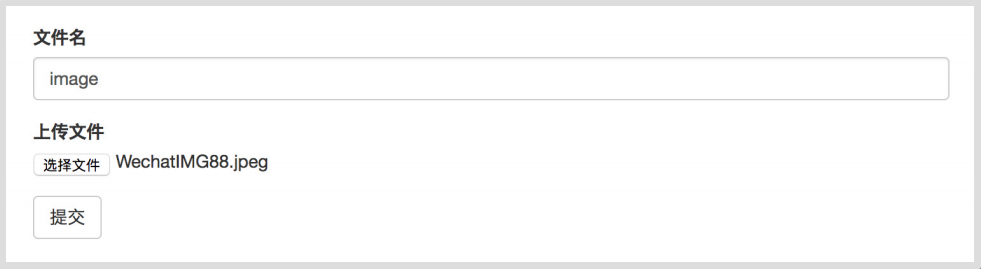
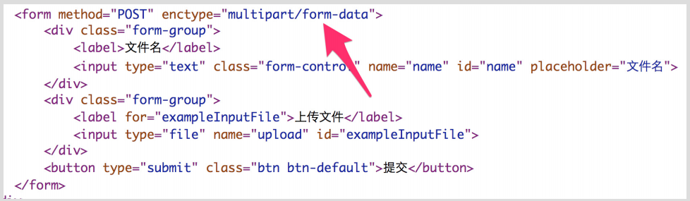
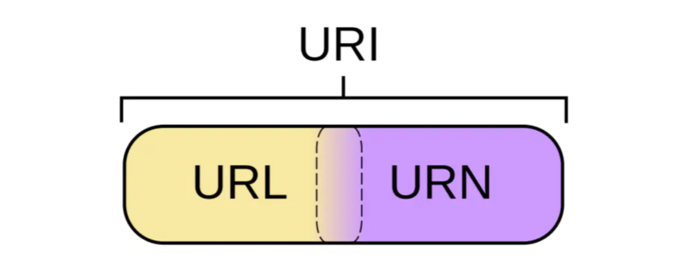
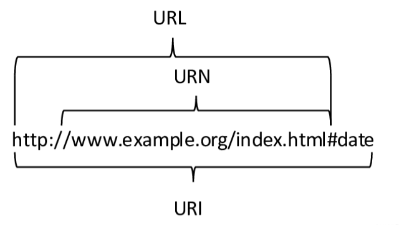
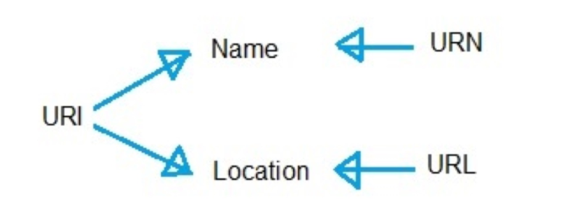

[toc]


#  一、Http 原理和工作机制概述


## 1.1 定义

**Hypertext Transfer Protocol，超⽂本传输协议**，
和 HTML (Hypertext Markup Language 超⽂本标记语⾔) ⼀起诞⽣，**⽤于在⽹络上请求和传输 HTML 内容**。
超⽂本，即「扩展型⽂本」，指的是 HTML 中可以有链向别的⽂本的链接(hyperlink）


总结:

**HTTP 是一个在计算机世界里专门在两点之间传输文字、图片、音频、视频等超文本数据的约定和规范**


## 1.2 ⼯作⽅式

### 浏览器
 ⽤户输⼊地址后回⻋或点击链接 -> 
 浏览器拼装 HTTP 报⽂并发送请求给服务器 -> 
 服务器处理请求后发送响应报⽂给浏览器 -> 
 浏览器解析响应报⽂并使⽤渲染引擎显示到界⾯

### ⼿机 App
⽤户点击或界⾯⾃动触发联⽹需求 ->
Android 代码调⽤拼装 HTTP 报⽂并发送请求到服务器 -> 
服务器处理请求后发送响应报⽂给⼿机 -> 
Android 代码处理响应报⽂并作出相应处理（如储存数据、加⼯数据、显示数据到界⾯） 


## 1.3 优点

- **「灵活可扩展」**。一个是语法上只规定了基本格式，空格分隔单词，换行分隔字段等。另外一个就是传输形式上不仅可以传输文本，还可以传输图片，视频等任意数据。

- **「请求-应答模式」**，通常而言，就是一方发送消息，另外一方要接受消息，或者是做出相应等。

- **「可靠传输」**，HTTP是基于TCP/IP，因此把这一特性继承了下来。

- **「无状态」**，这个分场景回答即可


## 1.4 缺点

- **「无状态」**，有时候，需要保存信息，比如像购物系统，需要保留下顾客信息等等，另外一方面，有时候，无状态也会减少网络开销，比如类似直播行业这样子等，这个还是分场景来说。

- **「明文传输」**，即协议里的报文(主要指的是头部)不使用二进制数据，而是文本形式。这让HTTP的报文信息暴露给了外界，给攻击者带来了便利。

- **「队头阻塞」**，当http开启长连接时，共用一个TCP连接，当某个请求时间过长时，其他的请求只能处于阻塞状态，这就是队头阻塞问题


# 二、Http 报文


## 请求报文




## 响应报文



# 三、Http 请求方法


## GET

- ⽤于获取资源
- 对服务器数据不进⾏修改
- 不发送 Body
- GET是**幂等**的

>  幂等表示执行相同的操作，结果也是相同的

报文
```
GET /users/1 HTTP/1.1
Host: api.github.com
```

对应 Retrofit 的代码
```java
@GET("/users/{id}")
Call<User> getUser(@Path("id") String id, @Query("gender") String gender);
```


## POST

- ⽤于增加或修改资源
- 发送给服务器的内容写在 Body ⾥⾯


报文
```
POST /users HTTP/1.1
Host: api.github.com
Content-Type: application/x-www-form-urlencoded
Content-Length: 13

name=rengwuxian&gender=male
```

对应 Retrofit 的代码
```
@FormUrlEncoded
@POST("/users")
Call<User> addUser(@Field("name") String name,@Field("gender") String gender);
```

## PUT

- ⽤于修改资源
- 发送给服务器的内容写在 Body ⾥⾯

报文
```
PUT /users/1 HTTP/1.1
Host: api.github.com
Content-Type: application/x-www-form-urlencoded
Content-Length: 13

gender=female
```

对应 Retrofit 的代码
```
@FormUrlEncoded
@PUT("/users/{id}")
Call<User> updateGender(@Path("id") String id,@Field("gender") String gender);
```


## DELETE

- ⽤于删除资源
- 不发送 Body

报文
```
DELETE /users/1 HTTP/1.1
Host: api.github.com
```

对应 Retrofit 的代码
```
@DELETE("/users/{id}")
Call<User> getUser(@Path("id") String id,@Query("gender") String gender);
```

## HEAD

- 和 GET 使⽤⽅法完全相同
- 和 GET 唯⼀区别在于，返回的响应中没有 Body


# 四、Status Code 状态码

三位数字，⽤于对响应结果做出类型化描述（如「获取成功」「内容未找到」）


| 状态码 |                             含义                             |
| :----: | :----------------------------------------------------------: |
|  1xx   |    临时性消息。如：100 （继续发送）、101（正在切换协议）     |
|  2xx   |         成功。最典型的是 200（OK）、201（创建成功）          |
|  3xx   | 重定向。如 301（永久移动）、302（暂时移动）、304（内容未改变） |
|  4xx   | 客户端错误。如 400（客户端请求错误）、401（认证失败）、403（被禁⽌）、404（找不到内容） |
|  5xx   |             服务器错误。如 500（服务器内部错误）             |


# 五、请求头 Header


作⽤：**HTTP 消息的 metadata**


## **Host**

⽬标主机。

注意：不是在⽹络上⽤于寻址的，⽽是在⽬标服务器上⽤于定位⼦服务器的。


## **Content-Type**

指定 Body 的类型。主要有四类：

### **text/html**

请求 Web ⻚⾯是返回响应的类型，Body 中返回 html ⽂本。

格式如下：

```
HTTP/1.1 200 OK
Content-Type: text/html; charset=utf-8
Content-Length: 853
<!DOCTYPE html>
<html>
<head>
 <meta charset="utf-8">
......
```


### **x-www-form-urlencoded**

Web ⻚⾯纯⽂本表单的提交⽅式。







报文：

```
POST /users HTTP/1.1
Host: api.github.com
Content-Type: application/x-www-form-urlencoded
Content-Length: 27

name=rengwuxian&gender=male
```


###  **multipart/form-data**

Web ⻚⾯含有⼆进制⽂件时的提交⽅式。







报文：

```
POST /users HTTP/1.1
Host: hencoder.com
Content-Type: multipart/form-data; boundary=----
WebKitFormBoundary7MA4YWxkTrZu0gW
Content-Length: 2382

------WebKitFormBoundary7MA4YWxkTrZu0gW
Content-Disposition: form-data; name="name"

rengwuxian
------WebKitFormBoundary7MA4YWxkTrZu0gW
Content-Disposition: form-data; name="avatar";
filename="avatar.jpg"
Content-Type: image/jpeg

JFIFHHvOwX9jximQrWa......
------WebKitFormBoundary7MA4YWxkTrZu0gW--
```


对于 Retrofit 代码：

```
@Multipart
@POST("/users")
Call<User> addUser(@Part("name") RequestBody name,@Part("avatar") RequestBody avatar);

...
RequestBody namePart =RequestBody.create(MediaType.parse("text/plain"),nameStr);
RequestBody avatarPart =RequestBody.create(MediaType.parse("image/jpeg"),avatarFile);
api.addUser(namePart, avatarPart);
```


###  **application/json , image/jpeg , application/zip ...**

单项内容（⽂本或⾮⽂本都可以），⽤于 Web Api 的响应或者 POST / PUT 的请求


请求中提交 JSON

```
POST /users HTTP/1.1
Host: hencoder.com
Content-Type: application/json; charset=utf-8
Content-Length: 38

{"name":"rengwuxian","gender":"male"}
```

对应 Retrofit 的代码

```
@POST("/users")
Call<User> addUser(@Body("user") User user);
...
// 需要使⽤ JSON 相关的 Converter
api.addUser(user);
```


响应中返回 JSON

```
HTTP/1.1 200 OK
content-type: application/json; charset=utf-8
content-length: 234

[{"login":"mojombo","id":1,"node_id":"MDQ6VXNl
cjE=","avatar_url":"https://avatars0.githubuse
rcontent.com/u/1?v=4","gravat......
```


请求中提交⼆进制内容

```
POST /user/1/avatar HTTP/1.1
Host: hencoder.com
Content-Type: image/jpeg
Content-Length: 1575

JFIFHH9......
```

对应 Retrofit 的代码

```
@POST("users/{id}/avatar")
Call<User> updateAvatar(@Path("id") String id, @Body RequestBody avatar);
...

RequestBody avatarBody =RequestBody.create(MediaType.parse("image/jpeg"),avatarFile);
api.updateAvatar(id, avatarBody)
```


响应中返回⼆进制内容

```
HTTP/1.1 200 OK
content-type: image/jpeg
content-length: 1575
JFIFHH9......
```


## **Content-Length**

指定 Body 的⻓度（字节）


## Transfer: chunked  (分块传输编码 Chunked  Transfer Encoding)

⽤于当响应发起时，内容⻓度还没能确定的情况下。和 Content-Length 不同时使⽤。⽤途是尽早给出响应，减少⽤户等待。

报文

```
HTTP/1.1 200 OK
Content-Type: text/html
Transfer-Encoding: chunked
4
Chun
9
ked Trans
12
fer Encoding
0
```


## **Location**

指定重定向的⽬标 URL


## **User-Agent**

⽤户代理，即是谁实际发送请求、接受响应的，例如⼿机浏览器、某款⼿机 App。


## **Range / Accept-Range**

按范围取数据

Accept-Range: bytes 响应报⽂中出现，表示服务器⽀持按字节来取范围数据

Range: bytes=<start>-<end> 请求报⽂中出现，表示要取哪段数据

Content-Range:<start>-<end>/total 响应报⽂中出现，表示发送的是哪段

数据

作⽤：断点续传、多线程下载。


## **其他** **Headers**

- Accept: 客户端能接受的数据类型。如 text/html

- Accept-Charset: 客户端接受的字符集。如 utf-8

- Accept-Encoding: 客户端接受的压缩编码类型。如 gzip

- Content-Encoding：压缩类型。如 gzip


## **Cache**

作⽤：在客户端或中间⽹络节点缓存数据，降低从服务器取数据的频率，以提⾼⽹络性能


# 六、URI、URL、URN





首先我们要弄清楚一件事：**URL和URN都是URI的子集**

URN 作用就好像一个人的名字，URL 就像一个人的地址。

换句话说：**URN 确定了东西的名称，URL 提供了找到它的方式，而 URI 代表资源的唯一标识**


## URI

URI，全称是（Uniform Resource Identifier），中文名称是统一资源标识符，使用它就能够唯一地标记互联网上资源

与 `URL` 不同的是，`URI` 不提供定位所述资源的方法

`URI` 的最常见的形式是统一资源定位符（`URL`），经常指定为非正式的网址


## URL

URL，全称是（Uniform Resource Locator），中文名称是统一资源定位符，也就是我们俗称的`网址`，它实际上是 URI 的一个子集

不仅标识了Web 资源，还指定了操作或者获取方式，同时指出了主要访问机制和网络位置。

URL格式包含三部分：
协议类型、服务器地址(和端⼝号)、路径(Path)

>  协议类型://服务器地址[:端⼝号]路径

例如：
http://hencoder.com/users?gender=male


## URN

URN 是 URI 的一种，用特定命名空间的名字标识资源。使用 URN 可以在不知道其网络位置及访问方式的情况下讨论资源


## 三者的关系

下面以一个网址为例，清晰的展示`URI`、`URN`、`URL` 三者的内容，可以更加直观的反应三者的关系




从概念上总结三者的关系的话，如图：




URL ：指定位置的 URI

URN ：指定名称的 URI

URI ：同时指定名称和位置的 URI


## URI 和 URL 的区别是什么

- URI(Uniform Resource Identifier) 是统一资源标志符，可以唯一标识一个资源。
- URL(Uniform Resource Location) 是统一资源定位符，可以提供该资源的路径。
  它是一种具体的 URI，即 URL 可以用来标识一个资源，而且还指明了如何 locate 这个资源

URI的作用像身份证号一样，
URL的作用更像家庭住址一样。URL是一种具体的URI，它不仅唯一标识资源，而且还提供了定位该资源的信息。


# 七、Cookie 与 Session


## Cookie


[Cookie](Cookie与Session.md)


## Session

[Session](Cookie与Session.md)

# 八、Https


[Https](Https.md)


# HTTP 和 HTTPS 的区别
HTTP 协议是超文本传输协议

HTTPS 是安全的超文本传输协议，是安全版的HTTP协议，使用安全套接字层(SSL)进行信息交换

HTTPS 协议主要针对解决 HTTP 协议以下不足：
1. 通信使用明文（不加密），内容可能会被窃听
2. 不验证通信方身份，应此可能遭遇伪装
3. 无法证明报文的完整性（即准确性），所以可能已遭篡改

> HTTP+加密+认证+完整性保护=HTTPS

HTTP端口 80
HTTPS端口 443


# Cookie的作用是什么?和Session有什么区别

Cookie 和 Session都是用来跟踪浏览器用户身份的会话方式，但是两者的应用场景不太一样。
Cookie 数据保存在客户端(浏览器端)，
Session 数据保存在服务器端。

