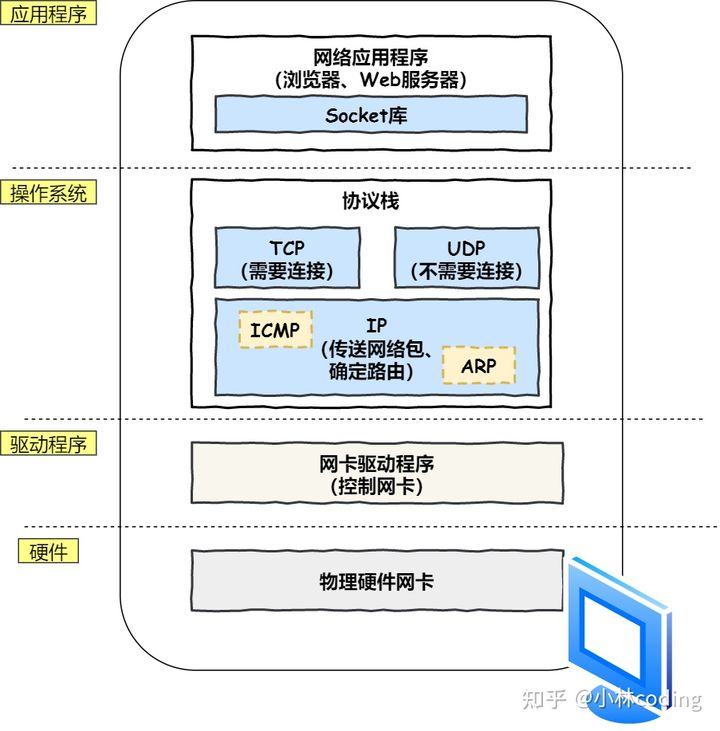

[toc]

# Socket 的概念

> **Socket 是应用层 与 `TCP/IP` 协议族通信的中间软件抽象层，表现为一个封装了 TCP / IP协议族 的编程接口（API）**

**socket 其实就是操作系统提供给程序员操作「网络协议栈」的接口，**
**说人话就是，你能通过socket 的接口，来控制协议找工作，从而实现网络通信，达到跨主机通信。**

socket 一般分为 TCP 网络编程和 UDP 网络编程。

# TCP 网络编程

# UDP 网络编程