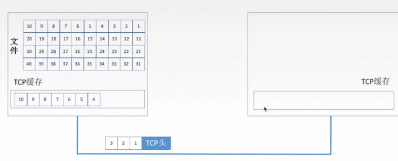
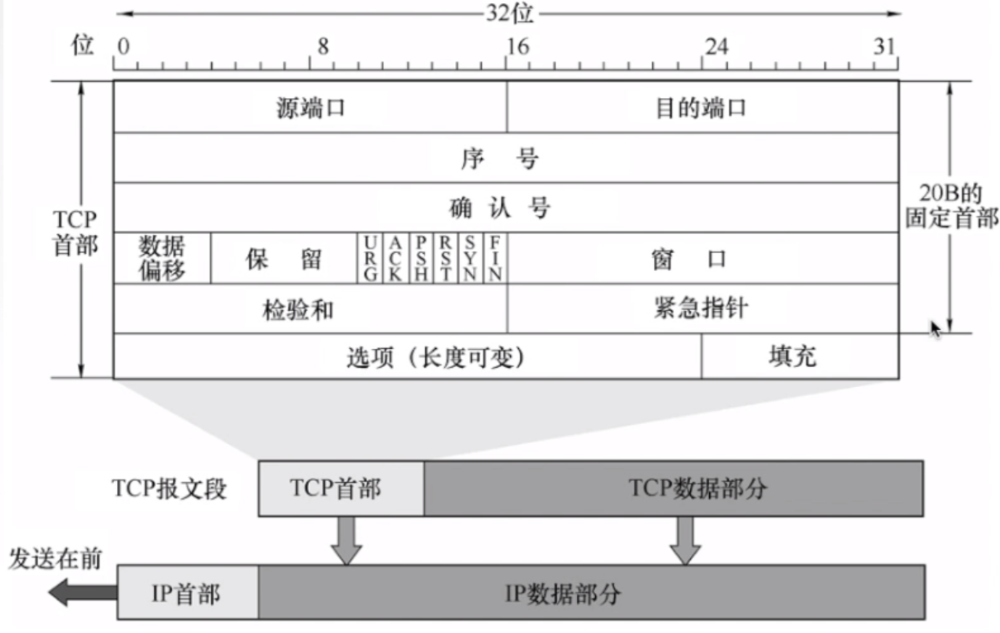
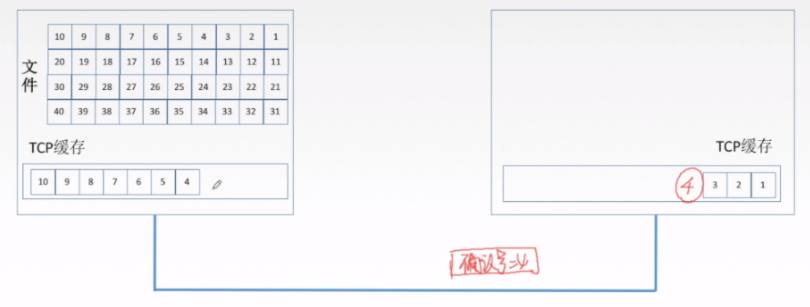
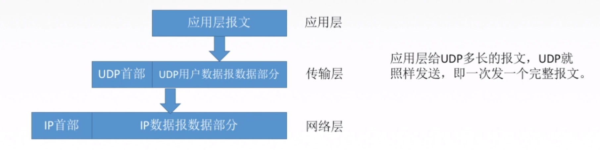
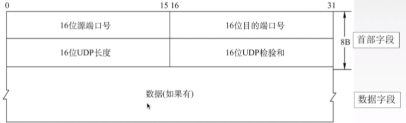

[toc]

# TCP 与 UDP

# 一、TCP

## 1.1 概述

### 1.1.1 概念

> TCP协议简单来说是一种位于传输层的，面向连接的、可靠的、基于字节流的传输层通信协议

### 1.1.2 特点

- TCP是`面向连接`的传输层协议。比如说TCP的三次握手，四次分手，针对的都是连接。

- 每一条TCP连接`只能有两个端点`，每一条TCP连接是点对点的。`也就是说TCP是不同计算机之间的进程的通信`。

- TCP提供可靠交付的服务，无差错，不丢失，不重复，按序到达。总结一下就是，`可靠有序，不丢不重`。

+ TCP提供`全双工通信`。全双工指的是连接双方可以同时收发数据。在收发两端都有发送缓存和接收缓存，发送缓存就是一个准备发送的队列，接收缓存是一个准备接收的队列。

- TCP`面向字节流`

如下图，我们解释一下什么是面向字节流：

图中的1，2，3，4.....数据块，每一个表示一个字节。tcp将应用层的数据变为了这样的字节进行发送

### 1.1.3 TCP报文

如下图所示，我们看一下比较重要的一些首部字段，这里我们介绍`固定的20字节`的TCP首部

- 源端口和目的端口分别是指发送方应用程序的端口和目的方应用程序的端口号。

- 序号是指在一个TCP连接中传送的字节流中的每一个字节都按顺序编号，本字段表示本报文段所发送数据的第一个字节的序号。

- 确认号是指期望收到对方下一个报文段的第一个数据字节的序号。若确认号为N，则证明到需要N-1为止所有的数据都已经正确收到。

如下图，我们举例说明一下

接收方收到了1，2，3个字节组成的数据包，然后接收方就会发送一个确认报文给发送方，其中确认报文的确认号就应该是4，因为1，2，3这三个字节的组成的数据包已经收到了。

- 数据偏移指的是TCP报文段的数据起始处距离TCP报文段的起始处有多远
- 6个控制位介绍如下

| 控制位 |                             作用                             |
| :----: | :----------------------------------------------------------: |
|  ACK   | 置1时表示确认号合法，为0的时候表示数据段不包含确认信息，确认号被忽略 |
|  PSH   | 置1时请求的数据段在接收方得到后就可直接送到应用程序，而不必等到缓冲区满时才传送 |
|  RST   |     置1时重建连接。如果接收到RST位时候，通常发生了某些错     |
|  SYN   |                    置1时用来发起一个连接                     |
|  FIN   | 置1时表示发端完成发送任务。用来释放连接，表明发送方已经没有数据发送了 |
|  URG   |       紧急指针，告诉接收TCP模块紧要指针域指着紧要数据        |

## 1.2 TCP 建立连接 ：三次握手

1. 首先客户端要发送一个数据包告诉服务器要建立连接，根据上面我们了解到的控制位信息，建立连接需要把`SYN置为1`，`seq`指的是序号，是随机产生的。

2. 然后服务器收到该数据包后，会为该TCP连接`分配缓存和变量`，缓存指的是一个字节流队列。（发送方和接收方都有这个队列，而且如果双方需要互相通信，那么双方都会有发送缓存和接收缓存），接着会返回一个确认报文，其中`SYN控制位置为1`，意思是允许建立连接，`ACK是确认号`，确认收到了发送方的包，并且会设一个`seq序号`，也为一个随机数。`小写ack`是确认号，也就是接下来希望发送方要发的数据从哪开始。

3. 最后，客户端需要给服务器端返回一个确认，此时`SYN控制位变为0`，意思这不是建立连接的请求了，要正式发数据了，`ACK是确认码`，意思是收到了服务器的确认请求了。

**第一次握手，客户端向服务器发生请求报文，能够证明客户端到服务器是通的**

**第二次握手，服务器向客户端返回确认报文，能够证明服务器到客户端是通的**

**第三次握手，客户端向服务器返回一个确认报文，证明说我已经收到你的信息了，接下来就要正式发生数据了**

## 1.3 TCP 释放连接：四次挥手

> FIN：用来释放一个链接，当FIN=1的时候，表明此报文的发送方已经完成了数据的发送，没有新的数据要传送，并要求释放链接。

1. 客户端发起请求，请求断开链接。`FIN=1，seq=u`。u是之前传送过来的`最后一个字节的序号+1`。客户端等着服务器返回确认

2. 服务器收到客户端的请求断开链接的报文之后，返回确认信息。`ACK=1，seq=v，ack=u+1`。

   这个时候，客户端不能给服务器发送信息报文，只能接收，即**客户端到服务器方向上的通讯已经关闭**。但是服务器要是还有信息要传给服务器，仍然能传送。这里的`v`是什么意思呢，这就取决于服务器发送给客户端之前的一个包确认号是多少了

3. 当服务器也没有了可以传的信息之后，给客户端发送请求结束的报文。`FIN=1，ACK=1，ack=u+1，seq=w`。这里的`w`，跟上面的`v`是一个意思，为什么不都是`v`呢，因为这一步和上一步中间可能还在发数据呢，所以`seq`这个数据发送的字节流序号可能要变
4. 客户端接收到`FIN=1`的报文之后，返回确认报文，`ACK=1，seq=u+1，ack=w+1`。发送完毕之后，客户端进入等待状态，等待两个时间周期，关闭

为什么最后还要等待两个时间周期呢？

- **客户端的最后一个`ACK`报文在传输的时候丢失，服务器并没有接收到这个报文**。这个候时候服务器就会超时重传这个`FIN`消息，然后客户端就会重新返回最后一个`ACK报文`，等待两个时间周期，完成关闭。

- 如果不等待这两个时间周期，服务器重传的那条消息就不会收到。服务器就因为接收不到客户端的信息而无法正常关闭。

## 1.4  TCP 常见面试题

**为什么连接的时候是三次握手，关闭的时候却是四次握手？**

关闭连接时，服务器收到对方的`FIN`报文时，**仅仅表示对方不再发送数据了但是还能接收数据**，而自己也未必全部数据都发送给对方了，所以己方可以立即关闭，也可以发送一些数据给对方后，再发送`FIN`报文给对方来表示同意现在关闭连接

**为什么不能用两次握手进行连接？**

若建立连接只需两次握手，客户端并没有太大的变化，仍然需要获得服务端的应答后才进入`ESTABLISHED`状态，而服务端在收到连接请求后就进入`ESTABLISHED`状态。

此时如果网络拥塞，客户端发送的连接请求迟迟到不了服务端，客户端便超时重发请求，如果服务端正确接收并确认应答，双方便开始通信，通信结束后释放连接。此时，如果那个失效的连接请求抵达了服务端，由于只有两次握手，服务端收到请求就会进入`ESTABLISHED`状态，等待发送数据或主动发送数据

但此时的客户端早已进入`CLOSED`状态，服务端将会一直等待下去，这样浪费服务端连接资源

但我觉得这个只是两次握手可能造成的问题，最关键的是**两次握手有服务器对客户端的起始序列号做了确认，`但客户端却没有对服务器的起始序列号做确认`，不能保证传输的可靠性**

**如果已经建立了连接，但是客户端突然出现故障了怎么办？**

TCP 保活计时器，每次客户端请求服务器会重置计时器，当`2小时之内`没收到客户端任何数据时，会`每隔75s`向客户端发一个探测报文，若接连发送`10个`，客户端都没有反应，则认为客户端故障，关闭连接

**什么是SYN洪泛攻击？**

SYN洪泛攻击就是利用TCP协议的特性（三次握手）

攻击者发送`TCP的 SYN`，SYN是TCP三次握手中第一个数据包，而当服务器返回ACK后，该攻击者就不对其进行再确认，那这个TCP连接就处于挂起状态，也就是半连接状态，服务器收不到再确认的话，还会重复发送ACK给攻击者

这样更加会浪费服务器资源。攻击者就对服务器发送大量的这种TCP连接，由于每一个连接都无法完成三次握手，所以就在服务器上，这些TCP连接会因为挂起状态而消耗CPU和内存，最后服务器可能死机

**序号（ISN）为什么要随机？**

增加安全性，为了避免被第三方猜测到，从而被第三方伪造的RST报文Reset。

**三次握手的第一次可以携带数据吗？为何？**

- 不可以，三次握手还没有完成。而且这样会放大`SYN FLOOD`（SYN洪泛）攻击。
- 如果攻击者伪造了成千上万的握手报文，携带了1K+ 字节的数据，而接收方会开辟大量的缓存来容纳这些巨大数据，内存会很容易耗尽，从而拒绝服务。

 

**三次握手的第三次可以携带数据吗？为何？**

第三次握手，此时客户端已经处于`ESTABLISHED`状态。对于客户端来说，他已经建立起连接了，并且已经知道服务器的接收和发送能力是正常的。所以也就可以携带数据了。

## 1.5 TCP 如何实现可靠传输

主要通过以下四种方式实现可靠传输机制：

-  校验。伪首部是为了增加TCP校验和的检错能力：通过伪首部的目的IP地址来检查TCP报文是否收错了、通过伪首部的传输层协议号来检查传输层协议是否选对了。需要注意的是，伪首部实际上是不存在的，只是用来验证TCP报文是否出错。

- 序号。之前我们提到TCP是面向字节流的，比如第一个字节就是序号1，第二个字节就是序号2。 而在TCP报文格式介绍的时候，有一个序号字段，这个指的是一个报文段第一个字节的序号。报文段就是你每个数据包。有了序号，就能保证数据是有序的传入应用层。

- 确认。发送方在收到接收方的确认包之后，才继续发送剩下的数据。

- 重传。TCP的发送方在规定的时间内没有收到确认就要重传已发送的报文段（超时重传）。重传时间是动态改变的，依据的是RTTS（加权平均往返时间）

## 1.6 TCP 的流量控制

为什么需要流量控制呢？

比如发送方发送速度非常快，接收方接收速度特别慢，这样就会发生严重的丢包现象。

**TCP 通过滑动窗口的机制来实现流量控制**，

滑动窗口的大小意味着接收方还有多大的缓冲区可以用于接收数据。发送方可以通过滑动窗口的大小来确定应该发送多少字节的数据。

当滑动窗口为 `0 `时，发送方一般`不能再发送数据报`，但有两种情况除外，一种情况是可以发送紧急数据，例如，允许用户终止在远端机上的运行进程。另一种情况是发送方可以发送一个 1 字节的数据报来通知接收方重新声明它希望接收的下一字节及发送方的滑动窗口大小。

## 1.7 TCP 的拥塞控制

如果网络出现拥塞，分组将会丢失，此时发送方会继续重传，从而导致网络拥塞程度更高。因此当出现拥塞时，应当控制发送方的速率。这一点和流量控制很像，但是出发点不同。**流量控制是为了让接收方能来得及接收，而拥塞控制是为了降低整个网络的拥塞程度**

TCP 主要通过四个算法来进行拥塞控制：慢开始、拥塞避免、快重传、快恢复。

# 二、UDP

## 2.1 概念

> UDP协议是参考模型中一种`无连接`的传输层协议，提供面向事务的简单不可靠信息传送服务

## 2.2 特点

- UDP是`无连接的`，减少开销和发送数据之前的时间延迟。大家都知道`TCP`的`三次握手和四次分手`，这个是需要时间花销的，但是UDP没有这部分花销。

- UDP使用`最大努力交付`，即不保证可靠交付。那谁来保证可靠的交付呢？是由UDP的上一层协议，应用层来保证。

- UDP是`面向报文的`，适合一次性传输少量数据的网络应用。

  

  什么意思呢，如下图，UDP这层，把应用层的全部内容作为自己的数据报部分，在IP层也只是加了一个IP首部，我们知道，在以太网，链路层上的数据如果超过1500字节，就会分片，所以网络层发现上面传输层给了`太大的数据就会分片`，加上UDP是不可靠的协议，这就加大了UDP的`不可靠性`，容易丢失，所以UDP适合数据量少的

    

  

- UDP没有拥塞控制，适合很多实时应用。也就是说如果网络堵塞，UDP不管那么多，照样按照自己的速率发数据，那有些人就会说，这协议是不是有点坑B，路都堵上了，还发死劲发数据呢，但是反过来看，这也是UDP的优点，它允许丢包，如果你的网络情况还不错，UDP就非常适合实时应用，比如视频会议。

  

- UDP首部较小，只有8字节，而TCP由20字节。这也是`减少网络传输开销`的一方面。

## 2.3 UDP 报文

- 16位端口号占了2B，也就是16位，说明端口号的范围是`0 - 65535`。源端口号可以没有，因为不希望收到对方的回应，可以写全0，目的端口是一定要有的。

- 16位UDP长度是指`首部+数据的长度`，比如数据2B，首部固定是8B，那么UDP长度就是2+8 = 10B

- 16位UDP校验和，是用来校验`首部和数据有错误`，如果有错就丢弃掉。比如说目的主机找不到对应的端口号，就会给发送方返回一个ICMP，`‘端口不可达’`的差错报文。

# 三、TCP 和 UDP 的区别

TCP 提供面向连接的服务。在传送数据之前必须先建立连接，数据传送结束后要释放连接
UDP 在传送数据之前不需要先建立连接，远地主机在收到 UDP 报文后，不需要给出任何确认。
虽然 UDP 不提供可靠交付，但在某些情况下 UDP 确是一种最有效的工作方式（一般用于即时通信），比如： QQ 语音、 QQ 视频 、直播等等

1. TCP面向连接，UDP无连接
2. TCP面向字节流（文件传输），
   UDP是面向报文的，UDP没有拥塞控制，因此网络出现拥塞不会使源主机的发送速率降低（对IP电话，实时视频会议等）
3. TCP首部开销20字节，UDP的首部开销小，只有8个字节
4. TCP提供可靠的服务。也就是说，通过TCP连接传送的数据，无差错，不丢失，不重复，且按序到达;
   UDP尽最大努力交付，即不保证可靠交付   
5. 每一条TCP连接只能是点到点的；UDP支持一对一，一对多，多对一和多对多的交互通信   
6. TCP的逻辑通信信道是全双工的可靠信道，UDP则是不可靠信道

# TCP 三次握手和四次挥手

## 三次握手

1. 客户端– 发送带有 SYN 标志的数据包–      一次握手–服务端
2. 服务端– 发送带有 SYN/ACK 标志的数据包–  二次握手–客户端
3. 客户端– 发送带有带有 ACK 标志的数据包–   三次握手–服务端

## 为什么要三次握手

三次握手的目的是建立可靠的通信信道，说到通讯，简单来说就是数据的发送与接收，
而三次握手最主要的目的就是双方确认自己与对方的发送与接收是正常的。

第一次握手：Client 什么都不能确认；Server 确认了对方发送正常，自己接收正常
第二次握手：Client 确认了：自己发送、接收正常，对方发送、接收正常；Server 确认了：对方发送正常，自己接收正常
第三次握手：Client 确认了：自己发送、接收正常，对方发送、接收正常；Server 确认了：自己发送、接收正常，对方发送、接收正常

所以三次握手就能确认双发收发功能都正常，缺一不可。

## 四次挥手

客户端-发送一个 FIN，用来关闭客户端到服务器的数据传送
服务器-收到这个 FIN，它发回一 个 ACK，确认序号为收到的序号加1 。和 SYN 一样，一个 FIN 将占用一个序号
服务器-关闭与客户端的连接，发送一个FIN给客户端
客户端-发回 ACK 报文确认，并将确认序号设置为收到序号加1

任何一方都可以在数据传送结束后发出连接释放的通知，待对方确认后进入半关闭状态。
当另一方也没有数据再发送的时候，则发出连接释放通知，对方确认后就完全关闭了TCP连接。

举个例子：A 和 B 打电话，通话即将结束后，A 说“我没啥要说的了”，B回答“我知道了”，
但是 B 可能还会有要说的话，A 不能要求 B 跟着自己的节奏结束通话，于是 B 可能又巴拉巴拉说了一通，
最后 B 说“我说完了”，A 回答“知道了”，这样通话才算结束。

