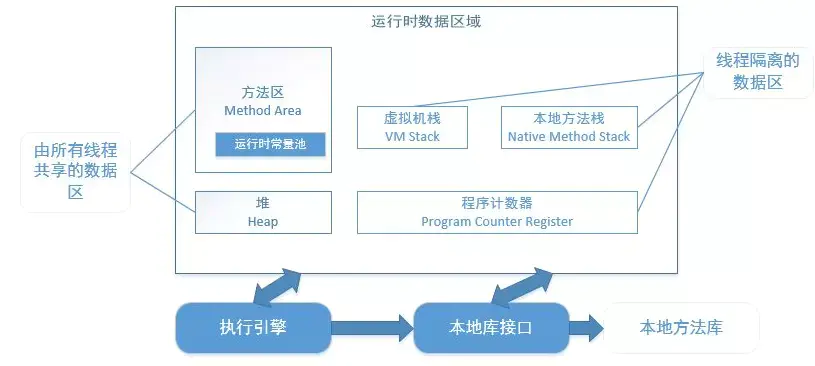

[doc]
# JVM

# 一、JVM内存区域的划分

## 

- **堆（Heap）**

它是 Java 内存管理的核心区域，用来放置 Java 对象实例，几乎所有创建的 Java 对象实例都是被直接分配在堆上。堆被所有的线程共享，在虚拟机启动时，我们指定的“Xmx”之类参数就是用来指定最大堆空间等指标。
（ 编译器通过逃逸分析，确定对象是在栈上分配还是在堆上分配）
理所当然，堆也是垃圾收集器重点照顾的区域，所以堆内空间还会被不同的垃圾收集器进行进一步的细分，最有名的就是新生代、老年代的划分

- **方法区（Method Area）**

方法区是被所有**线程共享**区域，用于存放**已被虚拟机加载**的类信息，常量，静态变量等数据。
被Java虚拟机描述为堆的一个逻辑部分。习惯是也叫它永久代（permanment generation）

永久代也会垃圾回收，主要针对常量池回收，类型卸载（比如反射生成大量的临时使用的Class等信息）

常量池用于存放**编译期**生成的各种字节码和符号引用，常量池具有一定的动态性，里面可以存放编译期生成的常量；
**运行期间**的常量也可以添加进入常量池中，比如string的intern()方法。

当方法区满时，无法在分配空间，就会抛出内存溢出的异常（OutOfMemoneyError）。

Java8中已经没有方法区了，取而代之的是元空间（Metaspace）。

- **程序计数器（PC，Program Counter Register）**

  

在 JVM 规范中，每个线程都有它自己的程序计数器，并且任何时间一个线程都只有一个方法在执行，也就是所谓的当前方法。程序计数器会存储当前线程正在执行的 Java 方法的 JVM 指令地址；或者，如果是在执行本地方法，则是未指定值（undefined）。（唯一不会抛出OutOfMemoryError）

- **Java 虚拟机栈（Java Virtual Machine Stack）**

Java虚拟机栈是**线程私有**，生命周期与线程相同。创建线程的时候就会创建一个java虚拟机栈。

虚拟机执行java程序的时候，每个方法都会创建一个栈帧，栈帧存放在java虚拟机栈中，通过压栈出栈的方式进行方法调用

- **本地方法栈（Native Method Stack）**

本地方法栈 为**虚拟机使用到本地方法服务（native）**。本地方法栈为线程私有，功能和虚拟机栈非常类似。线程在调用本地方法时，来存储本地方法的局部变量表，本地方法的操作数栈等等信息

> 本地方法：是非java语言实现的方法，例如，java调用C语言，来操作某些硬件信息。

# 二、垃圾回收机制

垃圾收集器在对堆区和方法区进行回收前，首先要确定这些区域的对象哪些可以被回收，哪些暂时还不能回收，这就要用到判断对象是否存活的算法

## 2.1 如何判断是否需要回收

### 引用计数算法

给一个对象添加一个引用计数器，当一个地方引用它时，计算器+1，不引用的时候-1，当引用计数器为0时说明该对象可回收。
但是一旦出现互相引用的情况，就会出现无法回收的现象。所以JVM采用的是可达性分析算法。

###  可达性分析算法

可达性分析算法是从离散数学中的图论引入的，程序把所有的引用关系看作一张图，从一个节点GC ROOT开始，寻找对应的引用节点，找到这个节点以后，继续寻找这个节点的引用节点，当所有的引用节点寻找完毕之后，剩余的节点则被认为是没有被引用到的节点，即无用的节点，无用的节点将会被判定为是可回收的对象

在Java语言中，可作为GC Roots的对象包括下面几种：

- Java虚拟机栈中引用的对象，
- 本地方法栈中引用的对象，
- 方法区中静态变量引用的对象和常量池中引用的对象。

## 2.2 常用的垃圾收集算法

###  2.2.1 标记-清除算法

标记-清除算法采用从根集合（GC Roots）进行扫描，对存活的对象进行标记，标记完毕后，再扫描整个空间中未被标记的对象，进行回收，如下图所示。

标记-清除算法不需要进行对象的移动，只需对不存活的对象进行处理，在存活对象比较多的情况下极为高效，但由于标记-清除算法直接回收不存活的对象，因此会造成内存碎片。

### 2.2.2 复制算法

复制算法的提出是为了克服句柄的开销和解决内存碎片的问题。它开始时把堆分成 一个对象面和多个空闲面， 程序从对象面为对象分配空间，当对象满了，基于copying算法的垃圾 收集就从根集合（GC Roots）中扫描活动对象，并将每个 活动对象复制到空闲面(使得活动对象所占的内存之间没有空闲洞)，这样空闲面变成了对象面，原来的对象面变成了空闲面，程序会在新的对象面中分配内存。

### 2.2.3 标记-整理算法

标记-整理算法采用标记-清除算法一样的方式进行对象的标记，但在清除时不同，在回收不存活的对象占用的空间后，会将所有的存活对象往左端空闲空间移动，并更新对应的指针。标记-整理算法是在标记-清除算法的基础上，又进行了对象的移动，因此成本更高，但是却解决了内存碎片的问题。具体流程见下图：

### 2.2.4 分代收集算法

分代集算法是目前大部分JVM的垃圾收集器采用的算法。它的核心思想是根据对象存活的生命周期将内存划分为若干个不同的区域。一般情况下将堆区划分为老年代（Tenured Generation）和新生代（Young Generation），在堆区之外还有一个代就是永久代（Permanet Generation）。

老年代的特点是每次垃圾收集时只有少量对象需要被回收，而新生代的特点是每次垃圾回收时都有大量的对象需要被回收，那么就可以根据不同代的特点采取最适合的收集算法。

#### 年轻代（Young Generation）的回收算法

a) 所有新生成的对象首先都是放在年轻代的。年轻代的目标就是尽可能快速的收集掉那些生命周期短的对象。

b) 新生代内存按照8:1:1的比例分为一个eden区和两个survivor(survivor0,survivor1)区。一个Eden区，两个 Survivor区(一般而言)。大部分对象在Eden区中生成。回收时先将eden区存活对象复制到一个survivor0区，然后清空eden区，当这个survivor0区也存放满了时，则将eden区和survivor0区存活对象复制到另一个survivor1区，然后清空eden和这个survivor0区，此时survivor0区是空的，然后将survivor0区和survivor1区交换，即保持survivor1区为空， 如此往复。

c) 当survivor1区不足以存放 eden和survivor0的存活对象时，就将存活对象直接存放到老年代。若是老年代也满了就会触发一次Full GC，也就是新生代、老年代都进行回收。

d) 新生代发生的GC也叫做Minor GC，MinorGC发生频率比较高(不一定等Eden区满了才触发)。

#### 年老代（Old Generation）的回收算法

a) 在年轻代中经历了N次垃圾回收后仍然存活的对象，就会被放到年老代中。因此，可以认为年老代中存放的都是一些生命周期较长的对象。

b) 内存比新生代也大很多(大概比例是1:2)，当老年代内存满时触发Major GC即Full GC，Full GC发生频率比较低，老年代对象存活时间比较长，存活率标记高。

#### 持久代（Permanent Generation）的回收算法

  用于存放静态文件，如Java类、方法等。持久代对垃圾回收没有显著影响，但是有些应用可能动态生成或者调用一些class，例如Hibernate 等，在这种时候需要设置一个比较大的持久代空间来存放这些运行过程中新增的类。持久代也称方法区，具体的回收可参见上文2.5节。

#

我们都知道Java是跨平台的，一次编译，到处运行，同一套Java代码可以在Windows、Linux、Mac上运行，
背后依赖于不同平台/版本的 JVM（Java虚拟机），
Java代码编译后生成 .class 字节码文件，再由JVM翻译成特定平台的 机器码，然后运行。

JVM的内部组成图如下：

 - 类加载器
 加载编译后的.class，链接、检测损坏的字节码，定位并初始化静态变量及静态代码

 - 运行时数据
 栈、堆、方法变量等；

 - 执行引擎
 执行已经加载的代码、清理生成的所有垃圾(gc)；

 运行程序时，Interpreter(解释器) 会将字节码解释为机器码然后运行，当发现有重复执行的代码时，会切换为 JIT编译器。
 JIT编译器会将重复的代码编译为本地机器码，当同样的方法被调用时，直接运行本地机器码，从而提高系统性能

 

 JVM的设计是面向无限电量/存储的设备，Android设备与之相比，太弱鸡了(电量、内存大小、存储等小的可怜)。

 不能直接使用，于是Google自己设计了一套用于Android平台的Java虚拟机——Dalvik，支持已转换为 .dex (Dalvik Executable)
  压缩格式的Java应用程序的运行。

 与JVM字节码基于栈不同，Dalvik基于寄存器(变量都存储在寄存器中)，后者更加高效且需要更少的空间。

 .java和.kt代码文件被Java、Kotlin编译器协作编译为.class，而后编译为.dex文件，最后打包到.apk文件中。

 把APK安装到设备上，当点击应用图标时，系统会启动一个新的Dalvik进程，并将应用包含的dex代码加载进来，
 在运行时交由Interpreter或JIT编译，然后就可以看到应用的界面了

 

 在Dalvik中，应用的每次运行都需要执行编译操作，而这段时间是计入程序的执行时间，所以程序的启动速度会有点慢，
 当然也有好处， 应用安装速度快。

 在Android 4.4.4后，Google开始引入 Dalvik 的替代品——ART，从JIT(Just In Time，即时编译) 到 
 AOT (Ahead-Of-Time，预编译)，应用在首次安装时用dex2oat将 dex 编译为 .oat 二进制文件。

 

 点击应用图标启动时，ART直接加载.oat文件并运行，启动速度明显提升，避免了重复编译，减少了CPU的使用频率，也降低了功耗，
 当然缺点也是有的：更长的应用安装时间 和 更大的存储空间占用。

 

 Android虚拟机采用 基于寄存器的指令集(opcodes)，这样会存在一个问题，更高版本Java新引入的语法特性不能在上面直接使用。

 为了让我们能使用上Java 8的特性，Google使用 Transformation 来增加了一步编译过程 → 脱糖(desugaring)。

 > 当使用当前Android版本不支持的高版本jdk语法时，在编译期转换为其支持的低版本jdk语法

 

 相信你对ProGuard、DX、D8和R8在混淆过程中起的作用有了一个基础的认知~

 # 用 ProGuard 还是 R8?
 如果没有历史包袱，直接R8，毕竟兼容绝大部分的ProGuard规则，更快的编译速度，对Kotlin更友好。

 - ProGuard →  压缩、优化和混淆Java字节码文件的免费工具，
 - R8 →  ProGuard的替代工具，支持现有ProGuard规则，更快更强，AGP 3.4.0或更高版本，默认使用R8混淆编译器。

 使用ProGuard或R8构建项目会在 build\outputs\mapping\release 输出下述文件：

- mapping.txt → 原始与混淆过的类、方法、字段名称间的转换；
- seeds.txt → 未进行混淆的类与成员；
- usage.txt → APK中移除的代码；
- resources.txt → 资源优化记录文件，哪些资源引用了其他资源，哪些资源在使用，哪些资源被移除；

 

