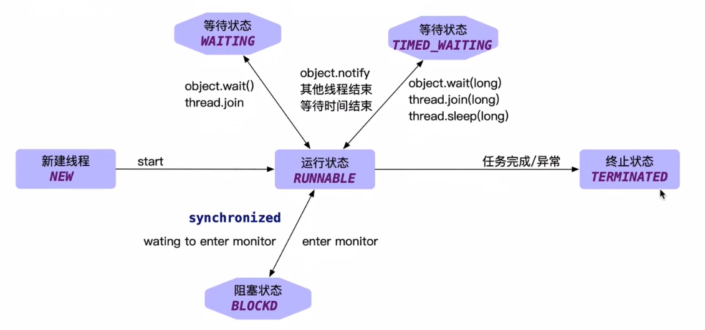
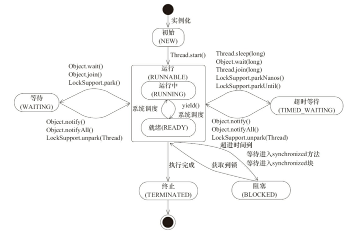
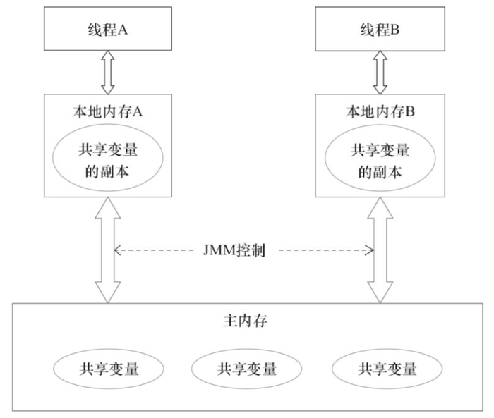
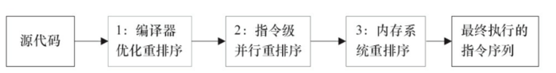
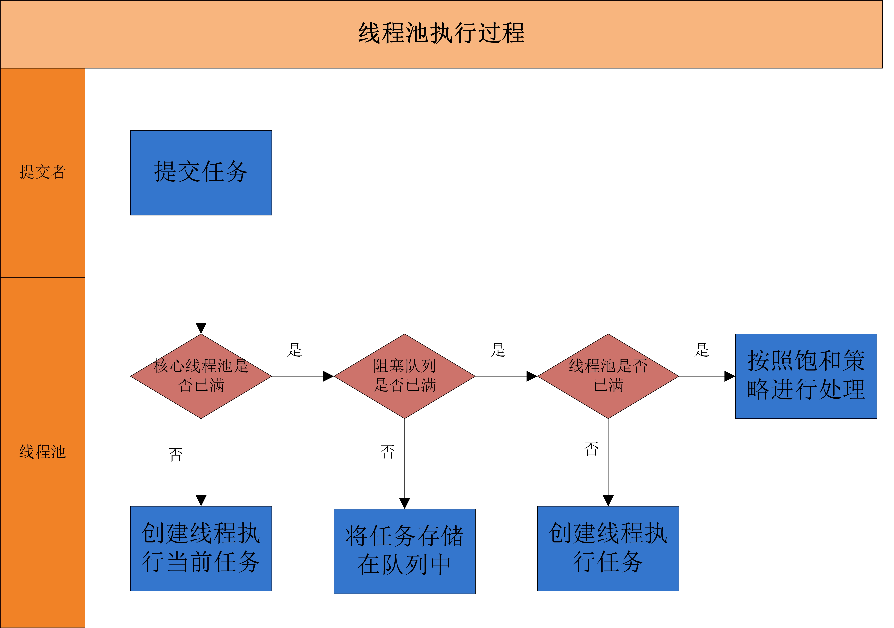

[toc]

# Thread

[参考文章](https://www.codercc.com/backend/basic/juc/)

# 一、相关概念

## 1.1  同步 VS 异步
同步和异步通常用来形容一次方法调用

- 同步
同步方法调用一开始，调用者必须等待被调用的方法结束后，调用者后面的代码才能执行

- 异步
异步调用，指的是，调用者不用管被调用方法是否完成，都会继续执行后面的代码，当被调用的方法完成后会通知调用者

例如：
在超时购物，如果一件物品没了，你得等仓库人员跟你调货，直到仓库人员跟你把货物送过来，你才能继续去收银台付款，
这就类似同步调用;
而异步调用了，就像网购，你在网上付款下单后，什么事就不用管了，该干嘛就干嘛去了，当货物到达后你收到通知去取就好


## 1.2 并发 VS 并行
并发和并行是十分容易混淆的概念
- 并发
并发指的是多个任务交替进行

- 并行
并行则是指真正意义上的“同时进行”

实际上，如果系统内只有一个CPU，而使用多线程时，那么真实系统环境下不能并行，只能通过切换时间片的方式**交替进行
而成为并发执行任务**。真正的并行也只能出现在拥有多个CPU的系统中

## 1.3 阻塞 VS 非阻塞
阻塞和非阻塞通常用来形容多线程间的相互影响，比如一个线程占有了临界区资源，那么其他线程需要这个资源就必须进行
等待该资源的释放，会导致等待的线程挂起，这种情况就是阻塞，
而非阻塞就恰好相反，它强调没有一个线程可以阻塞其他线程，所有的线程都会尝试地往前运行

## 1.4 临界区
临界区用来表示一种**公共资源**或者说是**共享数据**，可以被多个线程使用
但是每个线程使用时，一旦临界区资源被一个线程占有，那么其他线程必须等待

## 1.5 守护线程 Daemon
守护线程是一种特殊的线程，就和它的名字一样，它是系统的守护者，在后台默默地守护一些系统服务
比如**垃圾回收线程**，**JIT线程**就可以理解守护线程

线程可以通过setDaemon(true)的方法将线程设置为守护线程。并且需要注意的是设置守护线程要先于start()方法
当一个Java应用，只有守护线程的时候，虚拟机就会自然退出

注意：
守护线程在退出的时候并不会执行finally块中的代码，所以将释放资源等操作不要放在finally块中执行，
这种操作是不安全的


# 二、线程状态及基本操作

## 2.1 线程的状态






线程一共有六种状态，分别为 New、RUNNABLE、BLOCKED、WAITING、TIMED_WAITING、TERMINATED
**同一时刻只有一种状态**，通过线程的 getState 方法可以获取线程的状态


- 新建状态（New）     Thread state for a thread which has not yet started
用 new 语句创建的线程处于新建状态，此时它和其他Java对象一样，仅仅在堆区中被分配了内存


- 就绪状态（Runnable）
当一个线程对象创建后，其他线程调用它的 start() 方法，该线程就进入就绪状态，
Java 虚拟机会为它创建方法调用栈和程序计数器。
处于这个状态的线程位于可运行池中，等待获得CPU的使用权

> 注：不一定被调用了start()立刻会改变状态，还有一些准备工作，这个时候的状态是不确定的。

- 运行状态（Running）  // 这个状态包含在 Runnable 中
处于这个状态的线程占用CPU，执行程序代码
**只有处于就绪状态的线程才有机会转到运行状态**


- 阻塞状态（Blocked）

    A thread in the blocked state is waiting for a monitor lock to **enter a synchronized block/method** or
    **reenter a synchronized block/method** after calling {@link Object#wait() Object.wait}

    阻塞状态是指线程因为某些原因放弃 CPU，暂时停止运行
    当线程处于阻塞状态时，Java虚拟机不会给线程分配CPU。直到线程重新进入就绪状态，它才有机会转到运行状态


- 等待状态 (WAITING)

  A thread is in the waiting state due to calling one of the following methods:
  {@link Object#wait() Object.wait} with no timeout
  {@link #join() Thread.join} with no timeout
  {@link LockSupport#park() LockSupport.park}
  
  无条件等待，当线程调用 wait() / join() / LockSupport.park() 不加超时时间的方法之后所处的状态，
  如果**没有被唤醒或等待的线程没有结束，那么将一直等待**，当前状态的线程不会被分配CPU资源和持有锁


- 超时等待状态 (TIMED_WAITING)
  
    有条件的等待，当线程调用 sleep(time)、wait(time)、join(time)、LockSupport.parkNanos(time)、
    LockSupport.parkUntil(time) 方法之后所处的状态 
    **在指定的时间没有被唤醒或者等待线程没有结束，会被系统自动唤醒，正常退出**
    
- 死亡状态（TERMINATED）
 当线程退出run()方法时，就进入死亡状态，该线程结束生命周期   

 

 **当线程进入到synchronized方法或者synchronized代码块时，线程切换到的是BLOCKED态，
 而使用java.util.concurrent.locks下lock进行加锁的时候线程切换的是WAITING或者TIMED_WAITING状态，
 因为lock会调用LockSupport的方法**

## 2.2 线程状态的基本操作

除了新建一个线程外，线程在生命周期内还有需要基本操作，而这些操作会成为**线程间一种通信方式**

### 2.2.0 interrupted

interrupted 可以理解为线程的一个标志位，它表示了**一个运行中的线程是否被其他线程进行了中断操作**

interrupted 好比**其他线程**对**该线程**打了一个招呼，其他线程可以调用该线程的 interrupt()方法对其进行中断操作
同时该线程可以调用 isInterrupted() 来感知其他线程对其自身的中断操作，**该方法不会清除中断标志位**
同样可以调用 Thread 的静态方法 interrupted() 对当前线程进行中断操作，**该方法会清除中断标志位**

需要注意的是，当抛出InterruptedException时候，会清除中断标志位，也就是说在调用isInterrupted会返回false
```
sleepThread.interrupt()
```


### 2.2.1  interrupt()
如果线程处于阻塞状态，即调用了 wait、join、sleep 等方法时，调用此方法会清除中断标志位并抛出InterruptedException,
**否则不会清除中断标志位**

注意： 
在**阻塞状态**下调用此方法后，标志位并不是立刻清零的，也就是说 **在刚开始的一段时间内，isInterrupted() 返回 true,
随后返回 false**


### 2.2.2   join

Waits for this thread to die.

join 方法可以看做是线程间协作的一种方式
很多时候，一个线程的输入可能非常依赖于另一个线程的输出

如果一个线程实例 A 执行了 threadB.join() ,其含义是：
**当前线程 A 会等待 threadB 线程终止后 threadA 才会继续执行**

Thread 类除了提供 join() 方法外，另外还提供了超时等待的方法
**如果线程 threadB 在等待的时间内还没有结束的话，threadA 会在超时之后继续执行**

```
threadB.join()  //当前线程会等待threadB线程终止后才会继续执行
```


### 2.2.3 sleep

public static native void sleep(long millis) 方法是 Thread 的静态方法
当前线程按照指定的时间休眠，其休眠时间的精度取决于处理器的计时器和调度器

注意：
**如果当前线程获得了锁，sleep 方法并不会失去锁**


### 2.2.4 yield

public static native void yield()

一旦调用此方法，它会使当前线程让出CPU
需要注意的是，让出的CPU并不是代表当前线程不再运行了，
**如果在下一次竞争中，又获得了CPU时间片当前线程依然会继续运行**
另外，**让出的时间片只会分配给当前线程相同优先级的线程**


### 2.2.5 Thread.sleep()  VS  Object.wait()

1. sleep() 方法是 Thread 的静态方法，而 wait() 是 Object 实例方法

2. **wait() 方法必须要在同步方法或者同步块中调用，也就是必须已经获得对象锁**
   而 sleep() 方法没有这个限制可以在任何地方种使用
   
3. wait() 方法会释放占有的对象锁，使得该线程进入等待池中，等待下一次获取资源
   sleep() 方法只是会让出CPU并不会释放掉对象锁   
   
4. sleep() 方法在休眠时间达到后如果再次获得CPU时间片就会继续执行
   wait() 方法必须等待 Object.notify/Object.notifyAll 通知后，才会离开等待池，
   并且再次获得CPU时间片才会继续执行   

### 2.2.6 Thread.sleep()  VS  Thread.yield()

相同 ：
sleep() 和 yield() 方法，同样都是当前线程会交出处理器资源

不同：
sleep() 交出来的时间片其他线程都可以去竞争，也就是说都有机会获得当前线程让出的时间片
yield() 方法只允许**与当前线程具有相同优先级的线程**能够获得释放出来的CPU时间片


***


# 三、线程安全


##  3.1 关键字同步


###  3.1.1 volatile

volatile 修饰的成员变量在每次被线程访问时，都强迫从共享内存重新读取该成员的值，

而且，当成员变量值发生变化时，强迫将变化的值重新写入共享内存， 不能解决非原子操作的线程安全性。

性能不及原子类高


### 3.1.2 synchronized


## 3.2 JUC工具类

### 3.2.1 Lock

#### 公平锁、非公平锁

公平和非公平锁的队列都基于锁内部维护的一个双向链表，表结点Node的值就是每一个请求当前锁的线程

公平锁则在于每次都是依次从队首取值

公平锁：

表示线程获取锁的顺序是按照加锁的顺序来分配的，及先来先得，先进先出的顺序

非公平锁：

表示获取锁的抢占机制，是随机获取锁的，和公平锁不一样的就是先来的不一定能拿到锁，有可能一直拿不到锁

允许线程插队，避免每一个线程都进入阻塞，再唤醒，性能高


#### 乐观锁、悲观锁

Java 按照锁的实现分为乐观锁和悲观锁，乐观锁和悲观锁并不是一种真实存在的锁，而是一种设计思想


悲观锁：

悲观锁是一种悲观思想，它总认为最坏的情况可能会出现，所以悲观锁在持有数据的时候总会把**临界资源** 锁住，

这样其他线程想要请求这个资源的时候就会阻塞，直到等到悲观锁把资源释放为止

实现： Synchronized、ReentrantLock


乐观锁： 

乐观锁的思想与悲观锁的思想相反，它总认为资源和数据不会被别人所修改，所以读取不会上锁，

但是乐观锁在进行写入操作的时候会判断当前数据是否被修改过

乐观锁适用于多读的应用类型，这样可以提高吞吐量

乐观锁的实现方案一般来说有两种： **版本号机制 ** 和 **CAS实现**


在Java中`java.util.concurrent.atomic`包下面的原子变量类就是使用了乐观锁的一种实现方式CAS实现的


#### 共享锁、排他锁

共享锁：

又称为读锁

所有线程均可同时获得，并发量高，比如在线文档查看 


排他锁：

又称为写锁或独占锁

同一时刻只有一个线程有权修改资源，比如在线文档编辑


####      ReentrantLock

悲观锁 ，可重入锁，公平锁，非公平锁


基本用法：

```
        val lock = ReentrantLock()
        try {
            lock.lock()
        } finally {
            lock.unlock()
        }
```

```
void lock()          //获取不到会阻塞 
boolean tryLock()    //尝试获取锁，成功返回true。 
boolean tryLock(3000, TimeUnit.MILLISECONDS)   //在一定时间内去不断尝试获取锁
void lockInterruptibly();    //可使用Thread.interrupt()打断阻塞状态，退出竞争，让给其他线程
```


可重入，避免死锁：

 ```
  val lock = ReentrantLock()
  fun doWork() {
        try {
            lock.lock()
            doWork()  //递归调用,使得统一线程多次获得锁
        } finally {
            lock.unlock()
        }
    }
 ```

默认非公平锁，允许线程插队，避免每一个线程都进入阻塞，再唤醒，性能高。

因为线程可以插队，导致队列中可能会存在线程饿死的情况，一直得不到锁，一直得不到执行

```
val lock = ReentrantLock(true/false)
```

```
object ReentrantLokTest {

    @JvmStatic
    fun main(array: Array<String>) {
        (0 until 5).forEach {
            Thread(Task()).start()
        }
    }

    private val mLock = ReentrantLock(true)   //公平锁
//    private val mLock = ReentrantLock(false)  //非公平锁


    /**
     * 多个线程去打印
     */
    class Task : Runnable {
        override fun run() {

            try {
                val name = Thread.currentThread().name
                mLock.lock()
                println("$name 第一次打印")
                Thread.sleep(1000)
                mLock.unlock()

                mLock.lock()
                println("$name 第二次打印")
                Thread.sleep(1000)

            } catch (e: Exception) {
                e.printStackTrace()
            } finally {
                mLock.unlock()
            }
        }
    }
}

公平锁结果：
Thread-0 第一次打印
Thread-1 第一次打印
Thread-2 第一次打印
Thread-3 第一次打印
Thread-4 第一次打印
Thread-0 第二次打印
Thread-1 第二次打印
Thread-2 第二次打印
Thread-3 第二次打印
Thread-4 第二次打印

非公平锁结果：
Thread-0 第一次打印
Thread-0 第二次打印
Thread-2 第一次打印
Thread-2 第二次打印
Thread-1 第一次打印
Thread-1 第二次打印
Thread-3 第一次打印
Thread-3 第二次打印
Thread-4 第一次打印
Thread-4 第二次打印
```


#### Condition

ReentrantLock进阶用法 -> Condition条件对象

可使用它的await-singnal 指定唤醒一个(组)线程。相比于wait-notify要么全部唤醒，要么只能唤醒一个，更加灵活可控

```

```


#### ReentrantReadWriteLock

共享锁，排他锁 

```
ReentrantReadWriteLock reentrantReadWriteLock; 
ReentrantReadWriteLock.ReadLock readLock; 
ReentrantReadWriteLock.WriteLock writeLock;
```


### 3.2.2 Atomic

AtomicInterger原子包装类,CAS（Compare-And-Swap）实现无锁数据更新。

自旋的设计能够有效避免线程因阻塞-唤醒带来的系统资源开销 

适用场景：多线程计数,原子操作,并发数量小的场景


### 3.2.3 Concurrent


## 3.3 并发容器


### 3.3.1 CopyOnWriteArrayList

### 3.3.2 ConcurrentHashMap


***


# 四、 并发原理：Java内存模型(JMM) 以及 happens-before


## 4.1 三大性质

在并发编程中分析线程安全的问题时往往需要切入点，那就是两大核心：JMM抽象内存模型以及happens-before规则，
三条性质：原子性，有序性和可见性。


### 4.1.1 原子性
原子性是指一个操作是不可中断的，要么全部执行成功要么全部执行失败，有着“同生共死”的感觉

int a = 10;  //1  原子操作
a++;         //2 
int b=a;     //3 
a = a+1;     //4

上面这四个语句中只有第1个语句是原子操作，将10赋值给线程工作内存的变量a
语句2（a++），实际上包含了三个操作：1. 读取变量a的值；2：对a进行加一的操作；3.将计算后的值再赋值给变量a
而这三个操作无法构成原子操作
对语句3,4的分析同理可得这两条语句不具备原子性

java内存模型中定义了8中操作都是原子的，不可再分的：

- lock(锁定)：作用于主内存中的变量，它把一个变量标识为一个线程独占的状态
- unlock(解锁):作用于主内存中的变量，它把一个处于锁定状态的变量释放出来，释放后的变量才可以被其他线程锁定
- read（读取）：作用于主内存的变量，它把一个变量的值从主内存传输到线程的工作内存中，以便后面的load动作使用
- load（载入）：作用于工作内存中的变量，它把read操作从主内存中得到的变量值放入工作内存中的变量副本
- use（使用）：作用于工作内存中的变量，它把工作内存中一个变量的值传递给执行引擎，每当虚拟机遇到一个需要使用到变量的值的字节码指令时将会执行这个操作
- assign（赋值）：作用于工作内存中的变量，它把一个从执行引擎接收到的值赋给工作内存的变量，每当虚拟机遇到一个给变量赋值的字节码指令时执行这个操作
- store（存储）：作用于工作内存的变量，它把工作内存中一个变量的值传送给主内存中以便随后的write操作使用
- write（操作）：作用于主内存的变量，它把store操作从工作内存中得到的变量的值放入主内存的变量中


### 4.1.2 有序性
synchronized语义表示锁在同一时刻只能由一个线程进行获取，当锁被占用后，其他线程只能等待
因此，synchronized语义就要求线程在访问读写共享变量时只能“串行”执行，
**因此synchronized具有有序性**

**volatile包含禁止指令重排序的语义，其具有有序性**

### 4.1.3 可见性
可见性是指当一个线程修改了共享变量后，其他线程能够立即得知这个修改
通过之前对synchronzed内存语义进行了分析，当线程获取锁时会从主内存中获取共享变量的最新值，释放锁的时候会将共
享变量同步到主内存中
从而，**synchronized具有可见性**
在volatile分析中，会通过在指令中添加lock指令，以实现内存可见性。因此, **volatile具有可见性**


## 4.2 

出现线程安全的问题一般是因为**主内存和工作内存数据不一致性和重排序**导致的
java内存模型是**共享内存的并发模型**，线程之间主要通过读-写共享变量来完成隐式通信

哪些是共享变量?
在java程序中所有**实例域，静态域和数组元素**都是放在堆内存中（所有线程均可访问到，是可以共享的）
而局部变量，方法定义参数和异常处理器参数不会在线程间共享
共享数据会出现线程安全的问题，而非共享数据不会出现线程安全的问题


### 4.2.1 JMM抽象结构模型
我们知道CPU的处理速度和主存的读写速度不是一个量级的，为了平衡这种巨大的差距，每个CPU都会有缓存。
因此，
**共享变量会先放在主存中，每个线程都有属于自己的工作内存，并且会把位于主存中的共享变量拷贝到自己的
工作内存，之后的读写操作均使用位于工作内存的变量副本，并在某个时刻将工作内存的变量副本写回到主存中去**


如图为JMM抽象示意图，线程A和线程B之间要完成通信的话，要经历如下两步：

1. 线程A从主内存中将共享变量读入线程A的工作内存后并进行操作，之后将数据重新写回到主内存中；
2. 线程B从主存中读取最新的共享变量

从横向去看，线程A和线程B就好像通过共享变量在进行隐式通信
如果线程A更新后数据并没有及时写回到主存，而此时线程B读到的是过期的数据，这就出现了“脏读”现象。
可以通过**同步机制（控制不同线程间操作发生的相对顺序）**来解决 或者
**通过volatile关键字使得每次volatile变量都能够强制刷新到主存**，从而对每个线程都是可见的

### 4.2.2 重排序

在执行程序时，为了提高性能，编译器和处理器常常会对指令进行重排序

1. 编译器优化的重排序。编译器在不改变单线程程序语义的前提下，可以重新安排语句的执行顺序；
2. 指令级并行的重排序。现代处理器采用了指令级并行技术来将多条指令重叠执行。如果**不存在数据依赖性**，
处理器可以改变语句对应机器指令的执行顺序；
3. 内存系统的重排序。由于处理器使用缓存和读/写缓冲区，这使得加载和存储操作看上去可能是在乱序执行的

1属于编译器重排序，而2和3统称为处理器重排序
这些重排序会导致线程安全的问题，一个很经典的例子就是DCL问题，

编译器和处理器在重排序时，会遵守数据依赖性，编译器和处理器**不会改变存在数据依赖性关系的两个操作的执行顺序**

```
double pi = 3.14 //A
double r = 1.0 //B
double area = pi * r * r //C
```
由于A,B之间没有任何关系，对最终结果也不会存在关系，它们之间执行顺序可以重排序
因此可以执行顺序可以是A->B->C或者B->A->C执行最终结果都是3.14，即A和B之间没有数据依赖性


### 4.2.3 as-if-serial
as-if-serial语义的意思是：
**不管怎么重排序（编译器和处理器为了提供并行度），（单线程）程序的执行结果不能被改变**
as-if-serial语义把单线程程序保护了起来，遵守as-if-serial语义的编译器，runtime和处理器共同为编写单线程程序
的程序员创建了一个幻觉：单线程程序是按程序的顺序来执行的

### 4.2.4 happens-before

JMM可以通过happens-before关系向程序员提供跨线程的内存可见性保证

如果A线程的写操作a与B线程的读操作b之间存在happens-before关系，
尽管a操作和b操作在不同的线程中执行,但JMM向程序员保证a操作将对b操作可见

具体的定义为:
1. 如果一个操作happens-before另一个操作，那么第一个操作的执行结果将对第二个操作可见，
而且第一个操作的执行顺序排在第二个操作之前
2. 两个操作之间存在happens-before关系，并不意味着Java平台的具体实现必须要按照happens-before
关系指定的顺序来执行,如果重排序之后的执行结果，与按happens-before关系来执行的结果一致，那么这种
重排序并不非法（也就是说，JMM允许这种重排序）


上面的1是JMM对程序员的承诺.
如果A happens-before B，那么Java内存模型将向程序员保证——A操作的结果将对B可见，且A的执行顺序排在B之前
注意，这只是Java内存模型向程序员做出的保证！

上面的2）是JMM对编译器和处理器重排序的约束原则
JMM其实是在遵循一个基本原则：**只要不改变程序的执行结果（指的是单线程程序和正确同步的多线程程序），
编译器和处理器怎么优化都行**


### 4.2.5 as-if-serial VS happens-before

1. as-if-serial语义保证**单线程内程序的执行结果不被改变**
   happens-before关系保证**正确同步的多线程程序的执行结果不被改变**
   
2. as-if-serial语义给编写单线程程序的程序员创造了一个幻境：单线程程序是按程序的顺序来执行的
   happens-before关系给编写正确同步的多线程程序的程序员创造了一个幻境：
   正确同步的多线程程序是按happens-before指定的顺序来执行的
   
3. as-if-serial语义和happens-before这么做的目的，都是为了在不改变程序执行结果的前提下，
   尽可能地提高程序执行的并行度
   
   


### 4.2.6 happens-before 的具体规则

1. 程序顺序规则：一个线程中的每个操作，happens-before于该线程中的任意后续操作
2. 监视器锁规则：对一个锁的解锁，happens-before于随后对这个锁的加锁
3. volatile变量规则：对一个volatile域的写，happens-before于任意后续对这个volatile域的读
4. 传递性：如果A happens-before B，且B happens-before C，那么A happens-before C
5. start()规则：如果线程A执行操作ThreadB.start()（启动线程B），
   那么A线程的ThreadB.start()操作happens-before于线程B中的任意操作
6. join()规则：如果线程A执行操作ThreadB.join()并成功返回，那么线程B中的任意操作happens-before于
   线程A从ThreadB.join()操作成功返回   
7. 程序中断规则：对线程interrupted()方法的调用先行于被中断线程的代码检测到中断时间的发生
8. 对象finalize规则：一个对象的初始化完成（构造函数执行结束）先行于发生它的finalize()方法的开始   

### 4.2.7 总结

JMM是语言级的内存模型，在我的理解中JMM处于中间层，包含了两个方面：
（1）内存模型；
（2）重排序以及happens-before规则  


***

# 五、线程池


## 5.1 为什么要引入线程池


- 降低资源消耗。通过重复利用已创建的线程降低线程创建和销毁造成的消耗。 
- 提高响应速度。当任务到达时，任务可以不需要的等到线程创建就能立即执行。 
- 提高线程的可管理性。线程是稀缺资源，如果无限制的创建，不仅会消耗系统资源，还会降低系统的稳定性，使用线程池可以进行统一的分配，调优和监控。


## 5.2 Java中几种默认的线程池


```
       val threadPoll = ThreadPoolExecutor(
            5,
            20,
            20,
            TimeUnit.SECONDS,
            PriorityBlockingQueue(),
            Executors.defaultThreadFactory(),
            ThreadPoolExecutor.AbortPolicy()
        )
```


|      参数       |                             说明                             |
| :-------------: | :----------------------------------------------------------: |
|  corePoolSize   | 当向线程池提交一个任务时，若线程池已创建的线程数小于corePoolSize，即便此时存在空闲线程，也会通过创建一个新线程来执行该任务，直到已创建的线程数大于或等于corePoolSize时，（除了利用提交新任务来创建和启动线程（按需构造），也可以通过 prestartCoreThread() 或 prestartAllCoreThreads() 方法来提前启动线程池中的基本线程） |
| maximumPoolSize | 线程池所允许的最大线程个数。当队列满了，且已创建的线程数小于maximumPoolSize，则线程池会创建新的线程来执行任务。另外，对于无界队列，可忽略该参数 |
|  keepAliveTime  | 当线程池中线程数大于核心线程数时，线程的空闲时间如果超过线程存活时间，那么这个线程就会被销毁，直到线程池中的线程数小于等于核心线程数 |
|      unit       |                   keepAliveTime的时间单位                    |
|    workQueue    | 等待队列。当任务提交时，如果线程池中的线程数量大于等于corePoolSize的时候，把该任务放入等待队列 |
|  threadFactory  | 线程创建工程厂。默认使用Executors.defaultThreadFactory() 来创建线程，线程具有相同的NORM_PRIORITY优先级并且是非守护线程 |
|     handler     | 线程池的饱和拒绝策略。如果阻塞队列满了并且没有空闲的线程，这时如果继续提交任务，就需要采取一种策略处理该任务 |


JUC包下Executors提供的几种线程池：

```
//单一线程数,同时只有一个线程存活,但线程等待队列无界 
Executors.newSingleThreadExecutor(); 

//线程可复用线程池,核心线程数为0，最大可创建的线程数为Interger.max,线程复用存活时间是60s. Executors.newCachedThreadPool(); 

//固定线程数量的线程池 
Executors.newFixedThreadPool(int corePoolSize); 

//可执行定时任务,延迟任务的线程池 
Executors.newScheduledThreadPool(int corePoolSize);
```


线程池重要方法：

```
void execute(Runnable run)         //提交任务,交由线程池调度 
void shutdown()                    //关闭线程池,等待任务执行完成 
void shutdownNow()                 //关闭线程池，不等待任务执行完成 
int getTaskCount()                 //返回线程池找中所有任务的数量 
int getCompletedTaskCount()        //返回线程池中已执行完成的任务数量 
int getPoolSize()                  //返回线程池中已创建线程数量 
int getActiveCount()               //返回当前正在运行的线程数量
```


## 5.3 线程池执行流程





## 线程池的实现原理


## 线程池的复用原理


# 六、 并发工具

## 6.1 倒计时器：CountDownLatch  

在多线程协作完成业务功能时，有时候需要**等待其他多个线程完成任务之后，主线程才能继续往下执行业务功能**,
在这种的业务场景下，**通常可以使用Thread类的join方法，让主线程等待被join的线程执行完之后主线程才能继续往下执行**。
当然，使用线程间消息通信机制也可以完成。

其实，java并发工具类中为我们提供了类似“倒计时”这样的工具类，可以十分方便的完成所说的这种业务场景。
为了能够理解CountDownLatch，举一个很通俗的例子，运动员进行跑步比赛时，假设有6个运动员参与比赛，裁判员在终点
会为这6个运动员分别计时，可以想象没当一个运动员到达终点的时候，对于裁判员来说就少了一个计时任务。直到所有运
动员都到达终点了，裁判员的任务也才完成。这6个运动员可以类比成6个线程，当线程调用CountDownLatch.countDown方
法时就会对计数器的值减一，直到计数器的值为0的时候，裁判员（调用await方法的线程）才能继续往下执行。

下面来看些CountDownLatch的一些重要方法。
构造方法：
public CountDownLatch(int count)

构造方法会传入一个整型数N，之后调用CountDownLatch的countDown方法会对N减一，直到N减到0的时候，
当前调用await方法的线程继续执行

CountDownLatch的方法不是很多，将它们一个个列举出来：

- await() throws InterruptedException：调用该方法的线程等到构造方法传入的N减到0的时候，才能继续往下执行；
- await(long timeout, TimeUnit unit)：与上面的await方法功能一致，只不过这里有了时间限制，
        调用该方法的线程等到指定的timeout时间后,不管N是否减至为0，都会继续往下执行；
- countDown()：使CountDownLatch初始值N减1；
- long getCount()：获取当前CountDownLatch维护的值


```
   private static void countdownLatch() {
        final CountDownLatch startSignal = new CountDownLatch(1);
        final CountDownLatch endSignal = new CountDownLatch(6);

        ExecutorService executorService = Executors.newFixedThreadPool(6);
        for (int i = 0; i < 6; i++) {
            executorService.execute(new Runnable() {
                @Override
                public void run() {
                    try {
                        System.out.println(Thread.currentThread().getName() + " 运动员等待裁判员响哨！！！");
                        startSignal.await(); //所有运动员开始等待，直到startSignal的维护值为0

                        System.out.println(Thread.currentThread().getName() + "正在全力冲刺");
                        endSignal.countDown();
                        System.out.println(Thread.currentThread().getName() + "  到达终点");
                    } catch (InterruptedException e) {
                        e.printStackTrace();
                    }
                }
            });
        }

        try {
            Thread.sleep(500);

            System.out.println("裁判员发号施令啦！！！");
            startSignal.countDown(); // 这里的值为0，所有运动员线程开始执行

            endSignal.await();  //主线程开始等待，直到endSignal的值为0
            System.out.println("所有运动员到达终点，比赛结束！");
            executorService.shutdown();

        } catch (InterruptedException e) {
            e.printStackTrace();
        }
    }

```

该示例代码中设置了两个CountDownLatch，
第一个endSignal用于控制让main线程（裁判员）必须等到其他线程（运动员）让CountDownLatch维护的数值N减到0为止。
另一个startSignal用于让main线程对其他线程进行“发号施令”，startSignal引用的CountDownLatch初始值为1，
而其他线程执行的run方法中都会先通过startSignal.await()让这些线程都被阻塞，直到main线程通过调用
startSignal.countDown();，将值N减1，CountDownLatch维护的数值N为0后，其他线程才能往下执行，并且，每个线程
执行的run方法中都会通过endSignal.countDown();对endSignal维护的数值进行减一，由于往线程池提交了6个任务，
会被减6次，所以endSignal维护的值最终会变为0，因此main线程在latch.await();阻塞结束，才能继续往下执行。

注意：
当调用CountDownLatch的countDown方法时，当前线程是不会被阻塞，会继续往下执行

## 6.2 循环栅栏：CyclicBarrier

CyclicBarrier也是一种多线程并发控制的实用工具，和CountDownLatch一样具有等待计数的功能，但是相比于
CountDownLatch功能更加强大

为了理解CyclicBarrier，这里举一个通俗的例子。开运动会时，会有跑步这一项运动，我
们来模拟下运动员入场时的情况，假设有6条跑道，在比赛开始时，就需要6个运动员在比
赛开始的时候都站在起点了，裁判员吹哨后才能开始跑步。跑道起点就相当于“barrier”，
是临界点，而这6个运动员就类比成线程的话，就是这6个线程都必须到达指定点了，意味
着凑齐了一波，然后才能继续执行，否则每个线程都得阻塞等待，直至凑齐一波即可。
cyclic是循环的意思，也就是说CyclicBarrier当多个线程凑齐了一波之后，仍然有效，可以
继续凑齐下一波。CyclicBarrier的执行示意图如下：


当多个线程都达到了指定点后，才能继续往下继续执行。这就有点像报数的感觉，假设6
个线程就相当于6个运动员，到赛道起点时会报数进行统计，如果刚好是6的话，这一波就
凑齐了，才能往下执行。**CyclicBarrier在使用一次后，下面依然有效，可以继续当做计
数器使用，这是与CountDownLatch的区别之一。**这里的6个线程，也就是计数器的初始
值6，是通过CyclicBarrier的构造方法传入的。

下面来看下CyclicBarrier的主要方法：
```
//等到所有的线程都到达指定的临界点
await() throws InterruptedException, BrokenBarrierException 

//与上面的await方法功能基本一致，只不过这里有超时限制，阻塞等待直至到达超时时间为止
await(long timeout, TimeUnit unit) throws InterruptedException, BrokenBarrierException, TimeoutException 

//获取当前有多少个线程阻塞等待在临界点上
int getNumberWaiting()

//用于查询阻塞等待的线程是否被中断
boolean isBroken()

//将屏障重置为初始状态。如果当前有线程正在临界点等待的话，将抛出BrokenBarrierException
void reset() throws BrokenBarrierException
```


另外需要注意的是，CyclicBarrier提供了这样的构造方法：
public CyclicBarrier(int parties, Runnable barrierAction)
可以用来，当指定的线程都到达了指定的临界点的时，接下来执行的操作可以由barrierAction传入即可
注意，这个action由最后一个到达的线程执行

If the current thread is the last thread to arrive, and a
non-null barrier action was supplied in the constructor, then the
current thread runs the action before allowing the other threads to
continue


```
 private static void cyclicBarrier() {
        final CyclicBarrier cyclicBarrier = new CyclicBarrier(6, new Runnable() {
            @Override
            public void run() {
                System.out.println("所有运动员入场完毕，裁判员一声令下！！！！！");
            }
        });

        ExecutorService service = Executors.newFixedThreadPool(6);
        for (int i = 0; i < 6; i++) {
            service.execute(new Runnable() {
                @Override
                public void run() {
                    try {
                        System.out.println(Thread.currentThread().getName() + " 运动员，进场");

                        // 当6个运动员（线程）都到达了指定的临界点（barrier）时候，才能继续往下执行，否则，则会阻塞等待在调用await()处
                        cyclicBarrier.await(); // 此线程开始等待，直到所有的parties调用了cyclicBarrier.await()方法
                        System.out.println(Thread.currentThread().getName() + "  运动员出发");
                    } catch (BrokenBarrierException e) {
                        e.printStackTrace();
                    } catch (InterruptedException e) {
                        e.printStackTrace();
                    }
                }
            });
        }
        System.out.println("运动员准备进场，全场欢呼............");
    }
```
当6个运动员（线程）都到达了指定的临界点（barrier）时候，才能继续往下执行，否则，则会阻塞等待在调用await()处

## 6.3 CountDownLatch VS CyclicBarrier

CountDownLatch与CyclicBarrier都是用于控制并发的工具类，都可以理解成维护的就是一个计数器，
但是这两者还是各有不同侧重点的：

1. CountDownLatch一般用于**某个线程A等待若干个其他线程执行完任务之后，它才执行**
   CountDownLatch强调**一个线程等多个线程完成某件事情**
   
   而CyclicBarrier一般用于**一组线程互相等待至某个状态，然后这一组线程再同时执行**   
   CyclicBarrier是**多个线程互等，等大家都完成，再携手共进**
   
2. 调用CountDownLatch的countDown方法后，当前线程并不会阻塞，会继续往下执行；
   调用CyclicBarrier的await方法，会阻塞当前线程，直到CyclicBarrier指定的线程全部都到达了指定点的时候，
   才能继续往下执行
   
3. CountDownLatch方法比较少，操作比较简单，
   而CyclicBarrier提供的方法更多，比如能够通过getNumberWaiting()，isBroken()这些方法获取当前多个线程的状态
   并且CyclicBarrier的构造方法可以传入barrierAction，指定当所有线程都到达时执行的业务功能；

4. CountDownLatch是不能复用的，而CyclicLatch是可以复用的。

##  6.4 控制资源并发访问：  Semaphore

Semaphore可以理解为信号量，用于**控制资源能够被并发访问的线程数量**，以保证多个线
程能够合理的使用特定资源。Semaphore就相当于一个许可证，线程需要先通过acquire
方法获取该许可证，该线程才能继续往下执行，否则只能在该方法出阻塞等待。当执行完
业务功能后，需要通过release()方法将许可证归还，以便其他线程能够获得许可证继续执行。

Semaphore可以用于做流量控制，特别是公共资源有限的应用场景，比如数据库连接。
假如有多个线程读取数据后，需要将数据保存在数据库中，而可用的最大数据库连接只有10
个，这时候就需要使用Semaphore来控制能够并发访问到数据库连接资源的线程个数最多
只有10个。在限制资源使用的应用场景下，Semaphore是特别合适的

下面来看下Semaphore的主要方法：

```
//获取许可，如果无法获取到，则阻塞等待直至能够获取为止
void acquire() throws InterruptedException 

//同acquire方法功能基本一样，只不过该方法可以一次获取多个许可
void acquire(int permits) throws InterruptedException

//释放许可
void release()

//释放指定个数的许可
void release(int permits)

//尝试获取许可，如果能够获取成功则立即返回true，否则，则返回false
boolean tryAcquire()

//与tryAcquire方法一致，只不过这里可以指定获取多个许可
boolean tryAcquire(int permits)

//尝试获取许可，如果能够立即获取到或者在指定时间内能够获取到，则返回true，否则返回false
boolean tryAcquire(long timeout, TimeUnit unit) throws InterruptedException

//与上一个方法一致，只不过这里能够获取多个许可
boolean tryAcquire(int permits, long timeout, TimeUnit unit)

//返回当前可用的许可证个数
int availablePermits()

//返回正在等待获取许可证的线程数
int getQueueLength()

//是否有线程正在等待获取许可证
boolean hasQueuedThreads()

//获取所有正在等待许可的线程集合
Collection<Thread> getQueuedThreads()
```

另外，在Semaphore的构造方法中还支持指定是够具有公平性，默认的是非公平性，这样也是为了保证吞吐量。

```
    /**
     * 对临界资源进行并发量控制
     * <p>
     * 我们来模拟这样一样场景。有一天，班主任需要班上20个同学到讲台上来填写一个表格，但是老师只准备了5支笔
     * 因此，只能保证同时只有5个同学能够拿到笔并填写表格，没有获取到笔的同学只能够等前面的同学用完之后，
     * 才能拿到笔去填写表格
     */
    private static void semaphore() {
        final Semaphore semaphore = new Semaphore(5, false);

        ExecutorService executorService = Executors.newFixedThreadPool(10);
        for (int i = 0; i < 10; i++) {
            executorService.execute(new Runnable() {
                @Override
                public void run() {
                    try {
                        System.out.println(Thread.currentThread().getName() + "  同学准备获取笔......");
                        semaphore.acquire();  // 获取许可证，如果没有获取到会阻塞当前线程

                        System.out.println(Thread.currentThread().getName() + "  同学获取到笔");
                        System.out.println(Thread.currentThread().getName() + "  填写表格ing.....");
                        TimeUnit.SECONDS.sleep(3);

                        semaphore.release();  //释放许可证
                        System.out.println(Thread.currentThread().getName() + "  填写完表格，归还了笔！！！！！！");
                    } catch (InterruptedException e) {
                        e.printStackTrace();
                    }
                }
            });
        }

        executorService.shutdown();
    }
```
从这个例子就可以看出，Semaphore用来做特殊资源的并发访问控制是相当合适的，
如果有业务场景需要进行流量控制，可以优先考虑Semaphore

## 6.5 线程间交换数据的工具：Exchanger

Exchanger是一个用于线程间协作的工具类，用于两个线程间能够交换。它提供了一个交
换的同步点，在这个同步点两个线程能够交换数据。具体交换数据是通过exchange方法来
实现的，如果一个线程先执行exchange方法，那么它会同步等待另一个线程也执行
exchange方法，这个时候两个线程就都达到了同步点，两个线程就可以交换数据

Exchanger除了一个无参的构造方法外，主要方法也很简单：​​

```
//当一个线程执行该方法的时候，会等待另一个线程也执行该方法，因此两个线程就都达到了同步点​
//将数据交换给另一个线程，同时返回获取的数据
V exchange(V x) throws InterruptedException​

//同上一个方法功能基本一样，只不过这个方法同步等待的时候，增加了超时时间
V exchange(V x, long timeout, TimeUnit unit)
    throws InterruptedException, TimeoutException 
```

Exchanger理解起来很容易，这里用一个简单的例子来看下它的具体使用。我们来模拟这
样一个情景，在青春洋溢的中学时代，下课期间，男生经常会给走廊里为自己喜欢的女孩
子送情书，相信大家都做过这样的事情吧 ：)。男孩会先到女孩教室门口，然后等女孩出
来，教室那里就是一个同步点，然后彼此交换信物，也就是彼此交换了数据。现在，就来
模拟这个情景。

```

    /**
     * 线程之间在某个同步点交换数据
     * <p>
     * 下课期间，男生经会给走廊里为自己喜欢的女孩子送情书。
     * 男孩会先到女孩教室门口，然后等女孩出来，教室那里就是一个同步点，
     * 然后彼此交换信物，也就是彼此交换了数据
     */
    private static void exchanger() {
        final Exchanger<String> exchanger = new Exchanger<>();

        ExecutorService executorService = Executors.newFixedThreadPool(2);

        //男孩
        executorService.execute(new Runnable() {
            @Override
            public void run() {
                try {
                    //传入 男生对女生说的话，返回 女生对男生说的话
                    String girl = exchanger.exchange("我其实暗恋你很久了......");
                    System.out.println("女孩儿说：" + girl);
                } catch (InterruptedException e) {
                    e.printStackTrace();
                }
            }
        });

        //女孩
        executorService.execute(new Runnable() {
            @Override
            public void run() {
                try {
                    System.out.println("女生慢慢的从教室走出来......");
                    TimeUnit.SECONDS.sleep(3);

                    String boy = exchanger.exchange("我也很喜欢你.........");
                    System.out.println("男孩儿说：" + boy);
                } catch (InterruptedException e) {
                    e.printStackTrace();
                }
            }
        });

        executorService.shutdown();
    }
```
这个例子很简单，也很能说明Exchanger的基本使用。
当两个线程都到达调用exchange方法的同步点的时候，两个线程就能交换彼此的数据


# 七、生产者-消费者 问题

生产者-消费者模式是一个十分经典的多线程并发协作的模式，弄懂生产者-消费者问题能
够让我们对并发编程的理解加深。

所谓生产者-消费者问题，实际上主要是包含了两类线程，一种是生产者线程用于生产数据，
另一种是消费者线程用于消费数据，为了解耦生产者和消费者的关系，通常会采用共享的数
据区域，就像是一个仓库，生产者生产数据之后直接放置在共享数据区中，并不需要关心消
费者的行为；而消费者只需要从共享数据区中去获取数据，就不再需要关心生产者的行为。

但是，这个共享数据区域中应该具备这样的线程间并发协作的功能：
1. 如果共享数据区已满的话，阻塞生产者继续生产数据放置入内
2. 如果共享数据区为空的话，阻塞消费者继续消费数据

在实现生产者消费者问题时，可以采用三种方式：
1. 使用Object的wait/notify的消息通知机制；
2. 使用Lock的Condition的await/signal的消息通知机制
3. 使用BlockingQueue实现。

本文主要将这三种实现方式进行总结归纳

## wait/notify的消息通知机制
### 预备知识
Java 中，可以通过配合调用 Object 对象的 wait() 方法和 notify()方法或 notifyAll() 方法来
实现线程间的通信。在线程中调用 wait() 方法，将阻塞当前线程，直至等到其他线程调用了调用 notify()
 方法或 notifyAll() 方法进行通知之后，当前线程才能从wait()方法出返回,继续执行下面的操作。

- wait
该方法用来将当前线程置入休眠状态，直到接到通知或被中断为止。
在调用 wait()之前线程必须要获得该对象的对象监视器锁，即**只能在同步方法或同步块中调用 wait()方法**。
调用wait()方法之后，**当前线程会释放锁**
如果调用wait()方法时，线程并未获取到锁的话，则会抛出IllegalMonitorStateException异常，这是以个RuntimeException。
如果再次获取到锁的话，当前线程才能从wait()方法处成功返回


- notify
该方法也要在**同步方法或同步块中调用**，即在调用前，线程也必须要获得该对象的对象级别锁，如果调用 notify()
时没有持有适当的锁，也会抛出 IllegalMonitorStateException。
该方法任意从WAITTING状态的线程中挑选一个进行通知，使得调用wait()方法的线程从等待队列移入到同步队列中，
等待有机会再一次获取到锁，从而使得调用wait()方法的线程能够从wait()方法处退出。

**调用notify后，当前线程不会马上释放该对象锁，要等到程序退出同步块后，当前线程才会释放锁**

notifyAll 该方法与 notify ()方法的工作方式相同，重要的一点差异是：
notifyAll 使所有原来在该对象上 wait 的线程统统退出WAITTING状态，使得他们全部从等待队列中移入到同步队列中去，
等待下一次能够有机会获取到对象监视器锁


### wait/notify消息通知潜在的一些问题

- notify早期通知
notify 通知的遗漏很容易理解，即 threadA 还没开始 wait 的时候，threadB 已经 notify了，
这样，threadB 通知是没有任何响应的，当 threadB 退出 synchronized 代码块后，threadA 再开始 wait，
便会一直阻塞等待，直到被别的线程打断

针对这种现象，解决方法，
一般是添加一个状态标志，让waitThread调用wait方法前先判断状态是否已经改变了没
如果通知早已发出的话，WaitThread就不再去wait

```
  public class EarlyNotify {
        private static String lockObject = "";
        private static boolean isWait = true;

        public static void main(String[] args) {
            WaitThread waitThread = new WaitThread(lockObject);
            NotifyThread notifyThread = new NotifyThread(lockObject);
            notifyThread.start();
            try {
                Thread.sleep(3000);
            } catch (InterruptedException e) {
                e.printStackTrace();
            }
            waitThread.start();
        }

        static class WaitThread extends Thread {
            private String lock;

            public WaitThread(String lock) {
                this.lock = lock;
            }

            @Override
            public void run() {
                synchronized (lock) {
                    try {
                        while (isWait) {
                        System.out.println(Thread.currentThread().getName() + "  进去代码块");
                        System.out.println(Thread.currentThread().getName() + "  开始wait");
                         lock.wait();
                        System.out.println(Thread.currentThread().getName() + "   结束wait");
                        }
                    } catch (InterruptedException e) {
                        e.printStackTrace();
                    }
                }
            }
        }

        static class NotifyThread extends Thread {
            private String lock;
        }

        @Override
        public void run() {
            synchronized (lock) {
                System.out.println(Thread.currentThread().getName() + "  进去代码块");
                System.out.println(Thread.currentThread().getName() + "  开始notify");
                lock.notifyAll();
                isWait = false;
                System.out.println(Thread.currentThread().getName() + "   结束开始notify");
            }
        }
    }
}

```


#### 总结
在使用线程的等待/通知机制时，一般都要配合一个 boolean 变量值（或者其他能够判断真假的条件），
在 notify 之前改变该 boolean 变量的值，让 wait 返回后能够退出while 循环（一般都要在 wait 方法外围加一层
 while 循环，以防止早期通知）或在通知被遗漏后，不会被阻塞在 wait 方法处。这样便保证了程序的正确性。

- 等待wait的条件发生变化

如果线程在等待时接受到了通知，但是之后等待的条件发生了变化，并没有再次对等待条件进行判断，也会导致程序出现错误
```
  synchronized (lock) {
            try {
               //这里使用if的话，就会存在wait条件变化造成程序错误的问题
               while (lock.isEmpty()) {
                    System.out.println(Thread.currentThread().getName() + " list为空");
                    System.out.println(Thread.currentThread().getName() + " 调用wait方法");
                    lock.wait();
                    System.out.println(Thread.currentThread().getName() + "  wait方法结束");
                }
                String element = lock.remove(0);
                System.out.println(Thread.currentThread().getName() + " 取出第一个元素为：" + element);
            } catch (InterruptedException e) {
                e.printStackTrace();
            }
  }

```

在使用线程的等待/通知机制时，一般都要在 while 循环中调用 wait()方法，因此配合使用一个 boolean 变量
（或其他能判断真假的条件，如本文中的ist.isEmpty()），满足 while 循环的条件时，进入 while 循环，执行 wait()方法，
不满足while 循环的条件时，跳出循环，执行后面的代码。


- “假死”状态
现象：如果是多消费者和多生产者情况，如果使用notify方法可能会出现“假死”的情况，即**唤醒的是同类线程**

原因分析：假设当前多个生产者线程会调用wait方法阻塞等待，当其中的生产者线程获取到对象锁之后使用notify通知
处于WAITTING状态的线程，如果唤醒的仍然是生产者线程，就会造成所有的生产者线程都处于等待状态。

解决办法：将notify方法替换成notifyAll方法，如果使用的是lock的话，就将signal方法替换成signalAll方法


### 总结

在Object提供的消息通知机制应该遵循如下这些条件：
1. 永远在while循环中对条件进行判断而不是if语句中进行wait条件的判断；
2. 使用NotifyAll而不是使用notify
````
// The standard idiom for calling the wait method in Java 
synchronized (sharedObject) { 

 while (condition) { 
   sharedObject.wait(); // (Releases lock, and reacquires on wakeup) 
 }

 // do action based upon condition e.g. take or put into queue 
}

````

## 7.1 wait/notifyAll实现生产者-消费者

```
     /**
     * 使用 wait/notifyAll 完成生产者消费者
     */
      static int maxLength = 10;
      static List<Integer> container = new ArrayList<>();


  private static void productorAndConsumer1() {
        ExecutorService executorService = Executors.newFixedThreadPool(15);

        for (int i = 0; i < 5; i++) {
            executorService.submit(new Productor1());
        }

        for (int i = 0; i < 10; i++) {
            executorService.submit(new Consumer1());
        }

    }

    static class Productor1 implements Runnable {

        @Override
        public void run() {
            while (true) {
                synchronized (container) {
                    try {
                        while (container.size() == maxLength) {
                            System.out.println("生产者" + Thread.currentThread().getName() + "  list以达到最大容量，进行wait");
                            container.wait();
                            System.out.println("生产者" + Thread.currentThread().getName() + "  退出wait");
                        }

                        Random random = new Random();
                        int i = random.nextInt();
                        System.out.println("生产者" + Thread.currentThread().getName() + " 生产数据" + i);
                        container.add(i);
                        container.notifyAll();
                    } catch (Exception e) {
                        e.printStackTrace();
                    }
                }
            }
        }
    }


    static class Consumer1 implements Runnable {

        @Override
        public void run() {
            while (true) {
                synchronized (container) {
                    try {
                        while (container.isEmpty()) {
                            System.out.println("消费者" + Thread.currentThread().getName() + "  list为空，进行wait");
                            container.wait();
                            System.out.println("消费者" + Thread.currentThread().getName() + "  退出wait");
                        }

                        Integer element = container.remove(0);
                        System.out.println("消费者" + Thread.currentThread().getName() + "  消费数据：" + element);
                        container.notifyAll();
                    } catch (Exception e) {
                        e.printStackTrace();
                    }
                }
            }
        }
    }


```


## 7.2 使用Lock中Condition的await/signalAll实现生产者-消费者

参照Object的wait和notify/notifyAll方法，Condition也提供了同样的方法：

- void await() throws InterruptedException
当前线程进入等待状态，如果其他线程调用condition的signal或者signalAll方法并且当前线程获取Lock从await方法返回
如果在等待状态中被中断会抛出被中断异常；

- long awaitNanos(long nanosTimeout)
当前线程进入等待状态直到被通知，中断或者超时；

- boolean await(long time, TimeUnit unit)throws InterruptedException
同第二种，支持自定义时间单位

- boolean awaitUntil(Date deadline) throws InterruptedException
当前线程进入等待状态直到被通知，中断或者到了某个时间

- void signal()
唤醒一个等待在condition上的线程，将该线程从等待队列中转移到同步队列中，如果在同步队列中能够竞争到Lock
则可以从等待方法中返回

- void signalAll()：与1的区别在于能够唤醒所有等待在condition上的线程

对比一下，
wait--->await，notify---->Signal


如果采用lock中Conditon的消息通知原理来实现生产者-消费者问题，原理同使用wait/notifyAll一样

```

   /**
      * 采用lock中Conditon的消息通知原理来实现生产者-消费者问题
      */
 
     static int maxLength = 10;
     static List<Integer> container = new ArrayList<>();
 
     static Lock lock = new ReentrantLock();
     static Condition full = lock.newCondition();
     static Condition empty = lock.newCondition();
 
     private static void productorAndConsumer2() {
         ExecutorService executorService = Executors.newFixedThreadPool(15);
 
         for (int i = 0; i < 5; i++) {
             executorService.submit(new Productor1());
         }
 
         for (int i = 0; i < 10; i++) {
             executorService.submit(new Consumer1());
         }
 
     }
 
     static class Productor2 implements Runnable {
 
         @Override
         public void run() {
             while (true) {
                 lock.lock();
                 try {
                     while (container.size() == maxLength) {
                         System.out.println("生产者" + Thread.currentThread().getName() + "  list以达到最大容量，进行wait");
                         full.await();
                         System.out.println("生产者" + Thread.currentThread().getName() + "  退出wait");
                     }
 
                     Random random = new Random();
                     int i = random.nextInt();
                     System.out.println("生产者" + Thread.currentThread().getName() + " 生产数据" + i);
                     container.add(i);
                     empty.signalAll();
                 } catch (Exception e) {
                     e.printStackTrace();
                 } finally {
                     lock.unlock();
                 }
             }
         }
     }
 
     static class Consumer2 implements Runnable {
 
         @Override
         public void run() {
             while (true) {
 
                 lock.lock();
                 try {
                     while (container.isEmpty()) {
                         System.out.println("消费者" + Thread.currentThread().getName() + "  list为空，进行wait");
                         empty.await();
                         System.out.println("消费者" + Thread.currentThread().getName() + "  退出wait");
                     }
 
                     Integer element = container.remove(0);
                     System.out.println("消费者" + Thread.currentThread().getName() + "  消费数据：" + element);
                     full.signalAll();
 
                 } catch (Exception e) {
                     e.printStackTrace();
                 } finally {
                     lock.unlock();
                 }
             }
         }
     }
```


##   7.3 使用BlockingQueue实现生产者-消费者

由于BlockingQueue内部实现就附加了两个阻塞操作:
即当队列已满时，阻塞向队列中插入数据的线程，直至队列中未满；
当队列为空时，阻塞从队列中获取数据的线程，直至队列非空时为止。

可以利用BlockingQueue实现生产者-消费者为题，阻塞队列完全可以充当共享数据区域，
就可以很好的完成生产者和消费者线程之间的协作。

```

  /**
     * 使用BlockingQueue实现生产者-消费者
     */
    static LinkedBlockingQueue<Integer> linkedBlockingQueue = new LinkedBlockingQueue<>();

    private static void productorAndConsumer3() {
        ExecutorService executorService = Executors.newFixedThreadPool(15);
        for (int i = 0; i < 5; i++) {
            executorService.submit(new Productor3());
        }

        for (int i = 0; i < 10; i++) {
            executorService.submit(new Consumer3());
        }
    }

    static class Productor3 implements Runnable {
        @Override
        public void run() {

            while (true) {
                try {
                    Random random = new Random();
                    int i = random.nextInt();
                    System.out.println("生产者" + Thread.currentThread().getName() + "生产数据" + i);

                    linkedBlockingQueue.put(i);
                } catch (Exception e) {
                    e.printStackTrace();
                }
            }
        }
    }

    static class Consumer3 implements Runnable {
        @Override
        public void run() {

            while (true) {
                try {
                    Integer integer = linkedBlockingQueue.take();
                    System.out.println("消费者" + Thread.currentThread().getName() + "正在消费数据" + integer);

                } catch (Exception e) {
                    e.printStackTrace();
                }
            }
        }
    }

```


