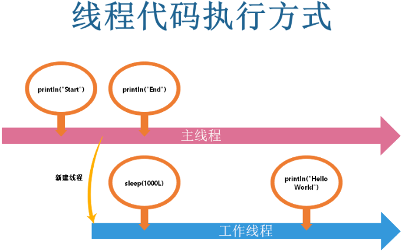
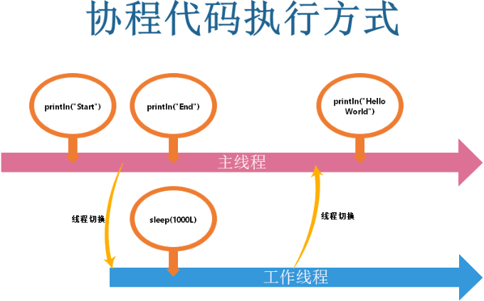
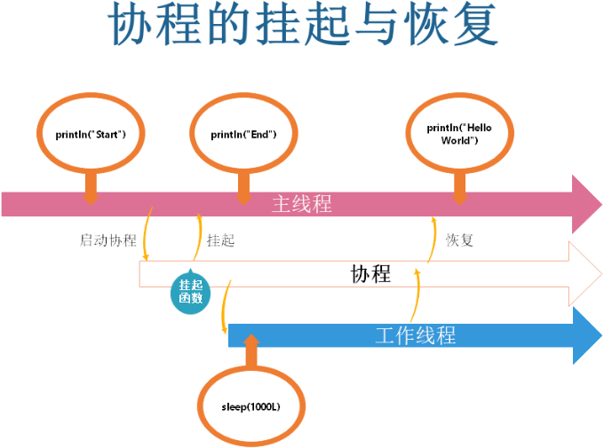
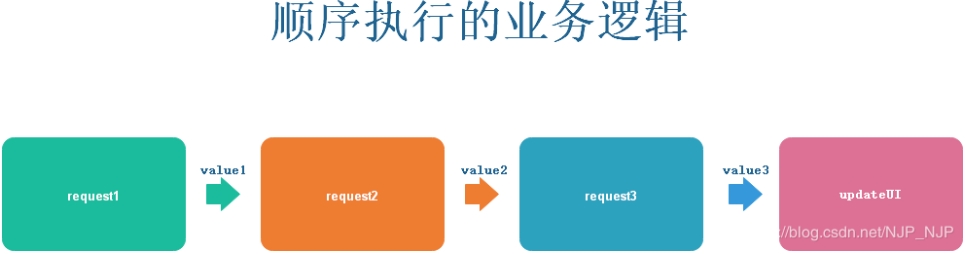
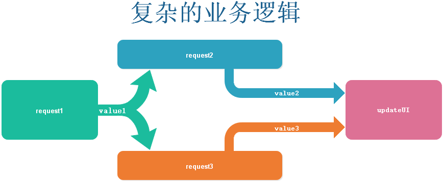
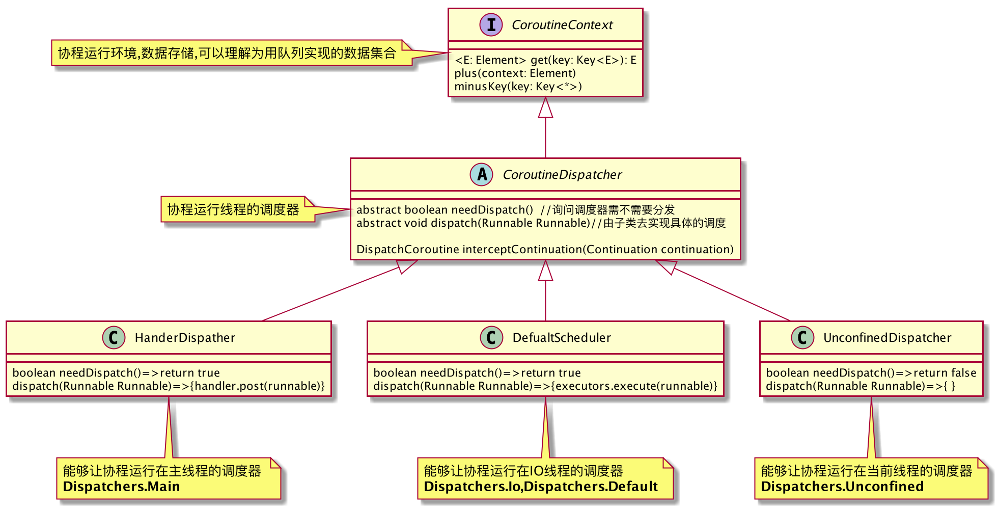
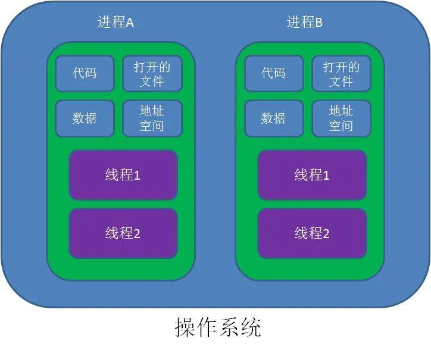
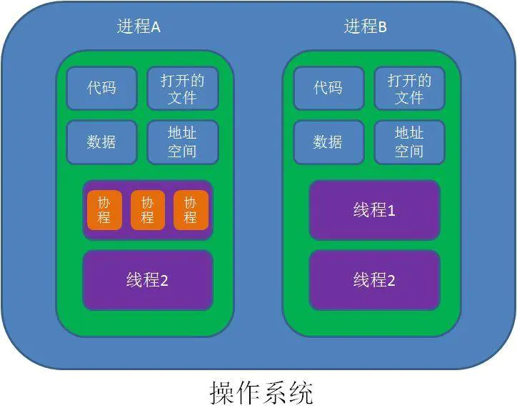

[toc]

# 协程
[参考文章](https://blog.csdn.net/c10wtiybq1ye3/article/details/103640848)

#  一、理解异步回调本质  


## 1.1 什么是异步

我记得小学二年级碰到过一个让我受益终身的数学题：
烧开水需要15分钟，洗碗需要5分钟，扫地需要5分钟，请问做完这三件事，总共需要几分钟？
从此我做什么事，都事先想想先后顺序，看看可不可以一并去做。
长大后才知道这就是异步的用法，它其实已经渗透到你的生活中。

**异步意味着同时进行一个以上彼此目的不同的任务。**

如果上面三个任务一个一个按部就班地去做的话，你可能总共需要25分钟。但是烧开水的时候并不需要你在一旁一直等待着，
如果你利用烧开水的时间去完成洗碗和扫地的任务，你只需要15分钟就可以完成以上三个任务

接着试着对着Android（或者其他任何UI开发框架）的线程模型类比一下：

你是主线程。烧开水是个耗时操作（比如网络请求），洗碗和扫地是与视图相关的非耗时操作。
洗碗和扫地必须由你本人亲自完成（视图相关的工作只能交给主线程），烧开水可以交给电磁炉完成，
你只需要按下电磁炉的开关（可以类比成网络请求的发起）

没有使用异步也就意味着你在烧开水的时候一直在旁边等待着，无法完成其他工作，这也就意味着Android在等待网络请求
的时候主线程阻塞，视图卡顿无法交互，这在Android中当然是不允许的。

所以必须使用异步的方式，你（主线程）在按下电磁炉开关（发起网络请求）之后就继续完成洗碗扫地（视图交互）等其他任务了。

所以异步很好理解，就是**同时进行着不同的任务就叫做异步**

## 1.2 为什么需要回调
当你按下电磁炉的按钮，并地利用这段时间完成了扫地的任务，你感到很有成就感。
心里想：异步机制真好，原来25分钟的工作如今只需要15分钟就能完成，以后我任何的工作都要异步地完成。

不过你并没有高兴太久，在洗碗时你遇到了麻烦。碗和盘子上沾满了油污，单靠自来水和洗洁精根本搞不定，这时你想到了
别人教你的方法，常温的水洗不掉的油污用热水就可以轻松洗掉。

但是你发现暖水瓶是空的，而放在电磁炉上的水刚烧了5分钟，还不够热，也就是说你必须等待水烧开了才能开始洗碗。

这时你不禁陷入了思考：异步机制真的是万能的吗？对于有前后依赖关系的任务，异步该如何处理呢？
这段等待烧水的时间我可以去做其他工作吗？我怎么确定水什么时候才能烧开呢？

这时，你眼前一亮：你发现了买水壶时赠送的一个配件，那是一个汽笛，它可以在水烧开的时候发出鸣叫声。
听到了汽笛声你就可以知道水烧开了，接着就可以用刚烧开的热水来刷碗，并且烧水的过程中你仍然可以去完成其他工作
（比如看技术博客），而不用担心烧水的问题。这个汽笛就可以看成异步中的回调机制

同样地我们来类比一下Android开发中的场景：

洗碗（渲染某个视图）依赖于烧开水（网络请求）这个耗时操作的结果才能进行，所以你（主线程）在按下电磁炉开关
（发起网络请求）的时候，为水壶装上了汽笛（为网络请求配置了回调），以便在水烧开（网络请求完成）的时候，
汽笛发出鸣叫（回调函数被调用）你（主线程）就可以继续用烧开的水（网络请求的结果）洗碗（渲染某个视图）了，
而等待水烧开（等待网络请求结果）的时候还可以去看技术博客（视图渲染与交互）

所以理解为什么需要回调也很简单：**因为不同的任务之间存在前后的依赖关系**


## 1.3 回调的缺点
以上的应用场景相对简单，回调处理起来也游刃有余，可以描述为以下代码：
```
boilWater(2000){ water ->
    washDishes(water)
}
```

但函数回调也有缺陷，就是代码结构过分耦合，遇到多重函数回调的嵌套，代码难以维护。
比如客户端顺序进行多次网络异步请求:

```
//客户端顺序进行三次网络异步请求，并用最终结果更新UI
request1(parameter) { value1 ->
    request2(value1) { value2 ->
        request3(value2) { value3 ->
            updateUI(value3)            
        } 
    }              
}
```

这种结构的代码无论是阅读起来还是维护起来都是极其糟糕的。对多个回调组成的嵌套耦合，
我亲切地称为“回调地狱（Callback Hell）”

解决回调地狱的方案有很多，其中比较常见的有：链式调用结构。例如：
```
request1(parameter)
    .map { value1 ->
         request2(value1)
       }.map { value2 ->
        request3(value2)
       }.subscribe { value3 ->
        updateUI(value3)
       }

```

我们可以链式调用结构中获得一些启发，虽然回调嵌套和链式调用在代码结构上完全不一样，但是其表达的东西完全一致。
也就是说**回调嵌套和链式调用者两种结构表达的都是同一种逻辑**，
这不禁让我们想对于回调的本质做一些深入思考，究竟回调的背后是什么东西呢？


## 1.4 深入理解异步回调（重点）
在接触多线程编程之前，我们天真地认为代码就是从上到下一行一行地执行的。代码中的基本结构只有三种：顺序、分支、循环，
顺序结构中写在上面的代码就是比写在下面的代码先执行，写在下面的代码就是要等到上面的代码执行完了才能得到执行。

但接触到了多线程和并发之后，我们之前在脑袋里建立的秩序的世界完全崩塌了，取而代之的是一个混沌的世界。
代码的执行顺序好像完全失控了，可能有多处的代码一起执行，写在下面的代码也可能先于上面的执行

举个简单的例子：
```
//1.简单秩序的串行世界：
print("Hello ")
print("World!")
//结果为：Hello World!
 
//2.复杂混沌的并行世界：
Thread { 
    Thread.sleep(2000)
    print("Hello ") 
}.start()
print("World!")

```

那么我们思考一下在串行的世界里，由回调组织起来的代码结构属于顺序、分支、循环哪种呢？
应该不难发现：烧完水再洗碗，网络请求成功再更新UI，**这些看似复杂的回调结构其实表达的就是一种代码的顺序执行的方式**

回过头来看看之前提到的回调嵌套的例子，如果放在简单的串行世界里代码其实完全可以写成这样：
```
val value1 = request1(parameter)
val value2 = request2(value1)
val value3 = request2(value2)
updateUI(value3)
```

上面代码的执行顺序与下面的回调方式组织代码的执行顺序完全相同：
```
request1(parameter) { value1 ->
    request2(value1) { value2 ->
        request3(value2) { value3 ->
            updateUI(value3)            
        } 
    }              
}
```
既然代码执行顺序完全一致为什么我们还要使用回调这么麻烦的方式来顺序执行代码呢？
原因就在于我们的世界不是简单的串行世界，实际的程序也不是只有一个线程那么简单的

**顺序代码结构是阻塞式的，每一行代码的执行都会使线程阻塞在那里**，但是主线程的阻塞会导致很严重的问题，
所以也就决定了所有的耗时操作不能在主线程中执行，所以就需要多线程来执行

对于上面的例子，虽然代码执行顺序是：request1 -> request2 -> request3 -> updateUI。
但是他们是有可能工作在不同的线程上的，比如：request1(work thread) -> request2(work thread) ->
request3(work thread) -> updateUI(main thread)

也就是说虽然代码确实是顺序执行的，但其实是在不同的线程上顺序执行的。

通常线程切换的工作是由异步函数内部完成的，通过回调的方式异步调用外界注入的代码。
也就是说：**异步回调其实就是代码的多线程顺序执行**

那么能不能既按照顺序的方式编写代码，又可以让代码在不同的线程顺序执行呢？
有没有一个东西可以帮助我自动地完成线程的切换工作呢？
答案当然是肯定的，接下来就轮到 Kotlin 协程大显身手的时候了。


# 二、协程初体验 

##  2..1 添加依赖
Kotlin 协程不属于 Kotlin 语言本身，使用之前必须手动引入。在 Android 平台上使用可以添加 Gradle 依赖
```
    //协程
    implementation "org.jetbrains.kotlinx:kotlinx-coroutines-android:$coroutines"
    implementation "androidx.lifecycle:lifecycle-viewmodel-ktx:$coroutinesKTX"  //ViewModelScope
    implementation "androidx.lifecycle:lifecycle-runtime-ktx:$coroutinesKTX"    //LifeCycleScope
    implementation "androidx.lifecycle:lifecycle-livedata-ktx:$coroutinesKTX"   //liveData
```

## 2.2 启动协程

```
GlobalScope.launch {
    delay(1000L)    
    println("Hello,World!")
}
```

接着来深入了解一下launch方法的声明：
```
public fun CoroutineScope.launch(    
    context: CoroutineContext = EmptyCoroutineContext,    
    start: CoroutineStart = CoroutineStart.DEFAULT,    
    block: suspend CoroutineScope.() -> Unit): Job {...}
```

可以看到 launch 方法是 CoroutineScope 的拓展方法，也就是说我们 **启动协程要在一个指定的 CoroutineScope 上来启动**。

CoroutineScope 翻译过来就是“协程范围”，指的是**协程内的代码运行的时间周期范围**，
如果超出了指定的协程范围，协程会被取消执行，
上面第一段代码中的 **GlobalScope 指的是与应用进程相同的协程范围**，也就是在进程没有结束之前协程内的代码都可以运行。

除此之外为了方便我们的使用，在 Google 的 Jetpack 中也提供了一些生命周期感知型协程范围。实际开发中我们可以方便
地选择适当的协程范围来为耗时操作（网络请求等）指定自动取消执行的时机，
详情见:https://developer.android.google.cn/topic/libraries/architecture/coroutines

接着可以看下 launch 方法的其他参数：

- context：协程上下文，可以指定协程运行的线程
  默认与指定的 CoroutineScope 中的 coroutineContext 保持一致，

   比如 GlobalScope 默认运行在一个后台工作线程内。也可以通过显示指定参数来更改协程运行的线程，

  

  Dispatchers 提供了几个值可以指定：
  Dispatchers.Default、
  Dispatchers.Main、
  Dispatchers.IO、
  Dispatchers.Unconfined

  

- start：协程的启动模式。默认的（也是最常用的）CoroutineStart.DEFAULT是指**协程立即执行**，
  除此之外还有
  CoroutineStart.LAZY、
  CoroutineStart.ATOMIC、
  CoroutineStart.UNDISPATCHED

  

- block：协程主体。也就是要在协程内部运行的代码，可以通过 lambda 表达式的方式方便的编写协程内运行的代码

- CoroutineExceptionHandler：除此之外还可以指定 CoroutineExceptionHandler 来处理协程内部的异常

- 返回值Job：对当前创建的协程的引用。可以通过 Job 的 start、cancel、join 等方法来控制协程的启动和取消。


## 2.3 调用挂起函数
```
//协程代码
println("Start ${Thread.currentThread().name}")
GlobalScope.launch(Dispatchers.Main) {
    delay(1000L)
    println("Hello World ${Thread.currentThread().name}")
}
println("End ${Thread.currentThread().name}")


//线程代码
println("Start ${Thread.currentThread().name}")
Thread {
    Thread.sleep(1000L)
    println("Hello World ${Thread.currentThread().name}")
}.start()
println("End ${Thread.currentThread().name}")

```

线程代码输出为：“Start main”->“End main”->“Hello World Thread-2”。
这个结果也很好理解，首先在主线程里输出"Start"，接着创建了一个新的线程并启动后阻塞一秒，
这时主线程继续向下执行输出"End"，这时启动的线程阻塞时间结束，在当前创建的线程输出"Hello World"。

协程代码输出为：“Start main”->“End main”->“Hello World main”。前两个输出很好理解与上面一致，
但是等待一秒之后协程里面的输出结果却显示当前输出的线程为主线程！

这是个很神奇的事情，输出"Start"之后就立即输出了"End"说明了我们的**主线程并没有被阻塞**，
等待的那一秒钟**被阻塞的一定是其他线程**。

但是阻塞结束后的输出却发生在主线程中，这说明了一件事：
**协程中的代码自动地切换到其他线程之后又自动地切换回了主线程！**这不正是我们一直想要的效果吗？






这个例子中 delay 和 println 两行代码紧密地写在协程之中，他们的执行也严格按照从上到下一行一行地顺序执行，
但是这两行的代码却运行在完全不同的两个线程中，
这就是我们想要的“既按照顺序的方式编写代码，又可以让代码在不同的线程顺序执行”的“顺序编写异步代码的效果”。
顺序编写保证了逻辑上的直观性，协程的自动线程切换又保证了代码的非阻塞性。

那为什么协程中的 delay 函数没有在主线程中执行呢？而且执行完毕为什么还会自动地切回主线程呢？
这是怎么做到的呢？我们可以来看一下delay函数的定义：

```
public suspend fun delay(timeMillis: Long) {...}
```

可以发现这个函数与正常的函数相比前面多了一个suspend关键字，这个关键字翻译过来就是“挂起”的意思，
**suspend关键字修饰的函数也就叫“挂起函数”**

关于挂起函数有个规定：
**挂起函数必须在协程或者其他挂起函数中被调用**，换句话说就是挂起函数必须直接或者间接地在协程中执行。

关于挂起的概念大家不要理解错了，**挂起的不是线程而是协程**。
遇到了挂起函数，协程所在的线程不会挂起也不会阻塞，但是协程被挂起了，
就是说**协程被挂起时当前协程与它所运行在的线程脱钩了**

**线程继续执行其他代码去了，而协程被挂起等待着，等待着将来线程继续回来执行自己的代码**。
也就是**协程中的代码对线程来说是非阻塞的，但是对协程自己本身来说是阻塞的**。
换句话说，**协程的挂起阻塞的不是线程而是协程**



所以说，**协程的挂起可以理解为协程中的代码离开协程所在线程的过程，协程的恢复可以理解为协程中的重新代码进入
协程所在线程的过程**
协程就是通过的这个挂起恢复机制进行线程的切换


## 2.4 线程切换

既然协程执行到了挂起函数会被挂起，那么是suspend关键字进行的线程切换吗？怎么指定切换到哪个线程呢？
对此我们可以做一个简单的试验：

```
  GlobalScope.launch(Dispatchers.Main) {
            println("coroutine run in thread ${Thread.currentThread().name}")
            test()
            println("coroutine finished ${Thread.currentThread().name}")
  }

 suspend fun test() {
        println("test ${Thread.currentThread().name}")
 }
```

执行结果为：Hello main -> World main -> End main，
也就是说这个 suspend 函数仍然运行在主线程中，suspend 并没有切换线程的作用


实际上我们可以 **withContext 方法来在 suspend 函数中进行线程的切换**：

```
GlobalScope.launch(Dispatchers.Main) {
    println("Hello ${Thread.currentThread().name}")    
    test()
    println("End ${Thread.currentThread().name}")
}
 
suspend fun test(){
   withContext(Dispatchers.IO){
        println("World ${Thread.currentThread().name}")
   }

```
执行的结果为：Hello main -> World DefaultDispatcher-worker-1 -> End main，
这说明我们的 suspend 函数的确运行在不同的线程之中了。
就是说实际是上 withContext 方法进行的线程切换的工作，那么suspend关键字有什么用处呢？

其实，忽略原理只从使用上来讲，suspend关键字只起到了**标志这个函数是一个耗时操作，必须放在协程中执行的作用**。
关于线程切换其实还有其他方法，但是withContext是最常用的一个  


## 2.5 顺序执行与并发执行
### 2.5.1 顺序执行
```
//客户端顺序进行三次网络异步请求，并用最终结果更新UI
request1(parameter) { value1 ->
    request2(value1) { value2 ->
        request3(value2) { value3 ->
            updateUI(value3)            
        } 
    }              
}
```




我们试着用刚刚学到的协程的方式来改进这个代码：

```
//用协程改造回调代码
GlobalScope.launch(Dispatchers.Main) {
    //三次请求顺序执行
    val value1 = request1(parameter)
    val value2 = request2(value1)
    val value3 = request2(value2)
    //用最终结果更新UI
    updateUI(value3)
}
 
//requestAPI适配了Kotlin协程
suspend fun request1(parameter : Parameter){...}
suspend fun request2(parameter : Parameter){...}
suspend fun request3(parameter : Parameter){...}
```

前提是request相关的API已经改造成了适应协程的方式，并在内部进行了线程切换

### 2.5.2 并发执行

那么接下来实现一些有挑战性的东西：
如果三次网络请求并不存在前后的依赖关系，也就是说三次请求要并发进行，但是最终更新UI要将三次请求的结果汇总才可以。
这样的需求如果没有RxJava或Kotlin协程这种强大的工具支持，单靠自己编码实现的确是一个痛苦的过程。


不过Kotlin协程提供了一种简单的方案：async await方法。

```
//并发请求
GlobalScope.launch(Dispatchers.Main) {
    //三次请求并发进行
    val value1 = async { request1(parameter1) }
    val value2 = async { request2(parameter2) }
    val value3 = async { request3(parameter3) }
    //所有结果全部返回后更新UI
    updateUI(value1.await(), value2.await(), value3.await())
}
 
//requestAPI适配了Kotlin协程
suspend fun request1(parameter : Parameter){...}
suspend fun request2(parameter : Parameter){...}
suspend fun request3(parameter : Parameter){...}

```

上面的代码中我们用async方法包裹执行了suspend方法，接着在用到结果的时候使用了await方法来获取请求结果，
这样三次请求就是并发进行的，而且三次请求的结果都返回之后就会切回主线程来更新UI


### 2.5.3 复杂业务逻辑

实际开发遇到了串行与并行混合的复杂业务逻辑，那么我们当然也可以混合使用上面介绍的方法来编写对应的代码。
比如这样的业务逻辑：request2和request3都依赖于request1的请求结果才能进行，request2和request3要并发进行，
更新UI依赖request2和request3的请求结果



```
//复杂业务逻辑的Kotlin协程实现
GlobalScope.launch(Dispatchers.Main) {
    //首先拿到request1的请求结果
    val value1 = request1(parameter1)
    //将request1的请求结果用于request2和request3两个请求的并发进行
    val value2 = async { request2(value1) }
    val value3 = async { request2(value1) }
    //用request2和request3两个请求结果更新UI
    updateUI(value2.await(), value3.await())
}
 
//requestAPI适配了Kotlin协程
suspend fun request1(parameter : Parameter){...}
suspend fun request2(parameter : Parameter){...}
suspend fun request3(parameter : Parameter){...}

```

怎么样？发现没有，无论怎样的复杂业务逻辑，用Kotlin协程表达出来始终是从上到下整齐排列的四行代码，
无任何耦合嵌套，有没有从中感受到Kotlin协程的这股化腐朽为神奇的神秘力量


# 三、深入了解协程


## 3.1 概述


协程就像非常轻量级的线程。线程是由系统调度的，线程切换或线程阻塞的开销都比较大。

而协程依赖于线程，但是协程挂起时不需要阻塞线程，几乎是无代价的，协程是由开发者控制的。

所以协程也像用户态的线程，非常轻量级，一个线程中可以创建任意个协程


协程的目的是为了**让多个任务之间更好的协作，解决异步回调嵌套。能够以同步的方式编排代码完成异步工作。**

将异步代码像同步代码一样直观。

同时它也是一个并发流程控制的解决方案。 

协程主要是**让原来要使用“异步+回调”写出来的复杂代码, 简化成看似同步写出来的方式**，弱化了线程的概念（对线程的操作进一步抽象）


## 3.2 相关方法

### 3.2.1 CoroutineContext

可以理解为协程的上下文，是一种 **key-value 数据结构**


|        Coroutine        |           List            |
| :---------------------: | :-----------------------: |
|    get(key : Key):E     |      get(int index)       |
| plus(context : Element) | add(int index, E element) |
| minusKey(key : Key<*>)  |     remove(E element)     |

### 3.2.2 CoroutineDispatcher

协程上下文包含一个 协程调度器
它确定了**相关的协程在哪个线程或哪些线程上执行**。
协程调度器可以将协程限制在一个特定的线程执行，或将它分派到一个线程池，亦或是让它不受限地运行。

所有的协程构建器诸如 launch 和 async 接收一个可选的 CoroutineContext 参数，
它可以被用来显式的为一个新协程或其它上下文元素指定一个调度器


当调用 launch { …… } 时不传参数，它从启动了它的 CoroutineScope 中承袭了上下文（以及调度器)





### 3.2.3 CoroutineScope

翻译过来就是“协程范围”，指的是**协程内的代码运行的时间周期范围**，如果超出了指定的协程范围，协程会被取消执行

- GlobalScope
指的是与应用进程相同的协程范围，也就是在进程没有结束之前协程内的代码都可以运行


-  ViewModelScope
为应用中的每个 ViewModel 定义了 ViewModelScope。
如果 ViewModel 已清除，则在此范围内启动的协程都会自动取消。如果您具有仅在 ViewModel 处于活动状态时才需要完成的工作，此时协程非常有用

- LifecycleScope
为每个 Lifecycle 对象定义了 LifecycleScope。在此范围内启动的协程会在 Lifecycle 被销毁时取消。
您可以通过 lifecycle.coroutineScope 或 lifecycleOwner.lifecycleScope 属性访问 Lifecycle 的 CoroutineScope

### 3.2.4 launch

CoroutineScope 的扩展方法，启动一个协程，不阻塞当前协程，并返回新协程的Job。

```
public fun CoroutineScope.launch(
    context: CoroutineContext = EmptyCoroutineContext,
    start: CoroutineStart = CoroutineStart.DEFAULT,
    block: suspend CoroutineScope.() -> Unit
): Job {
    val newContext = newCoroutineContext(context)
    val coroutine = if (start.isLazy)
        LazyStandaloneCoroutine(newContext, block) else
        StandaloneCoroutine(newContext, active = true)
    coroutine.start(start, coroutine, block)
    return coroutine
}

```


**启动协程不是只有launch一个方法的，还有async等其他方法可以启动协程**

### 3.2.5 async

CoroutineScope 的扩展方法，启动一个协程，不阻塞当前协程，
返回一个Deffer，除包装了未来的结果外，其余特性与launch{}一致

```
public fun <T> CoroutineScope.async(
    context: CoroutineContext = EmptyCoroutineContext,
    start: CoroutineStart = CoroutineStart.DEFAULT,
    block: suspend CoroutineScope.() -> T
): Deferred<T> {
    val newContext = newCoroutineContext(context)
    val coroutine = if (start.isLazy)
        LazyDeferredCoroutine(newContext, block) else
        DeferredCoroutine<T>(newContext, active = true)
    coroutine.start(start, coroutine, block)
    return coroutine
}
```

### 3.2.6 withContext

withContext 方法进行的**线程切换的工作**

一个 suspend 方法，在给定的上下文执行给定挂起块并返回结果，它**并不启动协程**，只会(可能会)导致线程的切换。
用它执行的挂起块中的上下文是当前协程的上下文和由它执行的上下文的合并结果。
withContext 的目的不在于启动子协程，它最初用于**将长耗时操作从UI线程切走，完事再切回来**

```
      GlobalScope.launch(Dispatchers.Main) {
            println("coroutine run in thread ${Thread.currentThread().name}")

            delay(1000) //这里是在其他线程执行的，并不会阻塞主线程
            println("coroutine finished ${Thread.currentThread().name}")  //这是在主线程执行
          
            //这里进行线程切换
            withContext(Dispatchers.IO) {
             println("coroutine run in thread ${Thread.currentThread().name}")
            }
        }
```


### 3.2.7 runBlocking

不是 GlobalScope 的 API，可以独立使用，区别是 runBlocking 里面的 delay 会阻塞线程，而 launch 创建的不会


### 3.2.8 suspend

suspend 关键字修饰的函数也就叫“挂起函数”。
关于挂起函数有个规定：**挂起函数必须在协程或者其他挂起函数中被调用**，
换句话说就是挂起函数必须直接或者间接地在协程中执行

关于挂起的概念大家不要理解错了，**挂起的不是线程而是协程**。
遇到了挂起函数，协程所在的线程不会挂起也不会阻塞，
但是协程被挂起了，就是说协程被挂起时当前协程与它所运行在的线程脱钩了
线程继续执行其他代码去了，而协程被挂起等待着，等待着将来线程继续回来执行自己的代码

也就是**协程中的代码对线程来说是非阻塞的，但是对协程自己本身来说是阻塞的**
换句话说，**协程的挂起阻塞的不是线程而是协程**

协程的挂起可以理解为协程中的代码离开协程所在线程的过程，
协程的恢复可以理解为协程中的重新代码进入协程所在线程的过程。
协程就是通过的这个挂起恢复机制进行线程的切换

### 3.2.9 delay

### 3.2.10 delay  VS   Thread.sleep


delay：不会暂停线程，但会暂停当前所在的协程

Thread.sleep：让线程休眠


## 3.3 挂起与恢复


被关键字 suspend 修饰的方法在编译阶段，编译器会修改方法的签名，包括返回值，修饰符，入参，方法体实现。

协程的挂起是靠挂起函数中实现的代码


**挂起和恢复的本质：return & callback 回调**


## 3.4 协程 VS 线程


- Thread

  线程拥有独立的栈、局部变量，基于进程的共享内存，因此数据共享比较容易，但是多线程时需要加锁来进行访问控制，不加锁就容易导致数据错误，但加锁过多又容易出现死锁。

  线程之间的调度由内核控制(时间片竞争机制)，程序员无法介入控制(`即便我们拥有sleep、yield这样的API，这些API只是看起来像，但本质还是交给内核去控制，我们最多就是加上几个条件控制罢了`)

  

  

  

- Coroutine

  协程是跑在线程上的优化产物，被称为轻量级 Thread，拥有自己的栈内存和局部变量，共享成员变量。传统 Thread 执行的核心是一个while(true) 的函数，本质就是一个耗时函数，Coroutine 可以用来直接标记方法，由程序员自己实现切换，调度，不再采用传统的时间段竞争机制。

  在一个线程上可以同时跑多个协程，同一时间只有一个协程被执行，在单线程上模拟多线程并发，协程何时运行，何时暂停，都是有程序员自己决定的

   

- 


