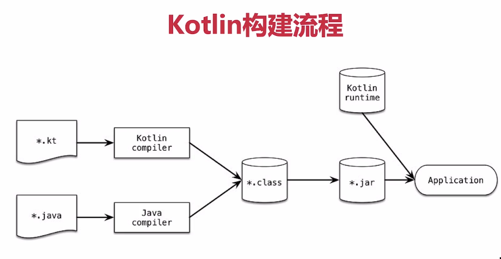

[toc]


# Kotlin 


# 一、Kotlin概述


## 1.1 Kotlin 为什么被设计出来

- 完全兼容Java
- 更少的空指针异常
- 更少的代码量，更快的开发速度


## 1.2   Kotlin构建流程




# 二、 基础

在 Kotlin 中，所有东西都是对象，在这个意义上讲我们可以**在任何变量上调用成员函数与属性**

## 2.1 基本数据类型

### 2.1.1 数值类型

类型   大小(比特数)    范围
Byte	8	        -128 ~ 127
Short	16          -32768 ~ 32767
Int	    32	        -2,147,483,648 (-231)	~  2,147,483,647 (231 - 1)
Long 	64	        -9,223,372,036,854,775,808 (-263)	~   9,223,372,036,854,775,807 (263 - 1)
    

类型	大小（比特数）	有效数字比特数	指数比特数	十进制位数
Float	  32	            24	          8	          6-7
Double	  64	            53	          11	      15-16

### 2.1.2 字符
字符用 Char 类型表示。它们**不能直接当作数字**
**字符不属于数值类型，它是一个独立的数据类型**


我们可以显式把字符转换为 Int 数字：      
```       
fun decimalDigitValue(c: Char): Int {
    if (c !in '0'..'9')
        throw IllegalArgumentException("Out of range")
    return c.toInt() - '0'.toInt() // 显式转换为数字
}
```

### 2.1.3 无符号整型
Kotlin 为无符号整数引入了以下类型：

- kotlin.UByte: 无符号 8 比特整数，范围是 0 到 255
- kotlin.UShort: 无符号 16 比特整数，范围是 0 到 65535
- kotlin.UInt: 无符号 32 比特整数，范围是 0 到 2^32 - 1
- kotlin.ULong: 无符号 64 比特整数，范围是 0 到 2^64 - 1


### 字面常量

数值常量字面值有以下几种:

- 二进制:    0b00001011
- 十进制：   123     Long 类型用大写 L 标记: 123L
- 十六进制： 0x0F

**注意: 不支持八进制**


每个数值类型支持如下的转换:

- toByte(): Byte
- toShort(): Short
- toInt(): Int
- toLong(): Long
- toFloat(): Float
- toDouble(): Double
- toChar(): Char


## 2.2 数组

数组在 Kotlin 中使用 Array 类来表示，
它定义了 get 与 set 函数（按照运算符重载约定这会转变为 []）以及 size 属性，以及一些其他有用的成员函数

我们可以使用库函数 arrayOf() 来创建一个数组并传递元素值给它，

例如： arrayOf(1, 2, 3) 创建了 array [1, 2, 3]
或者，库函数 arrayOfNulls() 可以用于创建一个指定大小的、所有元素都为空的数组。

另一个选项是用接受数组大小以及一个函数参数的 Array 构造函数，用作参数的函数能够返回给定索引的每个元素
初始值：
```
// 创建一个 Array<String> 初始化为 ["0", "1", "4", "9", "16"]
val asc = Array(5) { i -> (i * i).toString() }
asc.forEach { println(it) }
```

### 原生类型数组
Kotlin 也有无装箱开销的专门的类来表示原生类型数组: ByteArray、 ShortArray、IntArray 等等。

**这些类与 Array 并没有继承关系**，
但是它们有同样的方法属性集。它们也都有相应的工厂方法


## 2.3 集合


### 2.3.1 List

List 是一个有序集合。
可以通过索引访问元素，元素可以再List 中出现多次。

如果两个 List 在相同的位置具有相同大小和相同结构的元素，则认为它们是相等的

在 Kotlin 中，List 的默认实现是 ArrayList

### 2.3.2 Set

Set 是唯一元素集合。
它反映了集合(Set)的数学抽象：**一组无重复的对象**

null Set元素是唯一的：**一个 Set 只能包含一个 null**

当两个 set 具有相同的大小并且对于一个 set 中的每个元素都能在另一个 set 中存在相同元素，则两个 set 相等

Set的默认实现 - LinkedHashSet – 保留元素插入的顺序
另一种实现方式 – HashSet – 不声明元素的顺序，只需要较少的内存来存储相同数量的元素


### 2.3.2 Map

Map 是一组键值对。
键是唯一的，每个键对于一个值，值可以重复

Map<K, V> 不是 Collection 接口的继承者

无论键值对的顺序如何，包含相同键值对的两个 Map 是相等的。

Map 的默认实现 – LinkedHashMap – 迭代 Map 时保留元素插入的顺序。
反之，另一种实现 – HashMap – 不声明元素的顺序。


### 2.3.3 集合的可变性与不可变性

list
mutableList

set
mutableSet

map
mutableMap

只读集合类型是型变的。 
这意味着，如果类 Rectangle 继承自 Shape，则可以在需要 List <Shape> 的任何地方使用 List <Rectangle>。 
换句话说，集合类型与元素类型具有相同的子类型关系。
map 在值（value）类型上是型变的，但在键（key）类型上不是。

反之，可变集合不是型变的；否则将导致运行时故障。 
如果 MutableList <Rectangle> 是 MutableList <Shape> 的子类型，
你可以在其中插入其他 Shape 的继承者（例如，Circle），从而违反了它的 Rectangle 类型参数


### 2.3.4 集合相关问题

- 两个具有相同元素，但顺序不同的 list 相等吗，为什么
```
        //两个具有相同元素，但顺序不同的 list 相等吗，为什么
        val list1 = listOf(1, 2)
        val list2 = listOf(2, 1)

        println("list1 == list2 ${list1 == list2}") //false


        源码如下： AbstractMList#equals

         ListIterator<E> e1 = listIterator();
         ListIterator<?> e2 = ((List<?>) o).listIterator();
         while (e1.hasNext() && e2.hasNext()) {
            E o1 = e1.next();
            Object o2 = e2.next();
            if (!(o1==null ? o2==null : o1.equals(o2)))
                return false;
        }

```
 == 与 equals 效果相同
 equals 源码中是根据位置依次取出元素进行比较，与顺序有关
 所以结果是false


- 两个具有相同键值对，但顺序不同的map相等吗，为什么

 ```
       //两个具有相同键值对，但顺序不同的map相等吗，为什么
        val map1 = mapOf("key1" to 1, "key2" to 2)
        val map2 = mapOf("key2" to 2, "key1" to 1)

        println("map1 == map2 ${map1 == map2}")   //true

       

        源码如下： AbstractMap#equals

         while (i.hasNext()) {
                    Entry<K,V> e = i.next();
                    K key = e.getKey();
                    V value = e.getValue();
                    if (value == null) {
                        if (!(m.get(key)==null && m.containsKey(key)))
                            return false;
                    } else {
                        if (!value.equals(m.get(key)))
                            return false;
                    }
          }
     
        return true
 ```

 == 与 equals 效果相同
 equals 源码中是根据 key 和 value 进行判断是否相同的，与顺序无关

 所以问题的答案是相同


## 2.4 函数

### 2.4.1 函数

#### 函数的声明
```
fun double(x: Int): Int {
    return 2 * x
}
```


#### 可变数量的参数（Varargs）
```
fun <T> asList(vararg ts: T): List<T> {
    val result = ArrayList<T>()
    for (t in ts)    // ts is an Array
        result.add(t)
    return result
}

//允许将可变数量的参数传递给函数：
val list = asList(1, 2, 3)

//当我们调用 vararg-函数时，我们可以一个接一个地传参
val list = asList(1, 2, 3)

//如果我们已经有一个数组并希望将其内容传给该函数，我们使用伸展（spread）操作符（在数组前面加 *）
val a = arrayOf(1, 2, 3)
val list = asList(-1, 0, *a, 4)
```

在函数内部，类型 T 的 vararg 参数的可见方式是作为 T 数组，即上例中的 ts 变量具有类型 Array <out T>

如果我们已经有一个数组并希望将其内容传给该函数，**我们使用伸展（spread）操作符（在数组前面加 *）**


#### 中缀表示法
标有 infix 关键字的函数也可以使用中缀表示法（忽略该调用的点与圆括号）调用。

中缀函数必须满足以下要求：
- 它们必须是成员函数或扩展函数；
- 它们必须只有一个参数；
- 其参数不得接受可变数量的参数且不能有默认值。

```
infix fun Int.shl(x: Int): Int { …… }

// 用中缀表示法调用该函数
1 shl 2

// 等同于这样
1.shl(2)
```

中缀函数调用的优先级低于算术操作符、类型转换以及 rangeTo 操作符
1 shl 2 + 3           等价于   1 shl (2 + 3)
0 until n * 2         等价于   0 until (n * 2)
xs union ys as Set<*> 等价于   xs union (ys as Set<*>)

中缀函数调用的优先级高于布尔操作符 && 与 ||、is- 与 in- 检测以及其他一些操作符
a && b xor c 等价于 a && (b xor c)
a xor b in c 等价于 (a xor b) in c


### 2.4.2 高阶函数与 lambda 表达式

Kotlin 函数都是头等的，
这意味着**它们可以存储在变量与数据结构中、作为参数传递给其他高阶函数以及从其他高阶函数返回**。
可以像操作任何其他非函数值一样操作函数


#### 高阶函数

高阶函数是将函数用作参数或返回值的函数。

```
fun <T, R> Collection<T>.fold(
    initial: R, 
    combine: (acc: R, nextElement: T) -> R
): R {
    var accumulator: R = initial
    for (element: T in this) {
        accumulator = combine(accumulator, element)
    }
    return accumulator
}
```
参数 combine 具有函数类型 (R, T) -> R，因此 fold 接受一个函数作为参数， 
该函数接受类型分别为 R 与 T 的两个参数并返回一个 R 类型的值。
在 for-循环内部调用该函数，然后将其返回值赋值给 accumulator。


#### 函数类型

函数类型既可定义变量，也可用作函数形参类型，还可作为函数的返回值类型

```
fun func_one(a: Int, str: String) : String {
    //TODO
}
//函数类型为(Int, String) -> String

fun func_two(a: Int, str: String) {
    //TODO
}
//函数类型为(Int, String) -> Unit 或者 (Int, String)
```


Kotlin 使用类似 `(Int) -> String` 的一系列函数类型来处理函数的声明： `val onClick: () -> Unit = ……`。

这些类型具有与函数签名相对应的特殊表示法，即它们的参数和返回值：

- 所有函数类型都有一个圆括号括起来的**参数类型列表**以及**一个返回类型**：
  (A, B) -> C 表示接受类型分别为 A 与 B 两个参数并返回一个 C 类型值的函数类型。
  参数类型列表可以为空，如 () -> A。
  Unit 返回类型不可省略

- 函数类型可以有一个额外的接收者类型，它在表示法中的点之前指定：
  类型 A.(B) -> C 表示可以在 A 的接收者对象上以一个 B 类型参数来调用并返回一个 C 类型值的函数。 
  带有接收者的函数字面值通常与这些类型一起使用    

- 挂起函数属于特殊种类的函数类型，它的表示法中有一个 suspend 修饰符 
  例如 suspend () -> Unit 或者 suspend A.(B) -> C

  

#### 函数类型实例化 

有几种方法可以获得函数类型的实例：

- 使用函数字面值的代码块
 1. lambda 表达式: { a, b -> a + b }
 2. 匿名函数: fun(s: String): Int { return s.toIntOrNull() ?: 0 }

- 使用已有声明的可调用引用：
 1. 顶层、局部、成员、扩展函数： ::isOdd、 String::toInt，
 2. 顶层、成员、扩展属性： List<Int>::size
 3. 构造函数： ::Regex

- 使用实现函数类型接口的自定义类的实例
```
class IntTransformer: (Int) -> Int {
    override operator fun invoke(x: Int): Int = TODO()
}

val intFunction: (Int) -> Int = IntTransformer()
```


#### 函数类型实例调用
函数类型的值可以通过其 invoke(……) 操作符调用：f.invoke(x) 或者直接 f(x)。

如果该值具有接收者类型，那么应该将接收者对象作为第一个参数传递。 
调用带有接收者的函数类型值的另一个方式是在其前面加上接收者对象， 就好比该值是一个扩展函数：1.foo(2)

```
val stringPlus: (String, String) -> String = String::plus
val intPlus: Int.(Int) -> Int = Int::plus

println(stringPlus.invoke("<-", "->"))
println(stringPlus("Hello, ", "world!")) 

println(intPlus.invoke(1, 1))
println(intPlus(1, 2))
println(2.intPlus(3)) // 类扩展调用

```

#### Lambda 表达式

lambda 表达式与匿名函数是“**函数字面值**”，即**未声明的函数**， 但立即做为表达式传递

Lambda 表达式语法:
```
val sum: (Int, Int) -> Int = { x: Int, y: Int -> x + y }

//简洁的写法
val sum = { x: Int, y: Int -> x + y }
```

在 Kotlin 中有一个约定：
**如果函数的最后一个参数是函数，那么作为相应参数传入的 lambda 表达式可以放在圆括号之外**
这种语法也称为拖尾 lambda 表达式。

```
val product = items.fold(1) { acc, e -> acc * e }
```

如果该 lambda 表达式是调用时唯一的参数，那么圆括号可以完全省略
```
run { println("...") }
```


#### 匿名函数

上面提供的 lambda 表达式语法缺少的一个东西是**指定函数的返回类型**的能力。

在大多数情况下，这是不必要的。因为返回类型可以自动推断出来。

然而，如果确实需要显式指定，可以使用另一种语法： *匿名函数* 

匿名函数看起来非常像一个常规函数声明，除了其名称省略了。
其函数体可以是表达式或代码块：

```
fun(x: Int, y: Int): Int = x + y

fun(x: Int, y: Int): Int {
    return x + y
}
```

匿名函数参数总是在括号内传递
允许将函数留在圆括号外的简写语法仅适用于 lambda 表达式


#### 闭包

闭包（Closure）的概念总是存在于各种支持函数式编程的语言中。

首先理解什么是闭包，这里取JavaScript文档中对闭包的定义

> 函数和对其周围状态（lexical environment，词法环境）的引用捆绑在一起构成闭包

其中包括两个要点：

- 函数
- 周围环境（状态 & 上下文）

函数在Kotlin中主要包括三种形式：普通的具名函数，匿名函数，lambda表达式

周围环境可以理解为**函数所处的外部作用域中定义的各个自由变量**，这个作用域可能是另一个函数或块级作用域

二者捆绑在一起构成的闭包使得**函数内部可以对外部作用域定义的变量进行访问**


**闭包就是能够读取其他函数内部变量的函数**
闭包有两个作用

1. 可以读取函数内部的变量
2. 让这些变量的值始终保持在内存中


```
//定义一个函数，返回值是函数类型  () -> Unit
fun count(): () -> Unit {
        var count = 0
        return {
            println(count++)   //lambda表达式中能够访问到父函数中的变量count
        }
 }

fun main(args: Array<String>) {
    val method = count()
    method()  // 输出结果：0
    method()  // 输出结果：1
    method()  // 输出结果：2
}

```

闭包就是在函数被创建的时候，存在的一个私有作用域，并且能够访问所有的父级作用域


#### 带有接收者的函数字面值

带有接收者的函数类型，例如 `A.(B) -> C`，可以用特殊形式的函数字面值实例化—— 带有接收者的函数字面值。

Kotlin 提供了调用带有接收者（提供*接收者对象*）的函数类型实例的能力.

在这样的函数字面值内部，传给调用的接收者对象成为隐式的this，以便访问接收者对象的成员而无需任何额外的限定符，亦可使用`this` 表达式访问接收者对象。

这种行为与扩展函数类似，扩展函数也允许在函数体内部访问接收者对象的成员。

这里有一个带有接收者的函数字面值及其类型的示例，其中在接收者对象上调用了 `plus` ：

```
val sum: Int.(Int) -> Int = { other -> this.plus(other) }
//调用
1.sum(2)
sum(1,2)


//与此相同功能的写法是
val sum2: (Int, Int) -> Int = { a, b -> a.plus(b) }
sum2(1, 2)

```

​          

匿名函数语法允许你直接指定函数字面值的接收者类型。

如果你需要使用带接收者的函数类型声明一个变量，并在之后使用它，这将非常有用。

```
   val sum = fun Int.(other: Int): Int {
            return this.plus(other)
   }
```


### 2.4.3 内联函数


#### 内联函数

使用高阶函数会带来一些运行时的效率损失：
**每一个函数都是一个对象，并且会捕获一个闭包，即那些在函数体内会访问到的变量**
内存分配（对于函数对象和类）和虚拟调用会引入运行时间开销。

使用`lambda`表达式时，它会被正常地编译成匿名类,这表示每调用一次`lambda`表达式，一个额外的类就会被创建

如果`lambda`捕捉了某个变量，那么每次调用的时候都会创建一个新的对象


在许多情况下通过内联化 lambda 表达式可以消除这类的开销：

使用`inline`修饰符标记一个函数，在函数被调用的时候编译器并**不会生成函数调用的代码**，

而是 **使用函数实现的真实代码替换每一次的函数调用**

下面是我们定义的一个内联的函数：

```
inline fun inlineFunc(prefix : String, action : () -> Unit) {
    println("call before $prefix")
    action()
    println("call after $prefix")
}
```

我们用如下的方法来使用这个内联函数：

```
fun main(args: Array<String>) {
    inlineFunc("inlineFunc") {
        println("HaHa")
    }
}
```

运行结果为：

```
>> call before inlineFunc
>> HaHa
>> call after inlineFunc
```

最终它会被编译成下面的字节码：s

```
fun main(args: Array<String>) {
    println("call before inlineFunc")
    println("HaHa")
    println("call after inlineFunc")
}
```

`lambda`表达式和`inlineFunc`的实现部分都被内联了，由`lambda`生成的字节码成了函数调用者定义的一部分，

而不是被包含在一个实现了函数接口的匿名类中


**inline 修饰符影响函数本身和传给它的 lambda 表达式：所有这些都将内联到调用处**


#### 禁用内联

如果希望只内联一部分传给内联函数的 lambda 表达式参数，那么可以用 noinline 修饰符标记不希望内联的函数参数：
```
inline fun foo(inlined: () -> Unit, noinline notInlined: () -> Unit) { …… }
```


### 2.4.4 扩展函数


Kotlin 能够扩展一个类的新功能而无需继承该类或者使用像装饰者这样的设计模式。 

此外，也有扩展属性 ， 允许你为一个已经存在的类添加新的属性


#### 扩展函数

声明一个扩展函数，我们需要用一个接收者类型也就是被扩展的类型来作为他的前缀

```
//扩展函数定义
fun TextView.isBold() = this.apply { 
	paint.isFakeBoldText = true
}

//扩展函数调用
activity.find<TextView>(R.id.course_comment_tv_score).isBold()
```

这个 *this* 关键字在扩展函数内部对应到接收者对象（传过来的在点符号前的对象)


#### 扩展函数实质原理

扩展函数实际上就是一个对应Java中的静态函数，这个静态函数参数为接收者类型的对象，

然后利用这个对象就可以访问这个类中的成员属性和方法了，并且最后返回一个这个接收者类型对象本身

```
public final class ExtendsionTextViewKt {   
    //扩展函数isBold对应实际上是Java中的静态函数，并且传入一个接收者类型对象作为参数    
   @NotNull
   public static final TextView isBold(@NotNull TextView $receiver) { 
      Intrinsics.checkParameterIsNotNull($receiver, "$receiver");
      $receiver.getPaint().setFakeBoldText(true);//设置加粗
      return $receiver;//最后返回这个接收者对象自身，以致于我们在Kotlin中完全可以使用this替代接收者对象或者直接不写。
   }
}
```

#### 扩展属性

```
val <T> List<T>.lastIndex: Int
    get() = size - 1
```


## 2.5 类与对象


### 2.5.1 类


#### 数据类

```
data class User(val name: String, val age: Int)
```

编译器自动从主构造函数中声明的所有属性导出以下成员：

- `equals()`/`hashCode()` 对
- `toString()` 格式是 `"User(name=John, age=42)"
- componentN() 函数 按声明顺序对应于所有属性
- `copy()` 函数


#### 枚举类

枚举类的最基本的用法是实现类型安全的枚举：

```
enum class Direction {
    NORTH, SOUTH, WEST, EAST
}
```

每个枚举常量都是一个对象。枚举常量用逗号分隔


#### 密封类

密封类用来表示**受限的类继承结构**：当一个值为有限几种的类型、而不能有任何其他类型时

在某种意义上，他们是枚举类的扩展：

枚举类型的值集合也是受限的，但每个枚举常量只存在一个实例，

而 **密封类的一个子类可以有可包含状态的多个实例**

也可以说成，密封类是包含了一组受限的类集合，因为里面的类都是继承自这个密封类的。

但是其和其他继承类（`open`）的区别在，**密封类可以不被此文件外被继承，有效保护代码**


要声明一个密封类，需要在类名前面添加 `sealed` 修饰符。

- 一个密封类是自身抽象的，它不能直接实例化并可以有抽象（*abstract*）成员
- 密封类不允许有非private构造函数（其构造函数默认为 *private*）

虽然密封类也可以有子类，但是所有子类都必须在与密封类自身相同的文件中声明

```
sealed class Result<out T : Any> {

    data class SUCCESS<out T : Any>(val data: T) : Result<T>()

    data class LOADING<out T : Any>(val msg: String) : Result<T>()

    data class FAILURE<out T : Any>(val code: Int, val msg: String) : Result<T>()

    data class ERROR<out T : Any>(val code: Int, val msg: String) : Result<T>()
}
```

注意：**密封类是不能被实例化的**


密封类和普通继承类的区别：

- 普通的继承类使用`open`关键字定义，在项目中的类都可继承自该类
- 封类的子类必须是在密封类的内部或必须存在于密封类的同一文件


密封类和枚举类的区别：

- 枚举类的中的每一个枚举常量都只能存在一个实例
- 密封类的子类可以存在多个实例


### 2.5.2 接口


#### 函数式（SAM）接口

只有一个抽象方法的接口称为**函数式接口**或 **SAM（单一抽象方法**接口

```
fun interface IntPredicate {
   fun accept(i: Int): Boolean
}
```

#### SAM 转换

对于函数式接口，可以通过 [lambda 表达式](https://www.kotlincn.net/docs/reference/lambdas.html#lambda-expressions-and-anonymous-functions)实现 SAM 转换，从而使代码更简洁、更有可读性

**使用 lambda 表达式可以替代手动创建实现函数式接口的类**

如果不使用 SAM 转换，那么你需要像这样编写代码：

```
// 创建一个类的实例
val isEven = object : IntPredicate {
   override fun accept(i: Int): Boolean {
       return i % 2 == 0
   }
}
```

通过利用 Kotlin 的 SAM 转换，可以改为以下等效代码：

```
// 通过 lambda 表达式创建一个实例
val isEven = IntPredicate { it % 2 == 0 }
```


### 2.5.3 属性

#### 声明属性

Kotlin 类中的属性既可以用关键字 *var* 声明为可变的，也可以用关键字 *val* 声明为只读的


#### Getters 与 Setters

声明一个属性的完整语法是：

> var <propertyName>[: <PropertyType>] [= <property_initializer>]
>     [<getter>]
>     [<setter>]


自定义Getters 与 Setters：

```
  var notNullString: String? = null
        get() {
            return field ?: ""
        }
        set(value) {
            field = value
        }
```

当一个属性需要一个幕后字段时，Kotlin 会自动提供

这个幕后字段使用`field`标识符在访问器中引用


## 2.6 位运算

对于位运算，没有特殊字符来表示，而只可用中缀方式调用具名函数，例如:

```
val x = (1 shl 2) and 0x000FF000
```

这是完整的位运算列表（只用于 Int 与 Long）：


|    方法    |    含义    |
| :--------: | :--------: |
|   bits)    | 有符号左移 |
| shr(bits)  | 有符号右移 |
| ushr(bits) | 无符号右移 |
| and(bits)  |    位与    |
|  or(bits)  |    位或    |
| xor(bits)  |   位异或   |
|   inv()    |    位非    |
|            |            |


## 2.7 跳转表达式

Kotlin 有三种结构化跳转表达式：

- return。默认从最直接包围它的**函数或者匿名函数**返回
- break。终止最直接包围它的循环。
- continue。继续下一次最直接包围它的循环。 

### Break 与 Continue 标签

在 Kotlin 中任何表达式都可以用标签（label）来标记。 
标签的格式为标识符后跟 @ 符号，例如：abc@、fooBar@都是有效的标签

要为一个表达式加标签，我们只要在其前加标签即可:
```
loop@ for (i in 1..100) {
    // ……
}
```

现在，我们可以用标签限制 break 或者continue：
```
        loop@ for (i in 0 until 4) {
            println("i = $i")

            for (j in 10 until 20) {
                println("j = $j")
                if (j == 12) {
                    break         //只有直接包围它的循环会中断，外层循环继续运行
                    break@loop   // 从标记处中断
                }
            }
       }
```

### 返回到标签

Kotlin 有函数字面量、局部函数和对象表达式。因此 Kotlin 的函数可以被嵌套。
标签限制的 return 允许我们从外层函数返回。 最重要的一个用途就是从 lambda 表达式中返回

```

fun foo() {
    listOf(1, 2, 3, 4, 5).forEach {
        if (it == 3) return    // 非局部直接返回到 foo() 的调用者
        print(it)
    }
    println("this point is unreachable")
}
```
这个 return 表达式从最直接包围它的函数即 foo 中返回。
**如果我们需要从 lambda 表达式中返回，我们必须给它加标签并用以限制 return**

```

fun foo() {
    listOf(1, 2, 3, 4, 5).forEach lit@{
        if (it == 3) return@lit // 局部返回到该 lambda 表达式的调用者，即 forEach 循环
        print(it)
    }
    print(" done with explicit label")
}
```

现在，它只会从 lambda 表达式中返回。
**通常情况下使用隐式标签更方便。 该标签与接受该 lambda 的函数同名**

```
fun foo() {
    listOf(1, 2, 3, 4, 5).forEach {
        if (it == 3) return@forEach // 局部返回到该 lambda 表达式的调用者，即 forEach 循环
        print(it)
    }
    print(" done with implicit label")
}
```

注意：
return@forEach  // 局部返回到该 lambda 表达式的调用者，即 forEach 循环，
**这时forEach还是会继续进行下一次循环的**


# 三、进阶

## 3.1 泛型

与 Java 类似，Kotlin 中的类也可以有类型参数：
```
class Box<T>(t: T) {
    var value = t
}
```

### 型变

Java 类型系统中最棘手的部分之一是通配符类型,而 Kotlin 中没有。
相反，它有两个其他的东西：
声明处型变（declaration-site variance）与类型投影（type projections）

首先，让我们思考为什么 Java 需要那些神秘的通配符.在 《Effective Java》第三版 解释了该问题——第 31 条：
利用有限制通配符来提升 API 的灵活性。 

**Java 中的泛型是不型变的**，这意味着 List<String> 并不是List<Object> 的子类型, 
为什么这样？ 如果 List 不是不型变的，它就没比 Java 的数组好到哪去，因为如下代码会通过编译然后导致运行时异常：

```
// Java
List<String> strs = new ArrayList<String>();
List<Object> objs = strs; // ！！！此处的编译器错误让我们避免了之后的运行时异常
objs.add(1); // 这里我们把一个整数放入一个字符串列表
String s = strs.get(0); // ！！！ ClassCastException：无法将整数转换为字符串

```
因此，Java 禁止这样的事情以保证运行时的安全。但这样会有一些影响。
例如，考虑 Collection 接口中的 addAll() 方法。该方法的签名应该是什么？直觉上，我们会这样:
```
// Java
interface Collection<E> …… {
  void addAll(Collection<E> items);
}
```

但随后，我们就无法做到以下简单的事情（这是完全安全）：
```
// Java
void copyAll(Collection<Object> to, Collection<String> from) {
  to.addAll(from);
  // ！！！对于这种简单声明的 addAll 将不能编译：
  // Collection<String> 不是 Collection<Object> 的子类型
}
```

这就是为什么 addAll() 的实际签名是以下这样：
```
// Java
interface Collection<E> …… {
  void addAll(Collection<? extends E> items);
}
```

**通配符类型参数 ? extends E 表示此方法接受 E 或者 E 的一些子类型对象的集合，而不只是 E 自身**。
这意味着我们可以安全地从其中（该集合中的元素是 E 的子类的实例）读取 E，但不能写入， 因为我们不知道什么对
象符合那个未知的 E 的子类型。 反过来，该限制可以让Collection<String>表示为Collection<? extends Object>
的子类型。

简而言之，**带 extends 限定（上界）的通配符类型使得类型是协变的（covariant）**。

理解为什么这个技巧能够工作的关键相当简单：
如果只能从集合中获取元素，那么使用 String 的集合， 并且从其中读取 Object 也没问题 。
反过来，如果只能向集合中 放入 元素，就可以用 Object 集合并向其中放入 String：
在 Java 中有 List<? super String> 是 List<Object> 的一个超类。

后者称为逆变性（contravariance），并且对于 List <? super String> 你只能调用接受 String 作为参数的方法 
（例如，你可以调用 add(String) 或者 set(int, String)），当然如果调用函数返回 List<T> 中的 T，你得到的并
非一个 String 而是一个 Object。


## 3.2 委托


### 委托模式 （Delegate）

在委托模式中，有两个对象参与处理同一个请求，**接受请求的对象** 将请求委托给 **另一个对象** 来处理

原理：

类B和类A是两个互相没有任何关系的类，但是B具有和A一模一样的方法和属性；

并且调用B中的方法/属性就是调用A中同名的方法和属性

类B好像就是一个受A授权委托的中介，第三方的代码不需要知道A的存在，也不需要和A发生直接的联系，

通过B就可以直接使用A的功能，这样既能够使用到A的各种功能，又能够很好的将A保护起来。

简单的Java例子：

```java
  class Printer { // the "delegator"  委托者
     RealPrinter p = new RealPrinter(); // create the delegate 
     void print() { 
       p.print(); // delegation
     } 
 }
 
 class RealPrinter {    // the "delegate" 被委托者
     void print() { 
       System.out.print("something"); 
     }
 }
 
 public class Main {
     // to the outside world it looks like Printer actually prints.
     public static void main(String[] args) {
         Printer printer = new Printer();
         printer.print();
     }
 }
```

在这个例子里，类模拟打印机Printer拥有针式打印机RealPrinter的实例，Printer拥有的方法print()将处理转交给RealPrinter的方法print()


复杂的Java例子：

```java
interface I {
    void f();
    void g();
}

class A implements I {
    public void f() {
        System.out.println("A: doing f()");
    }
    public void g() {
        System.out.println("A: doing g()");
    }
}

class B implements I {
    public void f() {
        System.out.println("B: doing f()");
    }
    public void g() {
        System.out.println("B: doing g()");
    }
}

class C implements I {
    I i = new A();
    public void f() {
        i.f();
    }
    public void g() {
        i.g();
    }
    public void toA() {
        i = new A();
    }
    public void toB() {
        i = new B();
    }
}

public class Main {
    public static void main(String[] args) {
        C c = new C();
        c.f();      // output: A: doing f()
        c.g();      // output: A: doing g()
        c.toB();    // 更换委托对象
        c.f();      // output: B: doing f()
        c.g();      // output: B: doing g()
    }
}
```


在这个例子里，

类别C可以委托类别A或类别B，类别C拥有方法使自己可以在类别A或类别B间选择。

因为类别A或类别B必须实现接口I规定的方法，所以在这里委托是类型安全


###  由委托实现

委托模式已经证明是实现继承的一个很好的替代方式， 而 Kotlin 可以零样板代码地原生支持它

Derived 类可以通过将其所有公有成员都 **委托** 给指定对象来 **实现一个接口** : Base

```kotlin
   interface Base {
        fun println()
    }

    class BaseIml(val x: Int) : Base {
        override fun println() {
            println("$x")
        }
    }

    class Derived(b: Base) : Base by b

    @JvmStatic
    fun main(arg: Array<String>) {
        val baseIml = BaseIml(5)
        Derived(baseIml).println()
    }
```

`Derived` 的超类型列表中的 *by* 子句表示  **b 将会在 `Derived` 中内部存储**， 并且编译器将生成转发给 `b` 的所有 `Base` 的方法


### 覆盖由委托实现的接口成员

编译器会使用 `override` 覆盖的实现而不是委托对象中的

```kotlin
interface Base {
    fun printMessage()
    fun printMessageLine()
}

class BaseImpl(val x: Int) : Base {
    override fun printMessage() { print(x) }
    override fun printMessageLine() { println(x) }
}

class Derived(b: Base) : Base by b {
    override fun printMessage() { print("abc") }  //重写了委托对象中的printMessage
}

fun main() {
    val b = BaseImpl(10)
    Derived(b).printMessage()   //这里会输出 abc
    Derived(b).printMessageLine()  
}
```


### 委托的本质

将上面的代码转为Java代码：

```
  public static final class Derived implements Test.Base {
      // $FF: synthetic field
      private final Test.Base $$delegate_0;

      public void printMessage() {
         String var1 = "abc";
         boolean var2 = false;
         System.out.print(var1);
      }

      public Derived(@NotNull Test.Base b) {
         Intrinsics.checkNotNullParameter(b, "b");
         super();
         this.$$delegate_0 = b;
      }

      public void printMessageLine() {
         this.$$delegate_0.printMessageLine();
      }
   }
```

可以看到，类Derived中存在一个变量 Test.Base $$delegate_0


### 委托属性


语法：

> val/var <属性名>: <类型> by <表达式>

在 *by* 后面的表达式是该 *委托*， 属性对应的 `get()`（与 `set()`）会被委托给它的 `getValue()` 与 `setValue()` 方法。

 属性的委托不必实现任何的接口，但是需要提供一个 `getValue()` 函数（与 `setValue()`——对于 *var* 属性）

```
   var number: String by Delegate()

    class Delegate {
        operator fun getValue(thisRef: Test, property: KProperty<*>): String {
            return "$thisRef, thank you for delegating '${property.name}' to me"
        }

        operator fun setValue(thisRef: Test, property: KProperty<*>, value: String) {
            println("$value has been assigned to '${property.name}' in $thisRef.")
        }
    }

    @JvmStatic
    fun main(arg: Array<String>) {
        println(number)
        number = "abc"
    }
```


### 标准委托

#### 延迟属性 Lazy

lazy() 是接受一个 lambda 并返回一个 `Lazy <T>` 实例的函数，返回的实例可以作为实现延迟属性的委托：

 第一次调用 `get()` 会执行已传递给 `lazy()` 的 lambda 表达式并记录结果， 后续调用 `get()` 只是返回记录的结果

```
val lazyValue: String by lazy {
    println("computed!")
    "Hello"
}

fun main() {
    println(lazyValue)
    println(lazyValue)
}
```


## 3.3  作用域函数  Scope Functions

[作用域函数官方介绍](https://kotlinlang.org/docs/reference/scope-functions.html#let)
[精通Kotlin标准函数](https://blog.csdn.net/qq_18242391/article/details/81068906)

作用域函数不提供任何新的技术，它只是让代码变得更简洁、可读


| 函数  | 对象引用 |     返回值     |         是否是扩展函数         |
| :---: | :------: | :------------: | :----------------------------: |
|  let  |    it    | Lambda result  |               是               |
|  run  |   this   | Lambda result  |               是               |
|  run  |    无    | Lambda result  |       否，调用时无需对象       |
| with  |   this   | Lambda result  | 否，调用时需要一个对象作为入参 |
| apply |   this   | Context object |               是               |
| also  |    it    | Context object |               是               |


### let

```
public inline fun <T, R> T.let(block: (T) -> R): R {
    contract {
        callsInPlace(block, InvocationKind.EXACTLY_ONCE)
    }
    return block(this)
}

//调用
"hello".let {
	println(it)
}
```


### run

```
public inline fun <T, R> T.run(block: T.() -> R): R {
    contract {
        callsInPlace(block, InvocationKind.EXACTLY_ONCE)
    }
    return block()
}

//调用
 "hello".run {
    println(this)
}
```


### run

```
public inline fun <R> run(block: () -> R): R {
    contract {
        callsInPlace(block, InvocationKind.EXACTLY_ONCE)
    }
    return block()
}

 //调用
 fun main(arg: Array<String>) {
        kotlin.run {
            println("run block")
        }
  }
```


### with

```
public inline fun <T, R> with(receiver: T, block: T.() -> R): R {
    contract {
        callsInPlace(block, InvocationKind.EXACTLY_ONCE)
    }
    return receiver.block()
}

//调用
with("hello") {
  println(this)
}
```


### apply

```
public inline fun <T> T.apply(block: T.() -> Unit): T {
    contract {
        callsInPlace(block, InvocationKind.EXACTLY_ONCE)
    }
    block()
    return this
}

//调用
"hello".apply {
  println(this)
}
```


### also

```
public inline fun <T> T.also(block: (T) -> Unit): T {
    contract {
        callsInPlace(block, InvocationKind.EXACTLY_ONCE)
    }
    block(this)
    return this
}

//调用
"hello".also {
  println(it)
}
```


```
val numbers = mutableListOf("one", "two", "three")
val countEndsWithE = numbers.run { 
    add("four")
    add("five")
    count { it.endsWith("e") }
}
println("There are $countEndsWithE elements that end with e.")

```

### 如何使用及选择


实际上会有很多总情况，所以下面只是展示了最常见的用法：

- 在非空对象上执行 lambda   ->  let

  ```
  user?.let{
  
  }
  ```

  

- 配置对象的属性  -> apply

```
val myRectangle = Rectangle().apply {
    length = 4
    breadth = 5
    color = 0xFAFAFA
}
```


- 配置对象的属性并计算出结果 -> run

```
val service = MultiportService("https://example.kotlinlang.org", 80)

val result = service.run {
    port = 8080
    query(prepareRequest() + " to port $port")  
}
```


- 对一个对象实例调用多个方法 -> with

  

  We recommend `with` for calling functions on the context object without providing the lambda result

  In the code, `with` can be read as “ *with this object, do the following.*”

  ````
  class Turtle {
      fun penDown()
      fun penUp()
      fun turn(degrees: Double)
      fun forward(pixels: Double)
  }
  
  val myTurtle = Turtle()
  
  with(myTurtle) { // 画一个 100 像素的正方形
      penDown()
      for (i in 1..4) {
          forward(100.0)
          turn(90.0)
      }
      penUp()
  }
  
  ````


kotlin里面的out,in的简单理解:
out 相当于java里面的 <? extend>
in 相当于java里面的 <? super>
