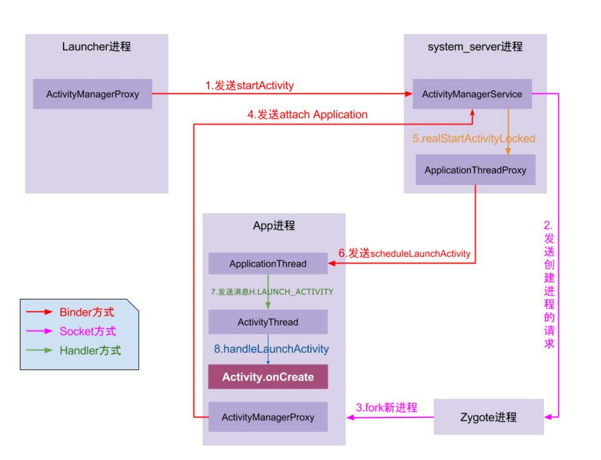
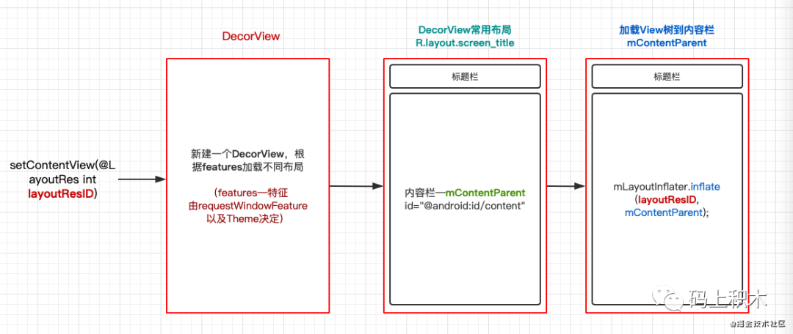
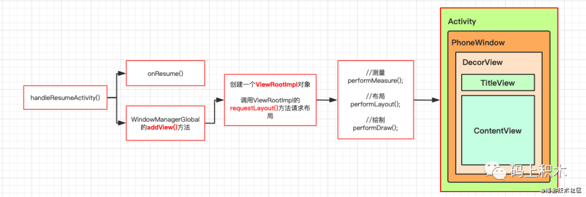
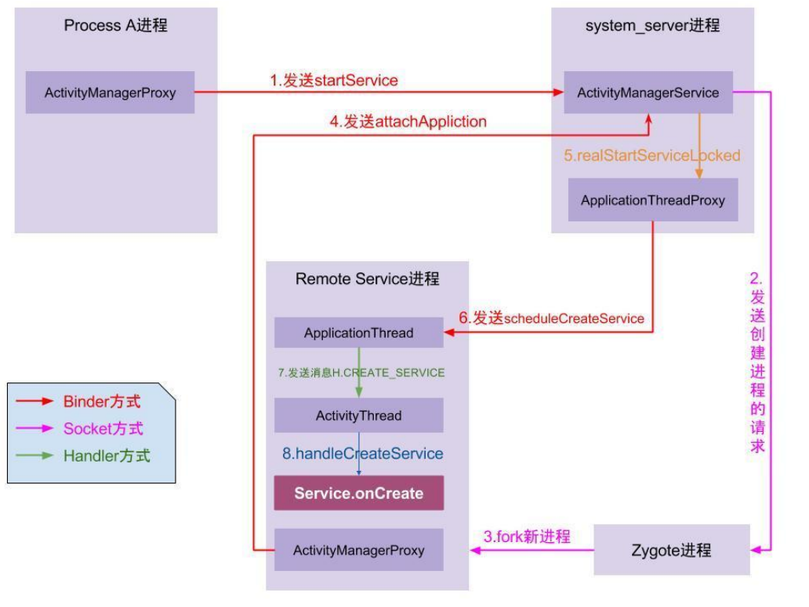
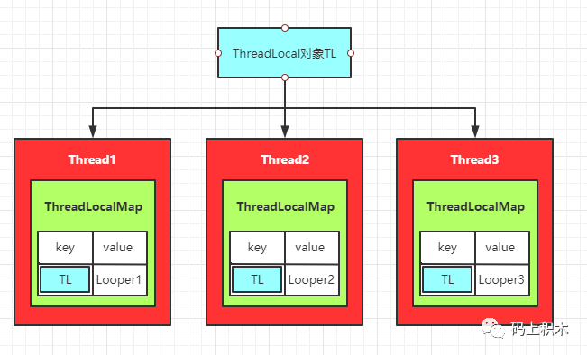
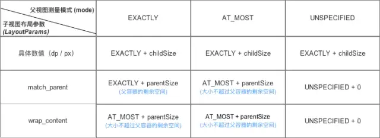
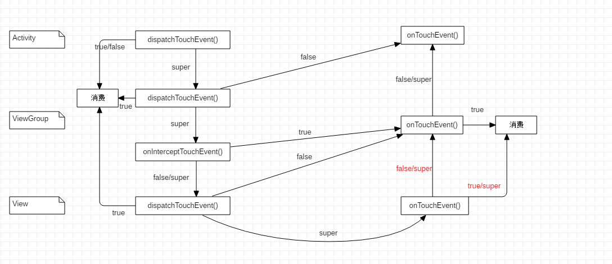
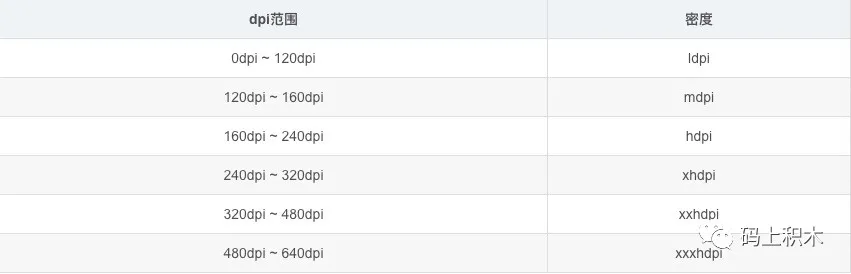
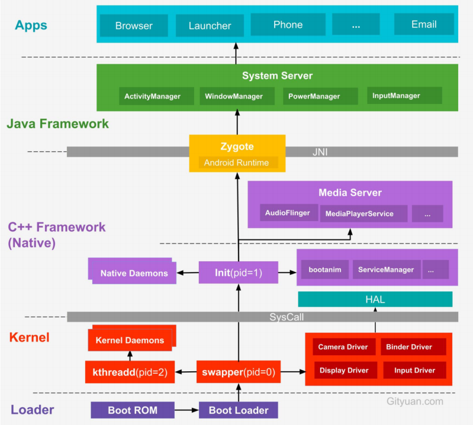

[toc]

# Android 面试总结(一)


# 一、Activity

## 1.1  Activity 的启动流程


1. 点击桌面App图标，Launcher 进程采用 Binder IPC (Inter-Process Communication，进程间通信) 向 system_server 进程发起 startActivity请求；

2. system_server 进程接收到请求后，向 zygote 进程发送创建进程的请求；

3. Zygote 进程 fork 出新的子进程，即 App 进程；

4. App 进程，通过 Binder IPC 向 sytem_server 进程发起 attachApplication 请求；

5. system_server 进程在收到请求后，进行一系列准备工作后，再通过 binder IPC 向 App 进程发送 scheduleLaunchActivity 请求；

6. App 进程的 binder 线程（ApplicationThread）在收到请求后，通过 handler 向主线程发送 LAUNCH_ACTIVITY 消息；

7. 主线程在收到 Message 后，通过发射机制创建目标 Activity，并回调 Activity.onCreate() 等方法





## 1.2 Activity 从创建到我们看到界面，发生了哪些事

1. 首先是通过setContentView加载布局，这其中创建了一个 DecorView
2. 然后根据然后根据Activity设置的主题（theme）或者特征（Feature）加载不同的根布局文件
3. 最后再通过 inflate 方法加载 layoutResID 资源文件，其实就是解析了xml文件，根据节点生成了 View 对象



4. 其次就是进行 view 绘制到界面上，这个过程发生在 handleResumeActivity 方法中，也就是触发 onResume 的方法。
   在这里会创建一个 ViewRootImpl 对象，作为 DecorView 的 parent ，然后对 DecorView 进行测量布局和绘制三大流程。





## 1.3  Activity、PhoneWindow、DecorView、ViewRootImpl  的关系

- PhoneWindow 是 Window 的唯一子类，每个 Activity 都会创建一个 PhoneWindow 对象，你可以理解它为一个窗口，
  但不是真正的可视窗口，而是一个管理类，是 Activity 和整个 View 系统交互的接口，是 Activity 和 View 交互系统的中间层。

- DecorView 是 PhoneWindow 的一个内部类，是整个View 层级的最顶层，
  一般包括标题栏和内容栏两部分，会根据不同的主题特性调整不同的布局。
  它是在 setContentView 方法中被创建，具体点来说是在 PhoneWindow 的 installDecor 方法中被创建。

- ViewRootImpl 是 DecorView 的 parent，用来控制 View 的各种事件，在 handleResumeActivity 方法中被创建


## 1.4 Window 是什么? 在Android中都用到了哪些地方？

首先，它是一个窗口， 是 Android 中唯一的展示视图的中介，所有的视图都是通过 Window 来呈现的，
无论是 Activity，Dialog 或 Toast，他们的视图都是附加到 Window上的，所以 Window 是 View 的直接管理者。

Window 是一个抽象类，他的具体实现就是 PhoneWindow。

Window 的具体实现在 WindowManagerService中，但是创建 Window 或者访问 Window 的操作都需要 WindowManager。
所以这就需要WindowManager和WindowManagerService进行交互，交互的方式就是通过IPC，具体涉及的参数就是token

每一个Window都对应着一个View和一个ViewRootImpl，Window和View通过ViewRootImpl建立联系，所以Window并不是实际存在的，而是以View的形式存在。


涉及到Window的地方：

事件分发机制。界面上事件分发机制的开始都是这样一个过程：
DecorView——>Activity——>PhoneWindow——>DecorView——>ViewGroup

之前看过一个比较有趣的问题：事件到底是先到 DecorView 还是先到 Window 的？
其实是先到DecorView的，具体逻辑可以自己翻下源码

各种视图的显示。比如Activity的setContentView，Dialog，Toast的显示视图等等都是通过Window完成的。


## 1.5 Activity,Dialog,Toast的 Window 创建过程

### 1. Dialog

```
//构造函数
Dialog(Context context, int theme, boolean createContextThemeWrapper) {
        //......
        //获取了WindowManager对象，mContext一般是个Activity，获取系统服务一般是通过Binder获取
        mWindowManager = (WindowManager)context.getSystemService(Context.WINDOW_SERVICE);
        //创建新的Window
        Window w = PolicyManager.makeNewWindow(mContext);
        mWindow = w;
        //这里也是上方mWindow.getCallback()为什么是Activity的原因，在创建新Window的时候会设置callback为自己
        w.setCallback(this);
        w.setOnWindowDismissedCallback(this);
        //关联WindowManager与新Window，token为null
        w.setWindowManager(mWindowManager, null, null);
        w.setGravity(Gravity.CENTER);
        mListenersHandler = new ListenersHandler(this);
    }

//show方法
    public void show() {
        //......
        if (!mCreated) {
            //回调Dialog的onCreate方法
            dispatchOnCreate(null);
        }
        //回调Dialog的onStart方法
        onStart();
        //获取当前新Window的DecorView对象
        mDecor = mWindow.getDecorView();
        WindowManager.LayoutParams l = mWindow.getAttributes();
        try {
            //把一个View添加到Activity共用的windowManager里面去
            mWindowManager.addView(mDecor, l);
            //......
        } finally {
        }
    }
```

可以看到一个 Dialog 从无到有经历了以下几个步骤：

1. 首先创建了一个新的Window，类型是PhoneWindow类型，与Activity创建Window过程类似，并设置setCallback回调。
2. 将这个新Window与从Activity拿到的WindowManager对象相关联，也就是dialog与Activity公用了同一个WindowManager对象。
3. show方法展示Dialog，先回调了Dialog的onCreate，onStart方法。
4. 然后获取Dialog自己的DecorView对象，并通过addView方法添加到WindowManager对象中，Dialog出现到屏幕上。

### 2. Activity

关于Activity的启动流程，相比大伙都知道些，流程最后会走到 ActivityThread 中的 performLaunchActivity 方法，
然后会创建Activity的实例对象，并调用attach方法，也就是上述贴的源码。

在这个方法中，创建了新的Window对象，设置回调接口。这个回调接口主要就是用作Window在接收到外界状态改变的时候，
就会回调给这个callback，比如onAttachedToWindow、dispatchTouchEvent方法等，
这个上篇文章也有说过，事件分发的时候就是通过在DecorView中这个callback进行分发的。

然后view怎么显示到界面上的呢，Activity可没有show方法哦？其实就是通过setContentView方法。该方法主要做了以下几件事：
创建DecorView，如果不存在的话。
然后将xml中解析到的view添加到DecorView的mContentParent中，也就是布局为android.R.id.content的ContentView。
回调onContentChanged方法，通知Activity视图已经发生改变

到这里，一个有完整view结构的DecorView就创建出来了，但是它还没有被显示到手机界面上，也就是没有被添加到Window中。
最后要调用了WMS的addView方法才会被用户真正看到:

```
void makeVisible() {
        if (!mWindowAdded) {
            ViewManager wm = getWindowManager();
            wm.addView(mDecor, getWindow().getAttributes());
            mWindowAdded = true;
        }
        mDecor.setVisibility(View.VISIBLE);
    }
```

### 3. Toast

Toast 有点不同的在于，它内部维护了两个IPC通信，一个是NotificationManagerService，一个是回调TN接口。
最终的实现都是走到TN.class的handleShow和handleHide方法，也就是addView和removeView。


##  Window

视图承载器，是一个视图的顶层窗口， 包含了View并对View进行管理, 是一个抽象类，具体的实现类为PhoneWindow,内部持有DecorView。 通过WindowManager创建，并通过WindowManger将DecorView添加进来


## WindowManager、ViewRootImpl


WindowManager 是一个接口，继承自只有添加、删除、更新三个方法的 ViewManager 接口。 它的实现类为 WindowManagerImpl，WindowManagerImpl 通过 WindowManagerGlobal 代理实现 addView， 最后调用到 ViewRootImpl 的 setView 使 ViewRoot 和 Decorview相关联。

如果要对 Window 进行添加和删除就需要使用 WindowManager， 具体的工作则由WMS来处理，WindowManager 和 WMS通过 Binder来进行跨进程通信


ViewRoot 是 View 和 WindowManager 的桥梁，View 通过 WindowManager 来转接调用 ViewRootImpl View 的三大流程(测量（measure），布局（layout），绘制（draw）)均通过ViewRoot来完成。 Android的所有触屏事件、按键事件、界面刷新等事件都是通过ViewRoot进行分发的。


## DecorView

DecorView是FrameLayout的子类，它可以被认为是Android视图树的根节点视图, 一般情况下它内部包含一个竖直方向的LinearLayout，在这个LinearLayout里面有上下三个部分， 上面是个ViewStub,延迟加载的视图（应该是设置ActionBar,根据Theme设置）， 中间的是标题栏(根据Theme设置，有的布局没有)，下面的是内容栏。

setContentView就是把需要添加的View的结构添加保存在DecorView中


## Activity，View，Window 三者之间的关系

Activity 并不负责视图控制，它只是控制生命周期和处理事件，Activity 中持有的是 Window 

Window 是视图的承载器，内部持有一个 DecorView，而这个 DecorView 才是 view 的根布局 

View 就是视图,在 setContentView 中将 R.layout.activity_main 添加到 DecorView


## DecorView 什么时候被 WindowManager 添加到 Window 中


即使 Activity 的布局已经成功添加到 DecorView 中，DecorView 此时还没有添加到 Window 中 

在 ActivityThread 的 handleResumeActivity 方法中，首先会调用 Activity 的 onResume 方法，接着调用 Activity 的 makeVisible() 方法，makeVisible() 中完成了 DecorView 的添加和显示两个过程


## ActivityThread、ApplicationThread

- ActivityThread

在 Android 中它就代表了Android的主线程,它是创建完新进程之后,main函数被加载，然后执行一个 loop 的循环使当前线程进入消息循环，并且作为主线程。


- ApplicationThread

ApplicationThread 是 ActivityThread 的内部类， 是一个 Binder 对象。在此处它是作为 IApplicationThread 对象的server端等待client端的请求然后进行处理，最大的client就是 AMS


# 二、Service


## 2.1 service 的生命周期，两种启动方式的区别


startService

onCreate() -> onStartCommand() -> onDestroy()

bindService

onCreate() -> onbind() -> onUnbind()-> onDestroy()


启动

如果服务已经开启，多次执行startService不会重复的执行onCreate()， 而是会调用onStartCommand()

如果服务已经开启，多次执行bindService时,onCreate和onBind方法并不会被多次调用


销毁

当执行stopService时，直接调用onDestroy方法

调用者调用unbindService方法或者调用者Context不存在了（如Activity被fifinish了），Service就会调用

onUnbind->onDestroy

使用startService()方法启用服务，调用者与服务之间没有关连，即使调用者退出了，服 务仍然运行。

使用bindService()方法启用服务，调用者与服务绑定在了一起，调用者一旦退出，服务也就终止。


## 2.2 Service 启动流程

1. Process A进程采用Binder IPC向 system_server 进程发起 startService 请求；
2. system_server进程接收到请求后，向zygote进程发送创建进程的请求；
3. zygote进程fork出新的子进程Remote Service进程；
4. Remote Service进程，通过Binder IPC向sytem_server进程发起attachApplication请求；
5. system_server进程在收到请求后，进行一系列准备工作后，再通过binder IPC向remote Service进程发送scheduleCreateService请求；
6. Remote Service进程的binder线程在收到请求后，通过handler向主线程发送CREATE_SERVICE消息；
7. 主线程在收到Message后，通过发射机制创建目标Service，并回调Service.onCreate()方法。

到此，服务便正式启动完成。当创建的是本地服务或者服务所属进程已创建时，则无需经过上述步骤2、3，直接创建服务即可。





##  2.3   Service 与 Activity  怎么实现通信


- 通过Binder对象

1. Service中添加一个继承Binder的内部类，并添加相应的逻辑方法

2. 重写Service的onBind方法，返回我们刚刚定义的那个内部类实例

3. Activity中绑定服务,重写ServiceConnection，onServiceConnected时返回的IBinder（Service中的binder）

   调用逻辑方法


```
class TestService : Service() {
    private val mBinder = MyBinder()

    override fun onBind(intent: Intent?): IBinder? {
        return mBinder
    }
   
    inner class MyBinder : Binder() {
        fun startWork() {
            //这里可以对Service进行操作
        }
        fun stopWork() {
        }
    }
}

class ServiceActivity:BaseActivity() {
    private val mServiceIntent = Intent(this, TestService::class.java)
    var mServiceBinder: TestService.MyBinder? = null
    
    private val mServiceConnection = object : ServiceConnection {
        override fun onServiceDisconnected(name: ComponentName?) {
            mServiceBinder = null
        }

        override fun onServiceConnected(name: ComponentName?, service: IBinder?) {
            service?.let {
                mServiceBinder = it as TestService.MyBinder
            }
        }
    }

    override fun onCreate(savedInstanceState: Bundle?) {
        super.onCreate(savedInstanceState)
        bindService(mServiceIntent, mServiceConnection, BIND_AUTO_CREATE)
    }

    override fun onDestroy() {
        unbindService(mServiceConnection)
        super.onDestroy()
    }
}
```


- Service通过BroadCast广播与Activity通信


##  2.4 IntentService

IntentService 是 Service 的子类，默认开启了一个工作线程HandlerThread，使用这个工作线程逐一处理所有启动请求，在任务执行完毕后会自动停止服务。

只要实现一个方法 onHandleIntent，该方法会接收每个启动请求的Intent，能够执行后台工作和耗时操作。

可以启动 IntentService 多次，而每一个耗时操作会以队列的方式在 IntentService 的 onHandlerIntent 回调方法中执行，并且，每一次只会执行一个工作线程，执行完第一个再执行第二个。并且等待所有消息都执行完后才终止服务。


# 三、 BroadCastReceiver


## 3.1 广播的分类

广播接收器的注册分为两种：静态注册、动态注册。

- 静态广播接收者：通过AndroidManifest.xml的标签来申明的BroadcastReceiver。

- 动态广播接收者：通过AMS.registerReceiver()方式注册的BroadcastReceiver，动态注册更为灵活，可在不需要时通过unregisterReceiver()取消注册。

  

广播类型：根据广播的发送方式，

- 普通广播：通过Context.sendBroadcast()发送，可并行处理
- 系统广播：当使用系统广播时，只需在注册广播接收者时定义相关的action即可，不需要手动发送广播(网络变化,锁屏,飞行模式)
- 有序广播： 指的是发送出去的广播被 BroadcastReceiver 按照先后顺序进行接收 发送方式变为：sendOrderedBroadcast(intent);
- App应用内广播（Local Broadcast）：App应用内广播可理解为一种局部广播，广播的发送者和接收者都同属于一个App。 相比于全局广播（普通广播），App应用内广播优势体现在：安全性高 & 效率高   发送方式： LocalBroadcastManager.getInstance(this).sendBroadcast()
- 粘性广播（Sticky Broadcast） 由于在Android5.0 & API 21中已经失效，所以不建议使用，在这里也不作过多的总结。


## 3.2 本地广播和全局广播的区别


BroadcastReceiver 是针对应用间、应用与系统间、应用内部进行通信的一种方式

LocalBroadcastReceiver 仅在自己的应用内发送接收广播，也就是只有自己的应用能收到，数据更加安全广播只在这个程序里，而且效率更高。


BroadcastReceiver 采用的 binder 方式实现跨进程间的通信；

LocalBroadcastManager 使用 Handler 通信机制。


LocalBroadcastReceiver不能静态注册，只能采用动态注册的方式。


# 四、ContentProvider


## 4.1 什么是 ContentProvider 及其使用

ContentProvider 的作用是为不同的应用之间数据共享，提供统一的接口，我们知道安卓系统中应用内部的数据是对外隔离的，要想让其它应用能使用自己的数据（例如通讯录）这个时候就用到了ContentProvider。

ContentProvider（内容提供者）通过 uri 来标识其它应用要访问的数据。

通过 ContentResolver（内容解析者）的增、删、改、查方法实现对共享数据的操作。

还可以通过注册 ContentObserver（内容观察者）来监听数据是否发生了变化来对应的刷新页面


## 4.2  ContentProvider , ContentResolver , ContentObserver 之间的关系


- ContentProvider：管理数据，提供数据的增删改查操作，数据源可以是数据库、文件、XML、网络等

- ContentResolver：外部进程可以通过 ContentResolver 与 ContentProvider 进行交互。其他应用中ContentResolver 可以不同 URI 操作不同的 ContentProvider 中的数据
- ContentObserver：观察 ContentProvider 中的数据变化，并将变化通知给外界


# 五、Handler


## 5.1 Handler组成和原理


从四个方面看Handler、Message、MessageQueue 和 Looper 

- Handler: 负责消息的发送和处理

- Message:消息对象，类似于链表的一个结点; 

- MessageQueue: 消息队列，用于存放消息对象的数据结构; 

- Looper: 消息队列的处理者，用于轮询消息队列的消息对象 

  

Handler发送消息时调用MessageQueue的enqueueMessage插入一条信息到 MessageQueue,
Looper不断轮询调用MeaasgaQueue的next方法 
如果发现 message 就调用 handler 的 dispatchMessage，dispatchMessage被成功调用，接着调用handlerMessage()


## 


## 5.2 相关问答


系统为什么提供Handler？
主要就是为了解决在子线程无法访问UI的问题

那么为什么系统不允许在子线程中访问UI呢？
因为Android的UI控件不是线程安全的，所以采用单线程模型来处理UI操作，通过Handler切换UI访问的线程即可

那么为什么不给UI控件加锁呢？
因为加锁会让UI访问的逻辑变得复杂，而且会降低UI访问的效率，阻塞线程执行。


子线程中能不能直接new一个Handler,为什么主线程可以

不能。因为Handler 的构造方法中，会通过Looper.myLooper()获取looper对象，如果为空，则抛出异常，

主线程则因为已在入口处ActivityThread的main方法中通过 Looper.prepareMainLooper()获取到这个对象， 并通过 Looper.loop()开启循环，

在子线程中若要使用handler，可先通过Loop.prepare获取到looper对象，并使用Looper.loop()开启循环


一个线程可以有几个Handler,几个Looper,几个MessageQueue对象？

一个线程可以有多个Handler,只有一个Looper对象,只有一个MessageQueue对象。

从 Looper.prepare() 函数中知道，在 Looper 的prepare方法中创建了Looper对象，并放入到ThreadLocal中，并通过ThreadLocal来获取looper的对象, 
ThreadLocal的内部维护了一个 ThreadLocalMap 类,ThreadLocalMap 是以当前 thread 做为 key 的, 因此可以得知，一个线程最多只能有一个Looper对象， 在Looper的构造方法中创建了MessageQueue对象，并赋值给mQueue字段。因为Looper对象只有一个，那么Messagequeue 对象肯定只有一个


Handler是怎么获取到当前线程的Looper的?
大家应该都知道Looper是绑定到线程上的，他的作用域就是线程，而且不同线程具有不同的Looper，也就是要从不同的线程取出线程中的Looper对象，这里用到的就是ThreadLocal

ThreadLocal的工作流程是这样的：
我们从不同的线程可以访问同一个ThreadLocal的get方法，然后ThreadLocal会从各自的线程中取出一个数组，然后再数组中通过ThreadLocal的索引找出对应的value值。

具体逻辑呢，我们还是看看代码，分别是ThreadLocal的get方法和set方法：

```
public void set(T value) {
    Thread t = Thread.currentThread();
    ThreadLocalMap map = getMap(t);
    if (map != null)
        map.set(this, value);
    else
        createMap(t, value);
} 

ThreadLocalMap getMap(Thread t) {
    return t.threadLocals;
}    

public T get() {
    Thread t = Thread.currentThread();
    ThreadLocalMap map = getMap(t);
    if (map != null) {
        ThreadLocalMap.Entry e = map.getEntry(this);
        if (e != null) {
            @SuppressWarnings("unchecked")
            T result = (T)e.value;
            return result;
        }
    }
    return setInitialValue();
}   
```

其实可以看到，操作的对象都是线程中的ThreadLocalMap实例，
也就是读写操作都只限制在线程内部，这也就是ThreadLocal故意设计的精妙之处了，
他可以在不同的线程进行读写数据而且线程之间互不干扰




当 MessageQueue 没有消息的时候，在干什么，会占用CPU资源吗?
MessageQueue 没有消息时，便阻塞在 loop 的 queue.next() 方法这里。
具体就是会调用到nativePollOnce方法里，最终调用到epoll_wait()进行阻塞等待。

这时，主线程会进行休眠状态，也就不会消耗CPU资源。
当下个消息到达的时候，就会通过pipe管道写入数据然后唤醒主线程进行工作


HandlerThread

HandlerThread本质上是一个线程类，它继承了Thread； HandlerThread有自己的内部Looper对象，通过Looper.loop()进行looper循环； 通过获取HandlerThread的looper对象传递给Handler对象，然后在handleMessage()方法中执行异步任务；


优势:

 1.将loop运行在子线程中处理,减轻了主线程的压力,使主线程更流畅,有自己的消息队列,不会干扰UI线程 

2.串行执行,开启一个线程起到多个线程的作用

劣势: 

1.由于每一个任务队列逐步执行,一旦队列耗时过长,消息延时 

2.对于IO等操作,线程等待,不能并发我们可以使用HandlerThread处理本地IO读写操作（数据库，文件），因为本地IO操作大多数的耗时属于毫秒级别，对于单线程 + 异步队列的形式 不会产生较大的阻塞


# 六、View 绘制


## 6.1 View / ViewGroup 的绘制流程

1. 绘制入口

   ```
   ActivityThread.handleResumeActivity
   -> WindowManagerImpl.addView(decorView,layoutParams)
   -> WindowManagerGlobal.addView()
   ```

   

2. 绘制的类及方法

   ```
   ViewRootImpl.setView(decorView,layoutParam,parentView)
   -> ViewRootImpl.requestLayout()
   -> scheduleTraversals()
   -> doTraversal()
   -> performTraversals()
   ```

   

startActivity->ActivityThread.handleLaunchActivity->onCreate ->完成DecorView和Activity的创建-\>ActivityThread.handleResumeActivity->onResume()->DecorView添加到WindowManager->ViewRootImpl.performTraversals()

方法，测量（measure）,布局（layout）,绘制（draw）, 从DecorView自上而下遍历整个View树。


View 的绘制流程是从ViewRoot 的 performTraversals 开始的，它经过measure，layout，draw三个过程最终将View绘制出来。
performTraversals会依次调用performMeasure，performLayout，performDraw三个方法，
他们会依次调用 measure，layout，draw方法，
然后又调用了onMeasure，onLayout，dispatchDraw

- measure ：

  对于自定义的单一 view 的测量，只需要根据父 view 传递的 MeasureSpec 进行计算大小。

  对于 ViewGroup 的测量，一般要重写 onMeasure 方法，在onMeasure方法中，父容器会对所有的子 View 进行 Measure，
  子元素又会作为父容器，重复对它自己的子元素进行Measure，这样Measure过程就从DecorView一级一级传递下去了，
  也就是要遍历所有子View的的尺寸，最终得出出总的 ViewGroup的尺寸。Layout和Draw方法也是如此

- layout ：根据 measure 子 View 所得到的布局大小和布局参数，将子View放在合适的位置上

  对于自定义的单一view，计算本身的位置即可。
  对于 ViewGroup 来说，需要重写 onLayout 方法。除了计算自己View的位置，还需要确定每一个子View在父容器的位置以及
  子view的宽高（getMeasuredWidth和getMeasuredHeight），最后调用所有子view的layout方法来设定子view的位置

- draw ：把 View 对象绘制到屏幕上
  1）drawBackground()，根据在 layout 过程中获取的 View 的位置参数，来设置背景的边界。
  2）onDraw()，绘制View本身的内容，一般自定义单一view会重写这个方法，实现一些绘制逻辑。
  3）dispatchDraw()，绘制子View 
  4）onDrawScrollBars(canvas)，绘制装饰，如 滚动指示器、滚动条、和前景


## 6.2 说说你理解的MeasureSpec

MeasureSpec 是由父View的MeasureSpec和子View的LayoutParams通过简单的计算得出一个针对子View的测量要求，
这个测量要求就是MeasureSpec

首先，MeasureSpec 是 一个大小跟模式的组合值, MeasureSpec中 的值是一个整型（32位）将size和mode打包成一个Int型，
其中高两位是mode，后面30位存的是size

```
  // 获取测量模式
  int specMode = MeasureSpec.getMode(measureSpec)

  // 获取测量大小
  int specSize = MeasureSpec.getSize(measureSpec)

  // 通过 Mode 和 Size 生成新的 SpecMode
  int measureSpec=MeasureSpec.makeMeasureSpec(size, mode);
```

- EXACTLY：精确测量模式，视图宽高指定为match_parent或具体数值时生效，表示父视图已经决定了子视图的精确大小，这种模式下View的测量值就是SpecSize的值

- AT_MOST：最大值测量模式，当视图的宽高指定为wrap_content时生效，此时子视图的尺寸可以是不超过父视图允许的最大尺寸的任何尺寸

- UNSPECIFIED：不指定测量模式, 父视图没有限制子视图的大小，子视图可以是想要的任何尺寸，通常用于系统内部，应用开发中很少用到


其次，每个子 View 的 MeasureSpec 值根据子 View 的布局参数和父容器的 MeasureSpec 值计算得来的，所以就有一个父布局测量模式，子视图布局参数，以及子view本身的 MeasureSpec

关系图：



其实也就是 getChildMeasureSpec 方法的源码逻辑，会根据子 View 的布局参数和父容器的MeasureSpec计算出来单个子
view的MeasureSpec。

最后是实际应用时：

对于自定义的单一view，一般可以不处理onMeasure方法，如果要对宽高进行自定义，就重写onMeasure方法，并将算好的宽高通过setMeasuredDimension方法传进去。
对于自定义的ViewGroup，一般需要重写onMeasure方法，并且调用measureChildren方法遍历所有子View并进行测量
（measureChild方法是测量具体某一个view的宽高），然后可以通过getMeasuredWidth/getMeasuredHeight获取宽高，
最后通过setMeasuredDimension方法存储本身的总宽高


## 6.3 requestLayout 和 invalidate、postInvalidate

requestLayout 方法是用来触发绘制流程，他会会一层层调用 parent 的requestLayout，
一直到最上层也就是ViewRootImpl的requestLayout，这里也就是判断线程的地方了，
最后会执行到 performMeasure -> performLayout -> performDraw 三个绘制流程，也就是测量——布局——绘制。

```
@Override
public void requestLayout() {
    if (!mHandlingLayoutInLayoutRequest) {
        checkThread();
        mLayoutRequested = true;
        scheduleTraversals();//执行绘制流程
    }
}
```

其中performMeasure方法会执行到View的measure方法，用来测量大小。
performLayout方法会执行到view的layout方法，用来计算位置。
performDraw方法需要注意下，他会执行到view的draw方法，但是并不一定会进行绘制，
只有只有 flag 被设置为 PFLAG_DIRTY_OPAQUE 才会进行绘制

invalidate方法也是用来触发绘制流程，主要表现就是会调用draw()方法。
虽然他也会走到scheduleTraversals方法，也就是会走到三大流程，
但是View会通过mPrivateFlags来判断是否进行onMeasure和onLayout操作。
而在用invalidate方法时，更新了mPrivateFlags，所以不会进行measure和layout。
同时他也会设置Flag为PFLAG_DIRTY_OPAQUE，所以肯定会执行onDraw方法

虽然两者都是用来触发绘制流程，但是在measure和layout过程中，只会对 flag 设置为 FORCE_LAYOUT 的情况进行重新
测量和布局，而draw方法中只会重绘 flag为 dirty 的区域。
requestLayout 是用来设置FORCE_LAYOUT标志，invalidate 用来设置 dirty 标志。
所以 requestLayout 只会触发 measure 和 layout，invalidate 只会触发 draw。


requestLayout：会触发三大流程。

 invalidate：触发 onDraw 流程，在 UI 线程调用。 

postInvalidate：触发onDraw 流程，在非 UI 线程中调用。

 postInvalidate()方法内部通过Handler发送了一个消息将线程切回到UI线程通知重新绘制 。最终还是调用了子View的invalidate()


##  6.4 Scroller 是怎么实现 View 的弹性滑动？

在 MotionEvent.ACTION_UP 事件触发时调用 startScroll() 方法，
该方法并没有进行实际的滑动操作，而是记录滑动相关量（滑动距离、滑动时间）
接着调用 invalidate/postInvalidate() 方法，请求View重绘，导致 View.draw方法被执行
当 View 重绘后会在draw方法中调用computeScroll方法，而computeScroll又会去向Scroller获取当前的scrollX和scrollY；
然后通过scrollTo方法实现滑动；
接着又调用postInvalidate方法来进行第二次重绘，和之前流程一样，如此反复导致View不断进行小幅度的滑动，
而多次的小幅度滑动就组成了弹性滑动，直到整个滑动过成结束。

```
mScroller = new Scroller(context);

@Override
public boolean onTouchEvent(MotionEvent event) {
    switch (event.getAction()) {
        case MotionEvent.ACTION_UP:
            // 滚动开始时X的坐标,滚动开始时Y的坐标,横向滚动的距离,纵向滚动的距离
            mScroller.startScroll(getScrollX(), 0, dx, 0);
            invalidate();
            break;
    }
    return super.onTouchEvent(event);
}

@Override
public void computeScroll() {
    // 重写computeScroll()方法，并在其内部完成平滑滚动的逻辑
    if (mScroller.computeScrollOffset()) {
        scrollTo(mScroller.getCurrX(), mScroller.getCurrY());
        invalidate();
    }
}
```


## 6.5 自定义 View   wrap_content 不起作用的原因


1. 因为onMeasure()->getDefaultSize()，当 View 的测量模式是 AT_MOST 或 EXACTLY 时，View 的大小都会被设置成子 View MeasureSpec 的 specSize

```
    public static int getDefaultSize(int size, int measureSpec) {
        int result = size;
        int specMode = MeasureSpec.getMode(measureSpec);
        int specSize = MeasureSpec.getSize(measureSpec);

        switch (specMode) {
        case MeasureSpec.UNSPECIFIED:
            result = size;
            break;
        case MeasureSpec.AT_MOST:
        case MeasureSpec.EXACTLY:
            result = specSize;
            break;
        }
        return result;
    }
```

2. View 的 MeasureSpec 值是根据子 View 的布局参数（LayoutParams）和父容器的 MeasureSpec 值计算得来，具体计算逻辑封装在getChildMeasureSpec()。 
   当子 View wrap_content 或 match_parent 情况下，子 View MeasureSpec 的 specSize 被设置成 parenSize = 父容器当前剩余空间大小


3. 所以当给一个View/ViewGroup 设置宽高为具体数值或者 match_parent，它都能正确的显示，但是如果你设置的是wrap_content->AT_MOST，则默认显示出来是其父容器的大小。
   如果你想要它正常的显示为wrap_content，所以需要自己重写onMeasure()来自己计算它的宽高度并设置。此时，可以在wrap_content的情况下（对应MeasureSpec.AT_MOST）指定内部宽/高(mWidth和mHeight)。


## 6.5 在Activity中获取某个View的宽高有几种方法


- Activity/View#onWindowFocusChanged：此时View已经初始化完毕，当Activity的窗口得到焦点和失去焦点时均会被调用一次，如果频繁地进行onResume和onPause，那么onWindowFocusChanged也会被频繁地调用。

- view.post(runnable)： 通过post将runnable放入ViewRootImpl的RunQueue中，RunQueue中runnable最后的执行时机，是在下一个performTraversals到来的时候，也就是view完成layout之后的第一时间获取宽高。

- ViewTreeObserver#addOnGlobalLayoutListener：当View树的状态发生改变或者View树内部的View的可见性发生改变时，onGlobalLayout方法将被回调。


## 6.6 为什么 onCreate 获取不到 View 的宽高


Activity在执行完oncreate，onResume之后才创建ViewRootImpl,ViewRootImpl进行View的绘制工作 

调用链：

startActivity -> ActivityThread.handleLaunchActivity -> onCreate -> 完成DecorView和Activity的创建 -\> handleResumeActivity -> onResume() -> DecorView 添加到 WindowManager -> ViewRootImpl.performTraversals()方法，

测量（measure）,布局（layout）,绘制（draw）, 从DecorView自上而下遍历整个View树。


## 6.7 getWidth()方法和getMeasureWidth()区别


- getMeasuredWidth 方法获得的值是setMeasuredDimension方法设置的值，它的值在measure方法运行后就会确定

- getWidth 方法获得是 layout 方法中传递的四个参数中的 mRight-mLeft，它的值是在layout方法运行后确定的

- 一般情况下在onLayout方法中使用getMeasuredWidth方法，而在除onLayout方法之外的地方用getWidth方法


## 什么是SurfaceView


SurfaceView是View的子类，且实现了Parcelable接口且实现了Parcelable接口，其中内嵌了一个专门用于绘制的Surface，SurfaceView可以控制这个Surface的格式和尺寸，以及Surface的绘制位置。可以理解为Surface就是管理数据的地方，SurfaceView就是展示数据的地方。

使用双缓冲机制，有自己的 surface，在一个独立的线程里绘制。 SurfaceView虽然具有独立的绘图表面，不过它仍然是宿主窗口的视图结构中的一个结点，因此，它仍然是可以参与到宿主窗口的绘制流程中去的。从SurfaceView类的成员函数draw和dispatchDraw的实现就可以看出，SurfaceView在其宿主窗口的绘图表面上面所做的操作就是将自己所占据的区域绘为黑色，除此之外，就没有其它更多的操作了，这是因为SurfaceView的UI是要展现在它自己的绘图表面上面的。

 优点： 使用双缓冲机制，可以在一个独立的线程中进行绘制，不会影响主线程，播放视频时画面更流畅 

缺点：Surface不在View hierachy中，它的显示也不受View的属性控制，SurfaceView 不能嵌套使用。在7.0版本之前不能进行平移，缩放等变换，也不能放在其它ViewGroup中，在7.0版本之后可以进行平移，缩放等变换。


## View和SurfaceView的区别

View适用于主动更新的情况，而SurfaceView则适用于被动更新的情况，比如频繁刷新界面。 

View在主线程中对页面进行刷新，而SurfaceView则开启一个子线程来对页面进行刷新。 

View在绘图时没有实现双缓冲机制，SurfaceView在底层机制中就实现了双缓冲机制。


## SurfaceView 为什么可以直接子线程绘制


通常View更新的时候都会调用ViewRootImpl中的performXXX()方法，在该方法中会首先使用checkThread()检查是否当前更新位于主线线程，

SurfaceView提供了专门用于绘制的Surface，可以通过SurfaceView来控制Surface的格式和尺寸，SurfaceView更新就不需要考虑线程的问题，它既可以在子线程更新，也可以在主线程更新。


## SurfaceView、TextureView、SurfaceTexture、GLSurfaceView


- SurfaceView：使用双缓冲机制，有自己的 surface，在一个独立的线程里绘制，Android7.0之前不能平移、缩放

- TextureView：它不会在WMS中单独创建窗口，而是作为一个普通View，可以和其它普通View一样进行移动，旋转，缩放，动画等变化。值得注意的是TextureView必须在硬件加速的窗口中。 
- SurfaceTexture：SurfaceTexture和SurfaceView不同的是，它对图像流的处理并不直接显示，而是转为OpenGL外部纹理，因此可用于图像流数据的二次处理（如Camera滤镜，桌面特效等）。
-  GLSurfaceView：SurfaceView不同的是，它加入了EGL的管理，并自带了渲染线程。


# 七、View 事件分发


## 概述





三个核心事件:

- dispatchTouchEvent()：

  - return true  表示事件被当前视图消费掉； 
  - return false 表示 停止往子View传递和分发, 交给父类的onTouchEvent处理
  - 

- onInterceptTouchEvent() ： 

  - return true 拦截这个事件并交由自身的onTouchEvent方法进行消费

  - return false 表示不拦截，需要继续传递给子视图

  - return super 表示不拦截，需要继续传递给子视图

    

- onTouchEvent() ：

  - return true 是消费事件。
  -  return false 是不消费事件，会被传递给父视图的onTouchEvent方法进行处理。


一个完整的事件流程包括按下（ACTION_DOWN）,移动（ACTION_MOVE）, 抬起（ACTION_UP）三个事件。

理解事件分发机制，必须要将 ACTION_DOWN 事件区别于其他事件来分析，其他事件（ACTION_MOVE 和 ACTION_UP）能否继续流转往往取决处理ACTION_DOWN事件的返回结果，我们直接来总结一下：

ACTION_DOWN 事件

- dispatchTouchEvent  /  onTouchEvent
  - return false： 后续无法接收到后续其他事件（MOVE & UP），回传给父控件处理，至于父控件是否处理可以套用同样的逻辑；
  - return true：事件被消费，不会往下传递，包括后续其他事件；
  - super method： 事件继续往下传递；

- onInterceptTouchEvent（ViewGroup独有）

  - return false / super ： 不拦截事件，事件往下传递；

  - return true： 拦截事件，交给自己 onTouchEvent 处理，后续其他事件能否传递到该 ViewGroup，取决于自身 onTouchEvent 返回值（默认为false），可套用上面的逻辑，一旦返回 true，后续将不会再被调用；


   ACTION_MOVE / ACTION_UP 事件

- 自身必须在处理 ACTION_DOWN 事件时 return true，否则无法接收到后续的 ACTION_MOVE/ACTION_UP 事件；

- dispatchTouchEvent  /  onTouchEvent

  - Return false/true/Super method:  无论返回什么值，都能收到后续事件

- onInterceptTouchEvent（ViewGroup独有）

  - return false： 不拦截事件，事件往下传递；

  - return true：会将当前事件置为 ACTION_CANCEL，后续事件将不会往下传递，进行拦截；


事件分发伪代码

```
  @Override
    public boolean dispatchTouchEvent(MotionEvent ev) {
        boolean consume = false;
        if(onInterceptTouchEvent(ev)){
            consume = onTouchEvent(ev);
        }else {
            consume = child.dispatchTouchEvent(ev);
        }
        return consume;
    }
```


## view 的 onTouchEvent，OnClickListerner 和 OnTouchListener 的 onTouch方法 三者优先级


dispatchTouchEvent-> onTouch -> onInterceptTouchEvent -> onTouchEvent。

1. dispatchTouchEvent 中会调用 mOnTouchListener.onTouch()， onTouchListener 的 onTouch 方法优先级比 onTouchEvent 高，会先触发
2.  假如 onTouch 方法返回 false 会接着触发 onTouchEvent，返回true, onTouchEvent方法不会被调用
3. onClick事件是在 onTouchEvent 的 MotionEvent.ACTION_UP 事件通过 performClick() 触发的。 OnTouchListener中onTouch方法如果返回true，则不会执行 view 的onTouchEvent 方法，也就更不会执行 view 的 onClickListener 的onClick方法, 返回false，则两个都会执行


## onTouch 和 onTouchEvent 的区别


onTouch 方法是 View 的 OnTouchListener 接口中定义的方法，在 dispatchTouchEvent 中调用。 当一个View绑定了OnTouchLister后，当有 touch 事件触发时，就会调用 onTouch 方 onTouchEvent 处理点击事件。 

onTouchListener 的 onTouch 方法优先级比 onTouchEvent 高，会先触发。 

假如onTouch方法返回false，会接着触发onTouchEvent，反之onTouchEvent方法不会被调用。 
内置诸如click事件的实现等等都基于onTouchEvent，假如onTouch返回true，这些事件将不会被触发


## ACTION_CANCEL 什么时候触发


1. 如果在父View中拦截ACTION_UP或ACTION_MOVE，在第一次父视图拦截消息的瞬间，父视图指定子视图不接受后续消息了，同时子视图会收到ACTION_CANCEL事件。
2.  如果触摸某个控件，但是又不是在这个控件的区域上抬起（移动到别的地方了），就会出现 action_cancel


## 事件是先到 DecorView 还是先到 Window 


DecorView -> Activity -> PhoneWindow -> DecorView


当屏幕被触摸input系统事件从Native层分发Framework层的InputEventReceiver.dispachInputEvent()调用了

ViewRootImpl.WindowInputEventReceiver.dispachInputEvent() -> 

ViewRootImpl 中的 DecorView.dispachInputEvent() ->

Activity.dispachInputEvent() ->

window.superDispatchTouchEvent()-\> 

DecorView.superDispatchTouchEvent()->

Viewgroup.superDispatchTouchEvent()


## Activity ViewGroup和View都不消费ACTION_DOWN,那么ACTION_UP 事件是怎么传递的


ACTION_DOWN-> 

Activity.dispatchTouchEvent() -> 

ViewGroup1.dispatchTouchEvent() ->

ViewGroup1.onInterceptTouchEvent() -> 

view1.dispatchTouchEvent() -> 

view1.onTouchEvent() ->

ViewGroup1.onTouchEvent() -> 

Activity.onTouchEvent()


## 同时对父 View 和子 View 设置点击方法，优先响应哪个


优先响应子 view，

如果先响应父 view，那么子 view 将永远无法响应，

父 view 要优先响应事件，必须先调用 onInterceptTouchEvent 对事件进行拦截，那么事件不会再往下传递，直接交给父 view 的 onTouchEvent 处理。


## 点击事件被拦截，但是想传到下面的View，如何操作


重写子类的 requestDisallowInterceptTouchEvent() 方法返回 true 就不会执行父类的 onInterceptTouchEvent()，可将点击事件传到下面的View, 剥夺了父view 对除了ACTION_DOWN以外的事件的处理权。


## Android 滑动冲突解决方法

滑动冲突，总的来说就是两类

- 不同方向滑动冲突
- 同方向滑动冲突

针对同方向滑动冲突,由于外部与内部的滑动方向不一致，那么我们可以根据当前滑动方向，
水平还是垂直来判断这个事件到底该交给谁来处理

针对同方向滑动冲突场景，由于外部与内部的滑动方向一致，那么不能根据滑动角度、距离差或者速度差来判断。
这种情况下必需通过业务逻辑来进行判断

上述两种滑动冲突的场景区别只是在于拦截的逻辑处理上。
第一种是根据水平还是竖直滑动来判断谁来处理滑动，
第二种是根据业务逻辑来判断谁来处理滑动，但是处理的套路都是一样的

### 套路一 外部拦截法：

即父 View 根据需要对事件进行拦截。逻辑处理放在父 View 的 onInterceptTouchEvent 方法中。
我们只需要重写父 View 的 onInterceptTouchEvent 方法，并根据逻辑需要做相应的拦截即可

```
    public boolean onInterceptTouchEvent(MotionEvent event) {
        boolean intercepted = false;
        int x = (int) event.getX();
        int y = (int) event.getY();
        switch (event.getAction()) {
            case MotionEvent.ACTION_DOWN: {
                intercepted = false;
                break;
            }
            case MotionEvent.ACTION_MOVE: {
                if (满足父容器的拦截要求) {
                    intercepted = true;
                } else {
                    intercepted = false;
                }
                break;
            }
            case MotionEvent.ACTION_UP: {
                intercepted = false;
                break;
            }
            default:
                break;
        }
        mLastXIntercept = x;
        mLastYIntercept = y;
        return intercepted;
    }
```

根据业务逻辑需要，在ACTION_MOVE方法中进行判断，
如果需要父View处理则返回true，否则返回false，事件分发给子View去处理。

ACTION_DOWN 一定返回false，不要拦截它，否则根据View事件分发机制，后续ACTION_MOVE 与 ACTION_UP事件都将默认交给父View去处理！
原则上ACTION_UP也需要返回false，如果返回true，并且滑动事件交给子View处理，
那么子View将接收不到ACTION_UP事件，子View的onClick事件也无法触发。
而父View不一样，如果父View在ACTION_MOVE中开始拦截事件，那么后续ACTION_UP也将默认交给父View处理！

### 套路二 内部拦截法：

即父 View 不拦截任何事件，所有事件都传递给子 View，子 View 根据需要决定是自己消费事件还是给父 View 处理。
这需要子 View 使用 requestDisallowInterceptTouchEvent 方法才能正常工作。
下面是子 View 的 dispatchTouchEvent 方法的伪代码：

```
public boolean dispatchTouchEvent(MotionEvent event) {        int x = (int) event.getX();        int y = (int) event.getY();        switch (event.getAction()) {            case MotionEvent.ACTION_DOWN: {                parent.requestDisallowInterceptTouchEvent(true);                break;            }            case MotionEvent.ACTION_MOVE: {                int deltaX = x - mLastX;                int deltaY = y - mLastY;                if (父容器需要此类点击事件) {                    parent.requestDisallowInterceptTouchEvent(false);                }                break;            }            case MotionEvent.ACTION_UP: {                break;            }            default:                break;        }        mLastX = x;        mLastY = y;        return super.dispatchTouchEvent(event);    }
```

父View需要重写onInterceptTouchEvent方法：

```
    public boolean dispatchTouchEvent(MotionEvent event) {
        int x = (int) event.getX();
        int y = (int) event.getY();
        switch (event.getAction()) {
            case MotionEvent.ACTION_DOWN: {
                parent.requestDisallowInterceptTouchEvent(true);
                break;
            }
            case MotionEvent.ACTION_MOVE: {
                int deltaX = x - mLastX;
                int deltaY = y - mLastY;
                if (父容器需要此类点击事件) {
                    parent.requestDisallowInterceptTouchEvent(false);
                }
                break;
            }
            case MotionEvent.ACTION_UP: {
                break;
            }
            default:
                break;
        }
        mLastX = x;
        mLastY = y;
        return super.dispatchTouchEvent(event);
    }
```

使用内部拦截法需要注意：

内部拦截法要求父View不能拦截ACTION_DOWN事件，由于ACTION_DOWN不受FLAG_DISALLOW_INTERCEPT标志位控制，
一旦父容器拦截ACTION_DOWN那么所有的事件都不会传递给子View。
滑动策略的逻辑放在子View的dispatchTouchEvent方法的ACTION_MOVE中，
如果父容器需要获取点击事件则调用 parent.requestDisallowInterceptTouchEvent(false)方法，让父容器去拦截事件。


## 竖向RecyclerView嵌套横向RecyclerView时的滑动冲突

问题分析
在滑动横向RecyclerView时事件会从竖向的RecyclerView里传过来，当我们滑动的手势触发了竖向RecyclerView的滑动
事件的时候，事件就会被拦截，这样横向的RecyclerView就不会滑动，而竖向的的RecyclerView就会上下抖动

解决办法：

```
class HorizontalRecyclerView(context: Context, attrs: AttributeSet) : RecyclerView(context, attrs) {
    private var mDownX: Int = 0
    private var mDownY: Int = 0

    override fun dispatchTouchEvent(ev: MotionEvent): Boolean {
        when (ev.action) {
            MotionEvent.ACTION_DOWN -> {
                mDownX = ev.x.toInt()
                mDownY = ev.y.toInt()
            }
            MotionEvent.ACTION_MOVE -> {
                val moveX = ev.x.toInt()
                val moveY = ev.y.toInt()
                if (abs(moveX - mDownX) > abs(moveY - mDownY)) {
                    parent.requestDisallowInterceptTouchEvent(true)
                }
                mDownX = moveX
                mDownY = moveY
            }
        }
        return super.dispatchTouchEvent(ev)
    }
}
```


## 竖向RecyclerView嵌套竖向RecyclerView滑动冲突，NestScrollView嵌套RecyclerView

1）RecyclerView嵌套RecyclerView的情况下，如果两者都要上下滑动，那么就会引起滑动冲突。
默认情况下外层的RecycleView可滑，内层不可滑

之前说过解决滑动冲突的办法有两种：内部拦截法和外部拦截法。这里我提供一种内部拦截法，还有一些其他的办法大家可以自己思考下。

```
holder.recyclerView.setOnTouchListener { v, event ->    when(event.action){        //当按下操作的时候，就通知父view不要拦截，拿起操作就设置可以拦截，正常走父view的滑动。        MotionEvent.ACTION_DOWN,MotionEvent.ACTION_MOVE -> v.parent.requestDisallowInterceptTouchEvent(true)        MotionEvent.ACTION_UP -> v.parent.requestDisallowInterceptTouchEvent(false)    }false}
```

2）关于ScrollView的滑动冲突还是同样的解决办法，就是进行事件拦截。还有一个办法就是用NestedScrollview代替ScrollView，
Nestedscrollview是官方为了解决滑动冲突问题而设计的新的View。它的定义就是支持嵌套滑动的ScrollView。

所以直接替换成Nestedscrollview就能保证两者都能正常滑动了。
但是要注意设置RecyclerView.setNestedScrollingEnabled(false)这个方法，用来取消RecyclerView本身的滑动效果。

这是因为RecyclerView默认是setNestedScrollingEnabled(true)，这个方法的含义是支持嵌套滚动的。
也就是说当它嵌套在NestedScrollView中时,默认会随着NestedScrollView滚动而滚动,放弃了自己的滚动。
所以给我们的感觉就是滞留、卡顿。所以我们将它设置为false就解决了卡顿问题，让他正常的滑动，不受外部影响。

# 八、RecyclerView 


## 8.1 RecyclerView 预取机制与缓存机制

讲一下RecyclerView 的缓存机制, 滑动10个，再滑回去，会有几个执行onBindView
缓存的是什么？cachedView 会执行 onBindView吗?

1）首先说下 RecycleView 的缓存结构：

RecycleView有四级缓存，分别是:

1. Scrap：mAttachedScrap(屏幕内)
2. Cache：mCacheViews(屏幕外)
3. ViewCacheExtension： mViewCacheExtension(自定义缓存)
4. RecycledViewPool:  mRecyclerPool(缓存池)

- mAttachedScrap(屏幕内)
  用于屏幕内 itemView 快速重用，不需要重新 createView 和 bindView

- mCacheViews(屏幕外)     大小默认是2
  保存最近移出屏幕的 ViewHolder，包含数据和 position 信息，复用时必须是相同位置的 ViewHolder 才能复用，
  应用场景在那些需要来回滑动的列表中，当往回滑动时，能直接复用 ViewHolder 数据，不需要重新 bindView

- mViewCacheExtension(自定义缓存)
  不直接使用，需要用户自定义实现，默认不实现

- mRecyclerPool(缓存池)     每个 itemType 缓存个数为5个
  当 cacheView 满了后或者 adapter 被更换，将 cacheView 中移出的 ViewHolder 放到 Pool 中，
  放之前会把 ViewHolder 数据清除掉，所以复用时需要重新 bindView

2）四级缓存按照顺序需要依次读取。所以完整缓存流程是：

保存缓存流程：

- 插入或是删除 itemView 时，先把屏幕内的 ViewHolder 保存至 AttachedScrap 中
- 滑动屏幕的时候，先消失的itemView会保存到CacheView，CacheView大小默认是2，
  超过数量的话按照先入先出原则，移出头部的 itemView 保存到 RecyclerPool 缓存池（如果有自定义缓存就会保存到自定义缓存里）
- RecyclerPool 缓存池会按照 itemView 的 itemType 进行保存，每个itemType缓存个数为5个，超过就会被回收

获取缓存流程：

- AttachedScrap中获取，通过pos匹配holder
  ——>获取失败，从CacheView中获取，也是通过 pos 获取 holder 缓存
  ——>获取失败，从自定义缓存中获取缓存
  ——>获取失败，从mRecyclerPool中获取
  ——>获取失败，重新创建 viewHolder—— createViewHolder 并 bindView

3）了解了缓存结构和缓存流程，我们再来看看具体的问题 滑动10个，再滑回去，会有几个执行onBindView？

由之前的缓存结构可知，需要重新执行onBindView的只有一种缓存区，就是缓存池mRecyclerPool

所以我们假设从加载RecycleView开始盘的话（页面假设可以容纳7条数据）：

1. 首先，7条数据会依次调用 onCreateViewHolder 和 onBindViewHolder

2. 往下滑一条（position=7），那么会把 position=0 的数据放到 mCacheViews中。
   此时 mCacheViews 缓存区数量为1，mRecyclerPool 数量为0。
   然后新出现的 position=7 的数据通过 position 在 mCacheViews 中找不到对应的 ViewHolder，
   通过itemType也在mRecyclerPool中找不到对应的数据，
   所以会调用onCreateViewHolder和onBindViewHolder方法

3. 再往下滑一条数据（position=8），如上

4. 再往下滑一条数据（position=9），position=2的数据会放到mCacheViews中，但是由于mCacheViews缓存区默认容量为2，
   所以position=0的数据会被清空数据然后放到mRecyclerPool缓存池中。
   而新出现的position=9数据由于在mRecyclerPool中还是找不到相应type的ViewHolder，
   所以还是会走onCreateViewHolder和onBindViewHolder方法。
   所以此时mCacheViews缓存区数量为2，mRecyclerPool数量为1

5. 再往下滑一条数据（position=10），这时候由于可以在mRecyclerPool中找到相同viewType的ViewHolder了。
   所以就直接复用了，并调用onBindViewHolder方法绑定数据

4）所以这个问题就得出结论了（假设mCacheViews容量为默认值2）：

如果一开始滑动的是新数据，那么滑动10个，就会走10个bindView方法。
然后滑回去，会走10-2个bindView方法。一共18次调用。

如果一开始滑动的是老数据，那么滑动10-2个，就会走8个bindView方法。
然后滑回去，会走10-2个bindView方法。一共16次调用。

但是但是，实际情况又有点不一样。因为RecycleView在v25版本引入了一个新的机制，预取机制。

预取机制，就是在滑动过程中，会把将要展示的一个元素提前缓存到mCachedViews中，
所以滑动10个元素的时候，第11个元素也会被创建，也就多走了一次bindview方法。
但是滑回去的时候不影响，因为就算提前取了一个缓存数据，只是把bindview方法提前了，并不影响总的绑定item数量

5）总结，问题怎么答呢？

四级缓存和流程说一下。
滑动10个，再滑回去，bindView可以是19次调用，可以是16次调用。
缓存的其实就是缓存item的view，在RecycleView中就是viewHolder。
cachedView就是mCacheViews缓存区中的view，是不需要重新绑定数据的


## 8..2 如何实现 RecyclerView 的局部更新，用过payload吗,notifyItemChange方法中的参数？

notifyDataSetChanged()，刷新全部可见的item
notifyItemChanged(int)，刷新指定item
notifyItemRangeChanged(int,int)，从指定位置开始刷新指定个item
notifyItemInserted(int)、notifyItemMoved(int)、notifyItemRemoved(int)，插入、移动一个并自动刷新
notifyItemChanged(int, Object)，局部刷新

可以看到，关于view的局部刷新就是notifyItemChanged(int, Object)方法，下面具体说说：

notifyItemChanged有两个构造方法：
notifyItemChanged(int position, @Nullable Object payload)
notifyItemChanged(int position)

其中payload参数可以认为是你要刷新的一个标识，
比如我有时候只想刷新itemView中的textview,有时候只想刷新imageview？
又或者我只想某一个view的文字颜色进行高亮设置？那么我就可以通过payload参数来标示这个特殊的需求了

具体怎么做呢？比如我调用了notifyItemChanged（14,"changeColor"）,
那么在onBindViewHolder回调方法中做下判断即可：

```
@Overridepublic void onBindViewHolder(ViewHolder holder, int position, List<Object> payloads) {    if (payloads.isEmpty()) {        // payloads为空，说明是更新整个ViewHolder        onBindViewHolder(holder, position);    } else {        // payloads不为空，这只更新需要更新的View即可。        String payload = payloads.get(0).toString();        if ("changeColor".equals(payload)) {            holder.textView.setTextColor("");        }    }}
```


# 九、动画


## 说说插值器和估值器

- 插值器
  一般指时间插值器TimeInterpolator，是设置 属性值 从初始值过渡到结束值 的变化规律，
  比如匀速，加速，减速等等。可以通过xml属性和java代码设置。

属性动画中，插值器的含义就是要设置时间和属性的变化关系，也就是根据动画的进度（0%-100%）通过逻辑计算 
计算出当前属性值改变的百分比。
比如匀速关系就是动画进度和属性值改变的进度保持一致，50%时间进度就完成了属性值50%的变化


- 估值器
  又叫类型估值算法TypeEvaluator，用来设置 属性值 从初始值过渡到结束值 的变化具体数值，
  刚才介绍的插值器是指变化规律，而这个估值器是决定具体的变化数值，是用来协助插值器完成动画设置。

比如属性动画设置：

```
ObjectAnimator anim = ObjectAnimator.ofObject(view, "scale", new IntEvaluator()，1，10);//系统估值器类型IntEvaluator：针对整型属性 FloatEvaluator：针对浮点型属性 ArgbEvaluator：针对Color属性
```

可以看看IntEvaluator源码，其实就是根据三个参数—估值小数（fraction），开始值（startValue）和 结束值（endValue）
然后计算具体属性变化的值：

```
public class IntEvaluator implements TypeEvaluator<Integer> {    public Integer evaluate(float fraction, Integer startValue, Integer endValue) {        int startInt = startValue;        return (int)(startInt + fraction  (endValue - startInt));    }}
```

所以要实现一个完整的属性动画，需要估值器和插值器进行协同工作：

首先由TimeInterpolator（插值器）根据时间流逝的百分比计算出当前属性值改变的百分比，
并且 插值器 将这个百分比返回，这个时候 插值器 的工作就完成了。

比如 插值器 返回的值是0.5，很显然我们要的不是0.5，而是当前属性的值，即当前属性变成了什么值，
这就需要 估值器根据当前属性改变的百分比来计算改变后的属性值，根据这个属性值，我们就可以设置当前属性的值了


使用动画的注意事项：

- OOM问题
  这个问题主要出现在帧动画中，当图片数量较多且图片较大时就极易出现OOM，这个在实际开发中要尤其注意，尽量避免使用帧动画。
- 内存泄露
  在属性动画中有一类无限循环的动画，这类动画需要在Activity退出时及时停止，否则将导致Activity无法释放从而造
  成内存泄露，通过验证后发现View动画并不存在此问题。
- View动画的问题
  View动画是对View的影像做动画，并不是真正改变View的状态，
  因此有时候会出现动画完成后View无法隐藏的现象，即setVisibility(View.GOEN)失效了，
  这个时候只要调用view.clearAnimation()清除View动画即可解决问题
- 不要使用px
  在进行动画的过程中，要尽量使用dp，使用px会导致在不用的设备上有不用的效果。
- 硬件加速
  使用动画的过程中，建议开启硬件加速，这样会提高动画的流畅性。

# 十、Bitmap

## 10.1 Bitmap 是什么，怎么存储图片

Bitmap，位图，本质上是一张图片的内容在内存中的表达形式。
它将图片的内容看做是由存储数据的有限个像素点组成；
每个像素点存储该像素点位置的ARGB值，每个像素点的ARGB值确定下来，这张图片的内容就相应地确定下来。
其中，A代表透明度，RGB代表红绿蓝三种颜色通道值。

## 10.2 Bitmap 内存如何计算

Bitmap一直都是 Android 中的内存大户，计算大小的方式有三种：

1. getRowBytes() 这个在API Level 1添加的，返回的是bitmap一行所占的大小，需要乘以bitmap的高，才能得出bitmap的大小
2. getByteCount() 这个是在API Level 12添加的，其实是对getRowBytes()乘以高的封装
3. getAllocationByteCount() 这个是在API Level 19添加的

> 图片内存=宽  高  每个像素所占字节

这个像素所占字节又和Bitmap.Config有关，Bitmap.Config是个枚举类，用于描述每个像素点的信息，比如：

ARGB_8888。常用类型，总共32位，4个字节，分别表示透明度和RGB通道。
RGB_565。16位，2个字节，只能描述RGB通道。

所以我们这里的图片内存计算就得出：
宽700  高700  每个像素4字节=1960000


## 10.3 Bitmap内存 和drawable目录的关系

首先放一张drawable目录对应的屏幕密度对照表：


刚才的案例，我们是把图片放到drawable-xxhdpi文件夹,
而drawable-xxhdpi文件夹对应的dpi就是我们测试手机的dpi—480。
所以图片的内存就是我们所计算的宽  高  每个像素所占字节。

如果我们把图片放到其他的文件夹，比如drawable-hdpi文件夹（对应的dpi是240），会发生什么呢？
再次打印结果：size = 7840000

这是因为一张图片的实际占用内存大小计算公式是：

> 占用内存 = 宽  缩放比例  高  缩放比例  每个像素所占字节

这个缩放比例就跟屏幕密度DPI有关了：
缩放比例 = 设备dpi/图片所在目录的dpi

所以我们这张图片的实际占用内存位：
宽700  （480/240）  高700  （480/240）  每个像素4字节 = 7840000


## 10.4 Bitmap加载优化？不改变图片质量的情况下怎么优化？

常用的优化方式是两种：

1. 修改Bitmap.Config
   这一点刚才也说过，不同的Conifg代表每个像素不同的占用空间，
   所以如果我们把默认的ARGB_8888改成RGB_565，那么每个像素占用空间就会由4字节变成2字节了，那么图片所占内存就会减半了。

2. 修改inSampleSize
   inSampleSize，采样率，这个参数是用于图片尺寸压缩的，
   他会在宽高的维度上每隔inSampleSize个像素进行一次采集，从而达到缩放图片的效果。
   这种方法只会改变图片大小，不会影响图片质量

```
val options=BitmapFactory.Options()    
options.inSampleSize=2val bitmap = BitmapFactory.decodeResource(resources, R.drawable.test2,options)    img.setImageBitmap(bitmap)
```


## 10.5 高清大图加载该怎么处理？

如果是高清大图，那就说明不允许进行图片压缩，比如微博长图，清明上河图。

所以我们就要对图片进行局部显示，这就用到 BitmapRegionDecoder属性，主要用于显示图片的某一块矩形区域。
比如我要显示左上角的100  100区域：

```
fun setImagePart() {    
     val inputStream: InputStream = assets.open("test.jpg")    
     val bitmapRegionDecoder: BitmapRegionDecoder =BitmapRegionDecoder.newInstance(inputStream, false)    
     val options = BitmapFactory.Options()    
     val bitmap = bitmapRegionDecoder.decodeRegion(Rect(0, 0, 100, 100), options)    
     image.setImageBitmap(bitmap)
}
```

实际项目使用中，我们可以根据手势滑动，然后不断更新我们的Rect参数来实现具体的功能即可。

具体实现源码可以参考鸿洋的博客：
https://blog.csdn.net/lmj623565791/article/details/49300989

## 10.6 如何跨进程传递大图？

1. 文件传输
   将图片保存到文件，然后只传输文件路径，这样肯定是可以的，但是不高效。

2. putBinder
   通过传递binder的方式传递bitmap

```
//传递binder
val bundle = Bundle()
bundle.putBinder("bitmap", BitmapBinder(mBitmap))  //接收binder中的bitmap

val imageBinder: BitmapBinder = bundle.getBinder("bitmap") as BitmapBinder
val bitmap: Bitmap? = imageBinder.getBitmap() 

//Binder子类
class BitmapBinder :Binder(){    
    private var bitmap: Bitmap? = null  
    
    fun ImageBinder(bitmap: Bitmap?) {        
         this.bitmap = bitmap    
   }     
    fun getBitmap(): Bitmap? {       
         return bitmap    
   }
 }
```

为什么用putBinder就没有大小限制了呢？

因为putBinder中传递的其实是一个文件描述符fd，文件本身被放到一个共享内存中，然后获取到这个fd之后，
只需要从共享内存中取出Bitmap数据即可，这样传输就很高效了。
而用Intent/bundle直接传输的时候，会禁用文件描述符fd，只能在parcel的缓存区中分配空间来保存数据，
所以无法突破1M的大小限制


## 10.7 Drawable、Canvas、Bitmap

Drawable表示的是一种可以在Canvas上进行绘制的抽象的概念，种类很多，最常见的颜色和图片都可以是一个Drawable
所以他是一种抽象的概念，是表示一种图像，但是又不全是图片，也可以表示颜色，一般被用作View的背景或者填充图

Canvas 一个矩形区域, 没有边界, 我们可以在上面调用任意drawXXX开头的方法绘制到引用的Bitmap上.
同时提供对图形的处理, 比如裁剪, 缩放, 旋转(需要Matrix对象配合使用).
所以 Canvas 与其说是画布, 不如说是一个绘制工具，它实际操作和存储的像素数据都在它的私有成员 Bitmap 对象中，
所谓的画到Canvas画布上，其实就是画到其Bitmap，存储到其Bitmap变量中。

Bitmap是一个存储格式, 存储了一个矩形区域内各像素点的信息. 这种格式适合显示, 但是存储效率低.可以理解为int[] buffer，用来保存每个像素的信息

所以这三者的关系简单点就是：
Drawable表示一个可以被绘制的图像，是一个抽象概念，需要通过Canvas绘制到Bitmap上，
作为一个图像的存储。所以Bitmap是Drawable存在的一种实体。


## 10.8 getByteCount() & getAllocationByteCount()的区别


如果被复用的Bitmap的内存比待分配内存的Bitmap大：

getByteCount() 获取到的是当前图片应当所占内存大小
getAllocationByteCount() 获取到的是被复用Bitmap真实占用内存大小

在复用 Bitmap 的情况下，getAllocationByteCount() 可能会比 getByteCount() 大


## 10.9 LruCache 、 DiskLruCache


常用的三级缓存主要有LruCache、DiskLruCache、网络，其中LruCache对应内存缓存、DiskLruCache对应持久化缓存。Lru表示最近最少使用，意思是当缓存到达限制时候，优先淘汰近期内最少使用的缓存，LruCache和DisLruCache都是如此。


LRU（Least Recently Used）

LruCache 的核心思想就是维护一个缓存对象列表，从表尾访问数据，在表头删除数据。

对象列表的排列方式是按照访问顺序实现，

当访问的数据项在链表中存在时，则将该数据项移动到表尾，否则在表尾新建一个数据项。

当链表容量超过一定阈值，则移除表头的数据。

利用 LinkedHashMap ，数组 + 双向链表的数据结构来实现的，其中双向链表的结构可以实现访问顺序和插入顺序，使得LinkedHashMap中的accessOrder设置为true则为访问顺序，为false，则为插入顺序。


DiskLruCache

这里有DiskLruCache介绍地址：https://github.com/JakeWharton/DiskLruCache

利用 LinkedHashMap 实现算法 LRU

DiskLruCache 有三个内部类，分别为 Entry、Snapshot 和 Editor。

Entry是 DiskLruCache 内 LinkedHashMap Value 的基本结构


# 十一、内存泄漏 && 内存溢出


## 11.1 什么是内存泄漏以及原因

没有用的对象资源任与GC-Root保持可达路径，导致系统无法进行回收。


造成内存泄漏的原因：

1. 非静态内部类默示持有外部类的引用，如非静态handler持有activity的引用

2. 接收器、监听器注册没取消造成的内存泄漏，如广播，eventsbus

3. Activity 的 Context 造成的泄漏，可以使用 ApplicationContext

4. 单例中的static成员间接或直接持有了activity的引用

5. 资源对象没关闭造成的内存泄漏（如： Cursor、File等）

6. 全局集合类强引用没清理造成的内存泄漏（特别是 static 修饰的集合）


## 11.2 什么是 OOM 

根据java的内存模型会出现内存溢出的内存有堆内存、 方法区内存、虚拟机栈内存、native方法区内存， 一般说的OOM基本都是针对堆内存

1、对于堆内存溢出主的根本原因有两种

（1）app进程内存达到上限

（2）手机可用内存不足，这种情况并不是我们app消耗了很多内存， 而是整个手机内存不足

2、对于app内存达到上限只有两种情况

（1）申请内存的速度超出gc释放内存的速度.往内存中加载超大文件，加载的文件或者图片过大造成或者循环创建大量对象

（2）内存出现泄漏，gc无法回收泄漏的内存，导致可用内存越来越少


## 11.3  Thread是如何造成内存泄露的，如何解决

原因：

- 垃圾回收器不会回收 GC Roots 以及那些被它们间接引用的对象

- 非静态内部类会持有外部类的引用

Thread 会长久地持有 Activity 的引用，使得系统无法回收 Activity 和它所关联的资源和视图。

解决方法：

使用静态内部类/匿名类，不要使用非静态内部类/匿名类。

该养成为thread设置退出逻辑条件的习惯。


## 11.4、Handler 导致的内存泄露的原因以及如何解决

原因:

- Java中非静态内部类和匿名内部类都会隐式持有当前类的外部引用

- 我们在Activity中使用非静态内部类初始化了一个Handler, 此Handler就会持有当前Activity的引用。

- 我们想要一个对象被回收，那么前提它不被任何其它对象持有引用， 所以当我们Activity页面关闭之后,存在引用关系：

  "未被处理 / 正处理的消息 -> Handler实例 -> 外部类", 如果在Handler消息队列 还有未处理的消息 / 正在处理消息时 导致Activity不会被回收，从而造成内存泄漏

  

解决方案: 

1. 将 Handler 的子类设置成 静态内部类,使用 WeakReference 弱引用持有 Activity 实例

2. 当外部类结束生命周期时，清空Handler内消息队列


## 11.5 如何加载 Bitmap 防止内存溢出

1. 对图片进行内存压缩；

2. 高分辨率的图片放入对应文件夹；

3. 内存复用

4. 及时回收


## 11.6  MVP中如何处理 Presenter 层以防止内存泄漏的

首先 MVP 会出现内存泄漏是因为 Presenter 层持有 View 对象，一般我们会把 Activity 做为 View 传递到Presenter，Presenter 持有 View对象，Activity 退出了但是没有回收出现内存泄漏。

解决办法： 

1. Activity onDestroy() 方法中调用 Presenter 中的方法，把 View 置为 null

2. 使用 Lifecycle


# 十二、性能优化


## 12.1 [内存优化 ](https://juejin.cn/post/6844903618642968590#heading-0)

首先你要确保你的应用里没有存在内存泄漏，然后再去做其他的内存优化。

### 1. 内存泄漏和图片优化

内存泄漏和图片优化相对来说比较容易定位问题， 且优化后效果也非常明显，性价比非常高。

- Handler内存泄漏

- 单例造成的内存泄漏

- 资源性对象未关闭

- 注册对象未注销

- MVP中的内存泄漏

- ViewPager+fragment内存泄露

  List 里一直有 Fragment 的引用，Fragment 无法回收造成内存泄漏 在重写的PagerAdapter的getItem()方法中，

  return new yourFragment()解决此问题

### 2. 使用工具查找内存泄漏具体位置

- LeakCanary

  与 ReferenceQueque 关联。这时再从ReferenceQueque中查看是否有没有该对象，如果没有，执行gc，再次查

  看，还是没有的话则判断发生内存泄露了。最后用HAHA这个开源库去分析dump之后的heap内存

  

- Profifiler

  使用App后，Android Profifiler中先触发GC，然后dump内存快照，之后点击按package分类，就可以迅速查看

  到你的App目前在内存中残留的class,点击class即可在右边查看到对应的实例以及引用对象

### 3. 图片优化

- 对图片进行内存压缩
- 高分辨率的图片放入对应文件夹
- 缓存
- 及时回收


## 12.2 启动优化

### 12.2.1 启动闪屏主题设置

白屏原因:

1. 从zygote进程fork出一个新进程 
2. 创建Application类并初始化，主要是执行Application.onCreate()方法； 
3. 创建并初始化入口Activity类，并在窗口上绘制UI；

解决办法：

1. 设置android:windowBackground属性。windowBackground属性可以配置任意drawable， 与你启动页一样的图片。做到视觉上的无缝过渡.

2. application初始化内存,异步改造。子线程来分担主线程的任务，并减少运行时间


## 12.3 布局优化


### 12.3.1 减少View树层级

布局尽量宽而浅，避免窄而深 ConstraintLayout 实现几乎完全扁平化布局，同时具备RelativeLayout和

LinearLayout 特性，在构建复杂布局时性能更高。
不嵌套使用 RelativeLayout
不在嵌套 LinearLayout 中使用 weight


### 12.3.2 merge 标签使用：减少一个根 ViewGroup 层级

ViewStub 延迟化加载标签，当布局整体被 inflflater，ViewStub 也会被解析但是其内存占用非常低，它在使用前

是作为占位符存在，对 ViewStub 的 inflflater 操作只能进行一次，也就是只能被替换1次。


### 12.3.3 避免过度绘制 一个像素最好只被绘制一次

去掉多余的background，减少复杂shape的使用

避免层级叠加

自定义View使用clipRect屏蔽被遮盖View绘制


## 12.4 卡顿优化

### 卡顿原因

FPS（帧率）：每秒显示帧数（Frames per Second）。表示图形处理器每秒钟能够更新的次数。高的帧率可以得到更流畅、更逼真的动画。一般来说12fps大概类似手动快速翻动书籍的帧率，这明显是可以感知到不够顺滑的。提升至60fps则可以明显提升交互感和逼真感

开发app的性能目标就是保持60fps，这意味着每一帧你只有16ms≈1000/60的时间来处理所有的任务。Android系统每隔16ms发出VSYNC信号，触发对UI进行渲染，如果每次渲染都成功，这样就能够达到流畅的画面所需要的60fps

假如android中某个操作花费时间是24ms，系统在得到VSYNC信号的时候就无法进行正常渲染，这样就发生了丢帧现象。那么用户在32ms内看到的会是同一帧画面。就会感觉到界面不流畅了（卡了一下）。丢帧导致卡顿产生。

卡顿优化就是监控和分析由于哪些因素的影响导致绘制渲染任务没有在一个vsync的时间内完成。尤其关注连续丢帧点。


### 卡顿监控

BlockCanary

动态检测消息执行耗时。 基于消息机制，向Looper中设置Printer，监控dispatcher到fifinish之间的操作，满足耗时阀值dump堆栈、设备信息，以通知形式弹出卡顿信息以供分析 非侵入式的性能监控组件，通知形式弹出卡顿信息 

[BlockCanary](https://github.com/markzhai/AndroidPerformanceMonitor)


# 十三、Binder


## Binder 进程通信

通过Binder来实现进程间通信：

1. Binder 驱动在内核空间创建一个数据接收缓存区。

2. 在内核空间开辟一块内核缓存区，建立内核缓存区和内核空间的数据接收缓存区之间的映射关系，以及内核中

   数据接收缓存区和接收进程用户空间地址的映射关系。

3. 发送方进程通过系统调用 copyfromuser() 将数据 copy 到内核空间的内核缓存区，由于内核缓存区和接收进程

   的用户空间存在内存映射，因此也就相当于把数据发送到了接收进程的用户空间，这样便完成了一次进程间的通信

因为当使用Intent来传递数据时，用到了Binder机制，数据就存放在了Binder的事务缓冲区里面，而事务缓冲区是有大小限制的。
普通的由Zygote孵化而来的用户进程，映射的Binder内存大小是不到1M的


# 十四、ANR


ANR 的四种场景：

- Service TimeOut: service 未在规定时间执行完成： 前台服务 20s，后台 200s

- BroadCastQueue TimeOut: 未在规定时间内未处理完广播：前台广播 10s 内, 后台 60s 内

- ContentProvider TimeOut: publish 在 10s 内没有完成

- Input Dispatching timeout: 5s 内未响应键盘输入、触摸屏幕等事件

  

Activity 的生命周期回调的阻塞并不在触发 ANR 的场景里面，所以并不会直接触发 ANR。
只不过死循环阻塞了主线程，如果系统再有上述的四种事件发生，就无法在相应的时间内处理从而触发 ANR。


# 十五、WebView


# 十六、AMS


## 16.1  ActivityManagerService


ActivityManagerService 主要负责系统中四大组件的启动、切换、调度及应用进程的管理和调度等工作，其职责与操作系统中的进程管理和调度模块类似

ActivityManagerService 进行初始化的时机很明确，就是在 SystemServer 进程开启的时候，就会初始化 ActivityManagerService。（系统启动流程）

如果打开一个 App 的话，需要 AMS 去通知 zygote 进程， 所有的 Activity 的生命周期 AMS 来控制


# 十七、系统启动


## 17.1 Android 系统启动流程


Android 系统架构


Android系统架分为 应用层，framework层，系统运行库层（Native)，Linux 内核层 

启动按照一个流程：Loader -> kernel -> framework -> Application 来进行的

1. Bootloader 引导
   - 当电源按下时，引导芯片代码 从 ROM (4G)开始执行。Bootloader 引导程序把操作系统映像文件拷贝到 RAM(内存) 中去，然后跳转到它的入口处去执行,启动Linux内核
   - Linux kernel 内核启动,会做设置缓存,加载驱动等一些列操作
   - 当内核启动完成之后,启动 init 进程,作为第一个系统进程, init 进程从内核态转换成用户态
   
2. init 进程启动

   - fork 出 ServerManager 子进程。 ServerManager 主要用于管理我们的系统服务，他内部存在一个 server 服务列表，这个列表中存储的就是那些已经注册的系统服务
   - 解析 init.rc 配置文件并启动 Zygote 进程

3. Zygote 进程启动

   - 孵化其他应用程序进程，所有的应用的进程都是由 zygote 进程 fork 出来的。 通过创建服务端 Socket,等待 AMS 的请求来创建新的应用程序进程
   -  创建 SystemServer 进程,在 Zygote 进程启动之后,会通过 ZygoteInit 的 main 方法 fork 出 SystemServer 进程

4. SystemServer 进程启动

   + 创建 SystemServiceManager，它用来对系统服务进行创建、启动和生命周期管理。
   + ServerManager.startService 启动各种系统服务：WMS/PMS/AMS等，调用 ServerManager 的 addService 方法，将这些 Service 服务注册到 ServerManager 里面
   + 启动桌面进程，这样才能让用户见到手机的界面

5. Launcher 进程启动

   - 开启系统 Launcher 程序来完成系统界面的加载与显示

     




## 孵化应用进程这种事为什么不交给 SystemServer 来做，而专门设计一个 Zygote

1. Zygote进程是所有Android进程的母体，包括system_server和各个App进程。zygote利用fork()方法生成新进程，对于新进程A复用Zygote进程本身的资源，再加上新进程A相关的资源，构成新的应用进程A。应用在启动的时候需要做很多准备工作，包括启动虚拟机，加载各类系统资源等等，这些都是非常耗时的，如果能在zygote里就给这些必要的初始化工作做好，子进程在fork的时候就能直接共享，那么这样的话效率就会非常高

2. SystemServer 里跑了一堆系统服务，这些不能继承到应用进程


##  Zygote 的 IPC 通信机制为什么使用 socket 而不采用 binder


1. Zygote是通过fork生成进程的

2. 因为fork只能拷贝当前线程，不支持多线程的fork，fork的原理是copy-on-write机制，当父子进程任一方修改内存数据时（这是on-write时机），才发生缺页中断，从而分配新的物理内存（这是copy操作）。zygote进程中已经启动了虚拟机、进行资源和类的预加载以及各种初始化操作，App进程用时拷贝即可。Zygotefork出来的进程A只有一个线程，如果Zygote有多个线程，那么A会丢失其他线程。这时可能造成死锁。

3. Binder通信需要使用Binder线程池,binder维护了一个16个线程的线程池，fork()出的App进程的binder通讯没法用


# 十八、App 的启动、打包、安装


## 18.1 应用启动流程


1. **Launcher 进程请求 AMS**

   点击图标发生在 Launcher 应用的进程,实际上执行的是 Launcher 的 onClick 方法，在 onClick 里面会执行到 Activity 的 startActivity方法。
   startActivity 会调用 mInstrumentation.execStartActivity(); 

   execStartActivity 通过 ActivityManager 的 getService 方法来得到 AMS 的代理对象( Launcher 进程作为客户端与服务端 AMS 不在同一个进程, ActivityManager.getService 返回的是 IActivityManager.Stub 的代理对象,此时如果要实现客户端与服务端进程间的通信， 需要 AMS 继承 IActivityManager.Stub 类并实现相应的方法，
   这样 Launcher 进程作为客户端就拥有了服务端 AMS 的代理对象，然后就可以调用 AMS 的方法来实现具体功能了)

   

2.  **AMS发送创建应用进程请求，Zygote进程接受请求并fork应用进程**

   AMS 通过 socket 通信告知 Zygote 进程 fork 子进程。

   应用进程启动 ActivityThread ,执行 ActivityThread 的 main 方法。

   main 方法中创建 ApplicationThread ， Looper ， Handler 对象，并开启主线程消息循环 Looper.loop() 

   

3. **App进程通过Binder向AMS(sytem_server)发起attachApplication请求,AMS绑定ApplicationThread**

   在 ActivityThread 的 main 中,通过 ApplicationThread.attach(false, startSeq) ,将 AMS 绑定 ApplicationThread 对象,这样 AMS 就可以通过这个代理对象 来控制应用进程

   

4. **AMS发送启动Activity的请求**

   system_server 进程在收到请求后，进行一系列准备工作后，再通过 binder 向 App 进程发送scheduleLaunchActivity 请求；

   AMS 将启动 Activity 的请求发送给 ActivityThread 的 Handler 

   

5. **ActivityThread 的 Handler 处理启动 Activity 的请求**

   App 进程的 binder 线程（ ApplicationThread ）在收到请求后，通过 handler 向主线程发送 LAUNCH_ACTIVITY 消息； 
   主线程在收到 Message 后，通过发射机制创建目标 Activity ，并回调Activity.onCreate() 等方法。 
   |到此， App 便正式启动，开始进入 Activity 生命周期，执行完onCreate/onStart/onResume 方法， UI 渲染结束后便可以看到 App 的主界面。


## Android 的签名机制，签名如何实现的，v2 相比于 v1 签名机制的改变


# 组件化


# 埋点

# 架构

##  MVP,MVVM,MVC 区别

### MVC

- 架构介绍
  Model：数据模型，比如我们从数据库或者网络获取数据
  View：视图，也就是我们的xml布局文件
  Controller：控制器，也就是我们的Activity

- 模型联系
  View --> Controller，也就是反应View的一些用户事件（点击触摸事件）到Activity上。
  Controller --> View, 也就是Activity在获取数据之后，将更新内容反映到View上。
  Controller --> Model, 也就是Activity去读写一些我们需要的数据。

- 优缺点
  这种缺点还是比较明显的，主要表现就是我们的Activity太重了，经常一写就是几百上千行了。
  造成这种问题的原因就是Controller层和View层的关系太过紧密，也就是Activity中有太多操作View的代码了。

其实Android这种并称不上传统的MVC结构，因为Activity又可以叫View层又可以叫Controller层，
所以我觉得这种Android默认的开发结构，其实称不上什么MVC项目架构，因为他本身就是Android一开始默认的开发形式，
所有东西都往Activity中丢，然后能封装的封装一下，根本分不出来这些层级

### MVP

- 架构介绍
  之前不就是因为Activity中有操作view，又做Controller工作吗。
  所以其实MVP架构就是从原来的Activity层把view和Controller区分开，单独抽出来一层Presenter作为原来Controller的职位。
  然后最后演化成，将View层写成接口的形式，然后Activity去实现View接口，最后在Presenter类中去实现方法。

​     Model：数据模型，比如我们从数据库或者网络获取数据。
​     View：视图，也就是我们的xml布局文件和Activity
​     Presenter：主持人，单独的类，只做调度工作

- 模型联系
  View --> Presenter，反应View的一些用户事件到Presenter上。
  Presenter --> Model, Presenter去读写操作一些我们需要的数据。
  Presenter --> View, Presenter在获取数据之后，将更新内容反馈给Activity，进行view更新。

- 优缺点
  这种的优点就是确实大大减少了Activity的负担，让Activity主要承担一个更新View的工作，
  然后把跟Model交互的工作转移给了Presenter，从而由Presenter方来控制和交互Model方以及View方。
  所以让项目更加明确简单，顺序性思维开发。

缺点也很明显：
首先就是代码量大大增加了，每个页面或者说功能点，都要专门写一个Presenter类，并且由于是面向接口编程，
需要增加大量接口，会有大量繁琐的回调。
其次，由于Presenter里持有了Activity对象，所以可能会导致内存泄漏或者view空指针，这也是需要注意的地方。

### MVVM

- 架构介绍
  MVVM的特点就是双向绑定，并且有Google官方加持，更新了Jetpack中很多架构组件，比如ViewModel，Livedata，DataBinding等等，
  所以这个是现在的主流框架和官方推崇的框架。

Model：数据模型，比如我们从数据库或者网络获取数据。
View：视图，也就是我们的xml布局文件和Activity。
ViewModel：关联层，将Model和View绑定，使他们之间可以相互绑定实时更新

- 模型联系
  View --> ViewModel -->View，双向绑定，数据改动可以反映到界面，界面的修改可以反映到数据。
  ViewModel --> Model, 操作一些我们需要的数据。
- 优缺点
  优点就是官方大力支持，所以也更新了很多相关库，让MVVM架构更强更好用，
  而且双向绑定的特点可以让我们省去很多View和Model的交互。也基本解决了上面两个架构的问题。


## 具体说说你理解的MVVM

1）先说说MVVM是怎么解决了其他两个架构所在的缺陷和问题：

- 解决了各个层级之间耦合度太高的问题，也就是更好的完成了解耦。
  MVP层中，Presenter还是会持有View的引用，但是在MVVM中，View和Model进行双向绑定，从而使viewModel基本只需要处理业务逻辑，无需关系界面相关的元素了。

- 解决了代码量太多，或者模式化代码太多的问题。
  由于双向绑定，所以UI相关的代码就少了很多，这也是代码量少的关键。
  而这其中起到比较关键的组件就是DataBinding，使所有的UI变动都交给了被观察的数据模型。

- 解决了可能会有的内存泄漏问题
  MVVM架构组件中有一个组件是LiveData，它具有生命周期感知能力，可以感知到Activity等的生命周期，
  所以就可以在其关联的生命周期遭到销毁后自行清理，就大大减少了内存泄漏问题。

- 解决了因为Activity停止而导致的View空指针问题。
  在MVVM中使用了LiveData，那么在需要更新View的时候，如果观察者的生命周期处于非活跃状态（如返回栈中的 Activity），
  则它不会接收任何 LiveData 事件。也就是他会保证在界面可见的时候才会进行响应，这样就解决了空指针问题。

- 解决了生命周期管理问题
  这主要得益于Lifecycle组件，它使得一些控件可以对生命周期进行观察，就能随时随地进行生命周期事件。

2）再说说响应式编程
响应式编程，说白了就是我先构建好事物之间的关系，然后就可以不用管了。他们之间会因为这层关系而互相驱动。
其实也就是我们常说的观察者模式，或者说订阅发布模式。

为什么说这个呢，因为MVVM的本质思想就是类似这种。不管是双向绑定，还是生命周期感知，其实都是一种观察者模式，
使所有事物变得可观察，那么我们只需要把这种观察关系给稳定住，那么项目也就稳健了。

3）最后再说说MVVM为什么这么强大？
MVVM强大不是因为这个架构本身，而是因为这种响应式编程的优势比较大，
再加上Google官方的大力支持，出了这么多支持的组件，来维系MVVM架构，其实也是官方想进行项目架构的统一
优秀的架构思想+官方支持=强大


# Jetpack


## ViewModel


### ViewModel 是什么

ViewModel是MVVM架构的一个层级，用来联系View和model之间的关系。而我们今天要说的就是官方出的一个框架——ViewModel。

ViewModel 类旨在以注重生命周期的方式存储和管理界面相关的数据

注重生命周期的方式。由于ViewModel的生命周期是作用于整个Activity的，所以就节省了一些关于状态维护的工作，
最明显的就是对于屏幕旋转这种情况，以前对数据进行保存读取，而ViewModel则不需要，他可以自动保留数据

其次，由于ViewModel在生命周期内会保持局部单例，
所以可以更方便Activity的多个Fragment之间通信，因为他们能获取到同一个ViewModel实例，也就是数据状态可以共享了。

存储和管理界面相关的数据。
ViewModel层的根本职责，就是负责维护界面上UI的状态，其实就是维护对应的数据，因为数据会最终体现到UI界面上。
所以ViewModel层其实就是对界面相关的数据进行管理，存储等操作。

ViewModel 为什么被设计出来，解决了什么问题？在ViewModel组件被设计出来之前，MVVM又是怎么实现ViewModel这一层级的呢？

其实就是自己编写类，然后通过接口，内部依赖实现View和数据的双向绑定。
所以Google出这个ViewModel组件，无非就是为了规范MVVM架构的实现，并尽量让ViewModel这一层级只触及到业务代码，
不去关心VIew层级的引用等。
然后配合其他的组件，包括livedata，databindingrang等让MVVM架构更加完善，规范，健硕

解决了什么问题呢？
1）不会因为屏幕旋转而销毁，减少了维护状态的工作
2）由于在作用域内单一实例的特性，使得多个fragment之间可以方便通信，并且维护同一个数据状态。
3）完善了MVVM架构，使得解耦更加纯粹


### 说说ViewModel原理

- 首先说说是怎么保存生命周期

ViewModel2.0之前呢，其实原理是在Activity上add一个HolderFragment，然后设置setRetainInstance(true)方法就能让这个Fragment在Activity重建时存活下来，也就保证了ViewModel的状态不会随Activity的状态所改变。

2.0之后，其实是用到了Activity的onRetainNonConfigurationInstance()和getLastNonConfigurationInstance()这两个方法，
相当于在横竖屏切的时候会保存ViewModel的实例，然后恢复，所以也就保证了ViewModel的数据

- 再说说怎么保证作用域内唯一实例

首先，ViewModel的实例是通过反射获取的，反射的时候带上application的上下文，这样就保证了不会持有Activity或者Fragment等View的引用。

然后实例创建出来会保存到一个ViewModelStore容器里面，其实也就是一个集合类，这个 ViewModelStore 类其实就是保存在界面上的那个实例，而我们的ViewModel就是里面的一个集合类的子元素

所以我们每次获取的时候，首先看看这个集合里面有无我们的ViewModel，
如果没有就去实例化，如果有就直接拿到实例使用，这样就保证了唯一实例。
最后在界面销毁的时候，会去执行ViewModelStore的clear方法，去清除集合里面的ViewModel数据。

一小段代码说明下：

```
public <T extends ViewModel> T get(Class<T> modelClass) {      // 先从ViewModelStore容器中去找是否存在ViewModel的实例      ViewModel viewModel = mViewModelStore.get(key);      // 若ViewModel已经存在，就直接返回      if (modelClass.isInstance(viewModel)) {            return (T) viewModel;      }      // 若不存在，再通过反射的方式实例化ViewModel，并存储进ViewModelStore      viewModel = modelClass.getConstructor(Application.class).newInstance(mApplication);      mViewModelStore.put(key, viewModel);      return (T) viewModel; }public class ViewModelStore {    private final HashMap<String, ViewModel> mMap = new HashMap<>();     public final void clear() {        for (ViewModel vm : mMap.values()) {            vm.onCleared();        }        mMap.clear();    }} @Overrideprotected void onDestroy() {    super.onDestroy();   if (mViewModelStore != null && !isChangingConfigurations()) {        mViewModelStore.clear();    }}
```


### ViewModel怎么实现自动处理生命周期？

为什么在旋转屏幕后不会丢失状态？为什么ViewModel可以跟随Activity/Fragment的生命周期而又不会造成内存泄漏呢？

这三个问题很类似，都是关于生命周期的问题，
其实也就是问为什么ViewModel能管理生命周期，并且不会因为重建等情况造成影响。

2.0之后，有了androidx支持
其实是用到了Activity的一个子类ComponentActivity，然后重写了onRetainNonConfigurationInstance()方法保存
ViewModelStore，并在需要的时候，也就是重建的Activity中去通过getLastNonConfigurationInstance()方法获取到
ViewModelStore实例。这样也就保证了ViewModelStore中的ViewModel不会随Activity的重建而改变

同时由于实现了LifecycleOwner接口，所以能利用Lifecycles组件组件感知每个页面的生命周期，
就可以通过它来订阅当Activity销毁时，且不是因为配置导致的destory情况下，去清除ViewModel，
也就是调用ViewModelStore的clear方法

2.0之后,不管是Activity或者Fragment，都实现了LifecycleOwner接口，
所以ViewModel是可以通过Lifecycles感知到他们的生命周期，从而进行实例管理的


## LiveData


### LiveData 是什么

LiveData 是一种可观察的数据存储器类。与常规的可观察类不同，LiveData 具有生命周期感知能力，
意指它遵循其他应用组件（如 Activity、Fragment 或 Service）的生命周期。
这种感知能力可确保 LiveData 仅更新处于活跃生命周期状态的应用组件观察者。


主要作用在两点：

1. 数据存储器类。也就是一个用来存储数据的类。
2. 可观察。这个数据存储类是可以观察的，也就是比一般的数据存储类多了这么一个功能，对于数据的变动能进行响应。
3. 感知生命周期

主要思想就是用到了观察者模式思想，让观察者和被观察者解耦，同时还能感知到数据的变化，
所以一般被用到ViewModel中，ViewModel负责触发数据的更新，更新会通知到LiveData，然后LiveData再通知活跃状态的观察者

```
var liveData = MutableLiveData<String>()liveData.observe(this, object : Observer<String> {    override fun onChanged(t: String?) {    }})liveData.setVaile("xixi")//子线程调用liveData.postValue("test")
```


### LiveData 为什么被设计出来，解决了什么问题？

LiveData作为一种观察者模式设计思想，常常被和 Rxjava 一起比较，
观察者模式的最大好处就是事件发射的上游 和 接收事件的下游 互不干涉，大幅降低了互相持有的依赖关系所带来的强耦合性。

其次，LiveData还能无缝衔接到MVVM架构中，主要体现在其可以感知到Activity等生命周期，这样就带来了很多好处：

1. 不会发生内存泄漏 观察者会绑定到 Lifecycle对象，并在其关联的生命周期遭到销毁后进行自我清理。
2. 不会因 Activity 停止而导致崩溃 如果观察者的生命周期处于非活跃状态（如返回栈中的 Activity），则它不会接收任何 LiveData 事件。
3. 自动判断生命周期并回调方法 如果观察者的生命周期处于 STARTED 或 RESUMED状态，
   则 LiveData 会认为该观察者处于活跃状态，就会调用onActive方法，
   否则，如果 LiveData 对象没有任何活跃观察者时，会调用 onInactive()方法。


### LiveData 原理

- 订阅方法
  也就是observe方法。通过该方法把订阅者和被观察者关联起来，形成观察者模式。

```
@MainThreadpublic void observe(@NonNull LifecycleOwner owner, @NonNull Observer<? super T> observer) {    assertMainThread("observe");    //...    LifecycleBoundObserver wrapper = new LifecycleBoundObserver(owner, observer);    ObserverWrapper existing = mObservers.putIfAbsent(observer, wrapper);    if (existing != null && !existing.isAttachedTo(owner)) {        throw new IllegalArgumentException("Cannot add the same observer"                + " with different lifecycles");    }    if (existing != null) {        return;    }    owner.getLifecycle().addObserver(wrapper);}  public V putIfAbsent(@NonNull K key, @NonNull V v) {    Entry<K, V> entry = get(key);    if (entry != null) {        return entry.mValue;    }    put(key, v);    return null;}
```

这里putIfAbsent方法是讲生命周期相关的wrapper和观察者observer作为key和value存到了mObservers中


- 回调方法
  也就是onChanged方法。通过改变存储值，来通知到观察者也就是调用onChanged方法。
  从改变存储值方法setValue看起：

```
@MainThreadprotected void setValue(T value) {    assertMainThread("setValue");    mVersion++;    mData = value;    dispatchingValue(null);}private void dispatchingValue(@Nullable ObserverWrapper initiator) {    //...    do {        mDispatchInvalidated = false;        if (initiator != null) {            considerNotify(initiator);            initiator = null;        } else {            for (Iterator<Map.Entry<Observer<T>, ObserverWrapper>> iterator =                    mObservers.iteratorWithAdditions(); iterator.hasNext(); ) {                considerNotify(iterator.next().getValue());                if (mDispatchInvalidated) {                    break;                }            }        }    } while (mDispatchInvalidated);    mDispatchingValue = false;}private void considerNotify(ObserverWrapper observer) {    if (!observer.mActive) {        return;    }    // Check latest state b4 dispatch. Maybe it changed state but we didn't get the event yet.    //    // we still first check observer.active to keep it as the entrance for events. So even if    // the observer moved to an active state, if we've not received that event, we better not    // notify for a more predictable notification order.    if (!observer.shouldBeActive()) {        observer.activeStateChanged(false);        return;    }    if (observer.mLastVersion >= mVersion) {        return;    }    observer.mLastVersion = mVersion;    //noinspection unchecked    observer.mObserver.onChanged((T) mData);}
```

这一套下来逻辑还是比较简单的，遍历刚才的map——mObservers，然后找到观察者observer，
如果观察者不在活跃状态（活跃状态，也就是可见状态，处于 STARTED 或 RESUMED状态），则直接返回，不去通知。
否则正常通知到观察者的onChanged方法。

当然，如果想任何时候都能监听到，都能获取回调，调用observeForever方法即可。

# 


  


